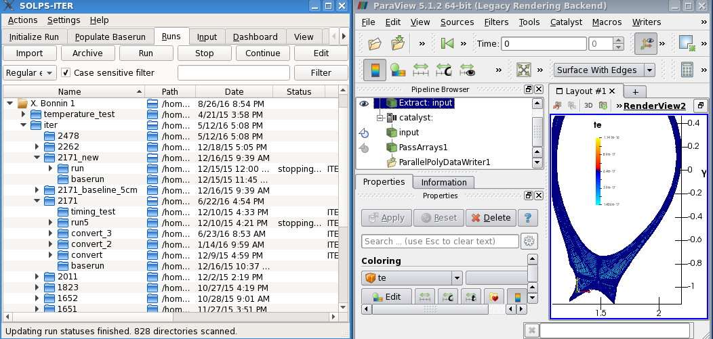
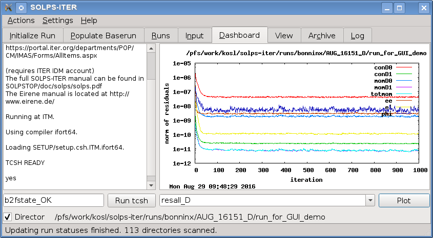
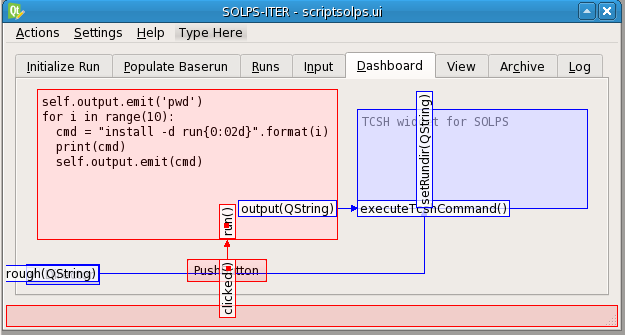

=========================
 Graphical User Interface
=========================

.. _fig-runs-8:

         simulations and ParaView Catalyst *In Situ* instrumentation of the
         SOLPS-ITER code (right).

   SOLPS-ITER GUI showing *Runs* view (left) for controlling simulations
   and ParaView Catalyst *In Situ* instrumentation of the SOLPS-ITER
   code (right).

In addition to the established SOLPS-ITER code suite a new SOLPS-ITER
GUI is being developed in support of users that can now easily work with
the codes for preparing and controlling the *runs* on the cluster.
SOLPS-ITER GUI aims to provide the users the ability to design custom
workflows in a dashboard-style layout. The principles and the GUI
presented in continuation are easily transformed to other simulation
codes. Especially, the communication among the building blocks of the
*dashboard* is aimed to provide workflow-like functionality. The
workflow of a SOLPS-ITER code run can be broken down into 6 separate
steps, not all of which need to be done for every simulation. The steps
consist of:

#. Geometry set-up. The “device description” specifies positions of
   surfaces bounding the domain of interest together with the properties
   of these surfaces such as temperature, material properties,
   transparency, etc... The external tools for design and meshing are
   launched in a loop to create and *Populate baserun* that can be then
   used by a series of *runs*.

#. Choice of the physics parameters for the run(s). The input files are
   being simply edited with the support of the manual or with the help
   of the *input file builder* that logically groups the input
   parameters described in a structured XML file and then translates
   them to several places inside SOLPS code.

#. Choice of the initial state. Because of the complexity of the plasma
   model to be solved, it is almost always more efficient to use as the
   starting point to a new simulation the converged end-state of some
   previous run, even if it comes from a different geometry or with
   different physics parameters. Thus the user often renames an end
   state file to be an initial state in the new run directory being
   prepared by the *Import* button in :numref:`fig-runs-8`.

#. Launch of the run(s). The code is typically run on a scientific
   computing cluster, and users usually submit multiple runs
   simultaneously to explore physical dependencies by doing parameter
   scans. The *Runs view* in :numref:`fig-runs-8` shows the "job"
   controlling interface. The monitoring of the *Runs* is an important aspect
   of the GUI that needs to determine: (i) which runs are doing well but
   need continuing, (ii) which runs have converged and can be stored for
   archival/analysis/post-processing, (iii) which runs have crashed, and
   (iv) ambiguous runs which have not crashed, but do not show that they
   are on the path to convergence according to the automatic criteria
   and need some human assessment.

#. In-line analysis and continuation of the run(s) until convergence. For
   the runs currently being executing, some simple in-line analysis to look
   at a few important physics parameters and assess if the run is doing
   well and going in the right direction is required. A rich library of the
   individual command-line scripts already exist to perform such an
   analysis function. These scripts are mostly based on a portable
   command-line driven plotting utility Gnuplot that has been encapsulated
   inside the SOLPS-ITER GUI as shown in :numref:`fig-runs-9` on a default
   *Dashboard*. Custom widgets were created that communicate and trigger
   plotting of desired scripts. The default dashboard, that has a re-sizable
   layout, is kept minimal in size and complexity to the users. However,
   the dashboard is completely user configurable and designed with
   graphical programming tool in a workflow-style manner, described in Sec.
   `The Dashboard`_.

#. Post-processing analysis. Once runs have been identified as having
   converged and completed, post-processing and a means to compare
   results from different runs with each other is required. In the
   present SOLPS versions, only ad hoc solutions exist, often using
   proprietary software. For single-run analysis, the existing *b2plot*
   program can be employed, used to obtain ASCII and graphical output
   from a single run. SOLPS-ITER GUI provides a new complementary tool,
   as a ParaView plug-in, allowing the same quantity from a series of
   runs to be plotted, facilitating comparisons, and to enable the
   plotting of one quantity in the code output data against another. For
   that purpose data from multiple runs is stored in the IMAS database;
   allowing also inclusion of a SOLPS actor in Kepler workflows. The new
   *UAL Edge reader plugin* for ParaView delivers essentially the same
   visualization and analysis possibilities as the *Catalyst*
   instrumentation, shown in :numref:`fig-runs-8`, except that it
   allows post-processing of multiple runs in one window at once and
   *comparative views*. The PDM for *edge profiles* IDS allows
   comparison with experimental data and other codes too. The grid and
   mapped field data is modeled with *General Grid Description*  (GGD)
   that is used within EU-IM and ITER community as a common way to
   describe grids. For the converting existing results, stored as Edge CPO a
   utility *cpo2ids* was written as part of the GUI to allow transition
   to SOLPS-ITER and comparison inside IMAS *edge_profiles* IDS.

SOLPS-ITER GUI keeps track of the jobs submitted by acting as a server
that accepts status change messages from the running jobs. The concept
of the monitoring interface allows large scale monitoring of several
hundreds jobs submitted in a cluster independent way. At the launch of
the GUI asynchronous scan of the monitored run-trees provides code
status derived from the log files inside *runs*.

Physics codes such as SOLPS, developed over may years, are using
specialized plotting scripts (e.g. *b2plot*) that cannot easily be
replaced with "modern" visualization tools. However, the aim of the GUI
is to encapsulate those utilities and provide user-friendly interface
for new users and attract SOLPS experts to simplify daily use and share
*dashboards* among them. The SOLPS-ITER GUI is written with PyQt5
application programming interface (API) that brings Python portability
and scripting to advanced users. Applicability of the SOLPS GUI is
therefore wide and is proven to run on many clusters as well as on
standalone Linux machines and can in principle be used by other codes
too.

The Dashboard
-------------

.. _fig-runs-9:

         and Gnuplot.

   Default SOLPS-ITER dashboard with custom widgets for TCSH shell and
   Gnuplot.

The SOLPS GUI design allows users to extend the functionality by coupling
custom widgets prepared for the ease of use within the *dashboard*.
These custom widgets are in similar environments called actors as they
do act on some data depending on input received and then they pass
results further in a scientific workflow. Custom widgets for SOLPS are
operating in a similar fashion in a way that they receive and send the
signals to other widgets for further operation. In principle, no
programming is needed by users to create their own *Dashboard* for
analysing and controlling the SOLPS simulations. Graphical workflow
"design" is done with *Qt designer*.

In contrast to scientific workflow engines such as *Kepler* here we are
more oriented to look-and-feel experience than to create a general
purpose workflow engine. That is why the widgets in the SOLPS GUI are
designed to have "nice" input and output presentation while we don’t
care how "nicely" wires are placed. The "Wiring" is usually takes up
significant amount of other workflow engines where *actors* are "small"
or have a unified size with separated or neglected display output.

The SOLPS GUI uses the reverse approach with widgets filling up the
available *Dashboard* window completely. There can be many widgets that
trigger part of the workflow, whereas there are just *play/pause/stop*
buttons used in *Kepler*. The SOLPS GUI *signal/slot* philosophy
provided by Qt framework is similar to input/output ports in *Kepler*,
while the triggering is more explicit than implicit. This means that
usually a single trigger is needed to start the action with the
assumption that all needed signals describing the action already arrived
beforehand.

Users are therefore encouraged to design their own *Dashboard* by
redesigning it to suit their needs. As the *dashboard* is intended to be
configured with *Qt designer* this means that all actions needs to be
provided within the widgets and connected by signals. "Wiring" can also be
graphical too. The GUI is then saved in XML files and compiled on-the-fly
at the GUI startup. Even when providing a limited set of "custom" widgets,
there can exist many different *dashboards* for running SOLPS simulations.
They may differ on the analysis, user’s preferences and to be reused by
others. To some extent the whole SOLPS-ITER GUI can be called *the
dashboard* with most of the widgets freely "removable" from the dashboard.

The Dashboard Designer
----------------------

The PyQt5 framework  provides *Qt designer* application that is normally
used for graphically designing Qt  applications and generate
corresponding widget-layout code. *PyQt* can compile and interpret with
Python designed ``.ui`` XML files on-the-fly and that means that the
whole GUI is read at the application startup. The PyQt5 plugin for *Qt
designer* extends standard set of Qt GUI widgets with the possibility for
developers and users to create "custom" widgets for use inside the
designer and then within the SOLPS GUI application.

.. _fig-dashboard-9:
.. figure:: dashboard_9-annotated.*
   :alt: The SOLPS Dashboard designer with custom widgets (a);
         default user interface (b) and customised dashboard in (c).
         Widget hierarchy (d) can contain custom widgets that have custom
         properties (e) and custom signal&slots pairs
         in the Signal/Slot Editor (f).

   The SOLPS Dashboard designer with custom widgets (a);
   default user interface (b) and customised dashboard in (c).
   Widget hierarchy (d) can contain custom widgets that have custom
   properties (e) and custom signal&slots pairs
   in the Signal/Slot Editor (f).

The SOLPS custom widgets shown in :numref:`Fig. %s (a)<fig-dashboard-9>`
are scripted in Python and they usually inherit and extend functionality of
some built-in Qt widget. Those "custom" widgets are grouped under SOLPS
toolbox and are available for *drag and drop* onto the dashboard.

The "extended" tool in :numref:`fig-dashboard-9` is called *SOLPS Dashboard
designer* and is in principle general tool for designing Qt GUIs that are
shown in two dashboard examples: :numref:`Fig. %s (b)<fig-dashboard-9>`
with the default dashboard and :numref:`Fig. %s (c)<fig-dashboard-9>`
showing custom dashboard designed. Although the *default dashboard* is
usually sufficient, the users are encouraged to delete it and create their
own in a grid or by using some *container widget*. Their look-and-feel
depends on user preferences and available screen how to design. The
dashboard can have statically positioned widgets or can have some
*responsive* re-sizing functionality that is built in the Qt framework. It
should be noted that users are not limited just to a single *Dashboard*
view and that additional pages can be created as folders to the default
GUI.

The *Object Inspector* in :numref:`Fig. %s (d)<fig-dashboard-9>` allows user
to select and manipulate the widgets in a complex layouts. For example
in :numref:`Fig. %s (c)<fig-dashboard-9>`, the Gnuplot widget is overlaid
several times inside :guilabel:`ToolBox` container widget. When the desired
widget is selected object properties shown in
:numref:`Fig. %s (e)<fig-dashboard-9>` can then be edited. For custom widgets
there exist some "custom" properties such as ``runDir`` marked purple on
:numref:`Fig. %s (e)<fig-dashboard-9>` that specifies in which directory
the Gnuplot should execute ``solpsPlotCommand`` script written in *TCSH*
shell language that is traditionally used as a standalone SOLPS script;
run from the command line in desired ``runDir``. Default values for the
object properties in :numref:`Fig. %s (e)<fig-dashboard-9>` come from the
widget itself and can be overwritten during the design phase. Furthermore,
the properties can be changed from the program or, more interestingly,
by *signalling* appropriate value from other widgets. The latter
approach allows us to create *workflows* within the *SOLPS dashboard
designer*. It should be noted that such graphical-only programming is
possible only if the widgets used on the dashboard are able to exchange
compatible signals. The compatibility is assured when same the basic
types are signaled to the widget *slots*. The :guilabel:`Signal/Slot Editor`
[see :numref:`Fig. %s (f)<fig-dashboard-9>`] allows creation
of such signal--slot pairs.
However, for signaling, there is also possibility to route
widget signals graphically with a *Workflow designer* that is part of
the *Dashboard designer* when we switch into "signal design" mode.
Besides the design mode there is also "run mode" where one can test the
GUI behaviour even at the design time provided that we setup test
parameters for the custom widgets in the workflow. Ideally, all
dashboard could be designed out of the standard and custom widgets and
users could design the dashboard from the scratch and use only graphical
programming. Such GUI design is certainly possible. However, the
SOLPS-ITER GUI design selected to provide *Settings*, *Runs*, *Archive*
and *Log* view as built-in functionality; the rest is fully
"re-designable".

The Workflow Designer
---------------------

.. _fig-my-simple-workflow:
.. figure:: dashboard-workflow.*
   :alt: Simple workflow design example with *Director*, *Gnuplot*
         and *PushButton* widgets.

   Simple workflow design example with *Director*, *Gnuplot*
   and *PushButton* widgets.

The *Workflow designer* is in fact just the combination of widget layout
and signal designer. To allow signals to travel from the *Runs* view the
*Director* widget is introduced in as similar fashion as with other
workflow systems. The workflow design steps are depicted in
:numref:`fig-my-simple-workflow` example where we
illustrate creation of a simple workflow by deleting default Dashboard
view and leaving only the *Director* before the dashboard is build up. Widgets
are positioned with *drag and drop* in
:numref:`Fig. %s (a)<fig-my-simple-workflow>`. Signals are
directed from one widget to another by *drag and drop* too as shown in
:numref:`Fig. %s (b)<fig-my-simple-workflow>`. Here many signals
and slots are possible. In
:numref:`Fig. %s (b)<fig-my-simple-workflow>` *Director* sends
*Runs*-selected ``rundir_passthrough`` signal to *Gnuplot* ``setRundir``
slot. In similar fashion *PushButton* widget directs the ``clicked``
signal to ``executeSolpsPlotCommand`` slot of the *Gnuplot* widget.
Complete workflow in
:numref:`Fig. %s (c)<fig-my-simple-workflow>` is then saved as a
custom GUI file that is demonstrated live in
:numref:`Fig. %s (d)<fig-my-simple-workflow>`. Complex workflows
are also possible. All that is needed is having custom widgets that pass
compatible signals. In cases where "special" behaviour is needed and is
not provided through default Qt widgets one can always create derived
version of basic widgets with Python scripting and put it under the
SOLPS or another toolbox. When some signal/slots are missing from the
widgets they can be simply added without breaking existing workflow
design. It should be noted that for complex workflows, that can extend
over several dashboards in the GUI, signal can be passed by using
regular *Signal/Slot Editor*. Users can also choose to hide some widgets
created or put them aside on a separate page.

Python Scripting
----------------

Sooner or later the users are required to express some tasks using scripts
instead of using less convenient looping "actors" provided by a workflow
system. It is also more intuitive to most of the users to have simple
simple tasks presented as a building blocks inside the dashboard. If these
scripts are commonly used then they deserve an icon for placement in
workflows. The *Script* widget for SOLPS GUI provides the scripting support to
advanced users that would like to create workflows that will interact with
simulations or do some built-in calculation required for their work.

.. _fig-python-widget:

   Python Scripting workflow example.

In the scripting example, shown in :numref:`fig-python-widget`, we want to
create a series of directories for parameter scanning simulations. The
workflow is essentially the same as with
:numref:`fig-my-simple-workflow` except that now *TCSH*
widgets receive "working" directory passed from *Director* at the run
selection in *Runs* view. The *PushButton* triggers ``run`` slot and the
Python script is evaluated. Evaluation of the script can *emit* "custom"
``output`` signals to *TCSH* widget that then create a multiple
directories in a loop. All other Python language possibilities can be
used inside the script that is entered at the "design" time and stored
inside the custom GUI file. It may be observed that entering Python
scripts with the dashboard designer, saving ``.ui``, and the running may be
cumbersome in some cases; but one can create Python scripts externally
and reused them here. Furthermore, the *Script* widget can update itself
in a GUI file at run time by adding XML update possibilities to the
widget.

