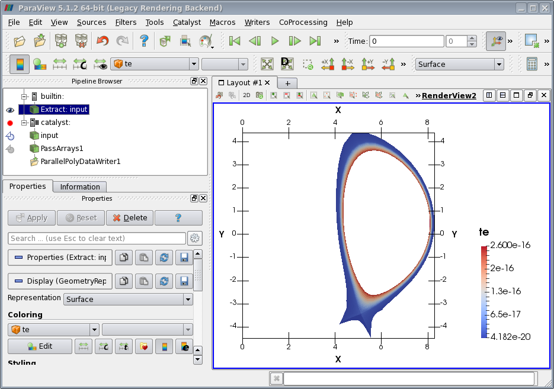

.. _cpo2ids-howto:

.. highlight:: csh
   
=======================
ParaView Catalyst HOWTO
=======================

:Author: Jure Bartol, University of Ljubljana

.. only:: html

   .. contents::

Introduction
============

Usual workflow when performing SOLPS simulations consists of three main
steps. The first one is pre-processing, where the input parameters are
specified and the grid is generated. The second is the processing stage,
which is a part where the simulation is performed. SOLPS code can run
either B2.5 or EIRENE in standalone mode, or both can run in coupled
mode called B2.5-EIRENE. The last step is to perform post-processing,
which is the analysis of the results.

In 2018, computing power is expected to reach 1 exaflop/s, which is a
major increase as compared to the input/output (I/O) rise in
capabilities. Because this gap between the computing and I/O speeds is
getting bigger, there has been effort made to overcome this problem. The
solution is to change the traditional approach to performing simulations
and analysis. While the usual method is to perform three steps,
pre-processing, processing and post-processing, the modern approach is
to combine processing and post-processing steps into one. As a result,
scientists are able to examine results simultaneously, also called *in
situ*, during the simulation run.

The SOLPS simulation runs can consist of several thousand time steps and
with each time step taking several minutes to complete that can add up
to a few months of run time per simulation. In such cases, the
traditional approach to analysis is very time consuming. In order to
overcome this constraints, implementation of Paraview Catalyst
*in situ* library into B2.5 code,
which would allos users to run simulation and perform analysis at the run time.

ParaView *Catalyst* brings the following improvements to the SOLPS code suite:

#. A significant reduction of the time users need to perform simulation
   and analysis because both can be performed at the same time.

#. *In situ* analysis of the simulation data during the simulation run.

#. Significant reduction in debugging time (e.g. finding correct input
   parameters).

#. More convenient way of analysis and thus reduction in the time used
   for analysis.

#. Powerful graphical tools for more user-friendly and intuitive
   analysis of the simulation data.

#. More storage efficient way of running simulations and performing
   analysis.

#. Simple implementation in the existing simulation code.

In Situ Analysis
----------------

In literature  Latin phrase *in situ* (also *in-situ*) literally
translates to “in place”. Phrase is very commonly used in science, e.g.
in chemistry, astronomy and medicine; however, meaning in each field
does not differentiate much from the literal sense.

In computing, phrase *in situ* processing became popular in recent
years. Some other expressions with similar meaning are *co-processing*,
*co-analysis* and *co-visualization* . In  *in situ* computations are
defined as processing that *“consists of processing the data using the
resources allocated for the simulation code. In this model, the
simulation code advances in time for a while, then hands off a baton to
a post-processing algorithm, which generates results and hands the baton
back”*. Similarly  describes *in situ* as the *“ability to concurrently
visualize and analyze data from simulations”*.

Background
~~~~~~~~~~

According to  the main challenge in computing that led to development of
*in situ* processing procedures is an ever-increasing gap in performance
between compute and Input/Output (I/O) capabilities. While computing
power is expected to reach exaflop/s in 2018, which is an increase in
the order of 500 compared to 2010, I/O bandwidth is expected to advance
only in the order of 100, between 2010 and 2018, to 20 TB/s. This is the
reason that, even though simulation times are decreasing for the same
problems, the frequency of saving time steps to disk is decreasing,
because it poses a significant bottleneck to simulation workflow. This
typically causes a loss of details in post-process analysis which may
lead to lower quality research.

Proposed solution is to change the traditional data analysis pipeline. 
presents two different approaches, *in situ* and *in transit*
processing, which are described as *“in-situ if they utilize the primary
compute resources, while in-transit processing refers to offloading
computations to a set of secondary resources using asynchronous data
transfers”*. Both ideas perform analysis during the simulation run and
store significantly reduced amount of data to disk, however there is a
difference how they perform that task. *In situ* procedure uses the same
compute resources as the simulation, while *in transit* moves some of
the data to another processor to perform the analysis. Some advantages
and disadvantages of each solution are presented below.

-  **In situ:**

   -  no resource limitations for analysis;

   -  may affect simulation performance.

-  **In transit:**

   -  does not impact performance of the scientific simulation;

   -  transferring raw data to a secondary computing unit over a network
      may be prohibited;

   -  secondary computing unit may not have sufficient memory and/or
      computing capabilities.

*In situ* solution should meet certain requirements when used. Compared
to simulation itself, it should

-  use a limited amount of memory,

-  execute much faster than each simulation time step;

-  significantly reduce the amount of data written to disk.

We will focus only on the *in situ* procedure in the following sections,
since this is the method we implemented in SOLPS code.

In Situ Pipeline
^^^^^^^^^^^^^^^^

The *In situ* approach to data processing changes the data analysis
pipeline.

.. _fig-trad-sub-pipeline:
.. figure:: images/trad_pipeline.*
   :alt: Traditional three-step pipeline consisting of pre-processing,
         processing, and post-processing.

   Traditional three-step pipeline consisting of pre-processing,
   processing, and post-processing.

Traditional pipeline shown in :numref:`fig-trad-sub-pipeline`
consists of three basic steps, briefly explained bellow .

#. **Pre-processing**, where input data is prepared, e.g. domain
   discretization, specifying different properties, boundary conditions,
   solver parameters, etc.

#. **Processing**, where simulation is executed and output files are
   written to a disk.

#. **Post-processing**, where the output of a simulation is read from
   disk and analyzed.

.. _fig-insitu-sub-pipeline:
.. figure:: images/insitu_pipeline.*
   :alt: Pipeline with *in situ* approach.

   Pipeline with *in situ* approach.

Alternatively, *in situ* analysis changes pipeline as explained bellow
and shown in :numref:`fig-insitu-sub-pipeline` consist of.

#. **Pre-processing**, which is identical to pre-processing in
   traditional pipeline.

#. **Processing with in situ analysis**, where during the simulation
   run a portion of the data is updated and displayed in certain time
   steps for analysis.

Instrumentation Libraries
~~~~~~~~~~~~~~~~~~~~~~~~~

There are many programming packages that enable the use of *in situ*
analysis during simulation runs, such as GLEAN, ADIOS, Libsim and
Catalyst. We will focus on the last two, Libsim and Catalyst, and
briefly present how each performs co-processing.

As stated in  both libraries try to meet the following design
requirements.

-  Allow diverse usage possibilities, e.g. creating animations, data
   analysis and interactive debugging.

-  Minimize code footprint in the simulation codes.

-  Minimize impact to the simulation run when library is in use.

-  No impact to the simulation run when library is not in use.

Libsim
^^^^^^

Libsim is a simulation library that  uses VisIt , which is an
open-source visualization program based on the Visualization Toolkit
(VTK) , as the data analysis and visualization engine. VisIt uses a
client/server architecture. Remote computing nodes usually represent a
server side, responsible for browsing the data and performing
computations. On the other hand, client side is a local computer and is
used to display the data.

Libsim alters VisIt client/server structure in a way that combines VisIt
server and the simulation. Libsim’s *in situ* process follows steps
bellow .

#. The simulation code starts execution.

#. The simulation initializes Libsim library and checks for connection
   requests from VisIt client.

#. When VisIt client sends connection request to the simulation, the
   simulation loads VisIt server library and connects with client.

#. After a request, the simulation sends mesh and data description to
   VisIt server.

#. At this point, the simulation sends pointers to the data, that the
   VisIt servers continuously requires for processing.

Libsim is divided into two libraries. First, called "front-end library"
is a lightweight static library which is linked during the compilation
of the simulation code. Second, named "runtime library" is bigger but is
used only when *in situ* analysis is requested.

Additionally, Libsim requests metadata from the simulation that contains
a list of meshes and fields simulation, and sends it to client. That
allows VisIt to ask only for data that is needed for the analysis and
thus not transmit redundant data.

Catalyst
^^^^^^^^

The Catalyst co-processing library is based on VTK and uses ParaView  as
a main program that enables data analysis, visualization and pipeline
control. Similarly to VisIt, ParaView also uses a client/server
architecture. Server side, called pvserver, exploits the advantage of
using a remote high-performance compute nodes, while the client side
enables the display on local machine.

Paraview allows remote processing capabilities through pvserver/client
connection. As already mentioned pvserver runs on a work machine (e.g.
high-performance compute nodes), while client side runs on a local
machine and is used to display actions from server side. They
communicate and exchange data over network sockets, however, if firewall
is present on either side they need to use different approach. The
solution is to use communication through secure shell (SSH) tunnel,
which enables sending of unencrypted data through encrypted connection.

ParaView can be configured to either render data on the server or client
side. In the first case ParaView does rendering on remote machine and
delivers only images to the client. In contrast, when ParaView does
rendering on the local machine, pvserver delivers geometries to the
client.

The Catalyst communicates with simulation through adaptor, which is a
piece of code that translates the simulation’s data types into type that
Catalyst library and ParaView can process. The adaptor transmits two
categories of data. First, simulation data, such as grid, field, time,
and time step information, and secondly information whether a
visualization should be executed at a given moment. All of the major
information about the *in situ* processing is held in a co-processing
script. This information includes a client address in the local network
and complete pipeline. The Catalyst *in situ* process consists of the
following steps.

#. The simulation code starts the execution.

#. The simulation initializes the Catalyst library and pipeline through
   co-processing script. At this point, simulation establishes
   connection with the pvserver. The simulation and pvserver do not
   exchange any data at this point.

#. After the client connects to the port where the pvserver is running
   and the user selects what data he/she would like to visualize or
   inspect, the pvserver starts receiving data from the simulation and
   the client starts receiving data from the pvserver as specified in
   the pipeline script and the adaptor.

#. From that point on, the adaptor continuously queries the
   co-processing script to determine whether co-processing needs to be
   performed. If it does, the simulation sends data in VTK form to the
   pvserver, and the pvserver to the client.

Catalyst library is linked to the simulation during the compilation of
the simulation code, and also requires linking with ParaView and some of
its major components. However, since the co-processing script is written
in a python, pipeline and client address and port can be modified after
compilation of the simulation code.

Workflow
--------

B2.5 code is composed of several independent programs that communicate
through external files. Main workflow incorporates the programs
``b2ag``, ``b2ah``, ``b2ai``, ``b2yp``. However, these are only used in
pre-processing and post-processing.

.. _fig-b2mn-sub-workflow:
.. figure:: images/b2mn_workflow.*
   :alt: Workflow of ``b2mn`` code.

   Workflow of ``b2mn`` code.

Computational part is handled by the ``b2mn`` program
(:numref:`fig-b2mn-sub-workflow`). It is responsible for opening and
closing the input/output files, system-dependent operations (e.g. MPI
function calls) and calling the code that actually performs computation,
``b2mndr``. ``B2mndr`` is responsible for control over time steps, which
means that, like b2mn, it hands out most of the computational part to
the routine that performs one time step, *b2mndt*.

Co-processing is implemented in ``b2mndr``, where function calls to
Catalyst adaptor are performed. The heart of the adaptor is a
co-processing function that is called each time ``b2mndr`` performs a
time step.

Catalyst initialization and finalization
~~~~~~~~~~~~~~~~~~~~~~~~~~~~~~~~~~~~~~~~

Main time stepping routine, ``b2mndr``, is written in Fortran 90
programming language and follows the outline presented in the following
listing.

.. code-block:: fortran

    initialize files and data
     initialize coprocessor 
     do while
         calculate one time step
         call coprocessor
     end do
     finalize coprocessor
     display results of calculation
     save results of calculation

Catalyst requires three function calls - initialization, finalization
and co-processing. In our case, the first two are a part of Catalyst
library, while co-processing is a custom function implemented in
adaptor. Obviously, it is important to place co-processing function
inside the main calculation loop in order to provide Catalyst with new
data when each time step is calculated.

One of the main objectives of *in situ* libraries is to not impact
simulation run if co-processing is not required. Catalyst function calls
are enclosed in logical statements, which prevent the usage if Catalyst
is not explicitly told to execute, so the above objective is satisfied.
On top of that, if ParaView is not available when simulation is built,
Catalyst part of the code is not included in ``b2mndr`` code.

Initialization
~~~~~~~~~~~~~~

The first step is to initialize the Catalyst library. This sets up the
Catalyst environment and prepares the pipelines for execution. For codes
that depend on MPI, Catalyst initialization needs to be performed after
the initialization of MPI. In SOLPS’s case MPI initialization is done in
``b2mn`` which is higher level than ``b2mndr``, and hence MPI is
initialized before Catalyst. There is a couple of initialization
functions in Catalyst API that are ready for direct usage in the
simulation code. The method that was selected is
``coprocessorinitializewithpython(pythonFileName,pythonFileNameLength)``
because it is the most convenient one to set up the Catalyst library and
also present it with the co-processing script in one step.

Since this function can be used in C, C++, Python and Fortran, it also
needs the length of the file name besides actual path to file or only
the name if the co-processing script is available in the same directory
the simulation is run from.

Function call as it appears in ``b2mndr`` is shown in in the following listing.

.. code-block:: fortran

    ...
     call coprocessorinitializewithpython('../coproc.py', 12)
    ...

The workflow was designed in a way that the
co-processing script, called ``coproc.py`` needs to be present inside
the run directory in order to call initialization function. The
``b2run`` command that runs ``b2mn`` is executed from ``b2mn.exe.dir``
directory which is located inside the run directory, hence the ``../``
before the file name.

Finalization
~~~~~~~~~~~~

After co-processing is performed (described in Section [sec:Adaptor]) we
need to perform finalization of Catalyst library. This returns all
resources used by Catalyst and should be done before finalization of
MPI, if used in code. Again, ``b2mndr`` is executed inside ``b2mn`` in
between MPI initialization and finalization, and thus the order is
correct. Function does not take in any arguments.

.. code-block:: fortran

    ...
     call coprocessorfinalize()
    ...

Adaptor
~~~~~~~

Next step after Catalyst initialization is to do co-processing. This
step is done by the adaptor which queries the pipelines to see if any of
them needs to be performed and provides VTK data objects that represent
grid and field data to Catalyst. The sequence of actions adaptor
performs  is shown below.

#. Get current time and time step.

#. Check if anything needs to be done this time step.

#. If co-processing is not needed this time step, return control back to
   simulation.

#. If co-processing needs to be performed this time step, create VTK
   grid.

#. Create VTK fields and associate with VTK grid.

#. Specify VTK grid for Catalyst.

#. Perform co-processing and execute pipelines with Catalyst.

According to the outline above, the adaptor was created. We implemented
it in Fortran 90, since this is the programming language of ``b2mndr``.
However, because the VTK is a C++ library, we needed to split the
adaptor into two codes. The main one, called *fortranAdaptor* and
written in Fortran 90, is called directly from ``b2mndr`` and contains a
routine called ``coprocessor``. The second one, called *cxxAdaptor*, is
responsible for creating a grid and storing field data, is written in
C++ and contains two functions, ``creategrid`` and ``adddata``.

:numref:`coprocessor` shows a function, ``coprocessor`` that performs
co-processing. Function arguments are as follows.

-  ``crx``, ``cry`` - Point coordinates in x and y direction.

-  ``ncrx`` - Number of points.

-  ``nx``, ``ny`` - Number of cells in x and y direction.

-  ``ns`` - Number of atomic species.

-  ``step``, ``time`` - Current time step and time.

-  ``<cell_data>`` - Field data that is assigned to cells.

.. code-block:: fortran
   :name: coprocessor
   :caption: Coprocessor call
   

    ...
     call coprocessor(crx,cry,ncrx,nx,ny,ns,step,time,
                      <cell_data>)
    ...

Fortran Part
^^^^^^^^^^^^

First, the *fortranAdaptor* queries co-processing script and checks the
current pipelines to see if any of them need to perform in the current
time step. This is done using the function
``requestdatadescription(step,time,flag)``. The function returns 1 if
co-processing needs to be executed and 0 otherwise. Arguments to the
function are current time step, ``step``, current time, ``time`` and an
indicator, ``flag``, that is assigned the function’s return value. If
``flag`` is equal to zero, the ``coprocessor`` function returns and
hands control back to the simulation code for current time step.
Alternatively, the ``coprocessor`` continues its execution.

Second, the adaptor checks whether Catalyst needs to build a grid. This
is performed by the function ``needtocreategrid(flag)``, which sets a
flag to 1 if it does not have a copy of the grid. If the grid exits, it
returns 0, but does not check if the grid is modified or needs to be
updated. If the adaptor needs to create a grid, it calls the function
called ``creategrid`` that we implemented in *cxxAdaptor*.

Third, *fortranAdaptor* starts adding new field data to the grid. It
calls function ``adddata`` for each field it needs to assign to cells.
The function is implemented in *cxxAdaptor*.

Finally, the adaptor performs co-processing and executes the pipelines
specified in co-processing script, by calling function ``coprocess``.
After it is finished the adaptor returns control back to the simulation
code.

Listing below shows the main part of the subroutine
``coprocessor``. Complete function is presented in `fortranAdaptor.F90`_

.. _lst-fortranadaptor:
.. code-block:: fortran

    subroutine coprocessor(crx,cry,ncrx,nx,ny,ns,step,time,vol,<cell_data>)
         ...
         call requestdatadescription(step,time,flag) 
             if (flag .ne. 0) then
             call needtocreategrid(flag)
             if (flag .ne. 0) then
                 call creategrid(crx, cry, ncrx, nx, ny)
             end if
             call adddata(vol,"Volume"//char(0),numC,1)
             ...
             ! Other field data is added here with adddata()
             ...
             call coprocess()
         endif
     end subroutine

C++ Part
^^^^^^^^

This part of the adaptor code, *cxxAdaptor*, is written in C++, because,
as already mentioned, it uses VTK library, written in C++, to create VTK
objects. These are required by Catalyst and ParaView in order to be able
to visualize the simulation data. The interface between Fortran 90 and
C++ code, we needed to use *name decoration*  in C++ function
definitions. Doing that, C++ function names are properly stored in
object files after compilation, and suitable to be called from the
Fortran code. The layout of *cxxAdaptor* is shown in
numref:`lst:cxxadaptor`. The content of each function is described in
detail in Section [sec:Visualization].

The first function in *cxxAdaptor* is called ``creategrid``. It is
designed to create a grid out of point coordinates and assign it to an
object ``vtkCPInputDataDescription`` which is responsible for passing
the grid and field data to the pipelines.

The second function, called ``adddata``, attaches the simulation data to
the cells in the grid. It again uses an object
``vtkCPInputDataDescription``, this time to get the grid and then assign
field data to the grid’s cells.

.. code-block:: c++
   :caption: Structure of *cxxAdaptor*.
   :name: lst:cxxadaptor
   
    // Include vtk and catalyst headers here.
     ...
     extern "C" void creategrid_(double* crx,double* cry,
     int* ncrx,int* nx,int* ny)
     {
        ...
        // Create grid out of vertexes coordinates.
        ...
     }
     extern "C" void adddata_(double* values,char* name,
     int* numC,int* dimension)
     {
        ...
        // Assign field data to cells in grid.
        ...
     }

Visualization
-------------

Following section first describes the VTK objects used in adaptor code.
Secondly, the process of creating a VTK grid out of a two-dimensional,
curvilinear, topologically rectangular grid from B2 simulation code is
explained. Lastly, we describe the way field data is attached to the VTK
grid for display.

Visualization Toolkit
~~~~~~~~~~~~~~~~~~~~~

The Visualization Toolkit, VTK, is used to create a grid and present the
field information, using the objects VTK provides. VTK can represent a
variety of grid types. Supported grid types, together with the
corresponding VTK dataset type, are listed bellow.

-  **Uniform Rectilinear grid** - ``vtkImageData, vtkUniformGrid``

-  **Non-Uniform Rectilinear grid** - ``vtkRectilinearGrid``

-  **Curvilinear grid** - ``vtkStructuredGrid``

-  **Polygonal grid** - ``vtkPolyData``

-  **Unstructured grid** - ``vtkUnstructuredGrid``

Furthermore, VTK also supports 2D and 3D cell types, e.g. triangles,
quadrilaterals, pyramids, hexahedron. The field data can be associated
with either cell or points. For more detail refer to .

When creating the adaptor we took advantage of three types of *VTK
objects*, ``vtkPoints`` for vertex coordinates, ``vtkPolydata`` for grid
representation and ``vtkDoubleArray`` to store field data.

``VtkPoints``  is a data type which explicitly stores the
three-dimensional point locations. It is derived from ``vtkPointSet``
class and allows setting points with or without automatic range checking
and memory allocation, uses data types of different bit lengths to store
coordinates in, and provides vertex information to VTK grid data types.

``VtkPolyData``  is a data type that can store geometric structures such
as vertexes, lines, polygons, and triangle strips. It is derived from
``vtkPointSet`` class and can store geometric structure in an efficient
manner, and it provides many getter functions to retrieve information on
geometric structures.

``VtkDoubleArray``  is an array of values of type *double*, derived from
``vtkDataArray``, which provides methods for automatic or manual memory
allocation to store arrays of data. It is designed to store data in
groups called *tuples* and each tuple contains a certain number of
components (e.g. velocity of a point in a three-dimensional space
contains 3 components; tuple represents that point and stores 3
components).

Grid
~~~~

Firstly, we have to address the issue of interfacing Fortran data
structure with C++. Fortran uses column major order for arranging
multidimensional arrays in memory storage, while C++ uses row major
(see :numref:`fig-row-sub-col-sub-major`).
In column major ordering, consecutive elements of the columns are
contiguous (memory stores one column after another in flat
one-dimensional array). However, in the row major ordering, consecutive
elements in memory storage are also consecutive in the rows of
multidimensional array (memory stores one row after another in flat
one-dimensional array).

.. _fig-row-sub-col-sub-major:
.. figure:: images/row_col_major.*
   :alt: 3D array of vertexes stored in a 1D array using row major
         and column major ordering.

   3D array of vertexes stored in a 1D array using row major and column
   major ordering.

Originally, points are stored in three-dimensional arrays for each
coordinate, :math:`x` and :math:`y`. Although, when data is passed from
Fortran to C++, the multidimensionality of the array is lost and we need to
retrieve the information from flat array of data. The way each cell’s
vertexes information is stored in 3D array and how it appears in memory is
shown in :numref:`fig-row-sub-col-sub-major`.

.. _fig:cells:
.. figure:: images/cell.*
   :align: center
   :alt: Cell notation with cells stored in 2D array and vertexes in
         3D array (left), and cells and vertexes stored in 1D array (right).

   Cell notation with cells stored in 2D array and vertexes in 3D array
   (left), and cells and vertexes stored in 1D array (right).

Each cell :math:`\Omega_{i,j}` (see :numref:`fig:cells`) owns a space
(:math:`i,j`), where :math:`i=-1,0,1,...,nx` and :math:`j=-1,0,1,...,ny`,
in :math:`(nx+2)\times{(ny+2)}` grid and a third dimension is reserved for
4 vertexes coordinates of every cell. Each point is denoted by
:math:`{P_{i,j,k}}`, where :math:`k=0,1,2,3`. As a result, complete
coordinates are stored in two (each for x and y direction)
:math:`(nx+2)\times{(ny+2)}\times4` arrays. Equation shows formulation for
every cell :math:`\Omega_{i,j}`.

.. math::

   \label{eq:cell_ij}
   \Omega_{i,j} = \left\{ P_{i,j,0}, P_{i,j,1}, P_{i,j,2},
                  P_{i,j,3} \right\}; \;i=-1,0,1,...,nx; \;j=-1,0,1,...,ny

However, when we store vertexes and cells in one-dimensional array,
formulation changes to equation. :math:`N` denotes number of cells.

.. math::

   \label{eq:cell_n}
   \Omega_{n} = \left\{ P_{n}, P_{n+N}, P_{n+2\times{N}}, P_{n+3\times{N}}
                \right\}; \;n=0,1,...,N; \; N=(nx+2)\times{(ny+2)}

:numref:`lst:points` shows the process of assigning point coordinates
from ``crx`` and ``cry`` to object ``pts`` of type ``vtkPoints``. First,
points object is created and memory space is allocated. Next, the number
of cells ``numC`` is calculated. At the end, coordinates are attached to
the object ``pts``.

.. code-block:: c++
   :name: lst:points
   :caption: Process of assigning point coordinates to the object ``pts``.
             First, ``pts`` object is created and memory space is allocated.
             Next, the number of cells ``numC`` is calculated.
             At the end, coordinates are attached to the object ``pts``.
      
    ...
     vtkPoints* pts = vtkPoints::New();
     pts->SetNumberOfPoints(*ncrx);
     int numC = (*nx+2)*(*ny+2);
     for (vtkIdType id=0; id<numC-1; ++id)
     {
       pts->SetPoint(0+id*4,crx[id],cry[id],0.0);
       pts->SetPoint(1+id*4,crx[id+numC],cry[id+numC],0.0);
       pts->SetPoint(2+id*4,crx[id+2*numC],cry[id+2*numC],0.0);
       pts->SetPoint(3+id*4,crx[id+3*numC],cry[id+3*numC],0.0);
     }
     ...

The next step is to create cells out of vertexes saved in ``pts``
object. The process as it appears in the *cxxAdaptor* is shown in
:numref:`lst:cells`. To begin, we create a ``vtkPolyData`` type object
``grid`` and connect it with the Catalyst co-processor. Next, points in
``pts`` are added to the ``grid`` object and then the ``pts`` is
deleted. Before creating cells we allocate space for sufficient number
of cells.

.. code-block:: c++
   :name: lst:cells 
   :caption: Process of creating quadrilateral cells in function ``creategrid``.
   
    ...
     vtkPolyData* grid = vtkPolyData::New();
     vtkCPPythonAdaptorAPI::GetCoProcessorData()->
       GetInputDescriptionByName("input")->SetGrid(grid);
     grid->SetPoints(pts);
     pts->Delete();
     grid->Allocate(numC);
     vtkIdType ids[4];
     for (int i=0 ; i<numC; i++){
        ids[0] = 0+i*4;
        ids[1] = 1+i*4;
        ids[2] = 3+i*4;
        ids[3] = 2+i*4;
        grid->InsertNextCell(9,4,ids);
     }
     ...

In the next step we need to insert each vertex, by its id, in the right
order to properly create cells. Given the numbering in simulation with
respect to how VTK treats vertexes in cells, we need to revert the order
of second and third edge point. Lastly, when creating cell and assigning
it to an object ``grid`` we also define cell type ("9" denotes a
quadrilateral cell) and number of vertexes in each cell ("4").

It is important to note that cells are numbered in the order we create
them and field data is later added in the same order. As a consequence
we need to make sure we understand how field data is stored in the
simulation arrays, to couple them properly with cells.

Field Data
~~~~~~~~~~

When adding field data, we need to first figure out a way to transform
data that was originally stored in multidimensional array and then
converted to one-dimensional one. Again, we have to consider row-major
and column-major ordering in the process.

The simulation keeps field data in two- or three-dimensional arrays,
depending on the type of information (e.g. scalar, vector). Field data
is stored in similarly to how the cell coordinates are stored. We can
denote each field as :math:`F_{i,j}`, where (:math:`i,j`) connects each
field :math:`F_{i,j}` to cell :math:`\Omega_{i,j}`. Consequently, whole
field array :math:`F` in the simulation is of size
(:math:`(nx+2)\times{(ny+2)}\times{k}`), where :math:`k=1,...,dim`.
:math:`dim` depends on a dimension of data in each cell. Scalar value
gives :math:`dim=1`, 2D vector :math:`dim=2`, 3D vector :math:`dim=3`,
etc.

Before adding field data to the grid, we first get grid information from
the co-processor through the object of type
``vtkCPInputDataDescription`` and insert it into an object ``grid`` of
type ``vtkPolyData``.

:numref:`lst:fields` shows the process of assigning values to the grid.
Because VTK only allows certain dimensions of field data attached to the
grid, we divided the process into two cases.

.. code-block:: c++
   :caption: Process of assigning simulation data to the grid in function
             ``adddata``.
   :name: lst:fields
   
    // Get grid information from coprocessor here
        ...
        if (*dimension <= 3){
            vtkDoubleArray* cellData = vtkDoubleArray::New();
            cellData->SetName(name);
            cellData->SetNumberOfComponents(*dimension);
            cellData->SetNumberOfTuples(*numC);
            switch (*dimension){
                case 1: { 
                    for (vtkIdType i = 0; i < *numC; ++i){
                        cellData->SetTuple1(i,values[i]);
                    } break;
                }
                case 2: {
                    for (vtkIdType i = 0; i < *numC; ++i){ 
                    cellData->SetTuple2(i, values[i], values[i+(*numC)]);
                    } break;
                }
                case 3: {
                    for (vtkIdType i = 0; i < *numC; ++i){ 
                      cellData->SetTuple3(i, values[i], values[i+(*numC)],
                                          values[i+2*(*numC)]);
                    } break;
                }
            }
            grid->GetCellData()->AddArray(cellData);
            cellData->Delete();
            cellData = NULL;
        }
        else {
            char new_name[50];
            for (int s = 0; s < *dimension; ++s){
                sprintf(new_name, "%s_%d", name, s);
                vtkDoubleArray* cellData = vtkDoubleArray::New();
                cellData->SetName(new_name);
                cellData->SetNumberOfComponents(1);
                cellData->SetNumberOfTuples(*numC);
                for (vtkIdType i = 0; i < *numC; ++i){ 
                    cellData->SetTuple1(i, values[i+s*(*numC)]);
                }
                grid->GetCellData()->AddArray(cellData);
                cellData->Delete();
                cellData = NULL;
            } 
        }

In the first case, where a field is a vector (1D, 2D or 3D), the data is
added as a one variable with one, two or three components. First we
create a data container ``cellData`` of type ``vtkDoubleArray``, set its
name, number of components and number of tuples, which in our case is
the same as number of cells ``numC``. We continue by entering the switch
statement, which inserts the field data stored in ``values`` into array
``cellData``, depending on the number of components in each variable. In
the last step, data is attached to the ``grid`` and a ``cellData``
object is deleted.

The second case handles all instances, where fields contain more than 3
components. In this case every component is added to the grid as a
separate variable. This applies to fields where the number of components
is equal to the number of atomic species. Otherwise, the process of
attaching data to the grid is similar to the first case.

Examples
========

Two SOLPS-ITER example cases that are used for debugging and
benchmarking new SOLPS features. The first case is *ITER_535_D+He+Ar*
and the second one is *AUG_16151_D*. *ITER_535_D+He+Ar* (later *ITER
535*) is an ITER all-metal walls example with Ar impurity seeding and
contains a B2.5-EIRENE coupled case (not fully converged) using the 5.2
physics model. *AUG_16151_D* (later *AUG 16151* is a standard
single-fluid 5.0 benchmark case. It contains a B2.5 standalone case
converged to machine accuracy, a case with a single call to EIRENE and
having B2.5 converged to machine accuracy, and a coupled B2.5-EIRENE
case. We use one specific run for each case to show results - coupled
B2.5-EIRENE *ITER 535* and standalone *AUG 16151*. For details on how to
run each case refer to  and to  to run it with Catalyst.

Running the case
----------------

The general course of actions when using Catalyst with a simulation is
the following (for step-to-step guide refer to ).

#. Start ParaView and connect to Catalyst on the correct port.

#. Start the simulation.

#. Wait for the output to show in the ParaView window.

#. Perform *in situ* analysis - inspect data with ParaView features
   while the simulation is running.

#. Perform post-processing on the data acquired.

Steps 1 and 2 can be reverted because of the way Catalyst and the
simulation communicate (description in Section [sec:Catalyst]). This
allows connecting to simulation whenever most suitable for use, e.g.
when running multiple simulations we can disconnect from one port and
connect to another to check other simulation that may run
simultaneously. Because the analysis is also performed *in situ*, step 5
is optional and can be omitted.

After completing first two steps, if the host name and port number are
correct, Catalyst connects with simulation and we should see pipeline
from the co-processing script in the ParaView window in pipeline
browser.

The live connection does not perform anything computationally expensive
without specific prompting by the user. Therefore, we need to prompt the
pvserver to start sending simulation data. When the connection is
established we can pick the extract and show it in the render view
:numref:`fig:window` shows electron temperature *te* during *ITER 535*
case run).

.. _fig:window:

         case *ITER 535* run with Catalyst (at time step 15).

   ParaView window showing electron temperature *te* during the case
   *ITER 535* run with Catalyst (at time step 15).

Next, the data that is sent to pvserver can be visualized on the fly
through *live visualization* feature of Catalyst. At this point we have
a full control of the simulation run. We can either pause or continue
the simulation or set up a break point at a specific time or time step.

While visualizing data live, we can choose the preferred way of showing
the grid in render view, e.g. grid can be shown as a wire frame with or
without edges, surface or points. Additionally, depending on the
pipeline, we can present field data in several ways, e.g. by coloring
the grid surface or by showing vector fields. Field data to display is
selected in the drop-down menu which contains variable names. When a
particular piece of data is selected, each component or magnitude can be
selected to output, if available.

When running the case *AUG 16151*, each time step produces 3,4 MB of
data and contains 3724 cells and 56 distinct sets of field data with
many having more than one component. We can simplify the analysis by
applying additional extracts to the pipeline simultaneously during the
live visualization. In our case the pipeline contains a filter called
*PassArrays* that allows us to select only a few particular sets of
field data to process. Doing that we reduce the amount of data
considerably, that can speed up the analysis and especially reduce the
data footprint if writing to disk is performed. For example if we use a
*PassArrays* filter to show only electron and all atom temperature on
the cell, *te* and *ti*, we managed to reduce the size of the data in
each step from 3,4 MB to 0,38 MB. Over more than 1000 time steps, *AUG
16151* case consists of, that reduces files size from approx. 3,4 GB to
380 MB (88,8 % reduction). Furthermore, the case *ITER 535* is bigger,
thus the savings are bigger too. Each time step produces 22 MB of data
(3496 cells and 698 sets of field data) and by saving only *te* and
*ti*, we reduce data footprint to 0,36 MB per time step. Over the
complete run (100 time steps) this reduces data from 2,2 GB to 36 MB
(98,3 % reduction).

Due to the co-processing Catalyst needs to perform every time step
during the simulation, there is a speed-drop in simulation performance.
The relative difference in speed between running the simulation with or
without Catalyst depends on many factors, such as complexity of the
simulation, amount of data to co-process, complexity of pipelines to
execute. To test performance we ran both cases with ``itersubmit``
command. Co-processing pipeline used contained *PassArrays* filter,
which extracts *te* and *ti*, and *vtkPolyDataWriter* to save *te* and
*ti* each time step. Each case was run in three different ways - without
Catalyst, with Catalyst and live visualization, with Catalyst and
without live visualization. During the simulation we were displaying
*te* from *input* source in ParaView. Results are presented in
:numref:`fig:time:sub:results`.

..  _fig:time:sub:results:
.. figure:: images/time-results.*
   :alt: Increase in average time of time steps when using Catalyst for
         cases *AUG 16151* and *ITER 535* compared to runs without Catalyst.
         Each bar contains an average time of a time step in red.

   Increase in average time of time steps when using Catalyst for cases
   *AUG 16151* and *ITER 535* compared to runs without Catalyst. Each
   bar contains an average time of a time step in red.

Finally, *in situ* analysis affects the post-processing. Performing
analysis during the simulation run with Catalyst enables the user to
prepare the data for later examination while running the simulation. We
can specify at what frequency to write files, what data to include and
which pipelines to execute. When simulation completes, the user can open
files saved during the simulation and then inspect data with respect to
time and time steps.

Pipeline example
----------------

To further illustrate the outcomes of using co-processing tools
alongside the SOLPS simulation, this section explains a simple pipeline
example of *AUG 16151* case.

When running the simulation we extract data fields we are interested in
from the part of the grid that we would like to inspect, in this case
the area where *te* is greater than :math:`2e-17` J. First, we apply our
selection criteria (:math:`te >= 2e{-17}` J) and extract new selection.
Now while the simulation runs the area, when our criteria are met,
updates every time step. We inspect how the flux of atoms of specific
ion species between each cell and its left neighbor cell, *fna_fcor*,
change with time steps :numref:`fig:fna:sub:fcorx`.

.. _fig:fna:sub:fcorx:
.. figure:: images/fna_fcor.*
   :alt: Flux of atoms of specific ion species between each cell and its
         left neighbor cell, *fna_fcor*, in the area where *te* is greater
         than :math:`2e{-17}` J. We can see that the area in figure (b)
         is bigger than in (a) and values of *fna_fcor* changed.

   Flux of atoms of specific ion species between each cell and its
   left neighbor cell, *fna_fcor*, in the area where *te* is greater
   than :math:`2e{-17}` J. We can see that the area in (b) at time step 15
   is bigger than in (a) at time step 10 and values of *fna_fcor* changed.

After the simulation has completed and we have written desired data to
disk, we open file that holds all time steps and inspect only the region
we are interested in, in this case PFR (:numref:`fig:tePFR`). In order to
find a maximum value of electron temperature, *te*, we use a tool called
*find data* and apply query :math:`te == max(te)`. In our case this is
the cell with an ID 869. Now, we present the electron temperature in the
selected cell over time, to observe how the temperature converged
(:numref:`fig:teplot`).

.. _fig:tePFR:
.. figure:: images/tePFR.*
   :alt: PFR region showing electron temperature *te* (J) in time step
         88 of the case *AUG 16151*. Cell 869 holds maximum value of *te*.

   PFR region showing electron temperature *te* (J) in time step 88 of
   the case *AUG 16151*. Cell 869 holds maximum value of *te*.

.. _fig:teplot:
.. figure:: images/teplot.*
   :alt: Electron temperature, *te* (J), on cell 869 with respect to
         time steps in the case *AUG 16151*. Cell 869 holds the maximum value
         of *te* in PFR region in time step 88.

   Electron temperature, *te* (J), on cell 869 with respect to time
   steps in the case *AUG 16151*. Cell 869 holds the maximum value of
   *te* in PFR region in time step 88.

:numref:`fig:tePFR` and :numref:`fig:teplot` shows electron temperature
*te* in Joules (J). In order to present results in :math:`eV`, which is
default, we multiply all *te* values by :math:`6,242e18`. To do that we use
*Calculator* filter and create new cell data *Te*
(:numref:`fig:derived:sub:Te`) derived from *te*, where :math:`Te = te
\times{6,242e18}`.

.. _fig:derived:sub:Te:
.. figure:: images/derived_Te.*
   :alt: Electron temperature, *Te* (eV) in time step 88 of the
         case *AUG 16151*.

   Electron temperature, *Te* (eV) in time step 88 of the case *AUG 16151*.

Discussion
==========

Even though SOLPS is a relatively simple (in terms of visualization)
two-dimensional case, it proved to be a convenient tool to simplify the
analysis for scientists. The discussion of results of running SOLPS with
Catalyst *in situ* library is given in two parts, strength and
weaknesses.

Catalyst Strengths
------------------

Benefits of running simulations with Catalyst *in situ* library are the
following.

#. If the simulation runs with Catalyst enabled and without live
   visualization, it does not affect simulation performance. In the case
   *ITER 535* Catalyst has almost no effect on performance if live
   visualization is not used. If live visualization is disabled in the
   co-processing script, it results in only 0,128 % percent slowdown and
   0,607 % slowdown if running with live visualization enabled but not
   actually using it. However, when performing co-processing with
   computationally undemanding simulation (case *AUG 16151*) Catalyst
   reduces performance for approx. 10 %. But since the *AUG 16151* case
   does not take more than a few minutes to complete, the Catalyst usage
   does not result in significant increase in simulation run time.

#. Catalyst enables the user to considerably reduce the amount of data
   written to disk storage by either reducing the number of variables to
   save or by saving only a part of the grid.

#. It enables control over the simulation run. User can pause or
   continue the simulation and set breakpoints. Simulation can be
   instructed to pause through Catalyst before it starts - when they
   connect, the simulation is paused at time step 1.

#. User can modify pipelines and the way data is presented during the
   simulation run. This results in shorter preparation times for
   analysis, because user can pause the simulation and prepare pipelines
   before continuing the execution. Therefore there is no need to
   perform runs only for the purpose of preparing pipelines.

#. Data can be saved to disk while the simulation is running even if the
   user does not connect to simulation. As a result, no interaction is
   needed in order to execute pipelines and co-processing is performed
   along with the simulation.

#. User can connect to the simulation run through Catalyst at any time
   while it runs.

#. After the pipeline is created, the Python co-processing script can be
   exported automatically from ParaView without any Python scripting. As
   a consequence, to use Catalyst, there is no need to have programming
   experience.

#. Co-processing script preserves pipeline information, which enables
   user to reuse the same pipelines and prepare and save several
   pipelines for later usage. As a result, the user can save
   considerable time for preparation and go straight to examining
   results.

#. ParaView provides rich graphical data analysis tools that require no
   knowledge in programming. As some ParaView analysis tools are built
   on top of the NumPy library  for Python, most of the functionality
   the library offers, can be used graphically.

#. *In situ* analysis with Catalyst is a powerful graphical debugging
   tool, since inaccuracies in data can be spotted easily by only
   observing field data on a grid.

#. Catalyst reduces time needed to find a correct set of input
   parameters and thus shorten the overall simulation time, since the
   user can spot faults in data during the simulation run.

#. The user can create derived field data out of existing ones and apply
   it to the grid *in situ* or in the post-processing stage. Meaning
   that there is no need to modify the simulation code in order to
   calculate and visualize newly derived field data.

#. ParaView Catalyst communicates with the simulation through the
   adaptor, which is a part of code separated from the simulation code.
   Therefore, the implementation of Catalyst has been done with minimal
   changes in the original code.

#. For users who have knowledge in programming, ParaView allows the
   writing Python scripts to create custom filters. This offers great
   possibilities to extend pipelines with complex analysis procedures.

Catalyst Weaknesses
-------------------

The following shortcomings should be considered when using the Catalyst
*in situ* library with SOLPS.

#. If the simulation runs with Catalyst and live visualization, it
   prolongs the execution time, depending on the complexity of
   simulation, pipelines, and the amount of data. In the example we ran,
   *ITER 535* and *AUG 16151*, we experienced an increase of approx.
   10,65 and 36,7 % in time step execution time when using live
   visualization, respectively. However, the expected usage does not
   predict using live visualization throughout the whole simulation run,
   therefore the actual slowdown would be much lower.

#. The way Catalyst communicates with the simulation may lead to
   conflicts when many users are using it on a similar machine. Catalyst
   listens to the user provided network port that must be globally
   agreed among users currently using the cluster and the port cannot be
   changed after the simulation has started. Therefore, it is
   recommended that user first starts Catalyst on a login node and
   connects Catalysts with a free network port to assure that nobody is
   using his port and then sets up the simulation to connect properly.

#. Python co-processing script needs to be modified manually in order to
   receive data on a login/visualization node and interface with the
   simulation, while the simulation runs on compute nodes.

#. Only one simulation can connect to ParaView at once. If several
   simulations are using the same port, only the first will connect
   successfully and the rest will continue to run but cannot be
   instrumented.

#. It is not possible to quickly switch between several simulation runs
   at once using Catalyst. There is no way to disconnect and re-connect
   to Catalyst on another port. The only way to do this is to restart
   ParaView and connect to Catalyst on a different port.

#. There is no network security between the simulation and Catalyst,
   which means that users can connect to the simulation runs on the
   cluster owned by other users.

#. When the simulation is linked with Catalyst, it links many of the
   libraries that are required by ParaView and Catalyst. This increases
   memory footprint of the code and number of dependencies on system
   libraries, which may leads to linking conflicts because certain
   libraries are usually not available on compute nodes.

#. ParaView needs to be built with an identical Fortran compiler as the
   simulation. This is because SOLPS code written in Fortran needs to
   interface with C++ functions in the adaptor. Using proper compiler
   enables name binding conventions in Catalyst shared libraries.

#. VTK allows adding only one-, two-, three-, four-, six- or
   nine-component field data to each cell. This may become a problem
   when dealing with field data that contains components that represent
   atomic species and the number of species can be different than the
   number of components VTK supports. This problem was solved by adding
   each species of a particular field data as an individual variable to
   the grid.

#. It is difficult to create VTK objects by reusing memory locations of
   the simulation data due to the programming language (Fortran and C++)
   differences, therefore the data is deep-copied.

Overall, the Catalyst adaptation brougth to SOLPS-ITER the following benefits:

#. The solution saves considerable amounts of time needed to debug the
   code or visualize and inspect the simulation data.

#. The solution allows the user to save a significant amount of storage
   space.

#. The implemented solution allows a convenient way of performing co- or
   post-processing with ParaView’s built in tools.

#. The solution has minimal effect on the simulation performance.

#. The solution does not affect the simulation in any way if an *in
   situ* analysis is not performed.

#. The solution has been implemented with minimal modifications in the
   original simulation codes.

The examples show that implementation of an *in situ* library in the
SOLPS code makes work more intuitive and effective. It allows
them to perform an analysis of the simulation data in a straightforward
manner using built-in tools in ParaView without any need to write code.
On the other hand, to the users who are knowledgeable in programming,
ParaView’s built-in Python scripting allows endless possibilities in
custom pipeline creation.

Catalyst co-processing library proved to be a great addition to existing
SOLPS code, however, in the future it may become even more useful, if
not crucial, to the simulation, as the domains may advance from two- to
three-dimensional. This is when *in situ* analysis will probably become
a necessity.

The Catalyst Adaptor Code
=========================

fortranAdaptor.F90
------------------
.. code-block:: fortran

    ! Fortran part of the adaptor for paraview catalyst
    ! for b2.5 simulation.
    ! Author: Jure Bartol
    ! Created on: 22.07.2016
    ! Modified on: 23.08.2016

    subroutine coprocessor(crx,cry,ncrx,nx,ny,ns,step,time,vol,hx,hy,qc,te,ti,po,bzb,OnedBsq,qz,pbs,fhe,fhi,fch,pbshz,fhe_mdf,fhi_mdf,fchvispar,fchvisq,fchinert,fchdia,fchin,fch_p,fchvisper,gs,bb,na,ua,kinrgy,rra,rqa,fna,fna_mdf,fna_fcor,uadia,vadia,vaecrb,rlsa,rlra,rlqa,rlza,rlpt,rlpi)
    !Coprocessor is called each time step in b2mndr to output
    !simulation data to ParaView Catalyst.

      implicit none
      integer :: nx, ny, ns, step, flag, numC
      integer, intent(in) :: ncrx
      real(kind=8) :: time
      real(kind=8), dimension(-1:nx,-1:ny,1) :: vol,hx,hy,qc,te,ti,po,bzb,OnedBsq
      real(kind=8), dimension(-1:nx,-1:ny,2) :: qz,pbs,fhe,fhi,fch,pbshz,fhe_mdf,fhi_mdf,fchvispar,fchvisq,fchinert,fchdia,fchin,fch_p,fchvisper
      real(kind=8), dimension(-1:nx,-1:ny,3) :: gs
      real(kind=8), dimension(-1:nx,-1:ny,4) :: crx,cry,bb
      real(kind=8), dimension(-1:nx,-1:ny,0:ns-1) :: na,ua,kinrgy,rra,rqa,rsa
      real(kind=8), dimension(-1:nx,-1:ny,0:1,0:ns-1) :: fna,fna_mdf,fna_fcor,uadia,vadia,vaecrb,rlsa,rlra,rlqa,rlza,rlpt,rlpi
      
    ! Query Catalyst to see if there is something to do this time step.
      call requestdatadescription(step,time,flag)
      if (flag .ne. 0) then
         call needtocreategrid(flag)
         if (flag .ne. 0) then
            call creategrid(crx, cry, ncrx, nx, ny)
         end if

    ! Add field data to cells.
    numC=(nx+2)*(ny+2) !number of cells
    ! 1 component in each cell
         call adddata(vol,"vol"//char(0),numC,1)
         call adddata(hx,"hx"//char(0),numC,1)
         call adddata(hy,"hy"//char(0),numC,1)
         call adddata(qc,"qc"//char(0),numC,1)
         call adddata(ti,"ti"//char(0),numC,1)
         call adddata(te,"te"//char(0),numC,1)
         call adddata(po,"po"//char(0),numC,1)
         call adddata(bzb,"bzb"//char(0),numC,1)
         call adddata(OnedBsq,"OnedBsq"//char(0),numC,1)
    ! 2 components in each cell
         call adddata(qz,"qz"//char(0),numC,2)
         call adddata(pbs,"pbs"//char(0),numC,2)
         call adddata(fhe,"fhe"//char(0),numC,2)
         call adddata(fhi,"fhi"//char(0),numC,2)
         call adddata(fch,"fch"//char(0),numC,2)
         call adddata(pbshz,"pbshz"//char(0),numC,2)
         call adddata(fhe_mdf,"fhe_mdf"//char(0),numC,2)
         call adddata(fhi_mdf,"fhi_mdf"//char(0),numC,2)
         call adddata(fchvispar,"fchvispar"//char(0),numC,2)
         call adddata(fchvisq,"fchvisq"//char(0),numC,2)
         call adddata(fchinert,"fchinert"//char(0),numC,2)
         call adddata(fchdia,"fchdia"//char(0),numC,2)
         call adddata(fchin,"fchin"//char(0),numC,2)
         call adddata(fch_p,"fch_p"//char(0),numC,2)
         call adddata(fchvisper,"fchvisper"//char(0),numC,2)
    ! 3 components in each cell
         call adddata(gs,"gs"//char(0),numC,3) 
         call adddata(bb,"bb"//char(0),numC,3)
    ! ns components
         call adddata(na,"na"//char(0),numC,ns)
         call adddata(ua,"ua"//char(0),numC,ns)
         call adddata(kinrgy,"kinrgy"//char(0),numC,ns)
         call adddata(rra,"rra"//char(0),numC,ns)
         call adddata(rqa,"rqa"//char(0),numC,ns)
         call adddata(rsa,"rsa"//char(0),numC,ns)
         call adddata(fna(:,:,0,:),"fnax1"//char(0),numC,ns)
         call adddata(fna(:,:,1,:),"fnay1"//char(0),numC,ns)
         call adddata(fna_mdf(:,:,0,:),"fna_mdfx"//char(0),numC,ns)
         call adddata(fna_mdf(:,:,1,:),"fna_mdfy"//char(0),numC,ns)
         call adddata(fna_fcor(:,:,0,:),"fna_fcorx"//char(0),numC,ns)
         call adddata(fna_fcor(:,:,1,:),"fna_fcory"//char(0),numC,ns)
         call adddata(uadia(:,:,0,:),"uadiax"//char(0),numC,ns)
         call adddata(uadia(:,:,1,:),"uadiay"//char(0),numC,ns)
         call adddata(vadia(:,:,0,:),"vadiax"//char(0),numC,ns)
         call adddata(vadia(:,:,1,:),"vadiay"//char(0),numC,ns)
         call adddata(vaecrb(:,:,0,:),"vaecrbx"//char(0),numC,ns)
         call adddata(vaecrb(:,:,1,:),"vaecrby"//char(0),numC,ns)
         call adddata(rlsa(:,:,0,:),"rlsa0"//char(0),numC,ns)
         call adddata(rlsa(:,:,1,:),"rlsa1"//char(0),numC,ns)
         call adddata(rlra(:,:,0,:),"rlra0"//char(0),numC,ns)
         call adddata(rlra(:,:,1,:),"rlra1"//char(0),numC,ns)
         call adddata(rlqa(:,:,0,:),"rlqa0"//char(0),numC,ns)
         call adddata(rlqa(:,:,1,:),"rlqa1"//char(0),numC,ns)
         call adddata(rlza(:,:,0,:),"rlza0"//char(0),numC,ns)
         call adddata(rlza(:,:,1,:),"rlza1"//char(0),numC,ns)
         call adddata(rlpt(:,:,0,:),"rlpt0"//char(0),numC,ns)
         call adddata(rlpt(:,:,1,:),"rlpt1"//char(0),numC,ns)
         call adddata(rlpi(:,:,0,:),"rlpi0"//char(0),numC,ns)
         call adddata(rlpi(:,:,1,:),"rlpi1"//char(0),numC,ns)

         call coprocess()
         call cpu_time(finish)
         print*, "Coprocessing time: ",finish-start
      end if
    end subroutine

    !!!Local Variables:
    !!! mode: f90
    !!! End:

cxxAdaptor.cxx
--------------

.. code-block:: c++

    // C++ part of the adaptor for paraview catalyst for b2.5 simulation.
    // Author: Jure Bartol
    // Created on: 22.07.2016
    // Modified on: 05.09.2016

    #include "vtkCPDataDescription.h"
    #include "vtkCPInputDataDescription.h"
    #include "vtkCPProcessor.h"
    #include "vtkCPPythonScriptPipeline.h"
    #include "vtkCPPythonAdaptorAPI.h"
    #include "vtkSmartPointer.h"
    #include "vtkDoubleArray.h"
    #include "vtkPointData.h"
    #include "vtkCellData.h"
    #include "vtkPolyData.h"

    extern "C" void creategrid_(double* crx, double* cry, int* ncrx, int* nx, int* ny) {
    //crx - x coordinate, cry - y coordinate, ncrx - number of points,
    //nx - number of cells in x direction, ny - number of cells in y direction

        if (!vtkCPPythonAdaptorAPI::GetCoProcessorData()){
            vtkGenericWarningMacro("Unable to access CoProcessorData.");
            return;
        }

        //create vtk points
        vtkPoints* pts = vtkPoints::New();
        pts->SetNumberOfPoints(*ncrx);
        int numC = (*nx+2)*(*ny+2);
        for (vtkIdType id = 0; id < numC-1 ; ++id){
            pts->SetPoint(0+id*4, crx[id], cry[id], 0.0);
            pts->SetPoint(1+id*4, crx[id+numC], cry[id+numC], 0.0);
            pts->SetPoint(2+id*4, crx[id+2*numC], cry[id+2*numC], 0.0);
            pts->SetPoint(3+id*4, crx[id+3*numC], cry[id+3*numC], 0.0);
        }

        //create vtk cells
        vtkPolyData* grid = vtkPolyData::New();
        vtkCPPythonAdaptorAPI::GetCoProcessorData()->GetInputDescriptionByName("input")->SetGrid(grid);
        grid->SetPoints(pts);
        points->Delete();
        grid->Allocate(numC);
        vtkIdType ids[4];
        for (int i = 0 ; i < numC ; i++){
            ids[0] = 0+i*4;
            ids[1] = 1+i*4;
            ids[2] = 3+i*4;
            ids[3] = 2+i*4;
            grid->InsertNextCell(9,4,ids);
        }
    }

    extern "C" void adddata_(double* values, char* name, int* numC, int *dimension) {
    // value - array of field data, name - name of the field, numC - number of Cells
    // dimension - dimension of field data to attach to cells

        vtkCPInputDataDescription* idd = vtkCPPythonAdaptorAPI::GetCoProcessorData()->GetInputDescriptionByName("input");
        vtkPolyData* grid = vtkPolyData::SafeDownCast(idd->GetGrid());
        if (!grid){
            vtkGenericWarningMacro("No adaptor grid to attach field data to.");
            return;
        }

        if (*dimension <= 3){
            vtkDoubleArray* cellData = vtkDoubleArray::New();
            cellData->SetName(name);
            cellData->SetNumberOfComponents(*dimension);
            cellData->SetNumberOfTuples(*numC);
            switch (*dimension){
                case 1: { 
                    for (vtkIdType i = 0; i < *numC; ++i){
                    cellData->SetTuple1(i,values[i]);
                    } break;
                }
                case 2: {
                    for (vtkIdType i = 0; i < *numC; ++i){ 
                    cellData->SetTuple2(i, values[i], values[i+(*numC)]);
                    } break;
                }
                case 3: {
                    for (vtkIdType i = 0; i < *numC; ++i){ 
                        cellData->SetTuple3(i, values[i], values[i+(*numC)], values[i+2*(*numC)]);
                    } break;
                }
            }
            grid->GetCellData()->AddArray(cellData);
            cellData->Delete();
            cellData = NULL;
        }
        else {
            char new_name[50];
            for (int s = 0; s < *dimension; ++s){
                sprintf(new_name, "%s_%d", name, s);
                vtkDoubleArray* cellData = vtkDoubleArray::New();
                cellData->SetName(new_name);
                cellData->SetNumberOfComponents(1);
                cellData->SetNumberOfTuples(*numC);
                for (vtkIdType i = 0; i < *numC; ++i){ 
                    cellData->SetTuple1(i, values[i+s*(*numC)]);
                }
                grid->GetCellData()->AddArray(cellData);
                cellData->Delete();
                cellData = NULL;
            } 
        }
    }

SOLPS Catalyst Compilation
==========================

Here we briefly explains the process of obtaining the SOLPS code with
Catalyst, environment setup, and the compilation of code at ITER.

#. To obtain the code from GIT, create new directory ``SOLPS-ITER-IDS``,
   GIT branch change to ``feature/IDS`` and set up the environment and
   submodules, type the following:

.. code-block:: csh

   $ git clone ssh://git@git.iter.org/bnd/solps-iter.git \
      SOLPS-ITER-IDS
   $ cd SOLPS-ITER-IDS
   $ git checkout feature/IDS
   $ git submodule init
   $ git submodule update
   $ cd modules/B2.5
   $ git checkout feature/IDS
   $ cd -
   $ tcsh
   $ source setup.csh

#. ParaView needs to be built with Catalyst, Python, MPI (optional) and
   a Fortran compiler (due to naming conventions in shared libraries
   used by Catalyst).

#. Now check that the Catalyst will be built with correct libraries and
   ParaView version. These should already be set by default. If not,
   follow the steps bellow.

   ::

           $ cd SETUP
           $ emacs config.ITER.ifort64

   Make sure these variables are set: ``LD_CATALYST`` (list of ParaView
   link libraries). Also, make sure ``SOLPS_CPP`` contains flag
   ``-DCATALYST``. To obtain information about system’s ParaView and version
   run::

           $ module display paraview

   .. note::

       ParaView version should be 5 or higher.

   To provide SOLPS with the libraries needed by Catalyst when linking a
   code variable, ``LD_CATALYST`` needs to contain required Catalyst
   shared libraries. If they are not already specified under
   ``LD_CATALYST`` variable follow steps in the next step, otherwise you
   may continue with the last step.

#. One way of obtaining these libraries is to copy them from Catalyst
   examples provided by ParaView. They are located in the ParaView
   source directory.

   ::

           $ cd <ParaView source top directory>
           $ cd Examples/Catalyst

   Now build the example with Fortran code ``Fortran90FullExample``

   ::

           $ cd Fortran90FullExample
           $ mkdir build
           $ cd build
           $ cmake ..
           $ make

   Now that the example is built, a list of libraries is created
   (``link.txt``) that is required to run the example. Because it is
   similar to our case, we can copy all library paths in
   ``build/CMakeFiles/Fortran90FullExample.dir/link.txt`` and assign it
   to a variable ``LD_CATALYST`` in ``config.ITER.ifort64``.

   Additionally, Catalyst normally requires ``qt``, ``libffi``, ``openssl``
   libraries and other, thus paths to these need to be added to ``LD_CATALYST``
   (e.g. to get path for ``qt`` run ``module display qt``.

   .. note::

       Recommended way for getting the list of requred libraries and
       include files is by using::

       $ paraview-config --libs vtkPVPythonCatalyst
       $ paraview-config --include

       inside :file:`setup.csh` and :file:`Makefile` system dependent includes
       residing under the ``SETUP/`` directory.

#. If all variables are set we can now compile complete SOLPS with
   Catalyst with

   ::

           $ cd $SOLPSTOP
           $ make

   or compile only B2.5 part of the SOLPS, run

   ::

           $ cd $SOLPSTOP
           $ make b25

   or compile B2.5-EIRENE, run

   ::

           $ cd $SOLPSTOP
           $ make b25eirene

   Depending on the machine, an “undefined reference” error may occur.
   If an error occurs, run ``ldd <path to undefined library>`` to see
   what libraries are required and identify which are missing.

#. For running SOLPS with Catalyst one needs to set :envvar:`PYTHONPATH` and
   :envvar:`LD_LIBRARY_PATH` to ParaView's *lib* ``site-packages``. See
   `The Catalyst Users guide <http://www.paraview.org/files/catalyst/docs/ParaViewCatalystUsersGuide_v2.pdf>`_
   Sec. 3.7.2 *Linking with Python Simulation Codes* for explation on
   reqirements. In short, one should use::

      set PARAVIEW_LIB=`paraview-config --libs --python | sed s/-L//`
      setenv LD_LIBRARY_PATH "${PARAVIEW_LIB}:${LD_LIBRARY_PATH}"
      setenv PYTHONPATH "${PARAVIEW_LIB}/site-packages/vtk:${PYTHONPATH}"
      setenv PYTHONPATH "${PARAVIEW_LIB}/site-packages:${PYTHONPATH}"