.. _cpo2ids-howto:

.. highlight:: csh

=============
CPO2IDS HOWTO
=============

:Author: Dejan Penko and Leon Kos

Our goal was to create a converter which will serve us for data
transfer between the *Edge* CPO and the *Edge_profiles* IDS
database. Test data transfer was done on ``gateway.efda-itm.org`` using two
different CPO databases:

 1. The first being *Shot: 16151; Run: 1000; User: kosl; Tokamak: aug;* 
    converting to IDS database *Shot: 16151; Run: 1000*.
 2. The second CPO database *Shot: 1; Run: 1; User: kosl; Tokamak: iter;* 
    converting to IDS database *Shot: 1; Run: 1*.

This HOWTO is split in two main parts. In the first part
we'll talk about using converter (needed modules, run command etc.)
and in the second chapter about the CPO and IDS data structure and
converting process, where first we will cover subgrids base
information, then geometry regarding the subgrids and lastly values
(as in electron density, electron temperature, ion density and ion
temperature) regarding the subgrids. In each section we'll talk about
data structure and converting the data from CPO to IDS database.

To avoid any confusion with index counting (python, C++ index counting
starts with 0, while in Fortran starts with 1) we'll be using Fortran
counting for the purposes of this working paper, which is also used in
CPO database description.

Using the cpo2ids converter
===========================

In order for the converter to work the following modules must be loaded 
(using terminal on the Gateway cluster where both CPO and IDS UAL modules are installed)::

 $ module use -a ~dkaljun/imas/etc/modulefiles
 $ module load imas/develop/3/ual/develop

Additional commands to check available modules etc.::

 $ module avail imas
 $ module display imas/develop/3/ual/develop

Then to run the cpo2ids converter [1]_  using the command::

 $ python cpo2ids.py --shot=16151 --run=1000 --user=kosl --tokamak=aug --version=4.10a

The *shot*, *run*, *user*, *tokamak* and *verison* variable has to be
correctly defined in order to get access to desired database. The
order of the variables can be random, only the ``python cpo2ids.py``
has to be in the start of the command.  For now for writing to IDS the
*shot* and *run* parameters are the same as of the CPO's. If needed
that can be changed in the future.

When the converter is done the resulting files are stored in
``$HOME/public/imasdb/solps-iter/3/0`` as ``ids_161511000``
(ids_shotNumber_runNumber).

.. [1] cpo2ids.py can be found under SOLPS-ITER/feature/IDS GIT repository
       in directory ``modules/B2.5/src/ids``.

CPO and IDS data structure and converting process explained
===========================================================

Subgrids
--------

What is a subgrid?
~~~~~~~~~~~~~~~~~~

Briefly, grid consists of subgrids [2]_ which represents all data
regarding the Tokamak: geometry and values. The subgrids are the
pieces that give us the whole form and/or split bigger subgrids into
smaller ones. For example, subgrid *Cells* is a whole of subgrids
*Core*, *SOL*, *Inner* divertor* and *Outer divertor*. So, if we are
interested only in tokamak core data, we can choose *Core* subgrid
instead of the *Cells* subgrid, as seen in :num:`Fig. #ids-cells-te`
and :num:`Fig. #ids-core-te`.  

Subgrids are of different classes. Class 1 is for *nodes*, class 2 for
*edges* and class 3 for 2D *cells/faces*.

.. [2] In CPO *subgrid* term is used, while in IDS it's used term *subset*.

.. _ids-cells-te:

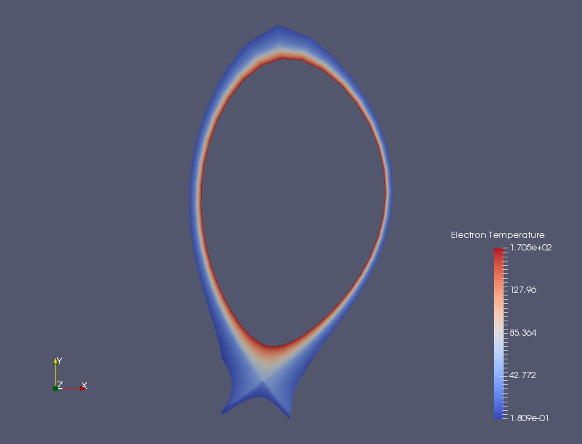

   Cells subgrid showing electron temperature values (using IDS database).

.. _ids-core-te:

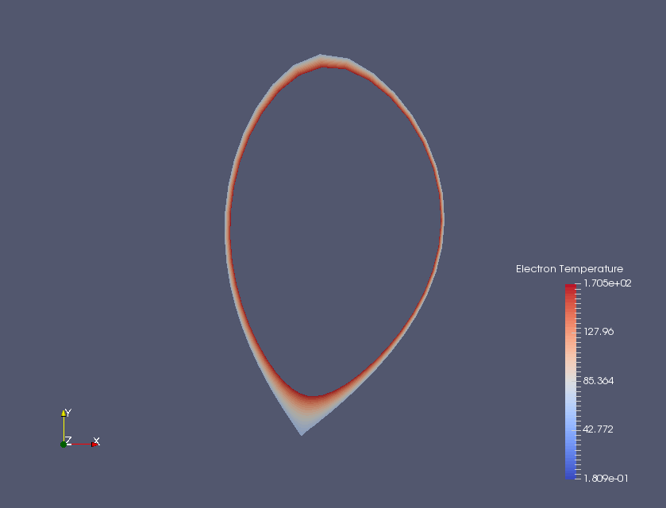

   Core subgrid showing electron temperature values (using IDS database).

Subgrids structure in CPO database
~~~~~~~~~~~~~~~~~~~~~~~~~~~~~~~~~~

In CPO database, subgrid base parameters and indices regarding nodes,
edges and cells are stored in ``edge.grid.subgrid(i)``, as seen in
:num:`Fig. #cpo-grid`, where ``i`` is **subgrid base index** going
from *1..n*, where *n* is sum of all subgrids.

The ``.subgrids`` subdata holds subgrid name in ``.id`` and
**list of indices**, as seen in :num:`Fig. #cpo-subgrids`, either in
**range** form found in ``.list(1).indset(1).range`` or **list**
form found in ``.list(1).ind(j)`` together with **subgrid class**
located in ``.list(1).cls`` (1 for nodes, 2 for edges and 3 for
cells) as seen in :num:`Fig. #cpo-list`, where *j* is number of all
indices for given subgrid.

The found indices correspond to the “main” subgrid of the same class.
For example, *Core* of subgrid class 3 corresponds to the main subgrid
of the same class *Cells*. Other “main” subgrids are *Nodes* for class
1 subgrids and *Edges* for class 2 subgrids.

.. _cpo-grid:

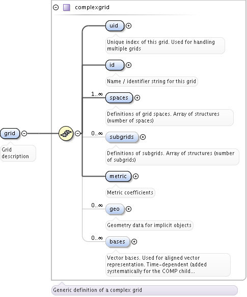

   CPO *grid* structure

.. _cpo-subgrids:

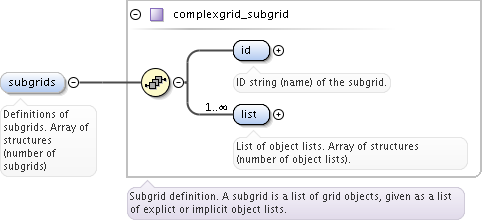

   CPO *subgrids* structure

.. _cpo-list:

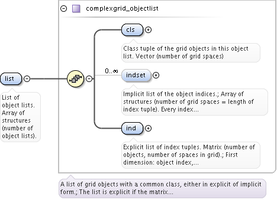

   CPO *list* structure

Subgrids structure in IDS database
~~~~~~~~~~~~~~~~~~~~~~~~~~~~~~~~~~

IDS subgrid base parameters, used to determine geometry data of
subgrids, are stored in location
``edge-profiles.ggd(1).grid.grid-subset(i)``, where ``i`` is **subgrid
base index** going from, the same as in CPO, ``1...n``, where ``n`` is
sum of all subgrids, as seen in :num:`Fig. #ids-grid`.

.. _ids-grid:
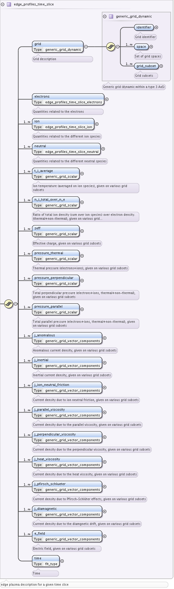

   IDS *grid* structure

It holds **subgrid name** in ``.identifier.name`` and additional info
**subgrid base index** in ``.identifier.index``, as seen in
:num:`Fig. #ids-subset` and :num:`Fig. #ids-identifier`.

.. _ids-subset:
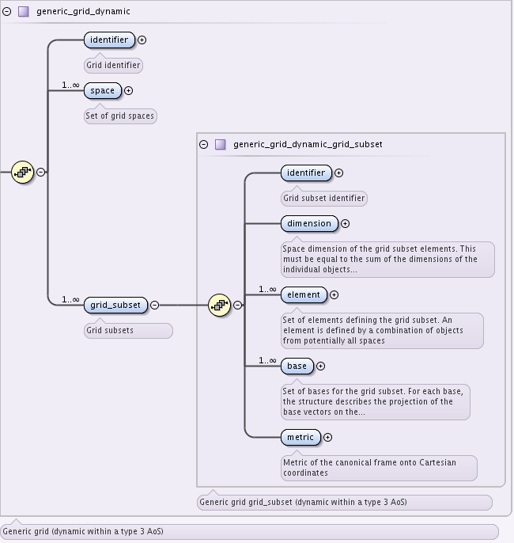

   IDS *subset* structure

.. _ids-identifier:
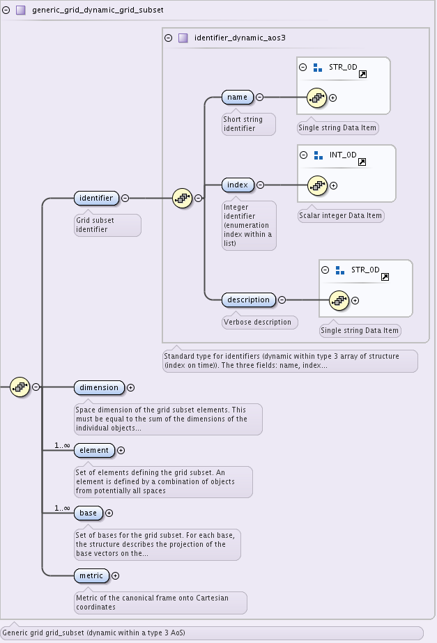

   IDS *identifier* structure

Furthermore, as seen in :num:`Fig. #ids-element` and
:num:`Fig. #ids-dimension` in ``.element(1).object(1).dimension`` it
holds **subgrid class** and in ``.element(1).object(1).index`` it
holds **subgrid object index**, used to navigate to subgrids geometry
data, which will be covered later.

.. _ids-element:
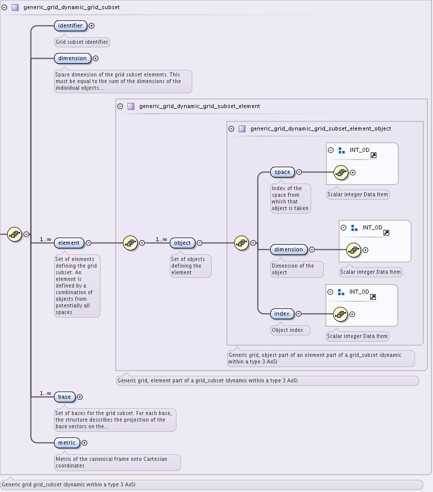

   IDS *element* structure   

.. _ids-dimension:
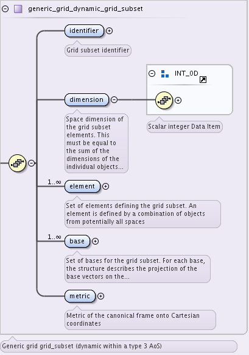

   IDS *dimension* structure

In IDS we have one new important parameter found in
``.element(1).object(1).index``. It holds **subgrid class object
index**, which is ``1...n``, where ``n`` is sum of all subgrids of
certain class, and it’s one of important parameters used to determine
location of geometry data on IDS database for each subgrid.

Another difference is, while CPO database in ``subgrid(i). ...``, as
previously explained, holds also list of indices for given subgrid,
the indices in IDS database are instead stored “close” to geometry
data, which we’ll cover later.

Converting subgrid subdata set from CPO to IDS
~~~~~~~~~~~~~~~~~~~~~~~~~~~~~~~~~~~~~~~~~~~~~~

Regarding the previously explained CPO and IDS database structure,
transferring subgrid data from CPO to IDS database is done by
transferring data from

-  | CPO: ``edge.grid.subgrid(i).id`` to
   | IDS: ``edge-profiles.ggd(1).grid-subset(i).identifier.name``

-  | CPO: ``edge.grid.subgrid(i).list(1).cls`` to
   | IDS:
     ``edge-profiles.ggd(1).grid-subset(i).element(1).object(1).dimension``

in addition, while converting we add

-  | IDS: ``edge-profiles.ggd(1).grid-subset(i).identifier.index``
   | = ``subgrid-base-index``

-  | IDS:
     ``edge-profiles.ggd(1).grid-subset(i).element(1).object(1).index``
   | = ``subgrid-class-object-index``

where ``i`` is **subgrid base index**.

Geometry and nodes
------------------

Main data of our geometry represent the *nodes/points*. *Edges* and
*faces/cells* are constructed using *nodes*.

Geometry and nodes in CPO database
~~~~~~~~~~~~~~~~~~~~~~~~~~~~~~~~~~

The **geometry** in CPO database is stored under subgrid ``Nodes``,
which is used also as reference for geometry of other subgrids (2
nodes/points form an edge, 4 nodes/points form a face/cell), in
``edge.grid.spaces(1).objects(i=2).geo`` as an 4D array as shown in
:num:`Fig. #cpo-geo1` and :num:`Fig. #cpo-geo2`.

.. _cpo-geo1:
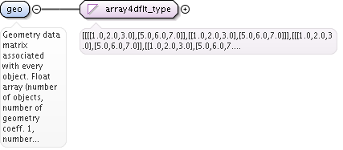

   CPO *geometry* data structure

.. _cpo-geo2:
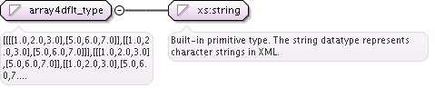

   CPO *geometry* array structure

| In Subgrid chapter we have mentioned that geometry (nodes) for other
  subgrids is found in relation of list of indices for given subgrid
  (general path:
| ``edge.grid.subgrid(i).list(1)...`` where ``i`` is base
  subgrid index) with geometry of ``Nodes`` subgrid..

Geometry and nodes in IDS database
~~~~~~~~~~~~~~~~~~~~~~~~~~~~~~~~~~

Similarly to CPO database, the **geometry** in IDS database is found
under subgrid ``Nodes`` in
``edge-profiles.ggd(1).grid.space(1).objects-per-dimension(c=1).object(k=1).geometry``,
where ``c`` is **subgrid class** and ``k`` is **subgrid class object
index**, stored as an one-dimensional list as shown in :num:`Fig. #ids-geo1a`

.. _ids-geo1a:
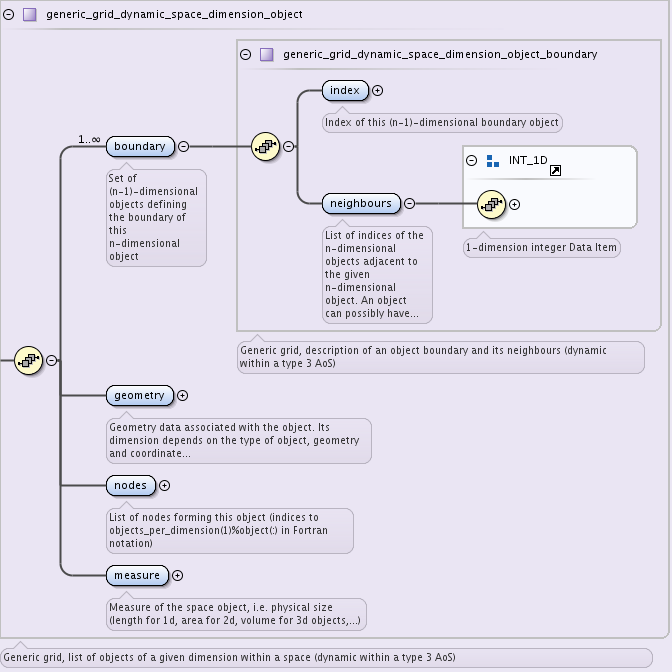

   IDS *geometry* data structure.

Unlike geometry in CPO database, IDS database has a list of nodes for
given subgrid close to geometry dataset, but similarly as in CPO
database, we get our geometry using ``edge-profiles... .nodes`` data
of given subgrid in relation to ``edge-profiles... .geometry`` data of
the “main” subgrid ``Nodes`` so it’s not neccessary to define
``edge-profiles... .geometry`` for each subgrid and that way we also
use less space.

Important differences between CPO and IDS geometry and nodes data structure
~~~~~~~~~~~~~~~~~~~~~~~~~~~~~~~~~~~~~~~~~~~~~~~~~~~~~~~~~~~~~~~~~~~~~~~~~~~

Because of the 4D array geometry data structure in CPO database, the
geometry there can be stored in multi-array structure, while in IDS
database it can be stored only as a list of data. To read/write geometry
from CPO database we have to state two indices, where first index
indicates the node index (goes from ``1`` to ``n``, where n is
number of nodes) while the second index indicates the coordinate (2D: 1
for *x*, 2 for *y*) in form
*[[x-1,y-1], [x-2,y-2], ..., [x-n,y-n]]* where *n*
is number of nodes. Because geometry of IDS database is limited to
one-dimensional space (list), only one index can be used. The decision
was made to write in Fortran notation and in this case read/write to IDS
database is done in form
*[x-1, x-2, x-3, ..., x-n, y-1, y-2, y-3,... y-n]* consisting of
*2n* elements, which gives us *n* nodes.

We have mentioned, that ``geometry`` in CPO databases uses two
indices, one of which is node index. IDS database doesn’t have this
option and it has separate nodes list, located in
``edge-profiles.ggd(1).grid.space(1).objects-per-dimension(c)``
``.object(k).nodes`` and holds in Fortran notation from 1 to *n*.

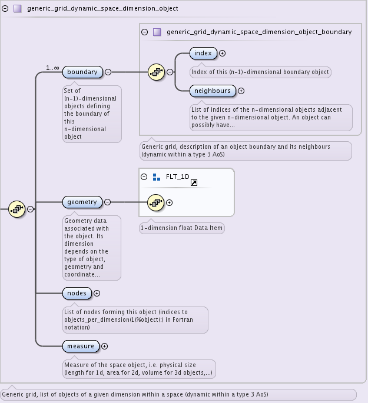

   IDS ``nodes`` data structure

Also getting the geometry of the ``Cells`` subgrid using CPO database
was quite problematic to put together. We found only boundary data in
``edge.grid.spaces(1).objects(3).boundary`` for which we couldn’t find
a proper way to use it, instead we managed to correctly construct the
``Cells`` subgrid using boundary data from ``Edges`` subgrid in
``edge.grid.spaces(1).objects(2).boundary`` together with
scripting. While converting geometry to IDS, the ordered node indices
of ``Cells`` subgrid were properly stored under
``edge-profiles.ggd(1).grid.space(1).objects-per-dimension(3).object(1).nodes``.

Converting geometry and nodes from CPO to IDS
~~~~~~~~~~~~~~~~~~~~~~~~~~~~~~~~~~~~~~~~~~~~~

Regarding the previously explained CPO and IDS database structure,
transferring geometry data from CPO to IDS database is done by
transferring data from:

Geometry and nodes for subgrids class 1 (nodes/points, ``c`` = 1):

-  | CPO: ``edge.grid.spaces(1).objects(2).geo`` to
   | IDS:
     ``edge-profiles.ggd(1).grid.space(1).objects-per-dimension(1).object(1).geometry``

-  | CPO: ``edge.grid.subgrid(i).list(1).ind`` or
     ``.list(1).indset(1).range`` to
   | IDS:
     ``edge-profiles.ggd(1).grid.space(1).objects-per-dimension(1).object(k).nodes``

For subgrids class 2 (edges, ``c`` = 2):

-  | CPO: ``edge.grid.spaces(1).objects(2).boundary`` to
   | IDS:
     ``edge-profiles.ggd(1).grid.space(1).objects-per-dimension(2).object(k).nodes``

For subgrids class 3 (cells, ``c`` = 3):

-  | CPO: Ordered node indices (got with using boundary data from Edges
     and script) to
   | IDS:
     ``edge-profiles.ggd(1).grid.space(1).objects-per-dimension(3).object(1).nodes``

-  | CPO: Using ordered node indices and
     ``edge.grid.subgrid(i).list(1).ind`` or
     ``.list(1).indset(1).range`` to
   | IDS:
     ``edge-profiles.ggd(1).grid.space(1).objects-per-dimension(3).object(k).nodes``

where ``i`` is **subgrid base index**, ``c`` is **subgrid class
index** and ``k`` is **subgrid class object index**.

Electron density and electron temperature
------------------------------------------
Electron density and electron temperature in CPO database
~~~~~~~~~~~~~~~~~~~~~~~~~~~~~~~~~~~~~~~~~~~~~~~~~~~~~~~~~

In CPO database, electron density and electron temperature datasets are
stored under ``fluid`` dataset where ’\ ``ne``\ ’ stands for
electron density and ’\ ``te``\ ’ stands for electron temperature,
as shown in :num:`Fig. #cpo-fluid`.

.. _cpo-fluid:
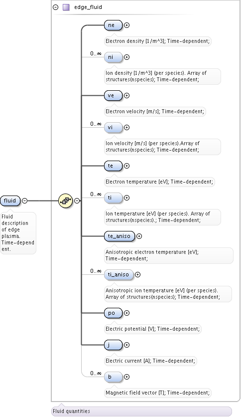

   CPO ``fluid`` data structure

Furthermore, both electron density and electron temperature dataset
structure consists of many subdata sets, ``value`` subdata set being
one of them (path: ``edge.fluid.ne.value(ne-species-index)`` where
``ne-species-index`` goes from 1 to n, where n is number of electron
density species), as shown in :num:`Fig. #cpo-ne`. In it we can find
``subgrid`` data, which is used to store the subgrid base index, and
``scalar`` dataset, in which array of data is stored (electron density
values in ``1/m^3``), as seen on Fig.  :num:`Fig. #cpo-value`.

.. _cpo-ne:
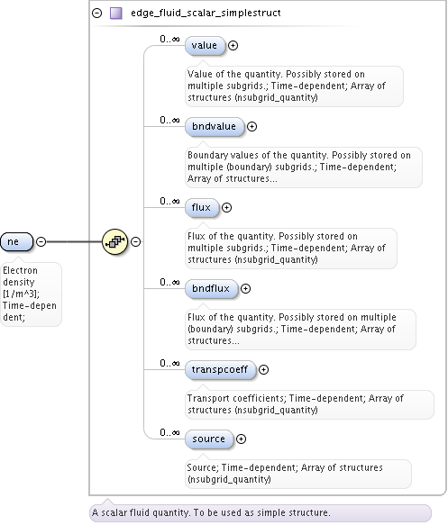

   CPO ``electron density`` data structure

.. _cpo-value:
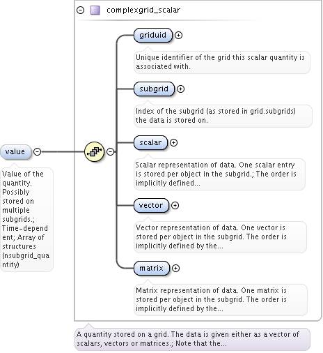

   CPO ``value`` data structure

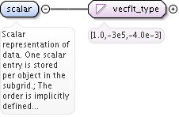

   CPO ``scalar`` data structure

Electron temperature ``te`` data set has identical structure as
electron density ``ne`` data set.

   CPO ``electron`` ``temperature`` data structure

Electron density and electron temperature in IDS database
~~~~~~~~~~~~~~~~~~~~~~~~~~~~~~~~~~~~~~~~~~~~~~~~~~~~~~~~~

While in CPO database, as already mentioned, electron density ``ne``
and electron temperature ``te`` datasets are part of ``fluid``
dataset, in IDS database are part of ``electrons`` dataset (path in
IDS: ``edge-profiles.ggd(1).electrons``), which furthermore
systematically splits to electrons properties datasets, as seen on
:num:`Fig. #ids-electrons`, with density (path:
``edge-profiles.ggd(1).electrons.density(ne-species-index)``) and
temperature (path:
``edge-profiles.ggd(1).electrons.temperature(te-species-index)``)
included.

.. _ids-electrons:
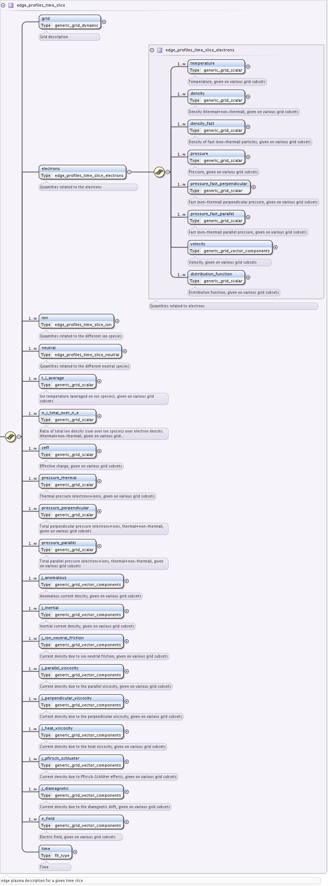

   IDS ``electrons`` data structure

The IDS ``density`` dataset, shown in
:num:`Fig. #ids-electron-density` consists of less subdata sets as CPO
electron density ``ne`` dataset. ``Grid-subset-index`` (in “Subgrid”
and “Geometry and nodes” chapter we called it **subgrid base index**)
and ``values`` data in IDS database are taken for being the same
datasets as ``subgrid`` index and ``scalar`` data in CPO database.

.. _ids-electron-density:
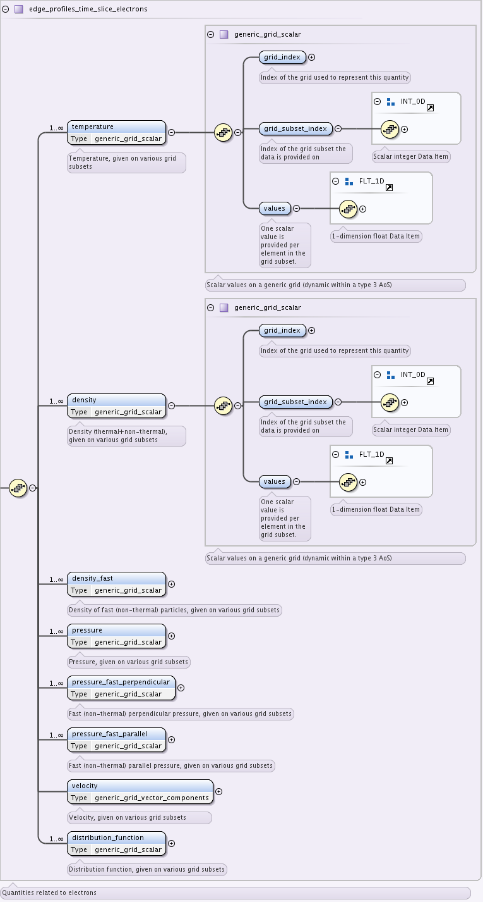

   IDS *electron density* data structure.

IDS ``temperature`` dataset has the same structure as ``density``
dataset as shown in Fig.  :num:`Fig. #ids-electron-temperature`.

.. _ids-electron-temperature:

   IDS *electron temperature* data structure

Converting electron density and electron temperature scalars from CPO to IDS database
~~~~~~~~~~~~~~~~~~~~~~~~~~~~~~~~~~~~~~~~~~~~~~~~~~~~~~~~~~~~~~~~~~~~~~~~~~~~~~~~~~~~~

Regarding the CPO and IDS database structure previously explained,
transferring electrons density and temperature data from CPO to IDS
database is done by transferring data from

-  | CPO: `` edge.fluid.ne.value(m).subgrid`` to
   | IDS:
     ``edge_profiles.ggd(1).electrons.density(i).grid_subset_index``
     (electron density subgrid/subset index),

-  | CPO: `` edge.fluid.ne.value(m).scalar(j)`` to
   | IDS: ``edge_profiles.ggd(1).electrons.density(m).values(j)``
     (electron density values),

-  | CPO: ``edge.fluid.te.value(m).subgrid`` to
   | IDS:
     ``edge_profiles.ggd(1).electrons.temperature(m).grid_subset_index``
     (electron temperature subgrid/subset index) and

-  | CPO: `` edge.fluid.te.value(m).scalar(j)`` to
   | IDS:
     ``edge_profiles.ggd(1).electrons.temperature(m).values(j)``
     (electron temperature values),

where ``m`` is **electron density/temperature species index** and
``j`` is **scalar index**.

Moreover, because in IDS we don’t have a space to store list of
indices for ``Core``, ``SOL``, ``Inner`` ``divertor`` and ``Outer``
``divertor`` subgrids, corresponding to ``Cells`` subgrid (all of them
are class 3) as in CPO database (found in
``edge.grid.subgrid(i).list(1).ind`` or ``.list(1).indset(1).range``),
which would be used to properly connect subgrid geometry and subgrid
scalars, we decided to create additional 4 electron density and
electron temperature species, define proper ``grid_subset_index`` and,
using list of indices from CPO and scalars of ``Cells`` subgrid, store
the scalars the same way as for previous electron density and electron
temperature species.

