.. _ids-howto:

.. highlight:: csh
   
=======================
 IDS HOWTO
=======================

:Author: Dejan Penko, University of Ljubljana

.. only:: html

   .. contents::

.. _sec-grid_desc:

Grid description
----------------

The grid (or mesh) [1]–[4] is an assemblage of multiple connected
elements, provided through their geometry data, which as a whole
represents a discrete approximation of geometry of a real-life physical
object, required for solving physical or mathematical problems like
fluid flow and heat transfer, producing virtual presentations of
simulations intended for analysis of simulation results and other
computing related work in connection with the real-life object.

.. _subsec-grid_struc:

Grid structure
~~~~~~~~~~~~~~

As previously mentioned, each grid is constructed by many low level
components of various geometrical types, hereafter referred to as
*objects*, as the same term is used for geometrical types in SOLPS and
in CPO data structure, covered in later chapters.

The main objects forming the grid are:

#. **points** or **nodes**,

#. **edges**,

#. **faces**, also known as **two-dimensional cells**, and

#. **three-dimensional cells**.

.. _fig-grid_structure_1:
.. figure:: images/grid1.*
   :width: 90.0%

   An example of the basic principle of the two-dimensional
   quadrilateral cell formation starting with four anti-clockwise
   assorted points P1, P2, P3, and P4 (a). Those points represent the
   edge boundary of the E1 to E4 edges (b), and are used for their
   formation, where the points P1 and P2 define the boundary of the edge
   E1, the points P2 and P3 define the boundary of the edge E2, etc.
   Then the same previously defined edges E1, E2, E3, and E4 define the
   boundary of the two-dimensional quadrilateral cell C1 (c). Each cell
   inside the grid is described the same way.

A point with given coordinates in a specific coordinate system
represents the base-level grid object. Two specific points form an
object specified as an edge, and two or more edges form an object
specified as a face or a two-dimensional cell. The most commonly used
two-dimensional cell shapes are triangles, formed by three edges, and
quadrilaterals, formed by four edges as shown in
:numref:`fig-grid_structure_1` and  :numref:`fig-grid_structure_4`. In
three-dimensional space multiple 2D cells form a 3D cell, of which the
most commonly used are tetrahedron (formed using four triangle 2D cells)
and hexahedron (formed using six quadrilateral 2D cells).

A two-dimensional grid is a collection of multiple 2D elements laying in
the same plane connected together (an example is shown in
:numref:`fig-grid_structure_2`) while a three-dimensional grid is a
collection of multiple connected 3D elements (an example is shown in
:numref:`fig-grid_structure_3`).

.. _subsec-grid_boundary:

Boundary
~~~~~~~~

Another term present in grid terminology is *boundary* [5], [6], which
additionally characterizes the grid. While in some cases it might
represent the bounds of the whole grid, in our case *boundary*
represents a list of ``(n-1)`` dimensional components defining the
``n`` dimensional object or bounds of the ``n`` dimensional
object inside the grid. For example, the boundary of an *edge* object
would be two points or nodes, while the boundary of a *2D cell* object
would be four edges as described in :numref:`fig-grid_structure_1`.

.. _fig-grid_structure_2:
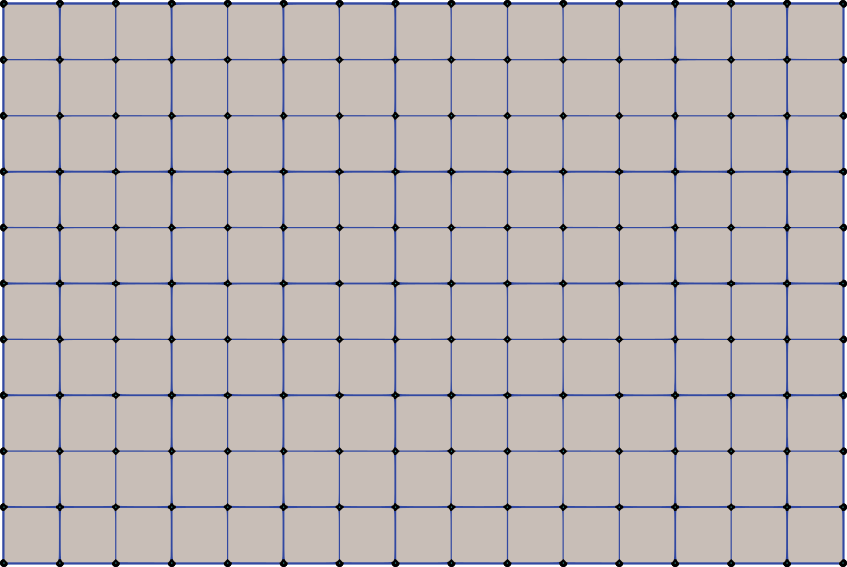
      
   Simple structured quadrilateral grid in two-dimensional space.

.. _fig-grid_structure_3:
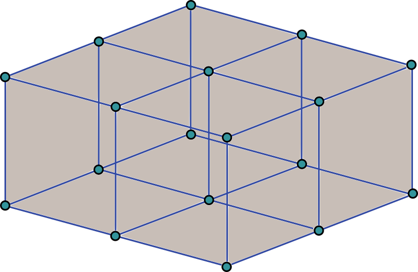
      
   Simple, structured hexahedral grid in three-dimensional space.

.. _fig-grid_examples:

.. _fig-grid_structure_4:
.. figure:: images/grid4.*
   :width: 80.0%

   An example of a connectivity array of an unstructured quadrilateral
   grid.

.. _subsec-grid_subset:

Grid subset or subgrid
~~~~~~~~~~~~~~~~~~~~~~

The grid subset, or subgrid, represents a portion of the contents of a
larger full grid, usually intended for more accurate analysis of an
exactly specified piece of the grid. The same can be seen in
:numref:`fig-aug_1` with each region being its own grid subset, while
simultaneously being part of a grid comprising of all five grid subsets
*Core*, *SOL*, *Inner Divertor*, *Outer Divertor* and *Seperatrix*.

Each grid subset is defined by objects of only one type, that being
either points or nodes [1]_, edges, or two-dimensional cells, etc.

.. _subsec-grid_class:

Grid classification
~~~~~~~~~~~~~~~~~~~

Grid classification [4] is based upon the type of the connectivity of
the grid, or on the type or shape of the cells present.

The main two grid types, based upon the type of the connectivity,

#. | **structured grid**,
   | consist of multiple cells organized in rows and columns, restricted
     to quadrilaterals in 2D and hexahedra in 3D space, as shown in
     :numref:`Figs. %s<fig-grid_structure_2>`,
     :numref:`%s<fig-grid_structure_3>` and :numref:`%s<fig-str_grid>`,

#. | **unstructured grid**,
   | consisting of multiple unorganized cells and with all cell elements
     types available, as shown in :numref:`Figs. %s<fig-grid_structure_4>`
     and :numref:`%s<fig-unstr_grid>`.

.. _fig-str_grid:
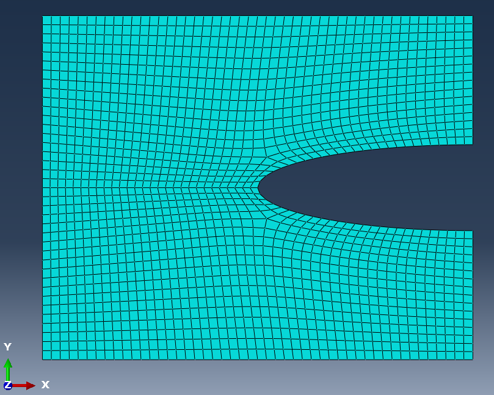

   Complex 2D structured grid.

.. _fig-unstr_grid:
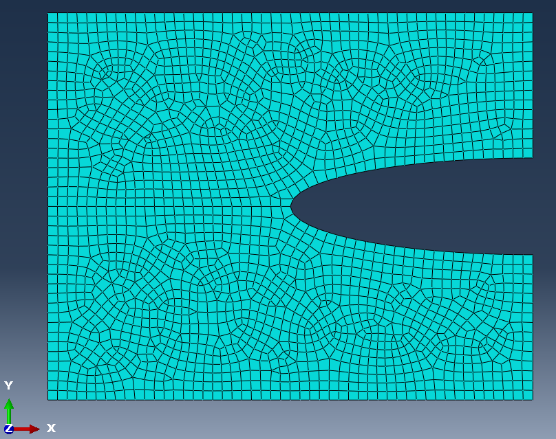
      
   Complex 2D unstructured grid.

.. _fig-grid_complex_examples:

The most common shapes of grid objects cells, based upon the dimension,
are (also shown in :numref:`fig-grid_structure_5`):

-  2-dimensional:

   #. triangles,

   #. quadrilaterals (also known as quads),

-  3-dimensional (note that the next elements are bounded by faces
   belonging to the above mentioned 2-dimensional cells):

   #. tetrahedra,

   #. hexahedra.

.. _fig-grid_structure_5:
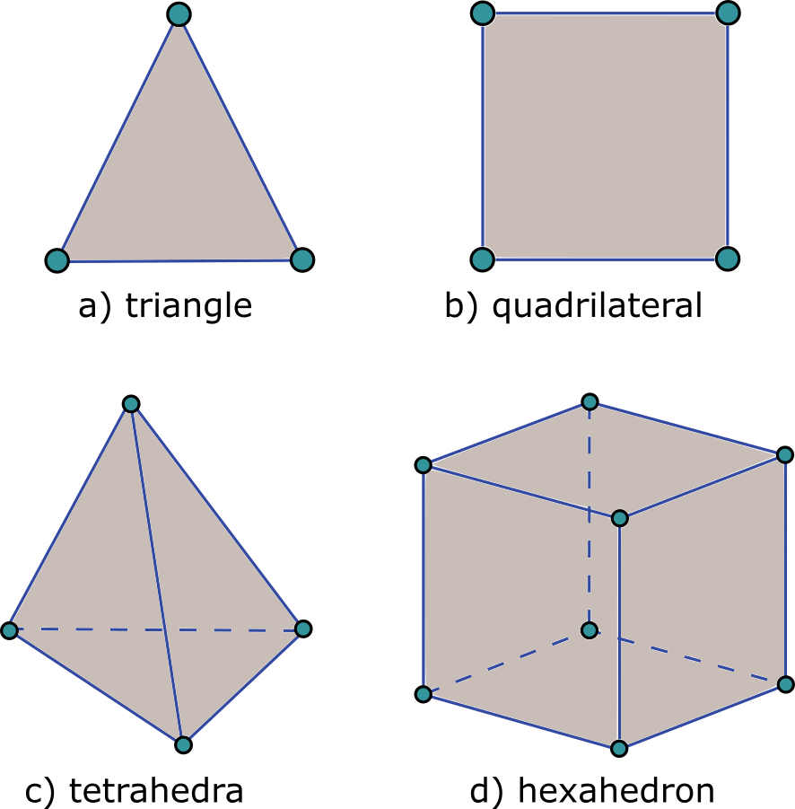

   Common grid cell elements.

.. _subsec-coordinate_systems:

Coordinate systems
~~~~~~~~~~~~~~~~~~

As previously stated in section `1.1`_, the node geometry information
is given in the form of coordinates in a specific coordinate system.
Commonly used coordinate systems in various tokamak fusion simulations
and analysis, also shown in :numref:`fig-tokamak_coord_system_2`,
are [7], [8]:

#. **Cylindrical system** (:math:`R,\phi,z`), with :math:`R` being the
   torus’s major radius, :math:`\phi` the toroidal direction, and with
   :math:`z` being the height, as seen in :numref:`fig-ITER_te_coord`,

#. **Parallel system** (:math:`\parallel,\perp,r`), with
   :math:`\parallel` being the direction parallel and :math:`\perp`
   perpendicular (diamagnetic direction) to magnetic field B and
   :math:`r` being the outward normal to the flux surface,

#. **Poloidal system** (:math:`\theta,r,\phi`), with :math:`\theta`
   being a tangent to the magnetic surface in the poloidal plane,
   :math:`r` being normal to the flux surface in the poloidal plane and
   :math:`\phi` being the angle in the toroidal direction.

The geometry data of the tokamak device is usually given in the global
cylindrical system.

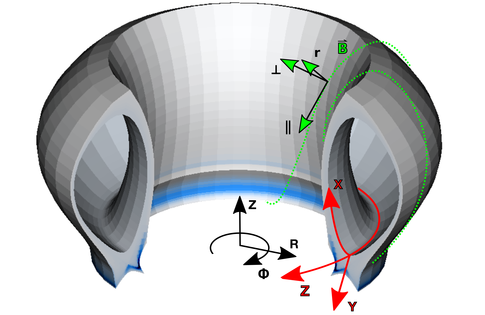
   space. (from Ref. [8]).
   :width: 70.0%

   Global coordinate systems of the tokamak in three-dimensional space.
   (from Ref. [8]).

.. _fig-tokamak_coord_system_2:

.. figure:: images/iter_te_coord.*
   :alt: Global cylindrical coordinate system of the ITER tokamak in
   three-dimensional space.
   :width: 70.0%

   Global cylindrical coordinate system of the ITER tokamak in
   three-dimensional space.

.. _fig-ITER_te_coord:

.. _sec-data_storage_units:

Standardized data structures
----------------------------

One approach of data storage of simulation results is the regular way by
saving the data in files inside a certain location on a computer or in a
directory. This way of data storage is not complicated and functions
with no greater issues. However, by increasing number of data files,
then file handling, such as locating and sharing the data with other
users, becomes gradually more difficult and time consuming until at some
point it becomes too troublesome and impractical. Moreover, this data is
often scattered in different locations and formats, resulting in greatly
increased file handling difficulty and possibly also in troublesome or
not straightforward data interpretation for other users. The other
possible approach, suitable when dealing with hierarchical data and a
higher number of users, and also currently used on ITER, is data storage
in standardized hierarchical transferable databases or data structures,
consisting of tree-like data structure units [2]_, as shown in
:numref:`fig-data_unit_tree_structure`, with each element of a tree
set to hold specified data in specified format. The data tree is
described by (from Ref. [10]):

-  a **node**, the main building block of the data tree, referring to
   any element of the tree. There are two types of nodes [11], also
   shown in :numref:`fig-node_types`:

   -  **simple structure node**, being a regular single node, and

   -  **array of structures node**, describing a 1D array of structures
      under single node label,

-  a **leaf**, referring to an end-point of a tree,

-  a **parent**, referring to an element one level above a particular
   node,

-  a **sibling**, referring to an element at the same level as a given
   node,

-  a **child**, referring to an element one level below a particular
   node,

as shown in :numref:`fig-node_parentChildSibling`, with navigation
through the tree nodes running from start-point nodes through
lower-level nodes to the end-point leafs.

.. _fig-node_types:
.. _fig-node_parentChildSibling:
.. figure:: images/data_tree_combined.*
   :alt: Parent, sibling, child and leaf element of data structure unit tree.
   :width: 100.0%

   Parent, sibling, child and leaf element of data structure unit tree.

.. _fig-data_unit_tree_structure:
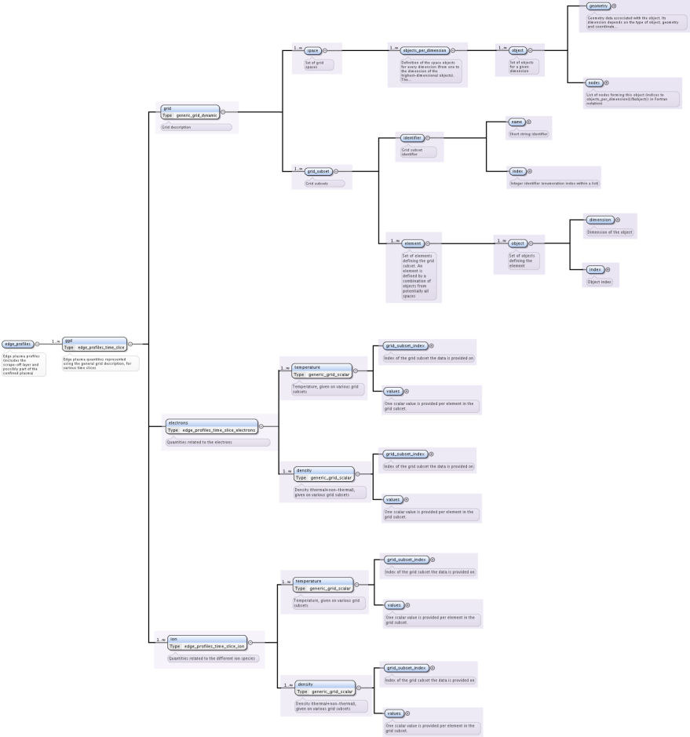

   An example of schematics of data structure unit tree structure [12].

The previously explained data tree structure, with each tree node being
predefined to hold specific data in specific format, provides us with a
standardized way of writing the data inside data structure unit and
consequently solves the issues regarding the data interpretation. The
standardized data unit structure and data format also allows us to store
either simulation or experimental data, and as such it makes the
comparison of simulations to experimental data straightforward.
Moreover, the data structures also contain information nodes inside
which the content of the data structure and origin of the data are
stored, such as information on the data provider, date of data structure
creation, source of the data, etc. Furthermore, the data structures of
certain user can be accessed by other users without the need of data
replication (data owners permission is required).

The contents of the data structure are accessed and written by using
various programming languages such as Python (both Python2.x and
Python3.x), C++, Fortran90, Matlab, and others. In C++ and Python
programming languages the specific tree node is described in form
``node_top.node_LV1(:). ... .node_LVn.leaf``, using period ``"."`` as
separation mark, while in Fortran90 percentage sign ``"%"`` is used
instead. The ``"(:)"`` mark used in the shown form is used to designate
a node being an array of structures node, as shown in
:numref:`fig-node_types`, containing many structures with identical
structure, additionally defined by array index with ``1`` as a start
index (Fortran notation). For example, ``node_top.node_LV1(1)``
navigates to first structure of the ``node_LV1`` array of structures
node.

Separate data structures are identified by their main unique case
parameters

-  **shot** number, the first case identification,

-  **run** number, the second case identification,

-  **user**, usually the owner or creator of the data structure and

-  **device**, name of the device or tokamak to which the stored data is
   related to.

Each data structure has their own preset parameter values, set by the
creator or author of the data structure.

To sum up, the pros and cons of using the discussed data structures are:

Pros:

-  standardized data archival and retrieval,

-  easier data sharing and distribution,

-  better data tracing and conservation, and

-  straightforward data comparison.

Cons:

-  additional software and environment configuration is required,

-  accessing the data might prove difficult for users with no or little
   computer programming skills, and

-  they are designed and intended to hold only data with the
   predetermined data types, related to a specific area of research.

Two data structure unit types currently exist and are used on ITER for
data storage of various plasma simulation results, tokamak device
geometry, etc. The first such data structure unit is *CPO (Consistent
Physical Object)* and the second, the successor of the CPO, *IDS
(Interface Data Structure)*, presented in depth in the following
chapter ``_.

.. cha:cpoids:

CPO data structures and IDS
===========================

This chapter aims to give insight into *Consistent Physical Objects
(CPOs)* data structure and its IMAS successor *Interface Data structures
(IDSs)*, their purpose, structure, advantages, and disadvantages etc.,
and is intended for better understanding of methods and concepts in the
following chapters.

.. _sec-cpo:

CPO data structure
------------------

A so-called *Consistent Physical Object (CPO)* [9] is a standardized
modular physics-oriented transferable data storage object within EU-IM
database designed by EUROfusion Integrated Modelling Task Force (EU-IM
TF) to contain structured tokamak and stellarator plasma physics data in
the form of tree-like standardized blocks used for data exchange between
physics modules in an arbitrary physics/technology workflow.

There are around 40 CPOs within the EU-IM data structure, each designed
to hold its own specified plasma physics data related to a specific
tokamak device. A few examples of the CPOs are [13]:

**edge** –
    a CPO describing plasma characteristics within the *edge* region of
    the tokamak, including the Scrape-Off Layer (SOL) region.

**equilibrium** –
    a CPO describing the plasma equilibrium.

**pfsystems** –
    a CPO describing the entire Poloidal Fields systems.

In this section the emphasis is on the *edge* CPO data structure. The
explanation that follows is our description of the "data dictionary"
explaining the relevant *edge* CPO content extracted from XSD
descriptions available for XSL translation (XSLT) into different forms
including several programming languages. Still, many "descriptions" of
nodes were left out for brevity of the text and complete description one
should use the latest reference available online
only http://portal.eufus.eu [14].

.. _fig-cpo_top_1:
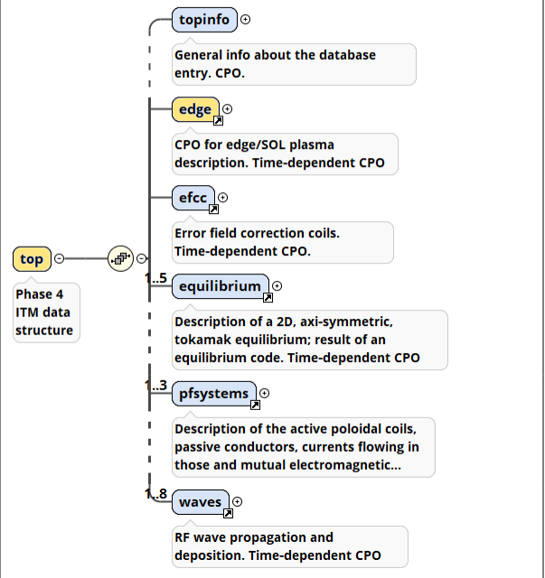
         highlighted *edge* CPO data structure, relevant to this thesis.
   :width: 70%
   :align: center

   Partial tree structure of the EU-IM database [13] with highlighted
   *edge* CPO data structure, relevant to this thesis.

.. _subsec-cpo_edge_structure:

The edge CPO data structure
~~~~~~~~~~~~~~~~~~~~~~~~~~~

The *edge* CPO is a database object within EU-IM database structure,
predefined to hold data related to the *edge* plasma with SOL region
included. As previously presented in chapter `2`_, *edge* CPO consists
of lower-level data-tree nodes. Taking into the account the extent and
complexity of the *edge* CPO structure, only nodes relevant to this
thesis will be covered. Following that, the main children of the
top-point *edge* CPO node, as shown in :numref:`fig-cpo_edge_top`, are:

-  **datainfo**, a simple structure node designed to contain generic
   information on the data stored in the CPO,

-  **grid**, a simple structure node designed to contain geometry data
   describing the full grid of edge plasma,

-  **species(:)**, an array of structures node designed to contain data
   describing the ion species,

-  **fluid**, a simple structure node designed to contain data fields
   (scalar values) on plasma quantities regarding the edge plasma,

-  **time**, a leaf designed to contain time scalar (single *float* data
   type value).

.. _fig-cpo_edge_top:
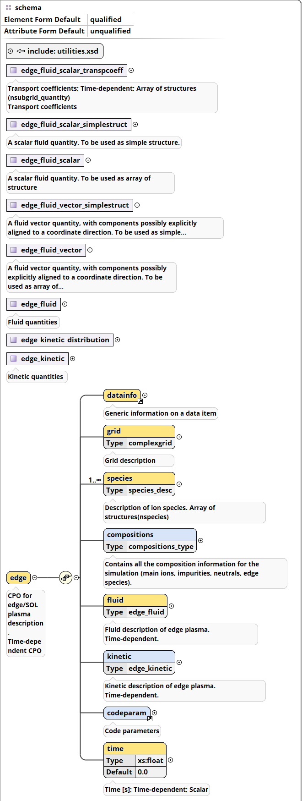
         ``datainfo``, ``grid``, ``species(:)``, ``fluid`` and ``time`` nodes.

   *edge* CPO structure [13] with highlighted relevant ``datainfo``,
   ``grid``, ``species(:)``, ``fluid`` and ``time`` nodes.

.. _subsubsec-grid_node_structure:

grid node structure
^^^^^^^^^^^^^^^^^^^

``grid`` is a node set to contain data on the grid description of the
edge region. It is a child of ``edge`` node and a sibling to
``datainfo``, ``species(:)`` and ``fluid`` node. The essential children
of the ``edge.grid`` node, as shown in :numref:`fig-cpo_edge_grid`,
are:

-  **spaces(:)**, an array of structures node designed to contain data
   describing each grid space,

-  **subgrids(:)**, an array of structures node designed to contain data
   describing each grid subset [3]_ previously presented in
   chapter `1.3`_.

.. _fig-cpo_edge_grid:
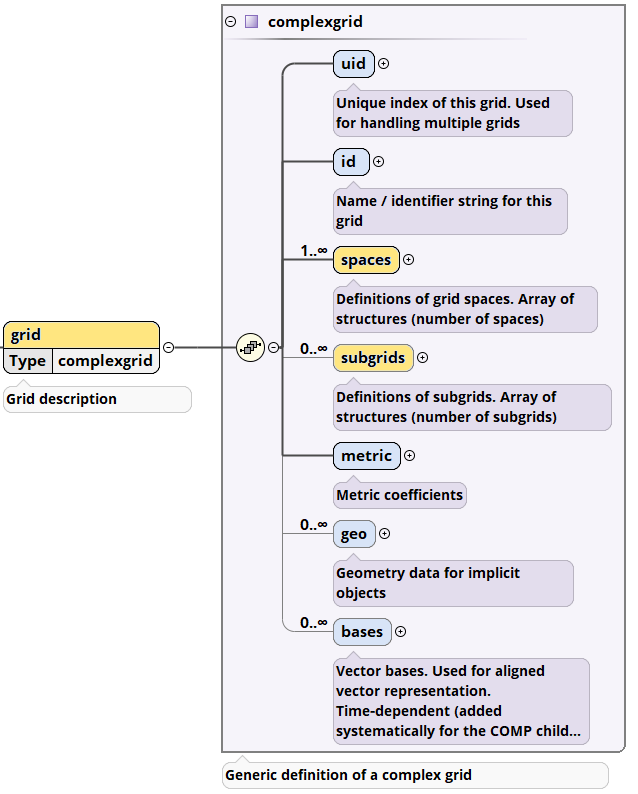
         ``spaces(:)`` and ``subgrids(:)`` nodes.

   CPO ``edge.grid`` node structure [13] with highlighted relevant
   ``spaces(:)`` and ``subgrids(:)`` nodes.

.. _fig-cpo_edge_species:

         relevant ``label`` node.

   CPO ``edge.species(:)`` node structure [13] with highlighted relevant
   ``label`` node.

.. _parag-cpo_grid_spaces:

spaces(:) node structure
''''''''''''''''''''''''

``spaces(:)`` is an array of structures node set to contain data on the
grid, defined in specified space or coordinate system. Its children, as
shown in :numref:`fig-cpo_edge_grid_spaces`, are:

-  **coordtype**, a leaf designed to contain information on types of
   coordinates describing the physical space, with predefined code
   number for each coordinate [15] (2D array of *integer* data type
   values),

-  **objects(:)**, an array of structures node designed to contain data
   on objects, previously discussed in chapter `1.1`_, separated by
   EU-IM *object class* index [5] referring to the type or dimension of
   the object (2D space):

   -  Class 1 or *(0,1)* for 0D objects (points or grid nodes),

   -  Class 2 for all 1D objects (edges) or *(1,0)* for edges aligned
      along first axis (horizontally) and *(0,1)* for edges aligned
      along second axis (vertically),

   -  Class 3 or *(1,1)* for 2D objects (2D cells), etc.

   For example, node ``edge.grid.spaces(:).objects(1)`` contains data in
   relation to the geometry of all points or grid nodes in the domain.
   Furthermore, ``object(:)`` node consists of the next children:

   -  **boundary**, leaf designed to contain an array of ``(n-1)``
      dimensional space objects defining the boundary of an
      n-dimensional space object (2D array of *integer* data type
      values), explained in chapter `1.2`_,

   -  **geo**, leaf designed to contain an array of geometry data
      associated with every object (4D array of *float* data type
      values). Usually only the *objects(1)* branch has that leaf filled
      with data, that data being coordinates of points or grid nodes in
      the coordinate system defined in the *spaces(:).coordtype* leaf.

.. _fig-cpo_edge_grid_spaces:
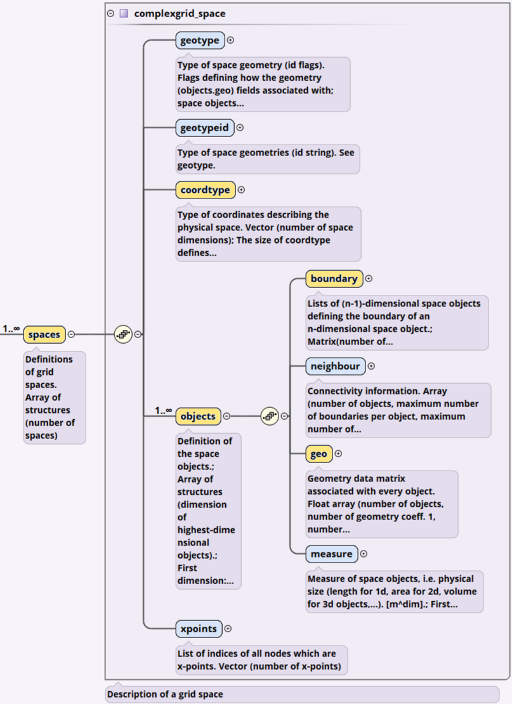
         highlighted relevant ``coordtype``, ``objects`` ``boundary`` and
         ``geo`` nodes.

   CPO ``edge.grid.spaces(:)`` node structure [13] with highlighted
   relevant ``coordtype``, ``objects`` ``boundary`` and ``geo`` nodes.

**subgrids(:)** is an array of structures node, set to contain data on
grid subsets, previously explained in chapter `1.3`_. It is a child of
``edge.grid`` node and a sibling to the ``spaces(:)`` node. Its children
are:

-  **id**, a leaf designed to contain the name of the grid subset
   (single *string* data type value)

-  **list(:)**, an array of structures node designed to contain list of
   object lists forming the grid subset. Its children, as shown in
   :numref:`fig-cpo_edge_grid_subgrids`, are:

   -  **cls**, a leaf describing the class of the objects defining the
      grid subset, previously presented in section `1.1.1.1`_ under
      ``objects(:)`` node (single *integer* data type value).

   -  **ind**, a leaf designed to contain explicit list of index tuples
      (2D array of *integer* data type values),

   -  **indset(:)** an array of structures node designed to contain
      implicit list of object indices corresponding to
      ``edge.grid.space(:).objects(:)`` node, defining the grid subset,
      with children:

      -  **range**, a leaf designed to contain an index range of object
         indices defining the grid subset, enumerating from start index
         to end index (array of *integer* data type values, typically
         containing only two integers - the start and end index of the
         range),

      -  **ind**, a leaf designed to contain an explicit list of object
         indices defining the grid subset.

.. _fig-cpo_edge_grid_subgrids:
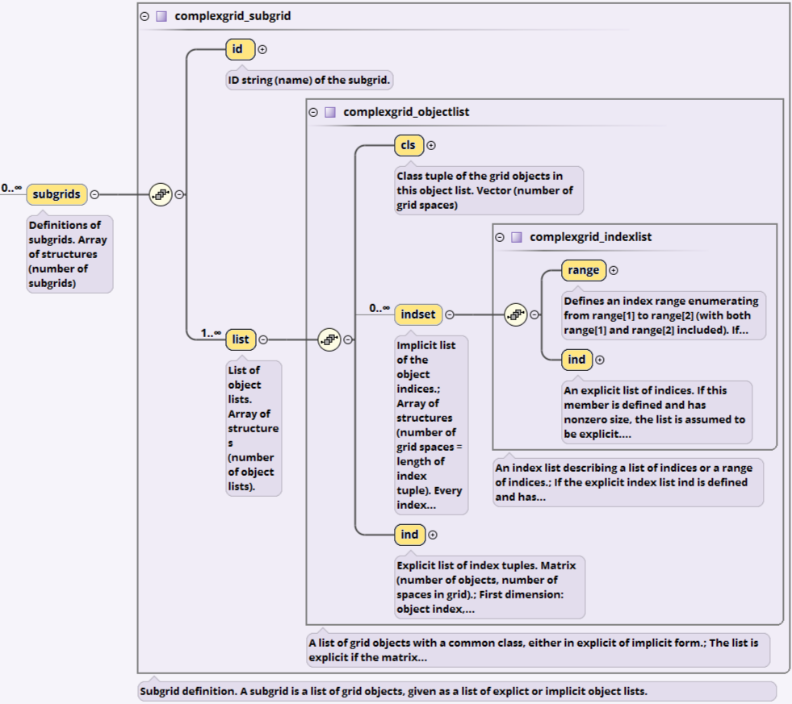
         highlighted relevant ``id``, ``list``, ``cls``, ``indset``, ``ind``
         and ``range`` nodes.

   CPO ``edge.grid.subgrids(:)`` node structure [13] with highlighted
   relevant ``id``, ``list``, ``cls``, ``indset``, ``ind`` and ``range``
   nodes.

.. _subsubsec-species_branch_structure:

species(:) node structure
^^^^^^^^^^^^^^^^^^^^^^^^^

``species(:)`` is an array of structures node, a child of ``edge`` node,
and a sibling of ``grid`` and ``fluid`` node, set to contain data on
each ion specie such as its charge state, ion label and other
characteristics, but not data fields on the ion properties itself. Its
more notable child is ``label`` node, a leaf designed to contain the
name of the ion (single *string* data type value).

.. _subsubsec-fluid_branch_structure:

fluid node structure
^^^^^^^^^^^^^^^^^^^^

``fluid(:)`` is an array of structures node containing data on data
fields of plasma properties such as electron density, electron
temperature, ion species density, ion species temperature, etc. of
plasma edge region (SOL and its adjacent regions) with direct relation
to the grid subsets. It is a child of ``edge`` a node and a sibling of
``grid``, and ``species`` a node, with the next nodes being its more
notable children, as shown in :numref:`fig-cpo_edge_fluid`:

-  **ne**, a simple structure node to contain data on electron density
   in the edge plasma region,

-  **ni(:)**, an array of structures node designed to contain data on
   the ion specie density in the edge plasma region for each ion specie,

-  **te**, a simple structure node to contain data on the electron
   temperature in the edge plasma region,

-  **ti(:)**, an array of structures node designed to contain data on
   the ion specie temperature in the edge plasma region. It might
   contain only one structure, as all ion species have approximately the
   same temperature.

All four nodes have the same structure and the same children only with
``ni(:)`` and ``ti(:)`` being an array of structures node, with as many
structures as there are different ion species [4]_, while we have only
one structure for ``ne`` and ``te`` as in physics all electrons are
identical.

The children and subchildren of previously mentioned ``ne``, ``ni``,
``te`` and ``ti`` nodes, as shown in :numref:`fig-cpo_edge_fluid_ni`,
are:

-  **values(:)**, an array of structures node designed to contain the
   data field on the physical quantity. Its children are:

   -  **griduid**, a leaf designed to contain the identifier of the grid
      this ``values(:)`` node is associated with (single *integer* data
      type value),

   -  **subgrid**, a leaf designed to contain the index of the grid
      subset this ``values(:)`` node is associated with (single
      *integer* data type value), and

   -  **scalar**, a leaf designed to contain data field of scalars
      representing the plasma property, with one scalar being stored per
      object associated with the identified grid subset (vector of
      *float* data type values).

.. _fig-cpo_edge_fluid:

         relevant ``ne``, ``ni(:)``, ``te`` and ``ti(:)`` nodes.

   CPO ``edge.fluid`` node structure [13] with highlighted relevant
   ``ne``, ``ni(:)``, ``te`` and ``ti(:)`` nodes.

.. _fig-cpo_edge_fluid_ni:
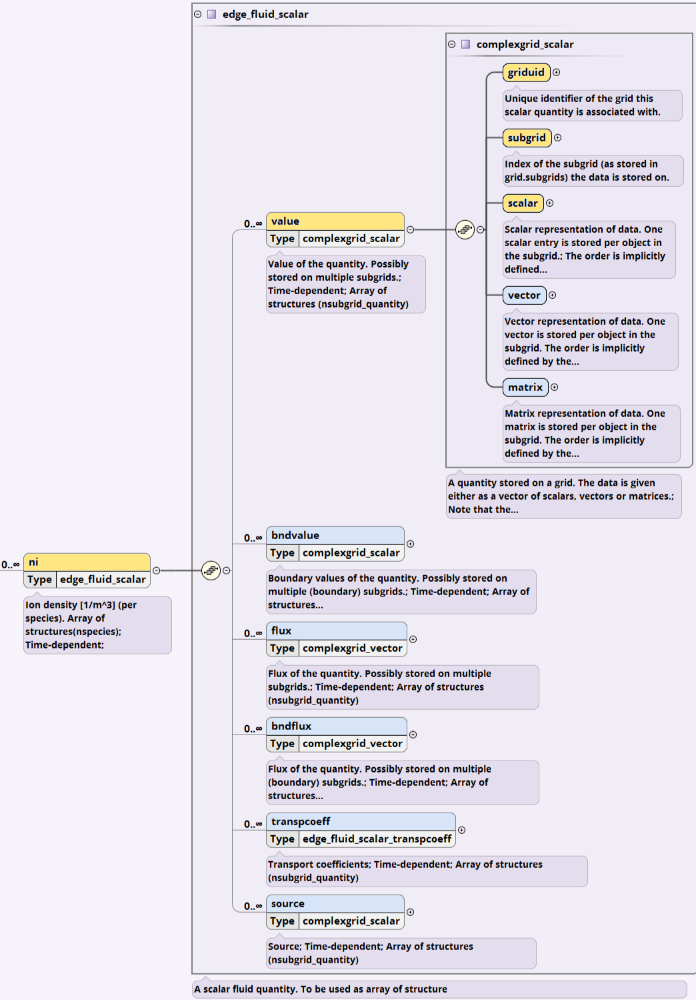
         relevant ``value(:)``, ``griduid``, ``subgrid`` and ``scalar`` nodes.

   CPO ``edge.fluid.ni(:)`` node structure [13] with highlighted
   relevant ``value(:)``, ``griduid``, ``subgrid`` and ``scalar`` nodes.

.. _sec-ids_desc:

IDS structure
-------------

The *Interface Data Structure (IDS)* [16], [17] is a rich and complex
data storage "object," allowing standardized archival and retrieval of
simulation output results of SOLPS-ITER, and other tools within the ITER
Integrated Modelling Analysis Suite (IMAS) framework [16]. Each IDS is a
part of so-called *Data Dictionary* [18], an extensive database
description or data container under which all IDS are listed as
children, and is stored in the local database using MDSplus [19].

Being the successor of the CPO, IDS, and CPO have many features in
common. Their data structure tree is similar (but not the same!). The
IDS, same as CPO, is designed to hold vast amounts of fusion data with
each IDS predefined to contain data in connection to specific fusion
area of research, such as full description of a tokamak subsystems
(diagnostic, heating system, etc.) or plasma physics models
(equilibrium, SOL, wave propagation, etc.).

Besides IDS having more vast and explicit data tree structure, another
advantage of IDS over CPO is its capability of containing data under
different time-bases for the same physics case, as in an experiment data
may be acquired at different time rates.

IDSs are currently being used by the first IMAS workflows, covering
aspects and conditions of plasma physics inside the ITER tokamak device
during plasma burn. At present the *Data Dictionary* is still being
expanded and upgraded with new IDSs, with currently over 40 IDSs defined
for IMAS.

Few of the IDSs, comprised in the Data Dictionary, as shown in
:numref:`fig-ids_data_dictionary`, are:

-  **edge_profiles**,

-  **edge_sources**,

-  **edge_transport**,

-  **equilibrium**,

-  **pf_active**,

-  **pf_passive**.

*edge_profiles*, *edge_sources* and *edge_transport* IDSs are upgraded,
extended, and separated successors of the *edge* CPO, previously covered
in chapter `1`_, describing the edge plasma, with *edge_profiles*
being the most similar to the CPO predecessor. *equilibrium* is an IDS
successor of the same-name CPO describing the 2D, axi-symmetric tokamak
equilibrium, and *pf_active* and *pf_passive* are upgraded, extended,
and separated successors of *pfsystems* CPO.

In this section the emphasis is only on the *edge_profiles* IDS, where
we describe important aspects of its properties. Similarly to CPO, one
should confer the current description at the ``data-dictionary`` GIT
repository [12] for detailed descriptions available as comments at
nodes.

.. _fig-ids_data_dictionary:
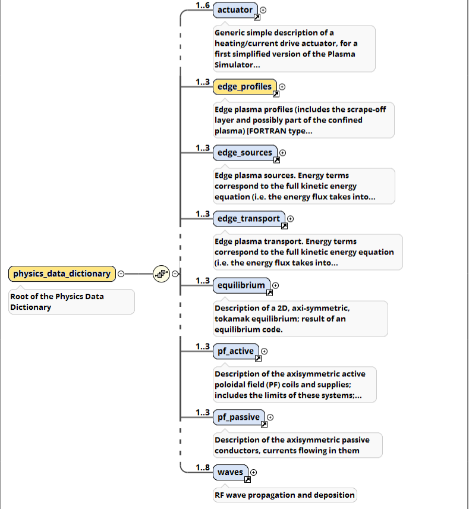
         Data Dictionary tree), and its listed IDSs [12] with highlighted
         relevant ``edge_profiles`` IDS.

   Partial structure of Physics Data Dictionary (the root of the Data
   Dictionary tree), and its listed IDSs [12] with highlighted relevant
   ``edge_profiles`` IDS.

.. _subsec-ids_edge_profiles_structure:

The edge_profiles IDS
~~~~~~~~~~~~~~~~~~~~~

The *edge_profiles* IDS is a generic data structure within the Data
Dictionary database [12], designed to hold data related to plasma burn
in the edge region of the tokamak with the SOL region included. As
previously discussed in chapter `2`_, *edge_profiles* IDS consists of
many lower-level data-tree nodes.

Taking into the account the extent of the *edge_profiles* IDS structure,
only nodes relevant to this work will be presented. Considering this,
the main children of the top-point *edge_profiles* IDS node, as shown in
:numref:`fig-ids_edgeprofiles_top`, are:

-  **ids_properties**, a simple structure node set to contain data on
   IDS properties, as shown in
   :numref:`fig-ids_edgeprofiles_idsproperties`, and

-  **ggd(:)**, an array of structures node designed to contain edge
   plasma quantities represented using the GGD (General Grid
   Description), for various time slices if required.

.. _fig-ids_edgeprofiles_top:
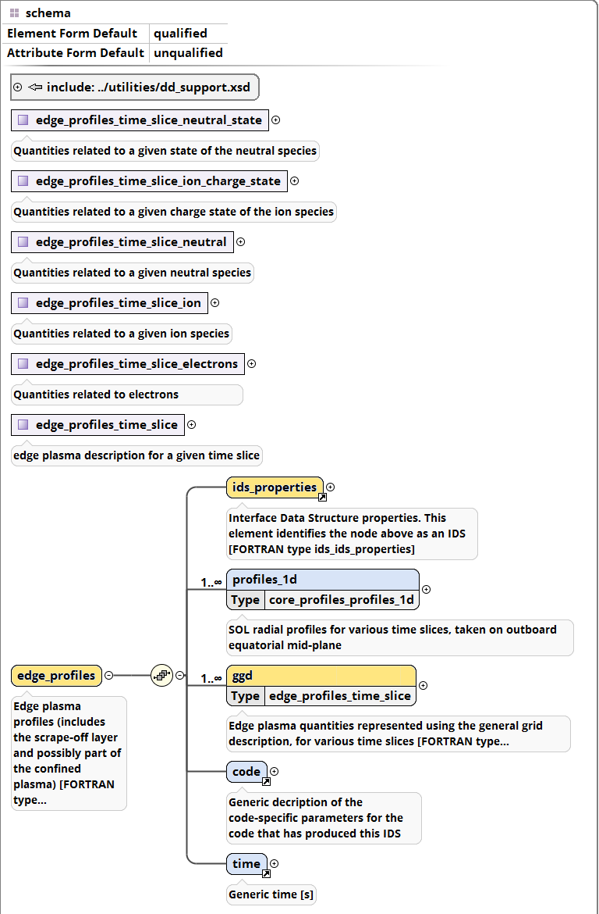
         relevant ``ids_properties`` and ``ggd(:)`` nodes.

   IDS ``edge_profiles`` node structure [12] with highlighted relevant
   ``ids_properties`` and ``ggd(:)`` nodes.

.. _fig-ids_edgeprofiles_idsproperties:
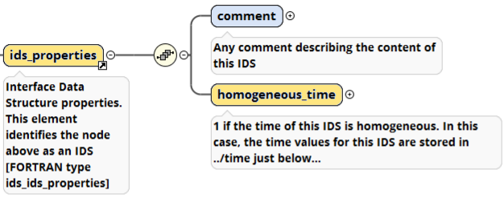
         highlighted relevant ``homogeneous_time`` nodes.

   IDS ``edge_profiles.ids_properties`` node structure [12] with
   highlighted relevant ``homogeneous_time`` nodes.

.. _subsubsec-ids_ggd:

ggd(:) node structure
^^^^^^^^^^^^^^^^^^^^^

The ``edge_profiles.ggd(:)`` node is an array of structures designed to
hold all edge plasma physics and grid description data regarding the
edge plasma region under its own timebase. Its more notable children, as
shown in :numref:`fig-ids_edgeprofiles_ggd`, are:

-  **grid**, a simple structure node to contain grid description,

-  **electrons**, a simple structure node to contain data on quantities
   related to the electrons,

-  **ion(:)**, an array of structures node designed to contain data on
   quantities related to different ion species, and

-  **time**, a leaf designed to contain the time of the time slice
   (single *float* data type value).

.. _fig-ids_edgeprofiles_ggd:
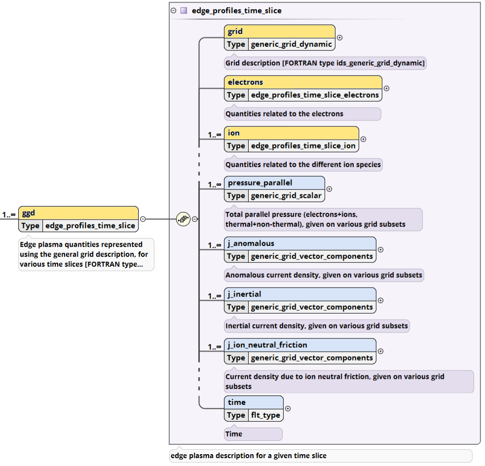
         highlighted relevant ``grid``, ``electrons`` and ``ion(:)`` nodes.

   IDS ``edge_profiles.ggd(:)`` node partial structure [12] with
   highlighted relevant ``grid``, ``electrons`` and ``ion(:)`` nodes.

.. _parag-ids_ggd_grid:

grid node structure
'''''''''''''''''''

The ``edge_profiles.ggd(:).grid`` node is a sibling of
``edge_profiles.ggd(:).electrons`` node and
``edge_profiles.ggd(:).ion(:)`` node. It contains data on full grid
description, described in :numref:`sec-grid_desc`, and its more
notable children, as shown in :numref:`fig-ids_edgeprofiles_ggd_grid`,
are:

-  **identifier**, a simple structure node to contain grid
   identification information,

-  **space(:)**, an array of structures node designed to contain data on
   grid spaces, and

-  **grid_subset(:)**, an array of structures node, designed to contain
   data on grid subsets.

.. _fig-ids_edgeprofiles_ggd_grid:
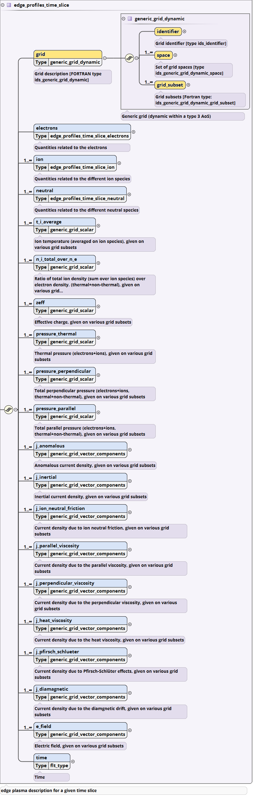
         highlighted relevant ``identifier``, ``space(:)`` and
         ``grid_subset(:)`` nodes.

   IDS ``edge_profiles.ggd(:).grid`` node structure [12] with
   highlighted relevant ``identifier``, ``space(:)`` and
   ``grid_subset(:)`` nodes.

.. _subparag-ids_ggd_identifier:

identifier
          

node is a sibling of ``space(:)`` node and ``grid_subset(:)`` node, set
to contain data used for grid identification. Its more notable children,
as shown in :numref:`fig-ids_edgeprofiles_ggd_grid_identifier`, are:

-  **name**, a leaf designed to contain grids unique name of the grid
   (single *string* data type value),

-  **index**, a leaf designed to contain grids unique index
   identificator (single *integer* data type value), and

-  **description**, a leaf designed to contain grid description in the
   form of a sentence (single *string* data type value).

.. _fig-ids_edgeprofiles_ggd_grid_identifier:
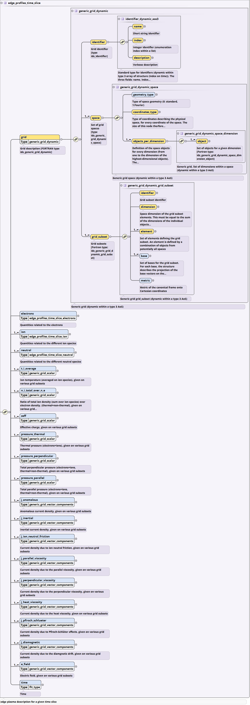
         structure [12] with highlighted relevant ``name``, ``index`` and
         ``description`` nodes.

   IDS ``edge_profiles.ggd(:).grid.identifier`` node structure [12] with
   highlighted relevant ``name``, ``index`` and ``description`` nodes.

.. _parag-ids_ggd_space:

space(:)
        

node is an array of structures and a sibling to ``identifier`` and
``grid_subset(:)`` node, set to contain data on grid spaces. Its more
notable children, as shown in
:numref:`fig-ids_edgeprofiles_ggd_grid_space`, are:

-  **coordinates_type**, a leaf designed to contain information defining
   the coordinate system and describing the physical space, with
   predefined code number for each coordinate [15] (array of *integer*
   data type values), and

-  **objects_per_dimension(:)**, an array of structures node designed to
   contain definition of space objects, previously covered in
   chapter `1.1`_, for every dimension. Each dimension corresponds to
   the predetermined array index:

   -  index 1 for 0D objects (points or grid nodes),

   -  index 2 for 1D objects (edges),

   -  index 3 for 2D objects (2D cells),

   -  index 4 for 3D objects (3D cells), etc.

| Each structure of
  ``edge_profiles.ggd(:).grid.space(:).objects_per_dimension(:)`` node
  has one child node, that is also an array of structures, named
  ``object(:)``, with each ``object(i)`` node describing the i-th object
  of the given dimension. For example, having ``n`` m-dimensional
  objects would result in set of ``n``
| ``objects_per_dimension(m).object(i)`` nodes, with node set index
  ``i`` running from 1 to ``n``.

The more notable children of ``object(:)`` node, each describing
specific grid subset object, as shown in
:numref:`fig-ids_edgeprofiles_ggd_grid_space_dim_object`, are:

-  **geometry**, a leaf designed to contain geometry data associated
   with the object. Its array size depends on the type of object and
   coordinate system (previously defined in ``coordinates_type`` leaf,
   covered in section `2.1.1.1.2`_ (an array of *float* data type
   values),

-  | **nodes**, a leaf designed to contain list of 0D points or grid
     nodes forming this object, corresponding to
   | ``edge_profiles.ggd(:).grid.spaces(:).objects_per_dimension(1).object(:)``
   | nodes (an array of *integer* data type values),

-  **boundary(:)**, an array of structures node, designed to contain
   data on boundary of the object, previously covered in
   section `1.2`_. Each node contains a set of (n-1) dimensional
   objects defining the boundary of this n-dimensional object, stored in
   its children *index* leaf (an array of *integer* data type values).

.. _fig-ids_edgeprofiles_ggd_grid_space:

         with highlighted relevant ``coordinates_type``,
         ``objects_per_dimension(:)`` and ``object(:)`` nodes.

   IDS ``edge_profiles.ggd(:).grid.space(:)`` node structure [12] with
   highlighted relevant ``coordinates_type``,
   ``objects_per_dimension(:)`` and ``object(:)`` nodes.

.. _fig-ids_edgeprofiles_ggd_grid_space_dim_object:
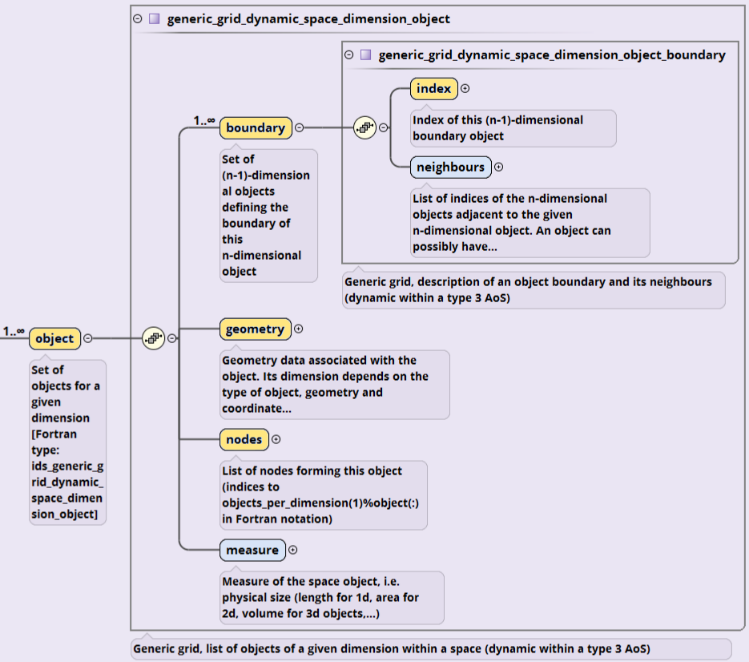
         .objects_per_dimension(:).object(:)``
         node structure [12] with highlighted relevant ``boundary``, *index*,
         ``geometry`` and ``nodes`` nodes.

   IDS
   ``edge_profiles.ggd(:).grid.space(:).objects_per_dimension(:).object(:)``
   node structure [12] with highlighted relevant ``boundary``, *index*,
   ``geometry`` and ``nodes`` nodes.

.. _parag-ids_ggd_grid_gridsubset:

grid_subset(:)
              

node is an array of structures and a sibling to ``identifier`` node and
``space(:)`` node, set to contain data on grid subsets previously
explained in `1.3`_ and it is an IDS variation of *edge* CPO
``subgrid(:)`` node, discussed in section `1.1.1.1`_. Its children, as
shown in :numref:`fig-ids_edgeprofiles_ggd_grid_gridsubset`, are:

-  **identifier**, a simple structure node to contain the identification
   data of the grid subset. Its more notable children are:

   -  **name**, a leaf designed to contain name of the grid subset
      (single *string* data type value), and

   -  **index**, a leaf designed to contain unique index identifier of
      the grid subset (single *integer* data type value).

-  **dimension**, a leaf designed to contain the space dimension of the
   grid subset elements (single *integer* data type value), and

-  **element(:)**, an array of structures node designed to contain data
   on each element of the same dimension, forming the grid subset. Each
   element can be formed by one or more objects and the data on the
   objects forming the element is stored in its child named
   **object(:)**, a node that is also an array of structures. The
   relation between grid, grid subset, element, and object in IDS
   *edge_profiles* is shown in :numref:`fig-ids_grid_hirearchy`. The
   children of ``object(:)`` node, as shown in
   :numref:`fig-ids_edgeprofiles_ggd_grid_gridsubset_element`, are:

   -  **space**, a leaf designed to contain space index of the object
      (single *integer* data type value),

   -  **dimension**, a leaf designed to contain dimension of the object
      (single *integer* data type value), and

   -  **index**, a leaf designed to contain the index of the object
      (single *integer* data type value).

.. _fig-ids_grid_hirearchy:
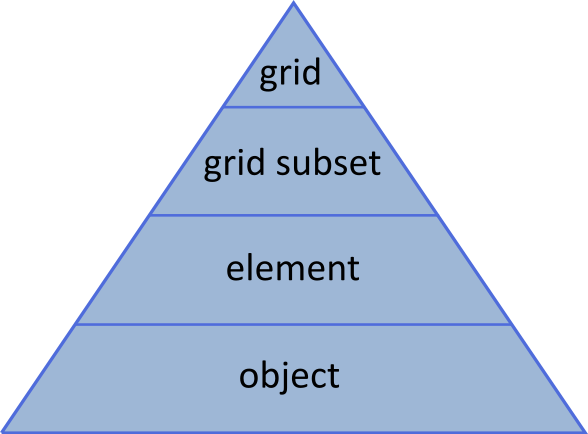
          *edge_profiles* IDS.

    Hierarchy scheme of grid and grid basic components in
   *edge_profiles* IDS.

| The *space index*, *dimension* and *object index* are then used to
  navigate through the IDS hierarchical data tree structure to the node
  containing the explicit data on the object forming the element. The
  "address" of the sought node is
| ``edge_profiles.ggd(:).grid.space(s).objects_per_dimension(d).object(o)``
| where ``s`` is the *space index*, ``d`` is the *dimension* and
  ``o`` is the *object index*.

.. _fig-ids_edgeprofiles_ggd_grid_gridsubset:
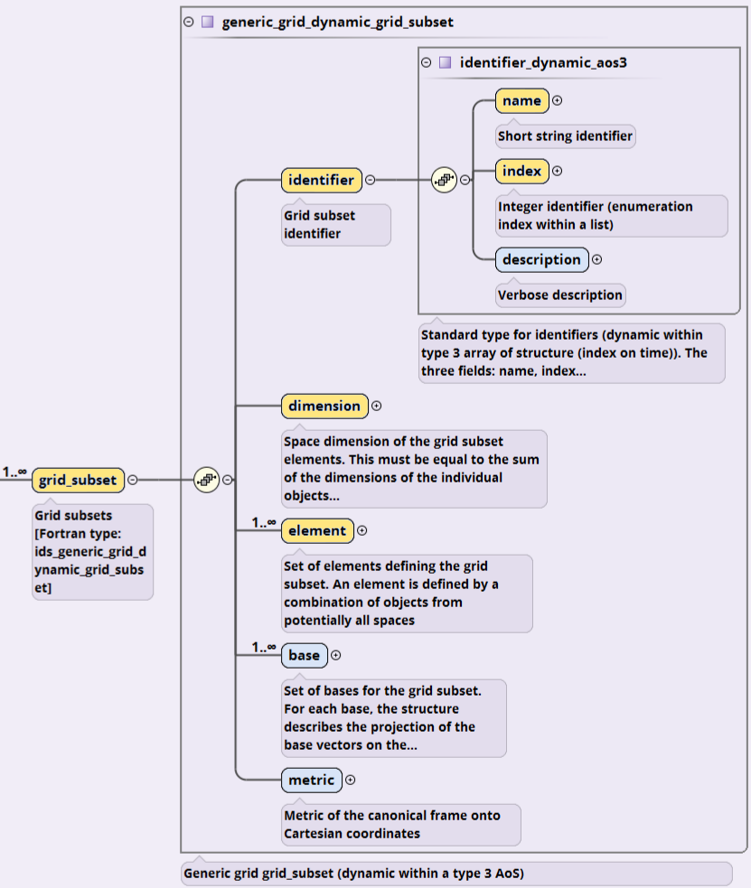
         structure [12] with highlighted relevant ``identifier``, ``name``,
         ``index``, ``dimension`` and ``element`` nodes.

   IDS ``edge_profiles.ggd(:).grid.grid_subset(:)`` node structure [12]
   with highlighted relevant ``identifier``, ``name``, ``index``,
   ``dimension`` and ``element`` nodes.

.. _fig-ids_edgeprofiles_ggd_grid_gridsubset_element:
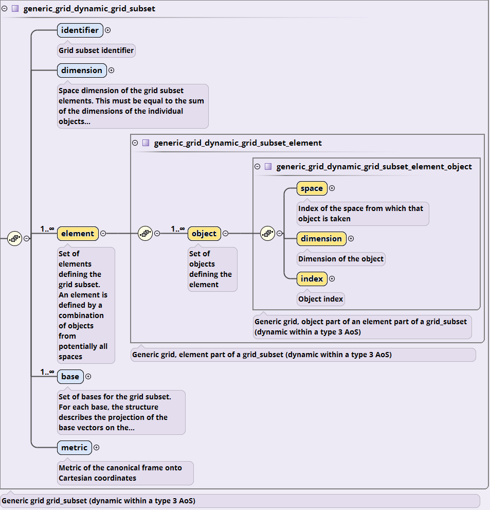
         node structure [12] with highlighted relevant ``object(:)``,
         ``space``, ``dimension`` and ``index`` nodes.

   IDS ``edge_profiles.ggd(:).grid.grid_subset(:).element(:)`` node
   structure [12] with highlighted relevant ``object(:)``, ``space``,
   ``dimension`` and ``index`` nodes.

.. _parag-ids_ggd_electrons:

electrons node structure
''''''''''''''''''''''''

The ``edge_profiles.ggd(:).electrons`` node is a child of ``ggd(:)``
node and a sibling of ``edge_profiles.ggd(:).grid`` node and
``edge_profiles.ggd(:).ion(:)`` node, set to contain data on quantities
related to electrons that are present in edge plasma during plasma burn.
Its more notable children are:

-  **temperature(:)**, an array of structures node designed to contain
   data on temperature of the electrons in edge plasma, and

-  **density(:)**, an array of structures node designed to contain data
   on density of the electrons in the edge plasma.

Note that the

.. _subparag-ei_temperature_density:

temperature(:)
              

and **density(:)** nodes have the same structure, as seen on figures
:numref:`fig-ids_edgeprofiles_ggd_ei_temperature` and
:numref:`fig-ids_edgeprofiles_ggd_ei_density`. Their more notable
children are:

-  | **grid_index**, a leaf containing index, pointing to the grid
     associated with the electron data (single *integer* data type
     value, corresponding to
   | ``edge_profiles.ggd(:).grid.identifier.index`` leaf),

-  | **grid_subset_index**, a leaf containing index of the grid subset
     associated with the electron data (single *integer* data type
     value, corresponding to
   | ``edge_profiles.ggd(:).grid.grid_subset(s)`` node out of array of
     structures, where ``s`` represents the ``grid_subset_index)``,
     and

-  | **values**, a leaf containing data field of scalar values on
     electron temperature or electron density physical quantity (array
     of *float* data type values). One scalar value is provided per
     element, with ``e``-th scalar value corresponding to element
     defined in
   | ``edge_profiles.ggd(:).grid.grid_subset(:).element(e)`` node
     (previously covered in section `2.1.1.1.3`_), where ``e``
     represents the ``element(:)`` node structure array index.

.. _fig-ids_edgeprofiles_ggd_electrons:
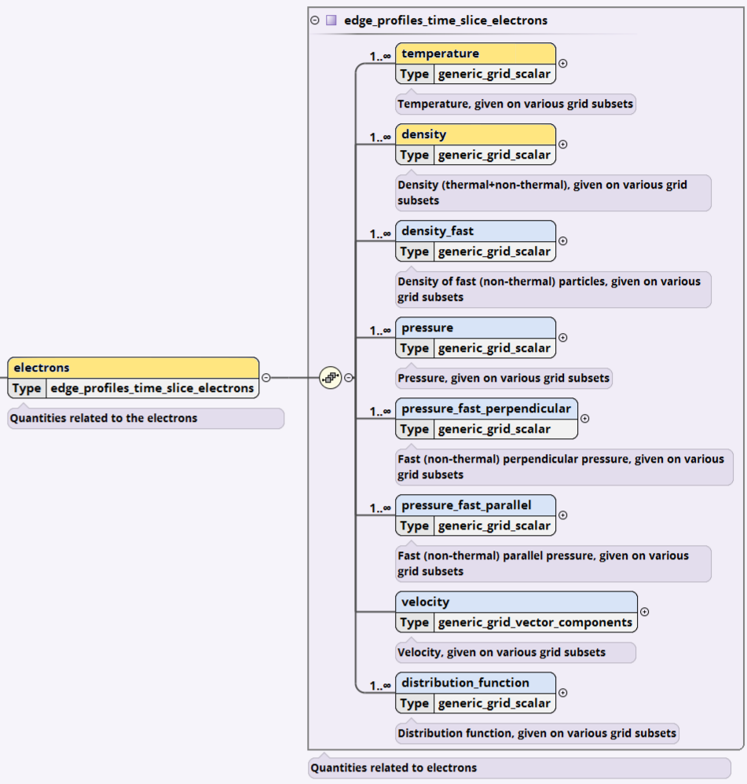
         highlighted relevant ``temperature(:)`` and ``density`` nodes.

   IDS ``edge_profiles.ggd(:).electrons`` node structure [12] with
   highlighted relevant ``temperature(:)`` and ``density`` nodes.

.. _fig-ids_edgeprofiles_ggd_ei_temperature:
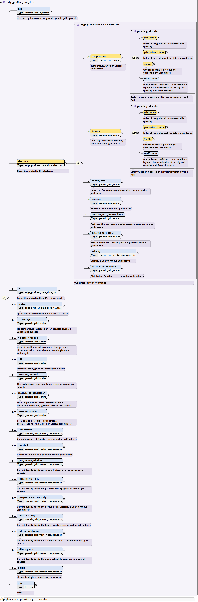
         ``edge_profiles.ggd(:).ion(:).temperature(:)`` node structure [12]
          with highlighted relevant ``grid_index``, ``grid_subset_index`` and
         ``values`` nodes.

   IDS ``edge_profiles.ggd(:).electrons.temperature(:)`` and
   ``edge_profiles.ggd(:).ion(:).temperature(:)`` node structure [12]
   with highlighted relevant ``grid_index``, ``grid_subset_index`` and
   ``values`` nodes.

.. _fig-ids_edgeprofiles_ggd_ei_density:

         ``edge_profiles.ggd(:).ion(:).density(:)`` node structure [12] with
         highlighted relevant ``grid_index``, ``grid_subset_index`` and
         ``values`` nodes.

   IDS ``edge_profiles.ggd(:).electrons.(:)`` and
   ``edge_profiles.ggd(:).ion(:).density(:)`` node structure [12] with
   highlighted relevant ``grid_index``, ``grid_subset_index`` and
   ``values`` nodes.

.. _parag-ids_ggd_ion:

ion(:) node structure
'''''''''''''''''''''

| ``edge_profiles.ggd(:).ion(:)`` node is an array of structures, a
  child of
| ``edge_profiles.ggd(:)`` node and a sibling to
  ``edge_profiles.ggd(:).grid`` and
| ``edge_profiles.ggd(:).electrons`` node, set to contain data on
  quantities related to ion species that are present in the edge plasma
  during plasma burn. The structure of the ``ion(:)`` node is similar to
  the structure of previously covered ``electrons`` node, as seen in
  :numref:`fig-ids_edgeprofiles_ggd_ion`, with the main difference in
  the ``ion(:)`` node being an array of structures while ``electron`` is
  a node with single structure, as many different ion species exist
  while in physics all electrons are identical. The more notable
  children of the ``ion(:)`` node are:

-  **label**, a leaf designed to contain name of the ion specie (single
   *string* data type value),

-  **temperature(:)**, an array of structures node designed to contain
   data on temperature of the ion in edge plasma, and

-  **density(:)**, an array of structures node designed to contain data
   on density of the ion in the edge plasma.

The structure of ``ion(:).temperature(:)`` and ``ion(:).density(:)``
nodes is identical to the same-name nodes found in ``electrons`` node
and is presented in previous section `2.1.1.2.1`_.

.. _fig-ids_edgeprofiles_ggd_ion:
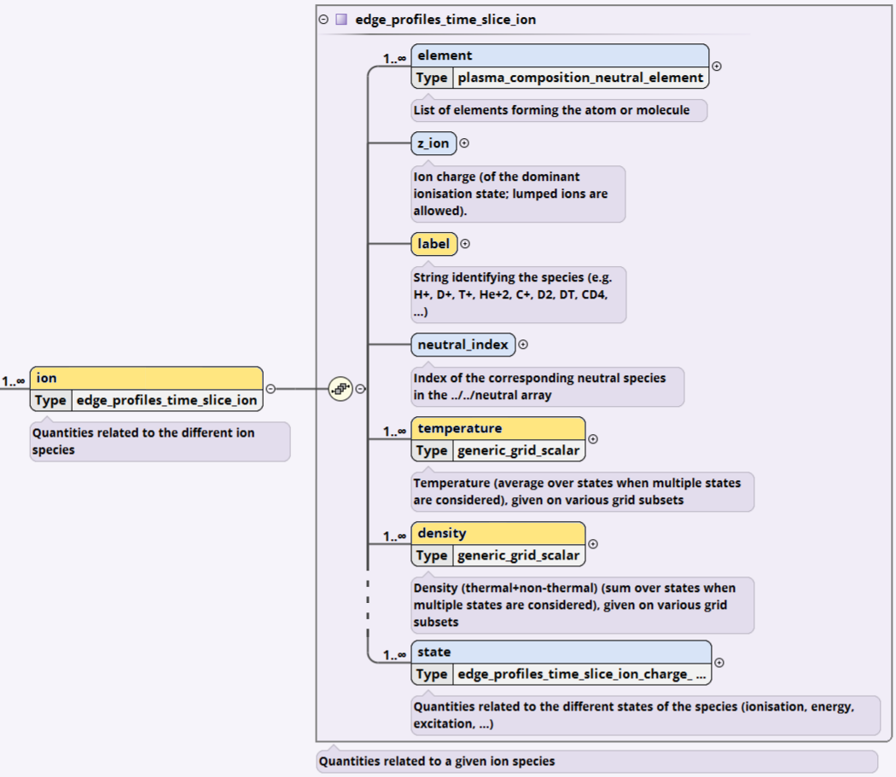
         highlighted relevant ``label``, ``temperature(:)`` and ``density(:)``
         nodes.

   IDS ``edge_profiles.ggd(:).ion`` node structure [12] with highlighted
   relevant ``label``, ``temperature(:)`` and ``density(:)`` nodes.

.. cha:data_processing:

Data Processing
===============

The main subject regarding the data processing in this chapter is
storage of the provided SOL data to *edge_profiles* IDS. The sources of
SOL data discussed in this chapter are:

-  formerly created *edge* CPOs from EU-IM SOLPS cases, and

-  data obtained by (re)running new B2.5 plasma simulation with
   SOLPS-ITER.

In the continuation of this chapter, the converter used for data
conversion from *edge* CPO to *edge_profiles* IDS is presented in
detail. Also, the basic principles of the writing part of SOL data,
obtained by running the B2.5 plasma simulation to *edge_profiles* IDS
are presented.

.. _sec-cpo2ids:

Edge CPO to IDS translation
---------------------------

Before the development of the IMAS IDSs, a great deal of SOL simulation
results data was stored in many CPO data structures. Those CPOs still
exist in the present day, and with IDS becoming the leading data
structure for plasma physics data storage nowadays and the majority of
IMAS tools being developed for use with the IDSs, the transfer of older
data from CPO to IDS is desirable by users. This would allow transfer
and continuation of work with previously obtained simulation data, and
also for straightforward data analysis and data comparison between the
old and recently produced data, obtained using the latest SOLPS-ITER
tools.

With that purpose the edge ``cpo2ids`` tool was developed. It serves as
a tool for data conversion and data transfer between the EU-IM *edge*
CPO and the ITER *edge_profiles* IDS, following the structure
description of the data structures presented in chapter ``_. The
converter is written in Python 3.5 [5]_ programming language and is used
under ITER IMAS.

.. _fig-cpo2ids_schema:

   *edge* CPO to *edge_profiles* IDS conversion process schema.

.. _subsec-cpo2ids_convertion_process:

Data conversion and transfer process
~~~~~~~~~~~~~~~~~~~~~~~~~~~~~~~~~~~~

This sub-section describes the data conversion and transfer process from
input *edge* CPO to specified output *edge_profiles* IDS. It is split
into parts with each sub-sub-section covering its own share of data,
such as the data on the two-dimensional edge plasma region grid and data
on quantities (such as electron temperature, etc.). Parts of data
structure contents and parts of the code of the converter are presented
for the purposes of better interpretation. For complete ``cpo2ids`` code
description see Appendix `[app:cpo2ids_code]`_.

In order to avoid any possible confusion regarding the index
notation [6]_. FORTRAN index notation [7]_ is used for the conversion
process presentation in the following sections. The same index notation
is also used in various IDS and CPO data structure documentation.

.. _subsubsec-conv_geo:

Grid geometry
^^^^^^^^^^^^^

The first share of converted and transferred data from *edge* CPO to
*edge_profiles* IDS is the grid geometry data, such as data on the grid
coordinate system [8]_, the objects forming the grid [9]_ and the grid
subsets [10]_.

.. parag-conv_geo_coordsys:

Coordinate system
'''''''''''''''''

The *edge* CPO and *edge_profiles* leaves designed for data storage of
data on coordinate system of the grid are presented in
:numref:`fig-cpo2ids_coordtype_data`, while the data structure and
format comparison of the CPO ``coordtype`` and IDS ``coordinates_type``
leafs are presented in :numref:`lst-cpoids_coordinatestype`.

Data on the coordinate system defines the dimension of the space of the
grid. For example, two coordinate code numbers stored inside the node
indicate that the grid is set in two-dimensional space, and three
coordinate code numbers stored would indicate that the grid is set in
three-dimensional space, etc.

.. table::  Coordinate system data: Comparison of data structures and their 
            leafs, containing the discussed data, and their data format.

    +--------------+-----------------------+--------------------------+
    |              |       edgeCPO         |   edge_profiles IDS      |
    +==============+=======================+==========================+
    |              |  edge.grid.spaces(:)  |  edge_profiles.ggd(:)    |
    | Location     |  .coordtype           |  .grid.space(:)          |
    |              |                       |  .coordinate_types       |
    |--------------+-----------------------+--------------------------+
    | Type         | 2D integer array.     | 1D integer array.        |
    | and format   |                       |                          |
    +--------------+-----------------------+--------------------------+

[Coordinate system data: Data structure comparison] Coordinate system
data: Data structure comparison. CPO ``coordtype`` (a) and IDS
``coordinates_types`` (b) leaf structure and data format. For
explanation of appearing indices and variables see
:numref:`fig-cpo2ids_coordtype_iv_explanation`.
.. _lst-cpoids_coordinatestype:

Following the discussed data format, the conversion process of
coordinate system data from *edge* CPO to *edge_profiles* IDS is
presented in :numref:`fig-cpo2ids_coordtype_conv`, together with part
of the ``cpo2ids`` Python code presented in
:numref:`lst-cpo2ids_code_coordtype`.

.. _tbl-cpo2ids_coordtype_conv:

.. table::  Coordinate system data: Data conversion process from *edge*
CPO to *edge_profiles* IDS. For explanation of appearing indices see
:numref:`fig-cpo2ids_coordtype_iv_explanation`.

   +-----------------+-----------------+-----------------+-----------------+
   | }}              |                 |                 |                 |
   +-----------------+-----------------+-----------------+-----------------+
   | ****            |                 | extit{edge} CPO | tit{edge_profi |
   |                 |                 | }               | les} IDS}       |
   +-----------------+-----------------+-----------------+-----------------+
   |                 | Data            |                 |                 |
   +-----------------+-----------------+-----------------+-----------------+
   | location        | edge.grid.space |                 |                 |
   |                 | (``p``)   |                 |                 |
   +-----------------+-----------------+-----------------+-----------------+
   | .coordtype[:m | edge_profiles.g |                 |                 |
   | ath:`c`,        | gd(``g``) |                 |                 |
   | ``1``]      |                 |                 |                 |
   +-----------------+-----------------+-----------------+-----------------+
   | .grid.space(: |                 |                 |                 |
   | math:`p`)       |                 |                 |                 |
   +-----------------+-----------------+-----------------+-----------------+
   | .coordinate_typ |                 |                 |                 |
   | es[``c``]   |                 |                 |                 |
   +-----------------+-----------------+-----------------+-----------------+
   +-----------------+-----------------+-----------------+-----------------+
   |                 | ansfer.}        |                 |                 |
   +-----------------+-----------------+-----------------+-----------------+

.. _tbl-cpo2ids_coordtype_iv_explanation:

.. table::  Coordinate system data: List of appearing indices and
variables together with their explanation.

   +-----------------------+-----------------------+-----------------------+
   |                       |                       |                       |
   +-----------------------+-----------------------+-----------------------+
   |                       | }}                    |                       |
   +-----------------------+-----------------------+-----------------------+
   | ``g``             | General grid          |                       |
   |                       | description structure |                       |
   |                       | array                 |                       |
   +-----------------------+-----------------------+-----------------------+
   | index.                | ``g=1``           |                       |
   +-----------------------+-----------------------+-----------------------+
   | ``p``             | Space structure array | ``p=1``           |
   |                       | index.                |                       |
   +-----------------------+-----------------------+-----------------------+
   | ``c``             | Coordinate type array | :math:`c=\{1 2 \l |
   |                       | index.                | dots n_\text{c}\}`  |
   +-----------------------+-----------------------+-----------------------+
   | ``n_\text{c}``    | Total number of       |                       |
   |                       | different coordinate  |                       |
   +-----------------------+-----------------------+-----------------------+
   | types describing the  |                       |                       |
   | grid and indicating   |                       |                       |
   +-----------------------+-----------------------+-----------------------+
   | the dimension of the  | /                     |                       |
   | grid.                 |                       |                       |
   +-----------------------+-----------------------+-----------------------+
   | ``C_c``           | ``c``-th          |                       |
   |                       | coordinate type in    |                       |
   |                       | form of a             |                       |
   +-----------------------+-----------------------+-----------------------+
   | coordinate code       | /                     |                       |
   | number [15].          |                       |                       |
   +-----------------------+-----------------------+-----------------------+

::

    num_coordtype = len(edge.grid.spaces[0].coordtype)
    ...
    for c in range(num_coordtype):
        edge_profiles.ggd[0].grid.space[0].coordinates_type[c]= \
            edge.grid.spaces[0].coordtype[c, 0]

.. _parag-conv_geo_gridobjects:

Grid objects
''''''''''''

The *edge* CPO and *edge_profiles* IDS parent nodes designed for data
storage of data on each object of the grid are presented in
:numref:`fig-cpo2ids_obj`

Each structure of ``.objects(:)`` and ``.object_per_dimension(:)`` array
of structures node is set to store data on ``n``-dimensional
objects [11]_, with one important difference between the data
structures. *edge* CPO ``.objects(:)`` array of structures consists of
multiple leaves set to hold data in a multidimensional array or list,
while in the *edge_profiles* IDS ``.object_per_dimension(:)`` array of
structures node, the data on each separate object is stored under a
child ``.object(:)`` array of structures in the form of a multiple
leaves set to hold data in a one-dimensional array or list.

The lower-level nodes containing the data on grid objects and detailed
data format for 0D, 1D, and 2D objects is presented in continuation of
this chapter.

.. _subparag-conv_geo_0dobjects:

0D objects
          

|  
| The data on **0D objects** or **grid nodes** [12]_, that are being
  processed by the converter, are as follows:

-  **coordinates of the 0D object**, and

-  only in *edge_profiles* IDS, **explicit entry of 0D object indices**.

The *edge* CPO and *edge_profiles* IDS leafs designed for data storage
of data on 0D objects and their data format are presented in
:numref:`fig-cpo2ids_0dobjects_data`, while the data structure and
detailed format of the data on 0D objects in both data structures are
presented in :numref:`lst-cpoids_0D_objects`.

A simple example of the discussed data format for 0D objects is
presented in :numref:`lst-cpoids_0D_objects_example`, describing grid
nodes in 2D cylindrical space (R,Z), with ``R`` being torus’s major
radius and ``z`` being the height.

::

    -objects[1]
        -geo:
        [[[[:math:`R_1`]] [[:math:`z_1`]]]
         [[[:math:`R_2`]] [[:math:`z_2`]]]
         :math:`\cdots`  
         [[[:math:`R_{n_{\text{o}^1}}`]] [[:math:`z_{n_{\text{o}^1}}`]]]]
        (*@ \vspace{10\baselineskip} @*)
        

::

    -objects:math:`_`per:math:`_`dimension[1]
        -object[1] 
            -geometry:
            [:math:`R_1` :math:`z_1`]
            -nodes:
            [1]
        -object[2] 
            -geometry:
            [:math:`R_2` :math:`z_2`]
            -nodes:
            [2]
        :math:`\cdots`
        -object[:math:`n_{\text{o}^1}`] 
            -geometry:
            [:math:`R_{n_{\text{o}^1}}` :math:`R_{n_{\text{o}^1}}`]
            -nodes:
            [:math:`n_{\text{o}^1}`]
        

                           \texttt{objects_per_dimension(1)} 
                           structure (b) and their accompanying children data format 
                           with demonstration of the data on the grid, set in 2D space with 
                           R and Z coordinate types. 
                           :math:`R_i` and :math:`z_i` are coordinates of :math:`i`-th 0D object or grid node, with
                           :math:`i` running from 1 to :math:`n_{\text{o}^1}` where :math:`n_{\text{o}^1}` is 
                           total number of 0D objects. As such, :math:`N_i` grid node is defined as
                           :math:`N_i[R_i,z_i]`.}

.. _lst-cpoids_0D_objects_example:

Following the discussed data format, the conversion process of 0D
objects data from *edge* CPO to *edge_profiles* IDS is presented in
:numref:`fig-cpo2ids_0dobjects_conv`, together with part of the
``cpo2ids`` Python code shown in
:numref:`lst-cpo2ids_code_0dobjects`.

::

    num_obj_0D_all = len(edge.grid.spaces[0].objects[0].geo)
    ...
    for o1 in range(num_obj_0D_all):
        ...
        for c in range(num_coordtype):
            edge_profiles.ggd[0].grid.space[0].objects_per_dimension[0].object[o1] 
                .geometry[c] = edge.grid.spaces[0].objects[0].geo[o1, c]
        """(in Fortran notation. i_Fortran = i_Python + 1) """
        edge_profiles.ggd[0].grid.space[0].objects_per_dimension[0].object[o1] \
            .nodes[0] = o1 + 1 

.. _subparag-conv_geo_1dobjects:

1D objects
          

|  
| The data on **1D objects** or **edges** [13]_, that are being
  processed by the converter, are as follows:

-  **boundary** information on each 1D object, and

-  only in *edge_profiles* IDS, **explicit listss of 0D objects**
   forming each 1D object.

The *edge* CPO and *edge_profiles* IDS leaves, designed for data storage
of data on 1D objects and their data format are presented in
:numref:`fig-cpo2ids_1dobjects_data`, while the data structure and
detailed format of the data on 1D objects in both data structures are
presented in :numref:`lst-cpoids_1D_objects`.

::

    -objects[2]
        -boundary:
        [[:math:`B^{1}_1` :math:`B^{1}_2`] [:math:`B^{2}_1` :math:`B^{2}_2`]:math:`\cdots`
         [:math:`B^{n_{\text{o}^2}}_1` :math:`B^{n_{\text{o}^2}}_2`]]
         (*@ \vspace{18\baselineskip} @*)
        

::

    -objects:math:`_`per:math:`_`dimension[2]
        -object[:math:`o^2= `1]
            -boundary[1]
                -index: :math:`B^{1}_1`
            -boundary[2] 
                -index: :math:`B^{1}_2`
            -nodes:
            [:math:`B^{1}_1` :math:`B^{1}_2`]
        -object[:math:`o^2= `2]  
            -boundary[1] 
                -index: :math:`B^{2}_1`
            -boundary[2] 
                -index: :math:`B^{2}_2`
            -nodes:
            [:math:`B^{2}_1` :math:`B^{2}_2`]
        :math:`\cdots`
        -object[:math:`o^2= ` :math:`n_{\text{o}^2}`] 
            -boundary[1] 
                -index: :math:`B^{n_{\text{o}^2}}_1`
            -boundary[2] 
                -index: :math:`B^{n_{\text{o}^2}}_2`
            -nodes:
            [:math:`B^{n_{\text{o}^2}}_1` :math:`B^{n_{\text{o}^2}}_2`]
        

[1D objects data: Data structure comparison] 1D objects data: Data
structure comparison. CPO ``objects(2).boundary`` leaf (a) and IDS
``objects_per_dimension(2)`` structure (b) and their accompanying
children data format. For explanation of the appearing indices and
variables see :numref:`fig-cpo2ids_1dobjects_iv_explanation`.
.. _lst-cpoids_1D_objects:

Following the discussed data format, the conversion process of 1D
objects data from *edge* CPO to *edge_profiles* IDS is presented in
:numref:`fig-cpo2ids_1dobjects_conv`, together with part of the
``cpo2ids`` Python code shown in :numref:`lst-cpo2ids_1dobjects`.

::

    num_obj_1D_all = len(edge.grid.spaces[0].objects[1].boundary)
    ...
    num_gridNodes_1D    = 2
    num_boundary_1D = 2
    for o2 in range(num_obj_1D_all):
        ...
        for b in range(num_boundary_1D):
            edge_profiles.ggd[0].grid.space[0].objects_per_dimension[1].object[o2] \
                .boundary[b].index = edge.grid.spaces[0].objects[1].boundary[o2,b] 
            edge_profiles.ggd[0].grid.space[0].objects_per_dimension[1].object[o2] \
                .nodes[b] = edge.grid.spaces[0].objects[1].boundary[o2,b]

.. _subparag-conv_geo_2dobjects:

2D objects
          

|  
| The data on **2D objects** or **2D cells** [14]_, that are being
  processed by the converter, are as follows:

-  **boundary** information on each 2D object, and

-  only in *edge_profiles* IDS **explicit lists of 0D objects** forming
   each 2D object.

*edge_profiles* IDS provides us with information on both, the link
between 2D and 1D objects [15]_ and the link between 2D and 0D
objects [16]_ while the *edge* CPO provides information only on the link
between 2D and 1D objects [17]_. A great number of existing modelling
software tools require an explicit list of 0D objects in order to
assembly the 2D objects, so that information is crucial. It is possible
to compute a list of 0D objects out of the boundary data (which is
inconvenient way to do it) and it was included in the ``cpo2ids``
converter in order to obtain the explicit list of 0D objects forming the
2D objects and store that information to the appropriate node in
*edge_profiles* IDS.

The *edge* CPO and *edge_profiles* IDS leaves, designed for data storage
of data on 2D objects and their data format are presented in
:numref:`fig-cpo2ids_2dobjects_data`, while the data structure and
detailed format of data on 2D objects in both data structures are
presented in :numref:`lst-cpoids_2D_objects`.

::

    -objects[3]
        -boundary:
        [[:math:`B^{1}_1` :math:`B^{1}_2` :math:`B^{1}_3` :math:`B^{1}_4`]
         [:math:`B^{2}_1` :math:`B^{2}_2` :math:`B^{2}_3` :math:`B^{2}_4`]
         :math:`\cdots`
         [:math:`B^{n_{\text{o}^3}}_1` :math:`B^{n_{\text{o}^3}}_2` :math:`B^{n_{\text{o}^3}}_3` :math:`B^{n_{\text{o}^3}}_4`]]
         (*@ \vspace{22\baselineskip} @*)
        

::

    -objects:math:`_`per:math:`_`dimension[3]
        -object[:math:`o^3=`1]
            -boundary[1] = 
                -index: :math:`B^{1}_1`
            -boundary[2] = 
                -index: :math:`B^{1}_2`
            -boundary[3] = 
                -index: :math:`B^{1}_3`
            -boundary[4] = 
                -index: :math:`B^{1}_4`
            -nodes:
            [:math:`o^{1}_{11}` :math:`o^{1}_{12}` :math:`o^{1}_{13}` :math:`o^{1}_{14}`]
        -object[:math:`o^3=`2] = 
            -boundary[1] = 
                -index: :math:`B^{2}_1`
            ...
            -boundary[4] = 
                -index: :math:`B^{2}_4`
            -nodes:
            [:math:`o^{1}_{21}` :math:`o^{1}_{22}` :math:`o^{1}_{23}` :math:`o^{1}_{24}`]
        :math:`\cdots`
        -object[:math:`o^3=` :math:`n_{\text{o}^3}`] = 
            -boundary[1] = 
                -index: :math:`B^{n_{\text{o}^3}}_1`
            ...
            -boundary[4] = 
                -index: :math:`B^{n_{\text{o}^3}}_4`
            -nodes:
            [:math:`o^{1}_{n_{\text{o}^3}1}` :math:`o^{1}_{n_{\text{o}^3}2}` :math:`o^{1}_{n_{\text{o}^3}3}` :math:`o^{1}_{n_{\text{o}^3}4}`]
        

                           \texttt{objects_per_dimension(3)} structure (b) and their 
                           accompanying children data format. For an explanation of 
                           appearing indices and variables, see 
                           Table~\ref{tbl:cpo2ids_2dobjects_iv_explanation}.}

.. _lst-cpoids_2D_objects:

Following the discussed data format, the conversion process of 2D
objects data from *edge* CPO to *edge_profiles* IDS is presented in
:numref:`fig-cpo2ids_2dobjects_conv`, together with part of the
``cpo2ids`` Python code shown in
:numref:`lst-cpo2ids_code_2dobjects`.

::

    ...
    num_gridNodes_2D    = 4
    num_boundary_2D     = 4
    for o3 in range(num_obj_2D_all):
        ...
        //> Calculation of 0D objects, forming the 2D objects, out from boundary 
        //> information of the 2D objects to "node_idx" array
        ...
        edge_profiles.ggd[0].grid.space[0].objects_per_dimension[2].object[o3] \
            .nodes[0] = node_idx[0] + 1 
        edge_profiles.ggd[0].grid.space[0].objects_per_dimension[2].object[o3] \
            .nodes[1] = node_idx[3] + 1
        edge_profiles.ggd[0].grid.space[0].objects_per_dimension[2].object[o3] \
            .nodes[2] = node_idx[2] + 1
        edge_profiles.ggd[0].grid.space[0].objects_per_dimension[2].object[o3] \
            .nodes[3] = node_idx[1] + 1
        ...
        for b in range(num_boundary_2D):
            edge_profiles.ggd[0].grid.space[0].objects_per_dimension[2].object[o3] \
                .boundary[b].index = edge.grid.spaces[0].objects[2].boundary[o3,b] 

.. _parag-conv_gridsubset:

Grid subset data
''''''''''''''''

The *edge* CPO and *edge_profiles* IDS parent nodes, designed for data
storage of data on grid subsets of the grid, are presented in
:numref:`fig-cpo2ids_gridsubset`.

Each structure of ``.subgrids(:)`` and ``.grid_subset(:)`` the array of
structures node is set to store data on a specific grid subset.

The data on grid subsets that are being processed by the converter, are
as follows:

-  grid subset **name**,

-  grid subset **dimension index**,

-  grid subset **list of object indices**,

-  grid subsets objects **space index**, and

-  grid subsets objects **dimension index**

One major difference between *edge* CPO and *edge_profiles* IDS grid
subset data is in the approach of how the list of object indices,
corresponding to objects forming the grid subset, is stored. In *edge*
CPO that list is stored either in the form of a range of object indices
(starting object index - ending object index) [18]_, or in the form of
an explicit list. In *edge_profiles* IDS the list of object indices can
be stored only as an explicit list, however, also with direct details on
a specific object composing the grid subset.

The *edge* CPO and *edge_profiles* IDS leaves, designed for data storage
of data on grid subsets, and their data format are presented in
:numref:`fig-cpo2ids_gridsubset_data`, while the data structure and
detailed format of data on grid subsets in both data structures are
shown in :numref:`lst-cpoids_gridsubset`.

::

    -subgrids[:math:`s=`1]
        -id: (*@ "grid subset :math:`s` name" @*)
        -list[1]
            -cls:
             [d]
            -indset[1]
                -range:
                 [:math:`o^d_{\text{start}}` :math:`o^d_{\text{end}}`]
            (*@ \large\textbf{OR} @*)
            -ind:
             [:math:`o^d_1` :math:`o^d_2` :math:`\cdots` :math:`o^d_{n_{\text{s}_\text{o}}}`]
    -subgrids[:math:`s=`2]
        ...
    ...
    -subgrids[:math:`n_\text{s}`]
        ...
        (*@ \vspace{9\baselineskip} @*)
        

::

    -grid_subset[:math:`s=`1]
        -identifier
            -name: (*@ "grid subset :math:`s` name" @*)
            -index: :math:`I_s`
        -dimension: :math:`d`
            -element[:math:`e=`1]
                -object[1]
                    -space: :math:`p`
                    -dimension: :math:`d`
                    -index: :math:`o^d_1`
            -element[:math:`e=`2]
                -object[1]
                    -space: :math:`p`
                    -dimension: :math:`d`
                    -index: :math:`o^d_2`
            ...
            -element[:math:`e=` :math:`n_{\text{s}_\text{e}}`] 
                -object[1]
                    -space: :math:`p`
                    -dimension: :math:`d`
                    -index: :math:`o^d_{n_{\text{s}_\text{e}}}`
    -grid_subset[:math:`s=`2]
        ...
    ...
    -grid_subset[:math:`s=` :math:`n_\text{s}`]
        ...
        

                           data format. For an explanation of appearing indices and variables, see 
                           Table~\ref{tbl:cpo2ids_gridsubset_iv_explanation}.}

.. _lst-cpoids_gridsubset:

| In *edge_profiles* IDS, the **space index** ``p``, **dimension
  index** ``d`` and **object index** ``o^{d}`` are used to
  navigate through nodes in the data structure tree structure to node
| ``edge_profiles.ggd(g).grid.space(p).objects_per_dimension(d).object(o^{d})``,
  containing data on object composing the element of the grid subset.
  When constructing the grid subset, the same process is done for all
  objects listed inside the ``.grid_subset(:)`` structure. Each grid
  subset can be constructed using only elements of the same dimension.

Following the discussed data format and properties, the conversion
process of the grid subset data from *edge* CPO to *edge_profiles* IDS
is presented in table `[tbl:cpo2ids_gridsubset_conv]`_, together with
part of the ``cpo2ids`` Python code shown in
:numref:`lst-cpo2ids_code_gridsubsets`.

::

    gridSubset_ind   = s + 1
    gridSubset_name = edge.grid.subgrids[s].id
    gridSubset_dim  = edge.grid.subgrids[s].list[0].cls[0] + 1
    edge_profiles.ggd[0].grid.grid_subset[s].identifier.name = gridSubset_name
    edge_profiles.ggd[0].grid.grid_subset[s].identifier.index = gridSubset_ind
    edge_profiles.ggd[0].grid.grid_subset[s].dimension = gridSubset_dim
    ...
    """Get the object indices from either range of indices or explicit 
    list of indices"""
    if range_found == 1:
        for o in range(ind_range_start, ind_range_end):
            gridSubset_object_index_array = numpy.insert(
                gridSubset_object_index_array, o-ind_range_start, o)
    else:
        for o in range(0, num_obj_index):
            object_index = edge.grid.subgrids[s].list[0].ind[o,0] - 1 
            gridSubset_object_index_array = numpy.insert(
                gridSubset_object_index_array, o, object_index)
    ...
    for e in range(num_gridSubset_el):
        edge_profiles.ggd[0].grid.grid_subset[s].element[e].object.resize(1)
        edge_profiles.ggd[0].grid.grid_subset[s].element[e].object[0].space= 1
        edge_profiles.ggd[0].grid.grid_subset[s].element[e].object[0].dimension = \
            gridSubset_dim + 1
        edge_profiles.ggd[0].grid.grid_subset[s].element[e].object[0].index = \
            gridSubset_object_index_array[e] + 1

.. _subsubsec-conv_scalars:

Data fields
^^^^^^^^^^^

The second share of converted and transferred data from *edge* CPO to
*edge_profiles* IDS are data fields that hold value presentations of
plasma properties, or a physical quantity corresponding to the grid
subset geometry. The plasma properties or quantities discussed in this
chapter are electron temperature, electron density, ion temperature, and
ion density [19]_. Note that it is possible for grid subsets to have no
corresponding data field at all.

The conversion process of each data field out of all four mentioned
plasma properties or quantities is almost identical. The main difference
is the parent node (inside data structure), where the data on each
property is stored; and the second difference is in the type of the
parent node, which is either array of structures node for ion properties
(each structure for one of the ion specie) or simple structure node for
electron properties.

The *edge* CPO and *edge_profiles* IDS parent nodes, designed for data
storage of data fields on the discussed plasma properties, are presented
in :numref:`fig-cpo2ids_scalars`.

In our case, due to the similarity of structured of the nodes, the above
listed nodes and structures (depending on the data structure) can be
treated the same, and in this aspect only the data transfer and
conversion process of data fields on the most extensive and complex
between the discussed plasma properties, the ion density, is presented.

.. _parag-cpoids_ni:

Ion density
'''''''''''

The *edge* CPO and *edge_profiles* IDS parent nodes, designed for the
data storage of data on each ion density data field corresponding to the
grid subsets, are presented in :numref:`fig-cpo2ids_ni`.

Each structure of ``.ni(:)`` and ``.ion(:)`` array of structures node is
set to store the ion density data field of each ion specie.

The data on the density of ion species found in plasma that are being
processed by the converter, are as follows:

-  **ion density data field**, with each value stored as number of ion
   particles per cubic meter or unit ``[1/m^3]`` [20]_, with one
   value per object (CPO) or element (IDS) stored,

-  **grid subset index**, to which the ion density data field
   corresponds to, and

-  **ion label**, the label of the ion specie.

The *edge* CPO and *edge_profiles* IDS leaves, designed for the data
storage of data on density of ion species in plasma, and their data
format are presented in :numref:`fig-cpo2ids_ni_data`, while the data
structure and detailed format of the ion density data in both data
structures are shown in :numref:`lst-cpo2ids_ni`.

.. _tbl-cpo2ids_ni_data:

::

    -ni[:math:`q=`1]
        -value[:math:`v=`1]
            -subgrid: :math:`s_1`
            -scalar:
            [ :math:`V_{11}` :math:`V_{12}` :math:`\ldots` :math:`V_{1n_{\text{V}^{\text{v}}}}` ]
        -value[:math:`v=`2]
            -subgrid: :math:`s_2`
            -scalar:
            [ :math:`V_{21}` :math:`V_{22}` :math:`\ldots` :math:`V_{2n_{\text{V}^{\text{v}}}}` ]
        :math:`\ldots`
        -value[:math:`v=` :math:`\text{n}_\text{v}`]
            -subgrid: :math:`s_{n_\text{v}}`
            -scalar:
            [ :math:`V_{n_\text{v} 1}` :math:`V_{n_\text{v} 2}` :math:`\ldots` :math:`V_{n_{\text{v}} n_{\text{V}^\text{v}}}` ]
    -ni[:math:`q=`2]
        :math:`\ldots`
    :math:`\ldots`
    -ni[:math:`q=` :math:`n_{\text{q}}`]
        :math:`\ldots`
        (*@ \vspace{2\baselineskip} @*)
        

::

    -ion[:math:`q=`1]
        -density[:math:`v=`1]
            -grid_subset_index: :math:`s_1`
            -values
            [ :math:`V_{11}` :math:`V_{12}` :math:`\ldots` :math:`V_{1n_{\text{V}^{\text{v}}}}` ]
        -density[:math:`v=`2]
            -grid_subset_index: :math:`s_2`
            -values
            [ :math:`V_{21}` :math:`V_{22}` :math:`\ldots` :math:`V_{2n_{\text{V}^{\text{v}}}}` ]
        :math:`\ldots`
        -density[:math:`v=` :math:`n_\text{v}`]
            -grid_subset_index: :math:`s_{n_\text{v}}`
            -values
            [ :math:`V_{n_\text{v} 1}` :math:`V_{n_\text{v} 2}` :math:`\ldots` :math:`V_{n_{\text{v}} n_{\text{V}^\text{v}}}` ]
        :math:`\ldots`
    -ion[:math:`q=`2]
        :math:`\ldots`
    :math:`\ldots`
    -ion[:math:`q=` :math:`n_{\text{q}}`]
        :math:`\ldots` 
        (*@ \vspace{1\baselineskip} @*)
        

                           For explanation of appearing indices and variables see 
                           Table~\ref{tbl:cpo2ids_ni_iv_explanation}.}

.. _lst-cpo2ids_ni:

In the provided benchmark *edge* CPO examples, only one
``ni(:).value(:)`` structure [21]_ contained a data field corresponding
to each two-dimensional grid subset, while more than one grid subset,
set in two-dimensional space, existed. Hence, in *edge* CPO single data
field might correspond to multiple grid subsets by combining the
mentioned data field together with list of indices stored in
``edge.grid.subgrids(:).list(1).ind`` leaf, though this way of data
storage is not recommended as then it is not explicit and harder to
notice. In *edge_profiles* IDS this is done differently, with each field
data explicitly corresponding to single grid subset, and the ``cpo2ids``
code was adjusted to follow that principle of explicit data field
definition.

Following the discussed data format and properties, the conversion
process of ion density data field from *edge* CPO to *edge_profiles* IDS
is presented in :numref:`fig-cpo2ids_ni_conv`, together with part of
the cpo2ids Python code shown in :numref:`lst-cpo2ids_code_ni`.

.. _tbl-cpo2ids_ni_conv:

.. _tbl-cpo2ids_ni_iv_explanation:

::

    ...
    for q in range (ni_species_num):
        ...
        num_ni_gridSubset_new = num_ni_gridSubset + 4   
        ...
        imas_obj.edge_profiles.ggd[0].ion[q].label = edge.species[q].label
        ...
        for s in range(num_ni_gridSubset_new):
            if s < num_ni_gridSubset:
                imas_obj.edge_profiles.ggd[0].ion[q].density[s].grid_subset_index = \
                    edge.fluid.ni[q].value[s].subgrid
                ...
                for i in range(ni_gridSubset_scalar_size):
                    imas_obj.edge_profiles.ggd[0].ion[q].density[s].values[i] = \
                        edge.fluid.ni[q].value[s].scalar[i]
            else: 
                """ Defining additional data fields """
                imas_obj.edge_profiles.ggd[0].ion[q].density[s].grid_subset_index = s + 2    
                ...
                for i in range(ni_gridSubset_scalar_size):
                    scalar_index = edge.grid.subgrids[s + 2 - 1].list[0].ind[i]
                    imas_obj.edge_profiles.ggd[0].ion[q].density[s].values[i] = \
                        edge.fluid.ni[q].value[0].scalar[scalar_index - 1]

.. _sec-b25toids:

Writing B2.5 plasma simulation results to IDS data structure
------------------------------------------------------------

Running the B2.5 plasma simulation produces many output files, holding
the data of results. The main objective of the work in this section is
to extract the required data [22]_ based on these "plasma state" files
and properly [23]_ store the data to *edge_profiles* IDS. The B2.5
plasma simulation output files and their edge plasma data covered in
this chapter are:

-  **b2fgmtry**, holding data on edge geometry, and

-  **b2fstate** or **b2fstati** representing "plasma state" at the *end*
   and as *input* to simulation, respectively [24]_. Both holding data
   fields on plasma properties such as electron density, electron
   temperature, and ion temperature.

A couple of tools for data storage of the discussed data to
*edge_profiles* IDS were developed, using the same data storage
principles as already previously discussed ``cpo2ids`` tool covered in
:numref:`sec-cpo2ids`:

-  **put_edge_ids**, written in Python 3.5 programming language and
   using step-by-step method of writing edge data to *edge_profiles*
   IDS,

-  **b2_ual_write**, written in Fortran90 programming language and also
   using step-by-step method of writing edge data to *edge_profiles*
   IDS, and

-  **b2_ual_write_gsl**, written in Fortran90 programming language and
   using Grid Service Library (GSL) routines for writing edge data to
   *edge_profiles* IDS.

All listed tools operate with the same data, the main difference between
them is the programming language they are written in and/or the method
of writing the data to the IDS, which is either a step-by-step method,
manually defining every single node and leaf in IDS tree structure and
setting its contents, or by using the Grid Service Library, written in
Fortran90, which provides routines for a simplified and more
user-friendly way of setting the data before it is written to the IDS.

The fundamental process of data extraction and data storage in the
discussed tools is as follows:

#. Read geometry data from ``b2fgmtry`` file and save the data to
   memory.

#. Read data fields on plasma properties from ``b2fstate`` or
   ``b2fstati`` file and save the data to memory.

#. Properly store data from memory to *edge_profiles* IDS.

.. _fig-b2_to_ids:
.. figure:: images/b2_data_to_IDS_schema.*
   :alt:  Data transfer of B2.5 plasma simulation results to
          *edge_profiles* IDS process schema.

   Data transfer of B2.5 plasma simulation results to *edge_profiles*
   IDS process schema.

| In the continuation of this chapter, a review of ``b2_ual_write`` and
  ``b2_ual_write_gsl`` code is presented. Full source codes of
  ``put_edge_ids.py``, ``b2_ual_write.f90`` and
| ``b2_ual_write_gsl`` are available in the
  Appendices `[app:putedgeids_code]`_, `[app:b2_ual_write_code]`_
  and `[app:b2_ual_write_gsl_code]`_.

b2_ual_write and b2_ual_write_gsl tools
~~~~~~~~~~~~~~~~~~~~~~~~~~~~~~~~~~~~~~~

The basic code structure of both ``b2_ual_write`` and
``b2_ual_write_gsl`` tools is identical, and it consists of the next
essential subroutines:

-  ``read_b2fgmtry_b2fstate``, designed to read geometry data from
   ``b2fgmtry`` file,

-  ``read_additional``, designed to read data fields on plasma
   quantities from ``b2fstate`` file, such as electron density, electron
   temperature, and ion temperature,

-  ``read_additional_sizes``, designed to read the size or number of
   values of each data field found inside the ``b2fstate`` file,

-  ``write_ids_edge_profiles``, designed to properly store the data,
   obtained by previously mentioned subroutines, to *edge_profiles* IDS.

The difference between those two tools is in the
``write_ids_edge_profiles`` subroutine, where the ``b2_ual_write`` tool
uses the step-by-step method, manually setting and writing the data to
IDS, while ``b2_ual_write_gsl`` tools uses Fortran90 *Grid Service
Library* (GSL) and its routines to accomplish the same task. The latest
GSL is available at GIT
repository https://git.iter.org/projects/IMEX/repos/ggd/ [20] under
*feature/IDS* branch.

Due to the source code of the both tools being quite extensive and with
both tool being used to accomplish the same task only
``write_ids_edge_profiles`` subroutine of the ``b2_ual_write_gsl`` is
presented in continuation of this section. For full source code and full
IDS writing method comparison see
appendices `[app:b2_ual_write_code]`_
and `[app:b2_ual_write_gsl_code]`_.

| Firstly, in the ``write_ids_edge_profiles`` subroutine, the mandatory
  data of
| *edge_profiles* IDS are set, those being the homogeneous time
  indicator and time value using the ``exampleSetIDSFundamentals`` GSL
  routine, as shown in Listing
  `[lst:b2_ual_write_gsl_code_fundamentals]`_.

::

    subroutine write_ids_edge_profiles(treename, shot, run, idx, username, &
                                        & machine, version, ne, te, ti)
        ...
        homogeneous_time = 1
        time = 0.0_IDS_R8
        call exampleSetIDSFundamentals( edge_profiles, homogeneous_time, time) 
        ...

Secondly, the coordinate system is being defined (global 2D cylindrical
coordinate system), as shown in
:numref:`lst-b2_ual_write_gsl_code_coordtype`.

::

        ...
        !> Set definition of the coordinate system of the space
        coordtype(:) = (/ IDS_COORDTYPE_R, IDS_COORDTYPE_Z /) 
        ...

Thirdly, 0D objects or nodes are being defined by coordinates that were
previously read from the ``b2fgmtry`` file, as shown in
:numref:`lst-b2_ual_write_gsl_code_0dobjects`.

::

        ...
        !> Set geometry (R,Z) coordinate of each node object
        num_nodes = num_nodes_all
        allocate(nodesGeoList( num_nodes_all, 2))

        !> To get nodes coordinates to 2D array in correct order
        icount = 0
        do k = 0, 3
            do j = -1, ny
                do i = -1, nx
                    icount = icount + 1
                    nodesGeoList(icount, 1) = crx(i,j,k)
                    nodesGeoList(icount, 2) = cry(i,j,k)
                enddo
            enddo
        enddo
        ...

Next, a connectivity array of the 2D unstructured quadrilateral grid is
being defined with cell nodes being ordered cyclically (here
anti-clockwise), as shown in Listing
`[lst:b2_ual_write_gsl_code_2dobjects]`_. Note that in this case 1D
objects/edges are not included.

::

        ...
        !> Set list of indices for nodes defining each cell object
        ...
        cellId = 1
        do j = 1,numCellsY
            do i = 1, numCellsX
                cellsNodesList(cellId, 1) = cellId+0*numCellsX*numCellsY
                cellsNodesList(cellId, 2) = cellId+1*numCellsX*numCellsY
                cellsNodesList(cellId, 3) = cellId+3*numCellsX*numCellsY
                cellsNodesList(cellId, 4) = cellId+2*numCellsX*numCellsY
                cellId = cellId + 1
            enddo
        enddo
        ...

At this point, the arrays containing information on 2D unstructured
quadrilateral grid coordinate system, nodes and 2D cells of the grid are
defined and ready to be written to specified IDS. That is done using
``gridSetup2dSpace`` GSL routine that takes all above mentioned
data [25]_ Additionally, the GSL routine accepts optional logical
argument ``createGridSubsets`` that specifies if also default grid
subsets, each consisting of all n-dimensional objects in the domain,
(*Nodes*, *Edges*, *2D Cells*) are to be automatically set to be written
to IDS. In our case this parameter is set as ``.true.`` as the default
subsets are required to be writtend to the IDS. The use of the mentioned
GSL routine is shown in
:numref:`lst-b2_ual_write_gsl_code_gslgrid`.

::

        ...
        !> --- Set the grid space objects and grid subsets ---
        !> For that we use GSL routine gridSetup2dSpace
        call gridSetup2dSpace(  grid, coordtype,                &
                            &   geo_0dObj   = nodesGeoList,     &
                            &   conn_1dObj  = edgesNodesList,   &
                            &   conn_2dObj  = cellsNodesList,   &
                            &   createGridSubsets = .true. )
        ...

Last but not least, the data fields of plasma quantities electron
temperature, electron density, and ion temperature, corresponding to
*Cells* grid subset and previously read from the ``b2fstate`` file and
stored to ``ne``, ``te`` and ``ti`` arrays, are written to IDS using
``gridStructWriteData1d`` GSL routine, as shown on
:numref:`lst-b2_ual_write_gsl_code_scalars`. Temperature scalar
values are given in joules [J] unit and are converted to electron volts
[eV] (1 J = 6.242e18 eV).

::

        ...
        gridSubset_index = 3

        !> --- Set ne (electron density) ---
        allocate(ggd%electrons%density(1))                                                                
        idsField => ggd%electrons%density(1)                                                               
        call gridStructWriteData1d( grid, idsField, gridSubset_index, ne)  

        !> --- Set te (electron temperature) ---
        allocate(ggd%electrons%temperature(1))                                                                
        idsField => ggd%electrons%temperature(1)
        !> convert to eV (1 J = 6.242e18 eV)                                 
        call gridStructWriteData1d( grid, idsField, gridSubset_index,   &
            &   te*6.242e18) 

        !> --- Set ti (ion temperature) ---
        allocate(ggd%ion(1))
        allocate(ggd%ion(1)%temperature(1))                                                                
        idsField => ggd%ion(1)%temperature(1)
        !> convert to eV (1 J = 6.242e18 eV)                                 
        call gridStructWriteData1d( grid, idsField, gridSubset_index,   &
            &   ti*6.242e18) 

        !> Set data to edge_profiles IDS
        write(0,*) "Writing to edge_profiles IDS"

        !> Create and modify new shot/run
        call imas_create_env(treename, shot, run, 0, 0, idx, username, & 
            machine, version)
        ...

Lastly, new *edge_profiles* is created and entire previously set data is
written to the IDS, as shown in
:numref:`lst-b2_ual_write_gsl_code_idswrite`.

::

        ...
        !> Create and modify new shot/run
        call imas_create_env(treename, shot, run, 0, 0, idx, username, & 
            device, version)
        
        !> Put data to IDS
        call ids_put_slice(idx,"edge_profiles",edge_profiles)
        call ids_put(idx,"edge_profiles",edge_profiles)
        
        !> Close IDS
        call ids_deallocate(edge_profiles)
        call imas_close(idx)

        write(0,*) "IDS write finished"
    end subroutine write_ids_edge_profiles

.. cha:readualedge:

ParaView ReadUALEdge plugin
===========================

ParaView [21], [22] is a multi-platform, open-source scientific data
analysis and visualization application, used for analysis and
visualization of extremely large datasets. Besides providing the user
with many options and tools for data analysis, it allows the user to
extend the functionality of the ParaView application by creating his own
custom-made tools referred to as ’plugins,’ that can be used to
add [23]:

-  support for new datafile formats,

-  custom graphical user interface (GUI) components, such as panels and
   toolbar buttons used to perform specific tasks,

-  additional data display options and preferences etc.

Of course, as for any other custom software and code scripts, a certain
level of programming skill is required in order to be able to create new
Paraview plugin, however many guides and tutorials on that matter are
available in digital form on the internet.

Because of the described properties and advantages of the ParaView
application, the custom-made tool ParaView ``ReadUALEdge`` plugin was
developed. This plugin was designed for analysis and visualization of 2D
edge plasma data, stored in *edge_profiles* IDS, as shown in Fig.
`[fig:readualedge_visualization_process_scheme]`_. The data in
*edge_profiles* IDS holds data stored beforehand by either ``cpo2ids``
converter, ``put_edge_ids`` tool, ``b2_ual_write`` /
``b2_ual_write_gsl`` tool, SOLPS-ITER code suite etc., however, it
allows the visualization of any other *edge* plasma data, under the
condition that the data is properly stored in the *edge_profiles* IDS
data structure unit, as previously described in 
:numref:`sec-cpo2ids`. At the beginning of the development, the
plugin was adjusted to work with *edge* CPO data structure unit, but
later the development was, and still is, focused on compatibility of the
plugin with the *edge_profiles* IDS data structure unit.

The whole plugin consists of multiple files:

-  ``ReadUALEdge.cxx``,

-  ``ReadUALEdge.h``,

-  ``ReadUALEdge.xml``,

-  ``pqMyPropertyWidgetDecorator.cxx`` and

-  ``pqMyPropertyWidgetDecorator.h``,

| where ``ReadUALEdge.cxx`` and ``ReadUALEdge.h`` files represent the
  "heart" of the plugin as they provide code for data handling, while
  ``ReadUALEdge.xml``,
| ``pqMyPropertyWidgetDecorator.cxx`` and
  ``pqMyPropertyWidgetDecorator.cxx`` files provide code for GUI
  implementation of the plugin inside the ParaView application.

.. _fig-readualedge_visualization_process_scheme:
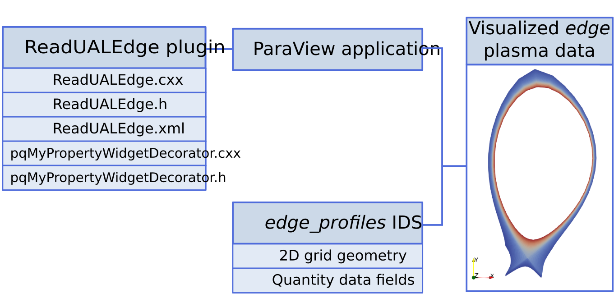
         data using ``ReadUALEdge`` plugin and *edge_profiles* IDS.

   Procedure of the visualization process of the *edge* plasma data
   using ``ReadUALEdge`` plugin and *edge_profiles* IDS.

In the continuation of this chapter, a review of the main ParaView
``ReadUALEdge`` plugin code file, ``ReadUALEdge.cxx``, and of the
plugins graphical user interface are presented. For complete plugin
codes, see Appendix `[app:readualedge_code]`_, while the tutorial and
additional information on the ``ReadUALEdge`` plugin can be found in
document SOLPS-GUI documentation [8].

.. _sec-readualedge_code:

The C++ code
------------

ParaView uses the open-source Visualization ToolKit (VTK) [24], [25]
software system for 3D computer graphicsand visualization, with
libraries written in C++, Python, Java, and other programming languages.
The ``ReadUALEdge`` plugin is mostly written in C++ programming
language, and as such it also uses the VTK libraries written in the same
programming language.

The VTK objects, used in the ``ReadUALEdge`` plugin code, are:

-  ``vtkPoints`` [26], an array representing an explicit list of 0D
   points and their coordinates in the 3D space,

-  ``vtkVertex`` **???**, a data type representing a 0D vertex in 3D
   space containing information on single point forming the vertex,

-  ``vtkLine`` [27], a data type representing a 1D line in 3D space
   containing list of two points forming the line,

-  ``vtkQuad`` [28], a data type representing a 2D quadrilateral cell in
   3D space containing list of four points (in anti-clockwise pattern)
   forming the cell

-  ``vtkCellArray`` [29], a supporting array holding an explicit list of
   data types such as ``vtkPoints``, ``vtkLine`` and ``vtkQuad``,

-  ``vtkDoubleArray`` [30], an array of values of *double* data type,

-  | ``vtkUnstructuredGrid`` [31], a dataset and a combination of
     ``vtkPoints`` array,
   | ``vtkCellArray`` array and ``vtkDoubleArray`` array. It stores
     connectivity information between VTK data types forming the
     unstructured grid, together with, if provided, value information on
     each VTK data type.

-  ``vtkMultiBlockDataSet`` **???**, a dataset collection, storing and
   organizing datasets, such as ``vtkUnstructuredGrid``, as blocks of
   data into a hierarchical tree structure.

The general sequence of operations of the ``ReadUALEdge`` plugin code,
using grid subset data and quantity data fields stored in the data
structure unit, is as follows:

#. Construct ``vtkUnstructuredGrid`` dataset, that represents the
   unstructured grid of *edge_profiles* IDS grid subset, using data on
   2D grid geometry found in *edge_profiles* IDS and, if available,
   assign the quantity data fields to it.

#. | Set the newly formed ``vtkUnstructuredGrid`` as a block of data to
   | ``vtkMultiBlockDataSet``.

#. Repeat operations 1. and 2. for all available grid subset data in the
   data structure unit.

#. Display the contents of ``vtkMultiBlockDataSet`` in the ParaView
   application.

.. _subsec-readualedge_vtkUnstructuredGrid:

Setting vtkUnstructuredGrid and vtkMultiblockdataSet
~~~~~~~~~~~~~~~~~~~~~~~~~~~~~~~~~~~~~~~~~~~~~~~~~~~~

| In ``ReadUALEdge`` plugin, the ``vtkUnstructuredGrid`` dataset
  represents the main component used for storage of all required data on
  specific grid subset while the
| ``vtkMultiBlockDataSet`` stores every created ``vtkUnstructuredGrid``
  dataset as a block inside multiblock dataset and sets all blocks
  display-ready.

Each ``vtkUnstructuredGrid`` dataset contains data only on one grid
subset and although each grid subset, as already discussed in previous
chapters, consists of either 0D, 1D, or 2D elements, the process of
defining the ``vtkUnstructuredGrid`` dataset for every grid subset is
mostly identical, and it is in close relation to the principles
previously discussed in section `1.1`_.

The process of setting the ``vtkUnstructuredGrids`` is shown in Fig.
`[fig:readualedge_gridsubset_process_scheme]`_ and described below,
however, it should be noted that various indices found inside the data
structure unit are stored in Fortran90 notation, while C++ programming
language, of course, uses C++ convention [26]_.

.. _fig-readualedge_gridsubset_process_scheme:
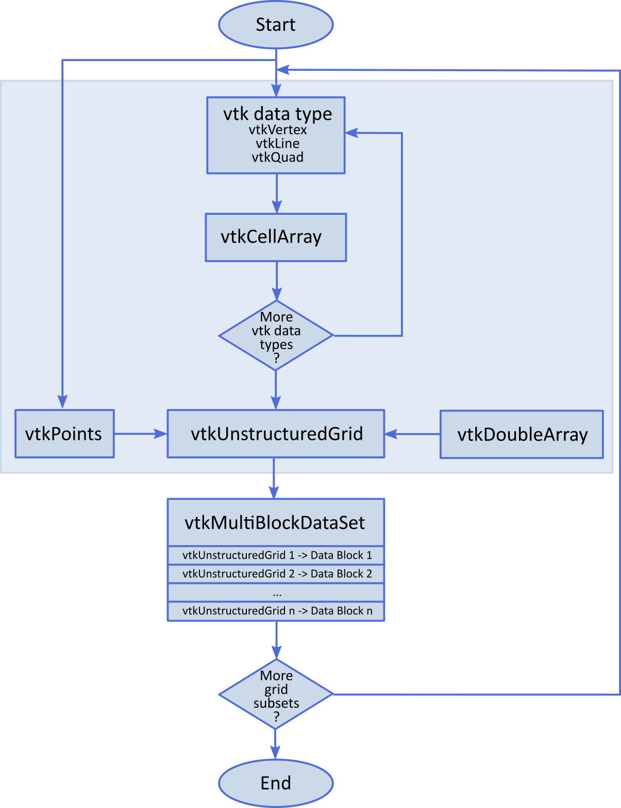
         creation.

   Process of ``vtkUnstructuredGrid`` and ``vtkMultiBlockDataSet``
   creation.

Firstly, the plugin sets a list of points and their coordinates with the
use of ``ReadUALEdge`` function ``fSetVtkPoints``, that reads and
assigns points data to ``vtkPoints`` array. The process of
``fSetVtkPoints`` function is shown in
:numref:`lst-readualedge_code_fSetVtkPoints`.

::

    ...
    vtkSmartPointer<vtkPoints> pointsArray =
        vtkSmartPointer<vtkPoints>::New(); 
    for(int i = 0; i < num_obj_0D; ++i){
    pointsArray->InsertNextPoint(
        dim_obj_0D.object(i).geometry(0),
        dim_obj_0D.object(i).geometry(1), 
        0.0);
    }
    ...

Secondly, the plugin sets ``vtkCellArray`` array, a list of all
same-dimensional elements forming the grid subset, together with indices
of the points forming each element. That process takes place in
``ReadUALEdge`` function ``fSetCellArray`` and is set to be used by any
of the three data types:

-  ``vtkVertex`` data type for 0D elements,

-  ``vtkLine`` data tpye for 1D elements, and

-  ``vtkQuad`` data types for 2D quadrilateral elements [27]_

The process of setting the list of the elements ``vtkCellArray`` is
shown in :numref:`lst-readualedge_code_fSetCellArray`

::

    ...
    vtkSmartPointer<vtkCellArray> newCellArray =
        vtkSmartPointer<vtkCellArray>::New();
    int num_gridSubset_el = loc_gridSubset.element.extent(0);
    int obj_dimension = loc_gridSubset.element(0).object(0).dimension;
    for (int j = 0; j < num_gridSubset_el; j++)
    {
        int obj_space = loc_gridSubset.element(j).object(0).space;
        int obj_index = loc_gridSubset.element(j).object(0).index;
        int num_obj_nodes = grid.space(obj_space - 1).
            objects_per_dimension(obj_dimension - 1).
            object(obj_index - 1).nodes.extent(0);
        for(int k = 0; k < num_obj_nodes; k++)
        {
            int node_ind = grid.space(obj_space - 1).
                objects_per_dimension(obj_dimension - 1).
                object(obj_index - 1).nodes(k);
            el_data_type->GetPointIds()->
                SetId(k, node_ind - 1);
        }
        newCellArray->InsertNextCell(el_data_type);
    }
    ...

Thirdly, the plugin sets the geometry of ``vtkUnstructuredGrid`` dataset
by assigning the previously defined ``vtkPoints`` and ``vtkCellArray``
data arrays to it, and additionally specifying the type of elements
forming the grid [32]:

-  ``VTK_VERTEX`` for ``vtkVertex`` data type,

-  ``VTK_LINE`` for ``vtkLine`` data type, or

-  ``VTK_QUAD`` for ``vtkQuad`` data type.

The process of setting the geometry of ``vtkUnstructuredGrid`` dataset
is shown in :numref:`lst-readualedge_code_UG`.

::

    //> Set vtkUnstructuredGrid dataset
    vtkSmartPointer<vtkUnstructuredGrid> <UG> =
        vtkSmartPointer<vtkUnstructuredGrid>::New();
    //> Assign vtkCellArray to vtkUnstructuredGrid
    <UG>->SetPoints(<vtkPoints>);
    <UG>->SetCells(<vtkCellType>, <vtkCellArray>);

At this point, the ``vtkUnstructuredGrid`` dataset contains only
geometry data on the unstructured grid of the given grid subset, found
in the data structure unit. The grid subsets, composed of 0D and 2D
objects (vtkVertex and vtkQuad data type), also have data fields of
different quantities available in the data structure unit. Those data
fields are first assigned to ``vtkDoubleArray`` array of values and then
to previously set ``vtkUnstructuredGrid``. More different defined data
fields can be assigned to the same ``vtkUnstructuredGrid``. In the
``ReadUALEdge`` plugin that process takes place in the function
``fSetValuesArrayLabel``, shown in Listing
`[lst:readualedge_code_fValues2UnstructuredGrid]`_.

::

    ...
    // Define vtkDoubleArray and set its label and size 
    vtkSmartPointer<vtkDoubleArray> newVtkDoubleArray =
        fSetValuesArrayBase(    num_gridSubset_el, 
                                values_array_label);
    newVtkDoubleArray->
        SetNumberOfValues(num_gridSubset_el);
    for (int j = 0; j < num_gridSubset_el; j++)
    {
        newVtkDoubleArray->SetComponent(
            j,0, loc_quantity.values(j));
    }
    inputVtkUnstructuredGrid->GetCellData()->AddArray(
        newVtkDoubleArray);
    ...

Lastly, the full ``vtkUnstructuredGrid`` dataset, containing grid
geometry and data fields of differenty quantities, is added as a block
to multiblock dataset In ``ReadUALEdge`` the plugin. That process takes
place in function ``fAddBlock2MultiBlock``, shown in Listing
`[lst:readualedge_code_fAddBlock2MultiBlock]`_.

::

    ...
    int num_blocks = MB->GetNumberOfBlocks();
    MB->SetBlock(num_blocks, <UG>);
    MB->GetMetaData((unsigned int) num_blocks)->Set(
        vtkCompositeDataSet::NAME(), gridSubset_name.c_str());
    ...

| After all ``vtkUnstructuredGrid`` datasets were created and set to
| ``vtkMultiBlockDataSet``, as previously shown in
  :numref:`fig-readualedge_gridsubset_process_scheme`, the plugin runs
  the command
| ``output->ShallowCopy(mainMB);``, that sets all blocks inside the
  multiblock as display-ready in ParaView application.

.. _sec-readualedge_gui:

Graphical user interface
------------------------

The design of the graphical user interface (GUI) of the developed
``ReadUALEdge`` plugin, whose purpose is to simplify the use of the
plugin itself, is shown in Figs. `[fig:readualedge_gui]`_ and
`[fig:readualedge_gui_close]`_.

It consists of:

-  four text boxes, **Shot**, **Run**, **User** and **Device**, that
   accept the parameters of the IDS data structure case, which hold the
   desired physics data

-  a ``refresh`` button, that re-reads the input IDS database,
   refreshing, and then displaying the data again in the process,

-  a widget box, displaying a list of all existing and available IDS
   cases for the currently set user, set in the above **User** text box.

More information and tutorial on the use of ParaView application and the
``ReadUALEdge`` plugin are available in Ref. [8] and examples of the
plugin use are presented in the chapter ` <#cha:results>`__.

.. _fig-readualedge_gui:

         The plugin custom GUI is marked with the green box.

   ParaView and ``ReadUALEdge`` plugin graphical user interface. The
   plugin custom GUI is marked with the green box.

.. _fig-readualedge_gui_close:

         interface.

   Close up view of the ``ReadUALEdge`` plugin graphical user interface.

.. cha:results:

Visualisation
=============

The results are divided into two sections. In
:numref:`sec-results_cpo2ids` are presented the results of *edge*
CPO to *edge_profiles* IDS data conversion using ``cpo2ids`` tool and
the visualization of the physics data from the converted *edge_profiles*
IDS using the ``ReadUALEdge`` plugin. Then in
:numref:`sec-results_b2_ual_write` are presented the results of
storing the SOLPS-ITER B2.5 simulation results to the *edge_profiles*
IDS, and then the visualization of the stored data using the
``ReadUALEdge`` plugin inside the ParaView application.

.. _sec-results_cpo2ids:

Visualization of converted edge CPO to edge_profiles IDS physics data
---------------------------------------------------------------------

In this section the results of data conversion from pre-existing *edge*
CPOs to newly created *edge_profiles* IDS with the use of ``cpo2ids``
the converter tool following with the use of the ``Readualedge`` plugin
to visualize the data from the same *edge_profiles* IDSs, as shown in
:numref:`fig-readualedge_cpo2ids` are presented. That is accomplished
using two provided EU-IM CPO data structures, listed in
:numref:`fig-res_cpo_data_units`, used for debugging and benchmarking
of the new ``cpo2ids`` converter tool features and ``ReadUALEdge``
plugin features. Both addressed CPO data structures, containing the
*edge* CPO data structure with stored physical data on edge plasma. The
same CPO cases were previously stored on the old *gateway.efda-itm.org*
HPC cluster and, at the time of writing this thesis, are available and
used on *Marconi GateWay eufus.eu* HPC cluster.

.. _fig-readualedge_cpo2ids:
.. figure:: images/ReadUALEdge_scheme_cpo2ids.*
   :alt: Visualization process of the edge plasma data using ``cpo2ids``
         converter and ``ReadUALEdge`` plugin.

   Visualization process of the edge plasma data using ``cpo2ids``
   converter and ``ReadUALEdge`` plugin.

.. _tbl-res_cpo_data_units:

.. table:: Case parameters of provided benchmark *edge* CPO data
structures.

   +-----------------------+------+--------+------+---------------------------------+
   | 16151                 |      |        |      |                                 |
   +-----------------------+------+--------+------+---------------------------------+
   | 1                     | 1    | g2kosl | iter | 4.10a                           |
   +-----------------------+------+--------+------+---------------------------------+

With the help of the ``cpo2ids`` tool, the *edge* CPO data structures,
listed in :numref:`fig-res_cpo_data_units`, are converted to
*edge_profiles* IDSs, presented in Table
`[tbl:res_cpo2ids_data_units]`_. The *Version* of the CPO data structure
defines the version of EU-IM database [13] while the version of the IDS
data structure defines the version of IMAS.

.. _tbl-res_cpo2ids_data_units:

.. table:: Input and output data structures of ``cpo2ids`` tool.

   +-----------------------+--------------+-------+------+----------+------------+---------+
   | Data structure        | Input/Output | Shot  | Run  | User     | Device     | Version |
   +-----------------------+--------------+-------+------+----------+------------+---------+
   | *edge* CPO            |              |       |      |          |            |         |
   +-----------------------+--------------+-------+------+----------+------------+---------+
   | *edge_profiles* IDS   | output       | 16151 | 1000 | g2penkod | solps-iter | 3       |
   +-----------------------+--------------+-------+------+----------+------------+---------+
   | *edge* CPO            | input        | 1     | 1    | g2kosl   | iter       | 4.10a   |
   +-----------------------+--------------+-------+------+----------+------------+---------+
   | *edge_profiles* IDS   | output       | 1     | 1    | g2penkod | solps-iter | 3       |
   +-----------------------+--------------+-------+------+----------+------------+---------+

After successfully converting any of the two data structures the data is
ready to be loaded and visualized with the use of ``ReadULAEdge`` the
plugin inside the ParaView application [28]_. By inserting the wanted
data structure properties of the first IDS case with Shot: 16151 and
Run: 1000 16151/1000 in short) and then loading it, the plugin first by
default displays all available blocks of data, with each block
representing one of the grid subsets and marked with different colors,
as shown in :numref:`fig-readualedge_16151_1000_all_sg`. Furthermore,
due to the use of VTK ``vtkMultiBlockDataSet`` object and code structure
in the ``ReadUALEdge`` plugin source code, previously discussed in
:numref:`subsec-readualedge_vtkUnstructuredGrid`, the plugin
allows selection of any available block (grid subsets) or blocks, as
shown in :numref:`fig-readualedge_16151_1000_cells_sciod`. A list of
all available grid subsets is shown in :numref:`fig-gridsubset_list`.

.. _tbl-gridsubset_list:

.. table:: Visualization of 16151/1000 IDS case using ReadUALEdge
plugin: List of all available grid subsets.

   +-----------------------+-------------------+
   | ID                    |                   |
   +-----------------------+-------------------+
   | 1                     |                   |
   +-----------------------+-------------------+
   | 2                     | Nodes             |
   +-----------------------+-------------------+
   | 3                     | Faces             |
   +-----------------------+-------------------+
   | 4                     | x-aligned faces   |
   +-----------------------+-------------------+
   | 5                     | y-aligned faces   |
   +-----------------------+-------------------+
   | 6                     | x-points          |
   +-----------------------+-------------------+
   | 7                     | Core              |
   +-----------------------+-------------------+
   | 8                     | SOL               |
   +-----------------------+-------------------+
   | 9                     | Inner divertor    |
   +-----------------------+-------------------+
   | 10                    | Outer divertor    |
   +-----------------------+-------------------+
   | 11                    | Inner target      |
   +-----------------------+-------------------+
   | 12                    | Inner throat      |
   +-----------------------+-------------------+
   | 13                    | Outer throat      |
   +-----------------------+-------------------+
   | 14                    | Outer target      |
   +-----------------------+-------------------+
   | 15                    | Core cut          |
   +-----------------------+-------------------+
   | 16                    | PFR cut           |
   +-----------------------+-------------------+
   | 17                    | Inner PFR wall    |
   +-----------------------+-------------------+
   | 18                    | Core boundary     |
   +-----------------------+-------------------+
   | 19                    | Outer PFR wall    |
   +-----------------------+-------------------+
   | 20                    | Separatrix        |
   +-----------------------+-------------------+
   | 21                    | Inner baffle      |
   +-----------------------+-------------------+
   | 22                    | Main chamber wall |
   +-----------------------+-------------------+
   | 23                    | Outer baffle      |
   +-----------------------+-------------------+
   | 24                    | Inner midplane    |
   +-----------------------+-------------------+
   | 25                    | Outer midplane    |
   +-----------------------+-------------------+

.. _fig-readualedge_16151_1000_all_sg:
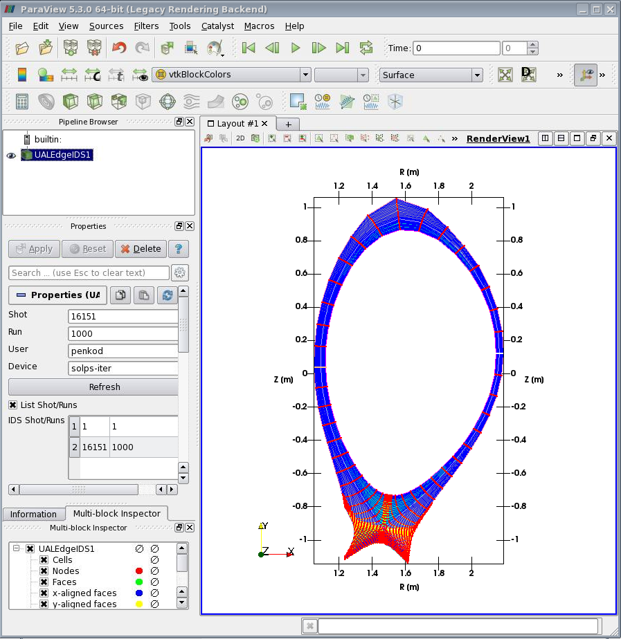
         plugin: All grid subsets. The list of all available grid subsets,
         ready for display, is shown on bottom left corner of the ParaView
         application window in *Multiblock inspector*.

   Visualization of 16151/1000 [29]_ IDS case using ReadUALEdge plugin:
   All grid subsets. The list of all available grid subsets, ready for
   display, is shown on bottom left corner of the ParaView application
   window in *Multiblock inspector*.

.. _fig-readualedge_16151_1000_cells_sciod:
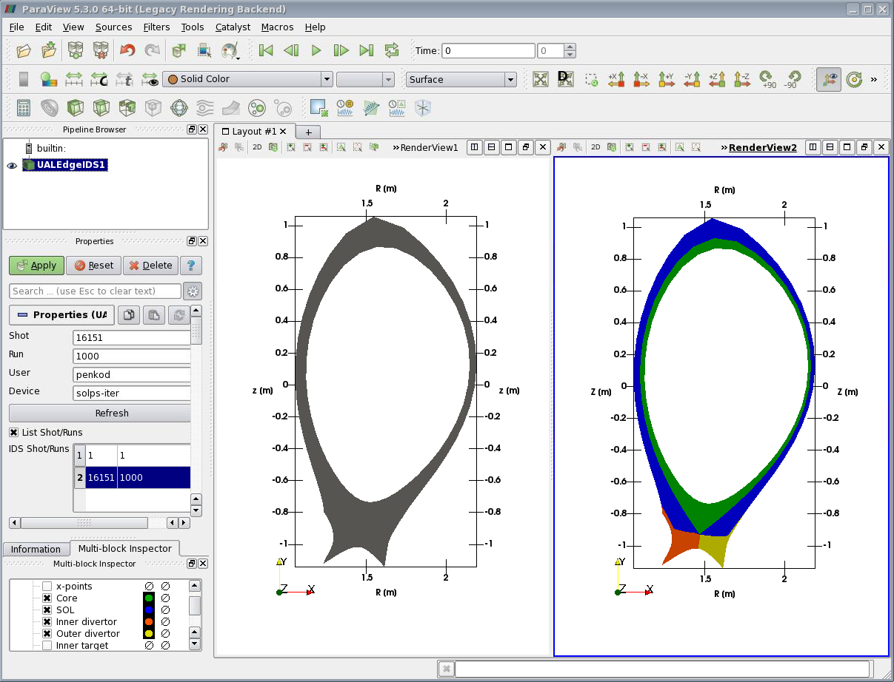
         Separate grid subsets. The displayed grid subsets are *Cells* (left
         display window) and *SOL*, *Core*, *Inner Divertor* and *Outer
         Divertor* (right display window) grid subsets. The Multi-Block
         Inspector shows grid subset selection of the right display window.

   Visualization of 16151/1000 IDS case using ReadUALEdge plugin:
   Separate grid subsets. The displayed grid subsets are *Cells* (left
   display window) and *SOL*, *Core*, *Inner Divertor* and *Outer
   Divertor* (right display window) grid subsets. The Multi-Block
   Inspector shows grid subset selection of the right display window.

Moreover, the plugin allows the selection between the available data
fields on plasma quantity, shown in
:numref:`fig-readualedge_16151_1000_datafield`, for selected grid
subsets, as shown in :numref:`fig-readualedge_16151_1000_sol_sciod_te`.
This allows the user to work only those grid subsets that he is
interested in. As such, the SOL region can be displayed individually and
further analyzed without having the unnecessary edge plasma regions
displayed on the screen, as shown in Fig.
`[fig:readualedge_16151_1000_sol_te]`_. The same can be done for any
other grid subset. The display of 16151/1000 IDS case edge plasma and
its all available data fields on plasma quantities [30]_ are shown in
Figs.
`[fig:readualedge_16151_1000_ne_te]`_, `[fig:readualedge_16151_1000_ni1_ni2]`_
and `[fig:readualedge_16151_1000_ti]`_.

.. _fig-readualedge_16151_1000_datafield:
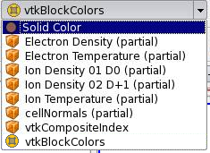
         quantities.

   16151/1000 IDS case: List of available data fields of quantities.

.. _fig-readualedge_16151_1000_sciod_te:

.. _fig-readualedge_16151_1000_sol_te:

.. _fig-readualedge_16151_1000_sol_sciod_te:

.. _fig-readualedge_16151_1000_ne:

.. _fig-readualedge_16151_1000_te:

.. _fig-readualedge_16151_1000_ne_te:

.. _fig-readualedge_16151_1000_ni1:

.. _fig-readualedge_16151_1000_ni2:

.. _fig-readualedge_16151_1000_ni1_ni2:

.. _fig-readualedge_16151_1000_ti:

The same as for the first IDS case can be done for the second IDS case
with Shot: 1 and Run: 1 parameters. This IDS case is more extensive,
mostly in the terms of data fields on ion specie density, as it contains
ion density data on a total of 98 ion species, as shown in
:numref:`fig-readualedge_1_1_datafield`, while the first case
contained ion density for just two ion species. The display of the
second IDS case together with applying some of its many available data
fields on plasma properties [31]_ are presented in
Figs. `[fig:readualedge_1_1_ne_te]`_, `[fig:readualedge_1_1_ni1_ni2]`_
and `[fig:readualedge_1_1_ti]`_.

.. _fig-readualedge_1_1_datafield:
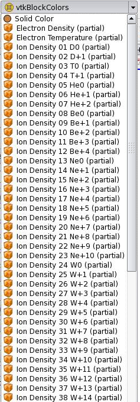
         quantities. There are total 98 different ion specie density data
         fields.

   1/1 IDS case: Partial list of available data fields of quantities.
   There are total 98 different ion specie density data fields.

.. _fig-readualedge_1_1_ne:

.. _fig-readualedge_1_1_te:

.. _fig-readualedge_1_1_ne_te:

.. _fig-readualedge_1_1_ni1:

.. _fig-readualedge_1_1_ni2:

.. _fig-readualedge_1_1_ni1_ni2:

.. _fig-readualedge_1_1_ti:

Furthermore, as an addition to this section, through the ParaView
application interface the ``ReadUALEdge`` plugin allows straightforward
comparative analysis of the IDS cases. As an example, comparison of size
of the edge region between the AUG and ITER tokamak is shown in Fig.
`[fig:readualedge_aug_vs_iter_edge]`_, and a comparison of electron
temperature in edge region with the use of single or separate views is
shown in Figs. `[fig:readualedge_aug_vs_iter_te1]`_ and
`[fig:readualedge_aug_vs_iter_te2]`_.

.. _fig-readualedge_aug_vs_iter_edge:
.. figure:: images/IDS_aug_vs_iter_SCIOD.*
   :alt: Comparative analysis: Size and edge plasma region of AUG (left)
         and ITER (right) tokamak.

   Comparative analysis: Size and edge plasma region of AUG (left) and
   ITER (right) tokamak.

.. _fig-readualedge_aug_vs_iter_te1:
.. figure:: images/AUG_vs_ITER_te_edit2.*
   :alt: Comparative analysis: Display of electron temperature in the
         edge plasma region of AUG (left) and ITER (right) tokamak - single
         display view.

   Comparative analysis: Display of electron temperature in the edge
   plasma region of AUG (left) and ITER (right) tokamak - single display
   view.

.. _fig-readualedge_aug_vs_iter_te2:
.. figure:: images/AUG_vs_ITER_te_edit.*
   :alt: Comparative analysis: Display of electron temperature in the
         edge plasma region of AUG (left) and ITER (right) tokamak - multiple
         display views.

   Comparative analysis: Display of electron temperature in the edge
   plasma region of AUG (left) and ITER (right) tokamak - multiple
   display views.

.. _sec-results_b2_ual_write:

Visualization of B2.5 simulation results
----------------------------------------

In this section, the results of storing the B2.5 simulation data to
newly created *edge_profiles* IDS using ``b2_ual_write_gsl`` tool
following with the use of the ``ReadUALEdge`` plugin to visualize the
data from the same *edge_profiles* IDS data structure units, as shown in
:numref:`fig-readualedge_b2` are presented. That is accomplished using
the results obtained by running the B2.5 simulation with two SOLPS-ITER
examples, *AUG_16151_D+C+He* a standalone case and *ITER_535_D+He+Ar*
case [33], used for debugging and benchmarking of the
``b2_ual_write_gsl`` features. The result of the mentioned example are
stored to IDS data structure with base parameters Shot: 16151, Run:
1001, User: penkod, Device: solps-iter and Version: 3 for the first
example and Shot: 535, Run: 1, User: penkod, Device: solps-iter and
Version: 3. Both input examples and output IDS are listed in
:numref:`fig-b2_ual_write_benchmark`.

.. figure:: images/ReadUALEdge_scheme_b2.*
   :alt: Visualization process of the edge plasma data using
   ``b2_ual_write_gsl`` tool and ``ReadUALEdge`` plugin.

   Visualization process of the edge plasma data using
   ``b2_ual_write_gsl`` tool and ``ReadUALEdge`` plugin.

.. _fig-readualedge_b2:

.. _tbl-b2_ual_write_benchmark:

.. table:: Benchmark SOLPS-ITER examples and output IDS parameters.

   +-----------+-----------+-----------+-----------+-----------+-----------+
   |           | column{5} |           |           |           |           |
   |           | {c|}{Outp |           |           |           |           |
   |           | ut IDS}   |           |           |           |           |
   +-----------+-----------+-----------+-----------+-----------+-----------+
   | {2-6}     |           |           |           |           |           |
   +-----------+-----------+-----------+-----------+-----------+-----------+
   | {1-6}{2.0 |           |           |           |           |           |
   | pt}       |           |           |           |           |           |
   |           |           |           |           |           |           |
   | AUG_16151 |           |           |           |           |           |
   | _D+C+He   |           |           |           |           |           |
   | standalon |           |           |           |           |           |
   | e         |           |           |           |           |           |
   +-----------+-----------+-----------+-----------+-----------+-----------+
   | {1-6}{2.0 |           |           |           |           |           |
   | pt}       |           |           |           |           |           |
   |           |           |           |           |           |           |
   | ITER_535_ |           |           |           |           |           |
   | D+He+Ar   |           |           |           |           |           |
   +-----------+-----------+-----------+-----------+-----------+-----------+

Running the B2.5 simulation and producing the output result files using
the above listed examples beforehand, the ``b2_ual_write.F90`` or
``b2_ual_write_gsl.F90`` tool, previously discussed in
:numref:`sec-b25toids` is used to read the required data out
from ``b2fstate`` or ``b2fstati`` and ``b2fgmtry`` files and storing it
to specified IDS. The newly created IDSs are then ready to be loaded and
its contents displayed using the ``ReadUALEdge`` plugin.

The visualized contents of the first IDS data structure in the
``ReadUALEdge`` plugin are shown below. The available grid subsets
*Nodes* and *2D Cells* [32]_ are presented in
:numref:`fig-readualedge_16151_1001_gs`, while data fields on plasma
properties, that being electron temperature, electron density, and ion
temperature of the AUG tokamak edge region, are presented in
Figs. `[fig:readualedge_16151_1001_cells_te]`_, `[fig:readualedge_16151_1001_cells_ne]`_
and `[fig:readualedge_16151_1001_cells_ti]`_

.. _fig-readualedge_16151_1001_gs:

.. _fig-readualedge_16151_1001_cells_te:

.. _fig-readualedge_16151_1001_gs_te:

.. _fig-readualedge_16151_1001_cells_ne:

.. _fig-readualedge_16151_1001_cells_ti:

.. _fig-readualedge_16151_1001_ne_ti:

Next, the visualized contents of the second IDS data structure, Shot:
535, Run: 1, in the ``ReadUALEdge`` plugin are presented. The plasma
properties, that being electron temperature, electron density, and ion
temperature of this case ITER tokamak edge region, with *2D Cells* the
grid subset selected, are presented in
Figs. `[fig:readualedge_535_1_cells_te]`_, `[fig:readualedge_535_1_cells_ne]`_
and `[fig:readualedge_535_1_cells_ti]`_.

.. _fig-readualedge_535_1_cells_ne:

.. _fig-readualedge_535_1_cells_te:

.. _fig-readualedge_535_1_cells_ti:

.. _fig-readualedge_535_1_te_ti:

.. cha:discussion:

Discussion
==========

The standardized data structures proved to be very convenient for the
storage of data on the plasma burn in the edge region of the tokamak
device, including the Scrape-Off Layer, with the IDS justifying its
place as the successor of the CPO data structure, as it provides better
means of defining the edge plasma. Firstly, the IDSs, unlike CPOs,
enable data storage under different time bases for the same physics
case. Secondly, the IDS enables improved grid description that
explicitly defines each and every object of the grid including full link
description between the objects of different dimensions, as 2D objects
hold information on link with both 0D objects and 1D objects, while in
the CPO only link between 2D and 1D objects is given and the quite
significant link between 2D and 0D objects is absent. Moreover, in CPO
the data on grid subsets is not always stored the same way - sometimes
explicit, defining the whole list of objects, sometimes implicit, using
range of objects. That might not pose a real problem in most cases, but
having the data stored in one way, the explicit way as in the IDS, is
still more convenient, though also the result of explicitly storing the
data results in the IDS being much more extensive in comparison to CPO.
However, making data much more understandable and easier to interpret in
exchange for more disk space [we are still in the range between 0-200 MB
(megabytes) for each case] is a small price to pay. Furthermore, the
data structure nodes, set to hold the data fields of plasma properties
such as electron density, electron temperature, ion species density, and
temperature, are better designed in the IDS data structure, as in IDS
the electron and ion properties data fields are set to be stored under
the same parent node ``electrons`` and ``ion(:)``, while in CPO separate
``edge.fluid.ne`` node is set to hold electron density data field,
separate ``edge.fluid.ti(:)`` node for ion temperature data field etc.
Furthermore, in IDS also the ion specie labels are included under the
``ion(:)`` array of structures node, while in CPO are stored in
completely separated ``edge.fluid.species(:)`` array of structures node
and that makes data interpretation and usage more inconvenient.

Next, the ``cpo2ids`` converter confirmed that the transfer of the edge
plasma data from CPO to IDS is possible, opening new way of potential
use of the existing CPO cases and confirming the IDS as a more than
suitable successor of the CPO, producing some of the first IDS cases
containing the edge plasma data in the process. The same goes for the
IDS tools ``put_edge_ids``, ``b2_ual_write`` and ``b2_ual_write_gsl``,
developed with the intent of writing the B2.5 simulation output results
IDS, providing the means of storing the most recent edge data to IDS
from other sources other than pre-existing CPOs. Furthermore, all of the
above mentioned IDS data processing tools can be seen as large-scale
examples of their own, and can be used as another considerable source of
information on how to handle and properly store the data to the IDS,
with the addition of the use of *Grid Service Library (GSL)*, unlike at
the beginning stages of this thesis when the IDS handling proved to be
somewhat difficult due to the lack of more extensive examples and
information on the IDS handling.

Finally, the major and final outcome of this master’s thesis, the
``ReadUALEdge`` plugin, operating within the open-source ParaView
application, makes it possible for the edge plasma data, stored within
the IDS, to be visualized using little effort as the plugin itself does
all the required work to open the database and assemble and display the
data. Moreover, the plugin itself allows a custom selection of the
available data, from grid subsets to the data fields of plasma
properties stored in the IDS, making the plugin flexible and adjustable
for the potential users. Furthermore, the plugin being encompassed
within the ParaView application, the data can be further analyzed
utilizing many of the various tools and utilities provided by the
ParaView application itself, providing the user with many means for
comparative data analysis, data presentation customization, further data
processing and more.

[1] "Geometry modeling and grid generation."

[2] G. Visavale, "Grid generation for cfd simulation: Introduction."
https://ganeshvisavale.wordpress.com/2013/02/14/pre-processing-meshing-for-cfd-simulations/.

[3] "Chapter 5: Grid generation." https://ntl.bts.gov/DOCS/ch5.html.

[4] "CFD-online: Meshing." https://www.cfd-online.com/Wiki/Meshing.

| [5] "ITM cpo example grids."
  "http://www.efda-itm.eu/ITM/html/imp3_gridexamples.html?sso_from=/ITM/html/
| imp3_gridexamples.html". 

| [6] "Fortran90 example itm_grid_example1_2dstructured_manual."
  "https://git.iter.org/projects/IMEX/repos/ggd/browse/f90/src/examples/
| itm_grid_example1_2dstructured_manual.f90". 

[7] Klingshirn and H.-J., "Adaptive grids and numerical fluid
simulations for scrape-off layer plasmas," PhD thesis, Technische
Universität München, 2010.

[8] Kos and L., "SOLPS gui."
https://git.iter.org/projects/BND/repos/solps-gui.

[9] F. Imbeaux and J. L. et al., "A generic data structure for
integrated modelling of tokamak physics and subsystems," *Computer
Physics Communications*, vol. 181, pp. 987–998, 2010.

[10] S. Pinches and F. Imbeaux., "Rules & guidelines for physics data
model," 2014.

[11] I. F., "Developer guide for data dictionary," 2016.

[12] S. Pinches and F. I. et al., "IDS data dictionary."
https://git.iter.org/projects/IMAS/repos/data-dictionary.

[13] "CPO data structure 4.10b.8."
"`http://www.efda-itm.eu/ITM/imports/isip/public/data_structure/4.10b.8/Phase4top.html"`_.

[14] "Official eu-im tf website." http://portal.eufus.eu.

[15] "CPO and ids coordinate identifiers."
"http://www.efda-itm.eu/ITM/html/itm_enum_types__coordinate_identifier.html".

[16] F. Imbeaux *et al.*, "Design and first applications of the iter
integrated modelling & analysis suite," *Nuclear Fusion*, vol. 55, no.
12, p. 123006, 2015 [Online]. Available:
http://stacks.iop.org/0029-5515/55/i=12/a=123006

[17] M. Schneider, S. Pinches, and L. van Dellen, "Tutorial for physics
code adaptation to the imas framework," 2017.

[18] I. F., "Data dictionary lifecycle," 2015.

[19] "Official mdsplus website - introduction."
http://www.mdsplus.org/index.php/Introduction.

[20] "GGD gsl." https://git.iter.org/projects/IMEX/repos/ggd.

[21] U. Ayachit, *The paraview guide, community edition*. Kitware Inc.,
2016.

[22] "Official paraview website." https://www.paraview.org/.

[23] "ParaView wiki: Plugin howto."
https://www.paraview.org/Wiki/ParaView/Plugin_HowTo.

[24] "Official vtk website." http://www.vtk.org/.

[25] L. S. Avila, U. Ayachit, and others, *The vtk user’s guide 11th
ed.* Kitware, 2010.

[26] "VtkPoints class reference."
http://www.vtk.org/doc/release/7.1/html/classvtkPoints.html.

[27] "VtkLine class reference."
http://www.vtk.org/doc/release/7.1/html/classvtkLine.html.

[28] "VtkQuad class reference."
http://www.vtk.org/doc/release/7.1/html/classvtkQuad.html.

[29] "VtkCellArray class reference."
http://www.vtk.org/doc/release/7.1/html/classvtkCellArray.html.

[30] "VtkDoubleArray class reference."
http://www.vtk.org/doc/release/7.1/html/classvtkDoubleArray.html.

[31] "VtkUnstructuredGrid class reference."
http://www.vtk.org/doc/release/7.1/html/classvtkUnstructuredGrid.html.

[32] "VtkCellType file referencee."
http://www.vtk.org/doc/release/4.2/html/vtkCellType_8h.html.

[33] "SOLPS-iter examples database."
https://portal.iter.org/departments/POP/CM/IMAS/Forms/AllItems.aspx?RootFolder=%2Fdepartments%2FPOP%2FCM%2FIMAS%2FSOLPS-ITER%2FExamples.

.. [1]
   Do not confuse with data structure tree nodes, as described in the
   following chapters.

.. [2]
   The term "data unit" is taken from Ref. [9]

.. [3]
   *subgrid* is formerly a term used to refer to *grid subset*.

.. [4]
   *ti(:)* node still might contain only one structure.

.. [5]
   The tool is written portable and can also be used unmodified with the
   Python 2.7 version of the programming language, if required.

.. [6]
   In Python and C++ programming languages index counting starts with 0,
   while in FORTRAN starts with 1.

.. [7]
   Note that the ``cpo2ids`` is still written in Python language and
   using Python notation.

.. [8]
   Covered in sections `1.5`_, `1.1.1.1`_ and `2.1.1.1.2`_

.. [9]
   Covered in sections `1.1`_, `1.1.1.1`_ and `2.1.1.1.2`_

.. [10]
   Covered in sections `1.3`_, `1.1.1.1`_ and `2.1.1.1`_

.. [11]
   For example, ``.objects(1)`` and ``.object_per_dimension(1)``
   structures are set to store data on 0D objects. Note that since
   Fortran notation is used, *dimension array index* 1 stands for
   zero-dimension, 2 for one-dimension, and 3 for two-dimension. As such
   the same index can also directly refer to *object class* of the
   object

.. [12]
   Also objects of object class 1

.. [13]
   Also objects of object class 2

.. [14]
   Also objects of object class 3

.. [15]
   Boundary of the 2D object

.. [16]
   The list of grid nodes forming the 2D object

.. [17]
   Boundary of the 2D object

.. [18]
   In case of defined range: The grid subset comprises of every object
   with object index between the given starting object index and the
   ending object index

.. [19]
   Previously covered in sections `1.1.3`_, `2.1.1.2`_
   and `2.1.1.3`_

.. [20]
   From here comes the abbreviation *ni* as *number of ions*. The same
   principle is used for abbreviations *ti*, *ne* and *te*, where the
   first character *t* stands for *temperature* and *n* stands for
   *number of*.

.. [21]
   The same for ``te(:).value(:)``, ``ne(:).value(:)`` and
   ``ti(:).value(:)`` for other physical quantities

.. [22]
   Geometry data and data on electron temperature, electron density, and
   ion temperature properties of edge plasma.

.. [23]
   Using the principles, presented in :numref:`sec-cpo2ids` and
   other chapters.

.. [24]
   Both file formats are identical and usually ``b2fstate`` is copied
   over ``b2fstate`` to continue SOLPS simulation

.. [25]
   It requires also list of nodes indices forming the edges. In this
   case, a placeholder array of zeros is given.

.. [26]
   Indices ``i_{FORTRAN90}=i_{C++}+1``

.. [27]
   2D quadrilateral cells

.. [28]
   The converted IDSs are transferred from *Marconi GateWay eufus.eu*
   HPC cluster to *ITER* HPC cluster and used under username *penkod*.

.. [29]
   Shot/Run

.. [30]
   Electron density, electron temperature, density of ion species, and
   ion temperature.

.. [31]
   Electron density, electron temperature, density of ion species and
   ion temperature, with ion density of just first two ion species out
   of total 98 ion species.

.. [32]
   Note that *Edges* grid subset is still available even though it is
   empty.

