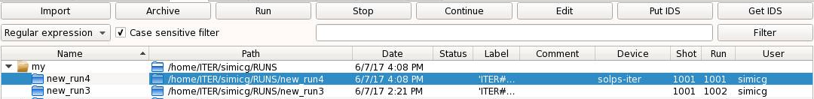

.. _imas-howto:

.. highlight:: csh

===================================
Put IDS and Get IDS functions HOWTO
===================================

:Author: Gregor Simič, University of Ljubljana

This howto describes how the put and get functions for ids work inside of
SOLPS-GUI.

.. note::   A short video tutorial on the use of the B2.5 writer is
            available `here <https://youtu.be/Dl_Bo-1zmxc>`_.

Put IDS
=======

If you highlight a run inside of SOLPS-GUI you can then save the input files
for that run in an IDS by clicking the Put IDS button.

The IDS it's saved to is marked with the run number, shot number, user name,
device and IMAS version. These values can be stored inside the b2mn.dat file in
the form of b2mndr_id switches:

- b2mndr_name
- b2mndr_device
- b2mndr_shot_number
- b2mndr_run_number

The IMAS version is system dependent so it is retrieved automatically from the
IMAS module for python.

These switches can be manually added to the b2mn.dat file or can be written
inside SOLPS-GUI columns for the currently selected run. When such an edit
happens, the b2mn.dat file is automatically updated accordingly.

To edit the columns, double click it and to activate the edit mode of the
field.

For now only the input files are stored.

Get IDS
=======

With the `Get IDS` button you can retrieve a runs input files. When you click
the `Get IDS` button a dialog opens, prompting you for the shot number,
run number, user name, machine, version number and for a new run name.

.. image :: imas_2.png
   :align: center

The run name is the name for the directory to which the data is saved. Be
careful though, to have your runs directory cleaned you should first select one
of the top directory of your runs. This way a new directory is created inside
the top dir and not inside another runs directory.

When you click ok, the data is fetched and saved to the directory with the run
name you provided inside the dialog.

Since the `Put IDS` function only save the input files, the `Get IDS` function
also retrieves only input files.
