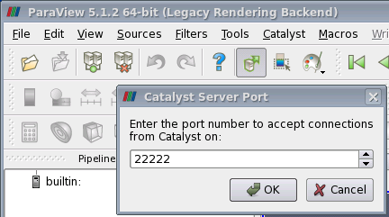
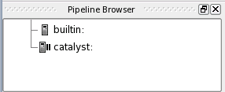
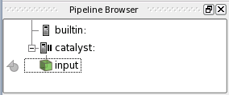
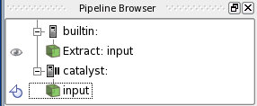
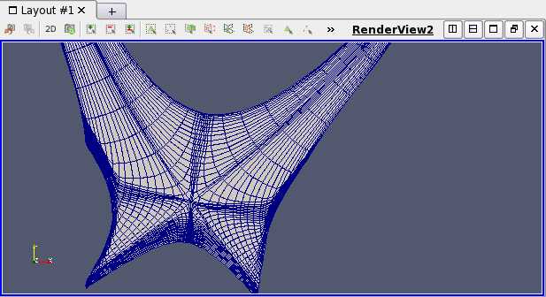
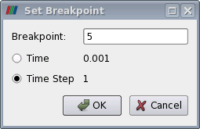
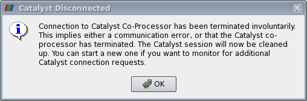

.. highlight:: csh

.. catalyst_:

=======================
Using ParaView Catalyst
=======================

With this tutorial we'll show how to instrument the SOLPS-ITER code with
*in situ* visualization using ParaView Catalyst. SOLPS-ITER code needs to be
compiled and linked with ParaView Catalyst libraries. Benefits of running
with Catalyst are:

 1. Live visualization of all exposed fields and creation of visualization 
    pipeline that can substantially reduce amount of data written during
    the simulation.
 2. Pausing and creating breakpoints at the specified time step.
 3. Writing VTK files for later inspection of all variables and analysis 
    over time.
 4. Saving image files without live connection to ParaView (offscreen mode)
    for later creation of animations.
 5. ParaView can connect/disconnect to/from running simulation at any time.
 6. ParaView can export Python CoProcessing script of the pipeline for 
    customized output.
 7. Designed visualization pipeline is preserved among ParaView quit/starts.

The following deficiencies should also be considered when using Catalyst:
 1. ParaView Catalyst listen on user provided network port that must be
    globally agreed among user currently using the cluster. The port
    cannot be changed after simulation is started. Therefore, it is
    recommended that user firstly start ParaView Catalyst on login node
    and "connects" Catalysts with some free network port to assure that
    nobody is using his port and then setups the simulation to connect
    properly.
 2. Python coprocesing script needs to be modified for correct network
    interface and port of the login/visualisation node where ParaView
    will be started for in situ analysis.
 3. Only one simulation can connect to ParaView at time. If several 
    simulations are using the same port then only the first will connect.
    The rest will continue to run but could not be instrumented.
 4. It is not possible to disconnect listening Catalyst in ParaView and 
    start listening on some other port number to allow quick switching
    between many running simulations. Recommended way is to quit ParaView
    and start over with :menuselection:`Catalyst --> Connect`. In fact,
    this menu should be named :menuselection:`Catalyst --> Accept connection`
    as the communication is established from simulation running on
    compute nodes. Better approach when having many simulations running at once
    might be reversed communication --- from Catalyst to master process started
    on some compute node where Catalyst co-processor is residing.
    Such solution would then require users to know where their processes are
    running and this might not be as easy and it thepends on the batch
    scheduler used on the cluster.
 5. There is no network security between the simulation and Catalyst. This
    means that on the cluster other users can connect to the simulation
    not owned by them if the port is temporarily free.
 6. Instrumented code get's linked with large amount of shared libraries
    that increase memory footprint and number of dependencies on some system
    libraries that are not usually available on compute nodes.
 7. ParaView need to be build with the same kind of Fortran compiler as
    the simulation due to Fortran to C++ name binding conventions that needs
    to be added to Catalyst libraries.

Basic Catalyst simulation
-------------------------

We will start the default In situ *live visualization* on ``hpc-app.iter.org``
login node using only B2.5.

The following commands copy the case that contains the usual AUG_16151_D demo
with additional ``coproc.py`` file that has hardcoded ``hpc-app1.iter.org``
and port ``22222`` for connecting to ParaView Catalyst::

  $ cd SOLSP-ITER-IDS
  $ tcsh
  $ source setup.csh
  $ cd runs
  $ mkdir catalyst-demo
  $ cd catalyst-demo
  $ cp -av ~kosl/solps-iter-ids-jb/runs/AUG_16151_D .
  $ cd AUG_16151_D/run_for_GUI_demo

Before starting the simulation it is recommended to start ParaView Catalyst
with :menuselection:`Catalyst --> Connect` and select free port. This is
especially true if several users are running this tutorial at the same time.
One can list already occupied ports on the login node by issuing::

  $ netstat -ln --tcp | grep -v :: | grep -v 127.0.0 | less

and then select free port in the range from 1025 to 65535 inclusive. In rare
(standalone) cases whe cluster is empty one can select the default
*Catalyst Server Port* on ``22222``. Otherwise, one may try another free port.

Immediately after starting the Catalyst server the  ``catalyst:`` icon appears
under the ``builtin:`` icon. We will pause the simulation at the first time
step to demonstrate initial conditions by selecting
:menuselection:`Catalyst --> Pause Simulation` that will change the
:guilabel:`catalyst:` icon to

inside the :guilabel:`Pipeline browser`. Before starting the B2.5 simulation
we need to adjust the last line of the ``coproc.py``

.. code-block:: python

   # Live Visualization, if enabled.
   coprocessor.DoLiveVisualization(datadescription, "hpc-app1.iter.org" , 22222)

and then start the simulation with the usual::

  $ rm -f *.prt
  $ itersubmit
  $ qstat -u ${USER} # should show running case for next 5 minutes

Immediately after the job gets running from the batch the code Catalyst
*co-processor* connects back to *Catalyst server* that pauses the code and
new :guilabel:`input` icon appears below the :guilabel:`catalyst:` icon.

If you click on the the grayed-out icon nearby :guilabel:`input` icon
the :guilabel:`Extract: input` extract should appear as

and once we click on grayed-out  :guilabel:`eye` icon the mesh is shown in
a new :guilabel:`RenderWindow2` as a surface.
If we close :guilabel:`RenderWindow2` and change :guilabel:`Representation`
to *Surface With Edges* with some zooming we see

Instead of :guilabel:`Solid Color` one may select any other B2.5 field
available under :guilabel:`Coloring` combo box.

Once the simulation is running you may pause it or set the breakpoint time
step. Set the breakpoint with :menuselection:`Catalyst --> Set Breakpoint` to 5

and :menuselection:`Catalyst --> Continue` the simulation that will stop
shortly at time step 5. After some additional inspection of the fields press
:menuselection:`Catalyst --> Continue` to run the simulation to the last
timestep at 1018 timesteps. While running, live simulation is shown.
If we open :menuselection:`Catalyst --> Set Breakpoint` while simulation is
runnint then the time will keep increasing while editing and this can be used
to follow the current state of the simulation. and at the end of live
visualisation rhe following message will occur:

The same message occurs if the simulation is killed by the user and ParaView
is ready for accepting connection from new simulations. If one needs to change
the *Catalyst Server Port* when the simulation is running then ParaView
needs to be restarted!

It is quite fine if one :menuselection:`File --> Exit` the ParaView while
the simulation is running. One can always reconnect by starting ParaView and
:menuselection:`Catalyst --> Connect` back at any time to see the current
state. Graphics pipeline that was created during is preserved within the
*co-processor* state  and can be saved for future use while the simulation
is running.

Co-Processing pipeline
----------------------

We will extend default co-processing script to include saving each
time step for later analysis and creation of animation. For that ``coproc.py``
pipeline needs to be changed. The easiest way to do that is by creating
and exporting visualisation pipeline shown in :guilabel:`Pipeline Browser`.

To create a new pipeline we need to:
 1. :menuselection:`Catalyst --> Connect`
 2. :menuselection:`Catalyst --> Pause Simulation`
 3. :menuselection:`Tools --> Manage Plugins ...` and guilabel:`Load Selected`
    *CatalystScriptGeneratorPlugin* and  guilabel:`Close`.
 4. Start the simulation again with::

    $ rm -f *.prt
    $ itersubmit

 5. Once we see the :guilabel:`input` we click in the icon and select
    :menuselection:`Writers --> Paralel Polydata Writer` from the menu.
    Change default *Property* :guilabel:`File Name` from ``filename_%t.pvtp``
    to ``solps_%t.pvtp`` and :guilabel:`Write Frequency` to 5.

    .. image:: catalyst_8.png
       :align: center

 6. Select :menuselection:`CoProcessing --> Export State`
    and :guilabel:`Next >`.
 7. Check :guilabel:`Show All Sources` and add *input* to proceed with
    :guilabel:`Next >` and retain :guilabel:`Name Simulation Inputs` as input
    by continuing with :guilabel:`Next >`.
 8. Under  :guilabel:`Export State Configuration` check just
    :guilabel:`Live Visualization` and press :guilabel:`Finish` and then
    replace ``runs/catalyst-demo/AUG_16151_D/run_for_GUI_demo/coproc.py``.
 9. Edit last line from ``coproc.py`` and change ``"localhost"`` back to
    "hpc-app1.iter.org" or enter::

    $ sed -i -e s/localhost/hpc-app1.iter.org/ coproc.py

 10. Kill simulation with::

     $ qstat -u ${USER}
     $ qdel Job_ID

 11. We start the simulation once again with
     :menuselection:`Catalyst --> Connect` and issuing::

     $ rm -f *.prt
     $ itersubmit

     that will connect to Catalyst and show new pipeline. Actually, there
     is no need to start ParaView unless *live visualization* is needed.
     The files ``solps_%t.pvtp`` will be created anyway as part of the
     co-processor pipeline and will be preserver under ``b2mn.exe.dir/``.
     Those files can be opened at later time with ParaView and played in time.
     Complete dumps of the code for each time step can occupy several GBytes
     of disk space even for a small example.
 12. Instead of dumping complete set of variables we create a new pipeline
     while running live visualization by selecting :guilabel:`input` and
     :menuselection:`Filters --> Alphabetical --> Pass Arrays`.
 13. Select only ``te`` and ``ti`` in filter :guilabel:`Properties`.
 14. Add :menuselection:`Writers --> Paralel Polydata Writer`and
     rename output *File Name*  to ``teti_%t.pvtp`` to get

     .. image:: catalyst_9.png
        :align: center
 15. Repeating simulation once again with::

     $ rm -f *.prt
     $ itersubmit

     we get a new set of files under ``b2mn.exe.dir/`` with smaller footprint.

     .. note:: We don't need a ParaView running if we already have desired
               fields extracted with ``coproc.py`` for later analysis,
               visualization and debugging.

