.. highlight:: csh

.. custom_plot_:

==============================
Creating custom tab with plots
==============================

Introduction
============

With Qt Designer we can create tabs with custom **gnuplot** widgets and
**b2plot** widgets.

Before we get started, to get full interactivity of **gnuplot** widget, build
the C++ bindings for gnuplot widget. This is described in
``solps-gui/README.md``.

With the use of Qt designer we can easily create custom interfaces with
arbitrary composition of widgets.

Editing solps.ui
================

Opening Qt Designer
-------------------

We will start with sourcing the environment in ``solps-gui``:

.. code-block:: bash

    cd solps-gui
    source setupenv.sh

Now the environment is loaded and we can start Qt ``designer`` and edit the
``solps.ui`` interface file.

.. code-block:: bash

    designer src/gui/solps.ui

This will open a window similar to the following image.

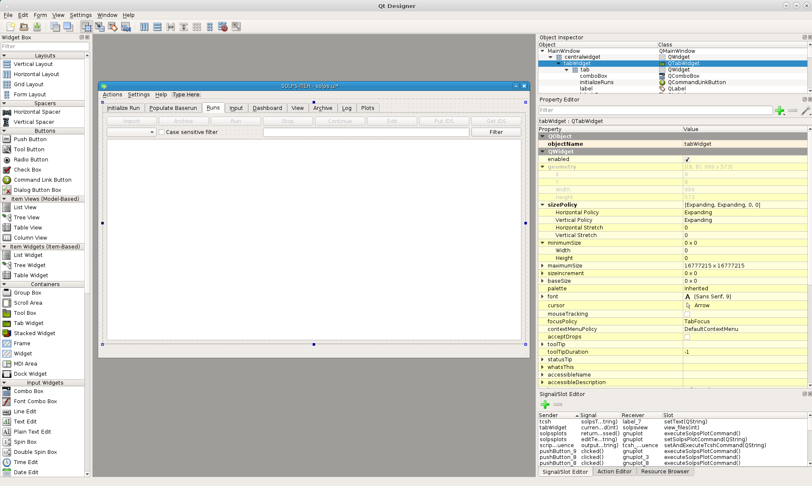

Custom tab page
---------------

Now we will create a new tab by right clicking on the last ``Tab page`` and
select :menuselection:`Insert page --> After Current Page`. This will create a
new tab page with the name ``Page``

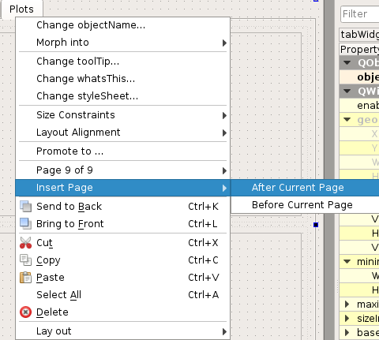

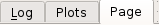

You can change the name of the tab by clicking on it, so it is selected and
then on the *right* side of the editor, under ``Property Editor``, scroll
until you get to the fields, with green color, that contains the properties of
the ``QTabWidget``.

Then change the value of the field ``currentTabText`` to a custom name or in
this case ``MyPlot``.

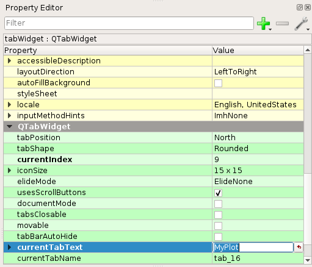

Populating tab page with plot widgets
-------------------------------------

We have our tab now and we will populate it with widgets. On the left side,
where you have a list of widgets, you will see that on the bottom there is a
group of ``SOLPS`` widgets. There are two custom widgets used specifically for
plotting, named ``Gnuplot`` and ``B2Plot``.

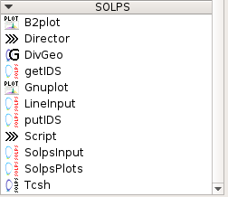

In this case we will put **one** B2Plot widget, **three** Gnuplot widgets and
a **Pushbutton** named Plot in the tab area.

The **Pushbutton** is located in the ``Buttons`` group on the left side.

To put a widget on our user interface, just click and hold on it and drag it on
the interface.

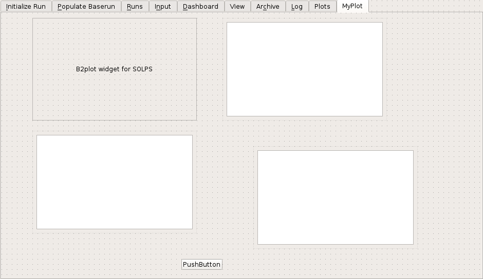

Now we would like to have the plot widgets aligned neatly. Without effort you
can sort the widgets in a grid layout. Right click on the tab area and click on
:menuselection:`Lay out --> Lay Out in a &Grid`. This
can save a lot of time if you wish to have a simple positioning of widgets.

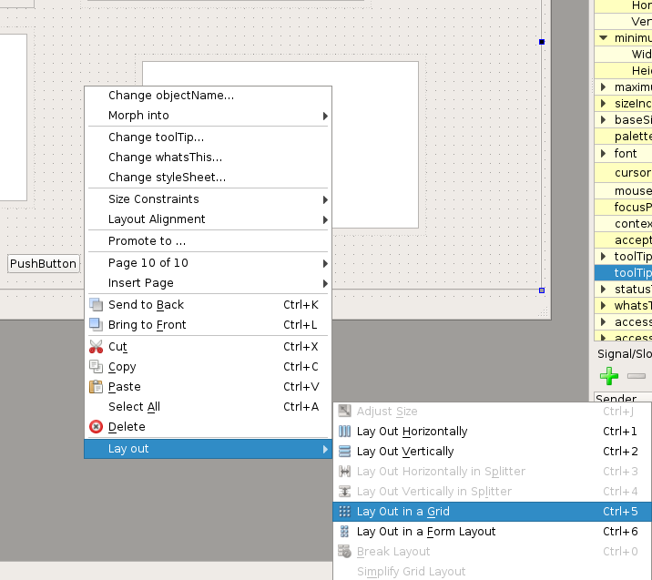

.. note::

   Of course sometimes Qt Designer can be a bit mischievous and will make
   some widgets very large or positioned strangely when you use
   :menuselection:`Lay out in a &Grid`.

   It takes a bit of practice, but you can get it under control by changing the
   size policies of certain widgets or change the positions of widgets and try
   the command again.

The result:

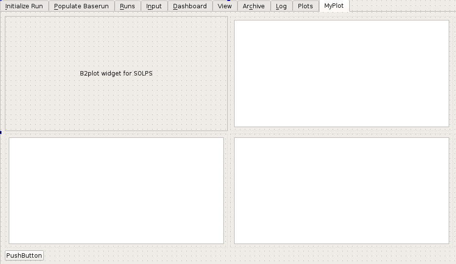

Connecting slots and signals
----------------------------

We have our widgets positioned but they will do nothing when we run solps-gui,
since nothing is telling them what to plot and from what to plot.

So we will use Qt ``signals`` and ``slots`` and connect the widget
**Director** ``rundir_passthrough`` signal, which will tell the plot widgets in
which ``run`` directory we currently are.

We can either go into ``Edit Signals/Slots`` mode by pressing :kbd:`F4` or
manually add them into the editor.

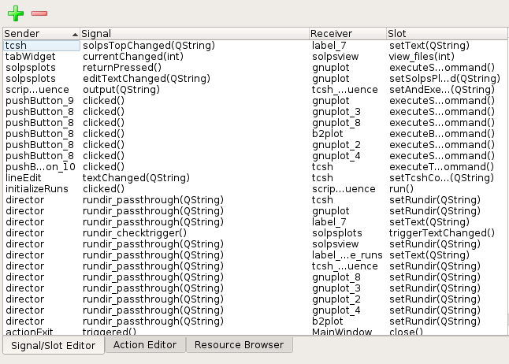

For connecting the **rundir_passthrough** signal we will use the Signal/Slot
editor. Notice the big **PLUS** and **MINUS** icons. With this you can add or
remove connections you create.

To create a connection click on the plus icon and then set the correct settings
for ``Sender``, ``Signal``, ``Receiver`` and ``Slot``.

What we want to connect is the ``Director`` signal ``rundir_passthrough`` to
the ``b2plot`` and ``gnuplot`` widgets slot ``setRundir``.

   +---------+------------------------------+-----------+---------------------+
   | Sender  | Signal                       | Receiver  | Slot                |
   +=========+==============================+===========+=====================+
   |director | rundir_passthrough (QString) | b2plot_2  | setRundir (QString) |
   +---------+------------------------------+-----------+---------------------+
   |director | rundir_passthrough (QString) | gnuplot_5 | setRundir (QString) |
   +---------+------------------------------+-----------+---------------------+
   |director | rundir_passthrough (QString) | gnuplot_6 | setRundir (QString) |
   +---------+------------------------------+-----------+---------------------+
   |director | rundir_passthrough (QString) | gnuplot_7 | setRundir (QString) |
   +---------+------------------------------+-----------+---------------------+

.. note::

   The name of the plot widgets might be different than in this tutorial. To
   get the name of the widget, simply press on it and then in the upper right
   corner of Qt Designer, you will see that the line highlighted will contain
   the name of the widget.

Now we will connect push button **Plot** to the plot widgets. For this we will
use the ``Edit Signals/Slots`` mode by pressing :kbd:`F4`.

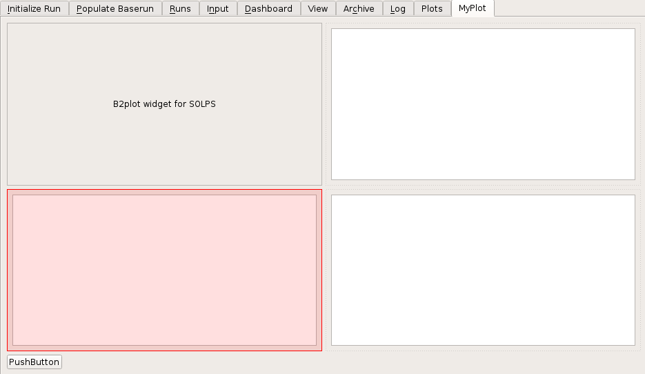

In this mode you can connect widgets by **click-and-hold** on one widget and
then dragging the mouse to the other widget.

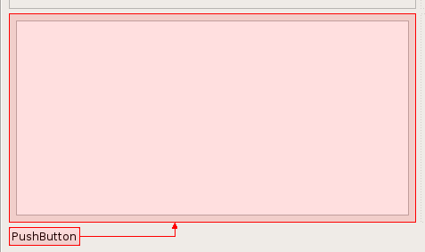

This will open a dialog in which you can select which signal will connect to
which slot.

What we want to connect is the ``clicked()`` signal to the
``executeSolpsPlotCommand``.

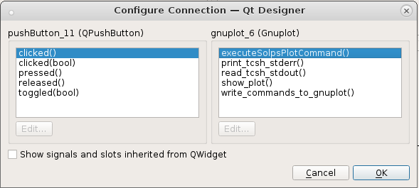

Now do the same for other plot widgets. After you are done, all we have to do
now is to set what the plot widgets should plot.

Setting plot command
--------------------

We have our widgets placed and connected, now what we have to do is to set the
plot command.

For this we will use the Qt Designers **Property editor** and change the
**B2Plot** property ``b2plotCommand``.

First click on the B2Plot widget and then scroll down in Property Editor to the
bottom. There you will see the property B2Plot. Change the value of the
property to ``echo phys a4p ti te m/ surf | b2plot``.

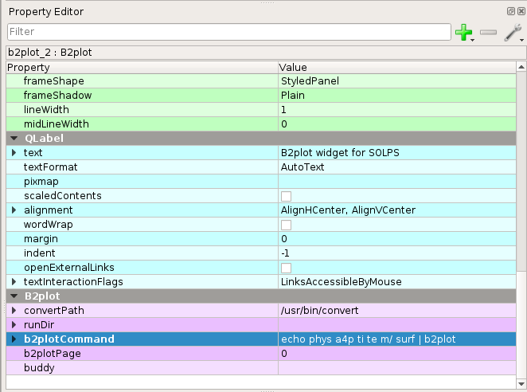

For **Gnuplot** widgets do the same. Click no a widget, scroll to the bottom in
property editor and change the value of property ``solpsPlotCommand``. Since
we have 3 widgets, try the following commands: ``energy_balance``,
``energy_analysis`` and ``resall_D``.

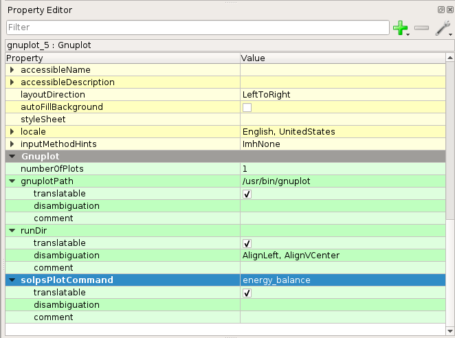

Now all you have to do is to save your interface file and that's it. You're
done!

Finish
------

Now you can run SOLPS-GUI, select a run and if the run has some data to plot,
you can go to your newly created tab and click the Plot button!

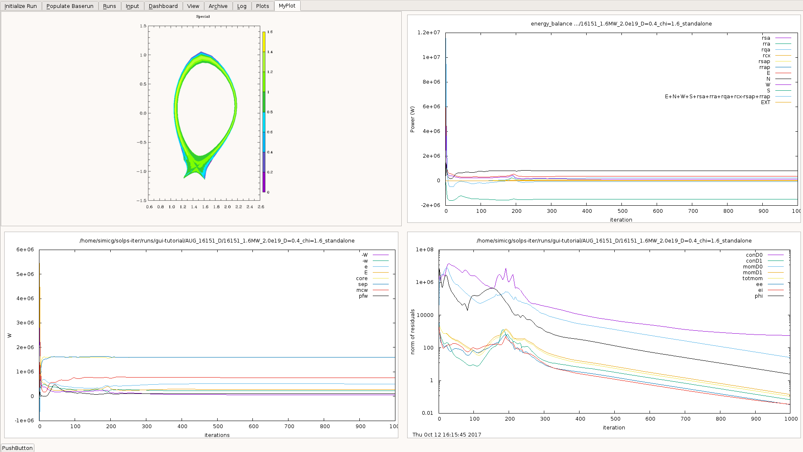