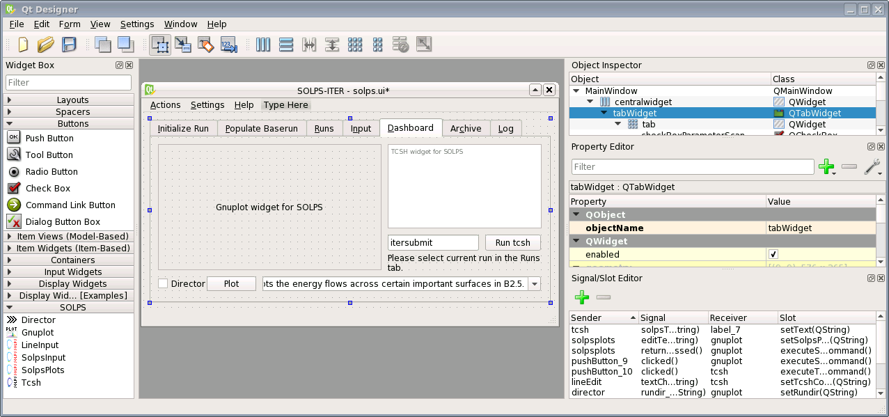

.. highlight:: csh

.. _dashboard:


===================
Designing Dashboard
===================

With this tutorial we'll show the ease of graphical programing of the SOLPS-GUI
Dashboard with a set of custom PyQt widgets and standard Qt widgets.

We will start from existing user SOLPS-GUI interface description (UI) saved
as an XML file with the ``.ui`` extension. We will create a new Dashboard
from scratch and save our UI (``mysolps.ui``) in our home directory or
elsewhere.

To start designing with *Qt Designer* from default (system provided)
``solps.ui`` that should be at the same location (`$SOLPSGUI`) as ``solps.py``
enter the following::

    $ designer $SOLPSGUI/solps.ui

You should see the following window to open with some resizing and opening
the *Dashboard* tab.



On the left widget box should appear. When folding nearly all of the Qt
widget groups *SOLPS* widget-group should appear at the bottom. These are
custom widgets that can were created with built-in "intelligence" for easy
creation.

Using custom UI
---------------

After clicking at the :guilabel:`Dashboard` tab  ``solps.ui`` is already in
modified state. It will open at the state saved. This means that it will
open with the :guilabel:`Dashboard` as default. Lets save this configuration
with :menuselection:`File --> Save as..` and name it ``mysolps.ui`` at your
``${HOME}`` location.

In a command line shell start your custom SOLPS GUI with::

    $ solps --ui ~/mysolps.ui

You can continue to work in designer. If you prefer the designer in some other
language you may start in BASH with the command line::

   $ LANG=fr designer ~/mysolps.ui

Starting the Dashboard from scratch
===================================

In this mini demo we'll create a single gnuplot window from scratch to show
design cycle.

  1. Let's remove all widgets from the Dashboard by clicking on each and
     pressing :kbd:`Delete` key. You will end up of clean surface to put
     your widgets.
  2. Firstly we need to add the *Director* widget. Select and drag the
     :guilabel:`>>> Director` from the :menuselection:`Widget Box --> SOLPS`
     group of widgets. Put the Director somewhere on top-left dashboard
     position. On the right side of the *Qt Designer* you should verify
     that the name given in the
     :menuselection:`Property editor --> Property -->  QObject --> objectName`
     value shoud be ``director``. This is your "director general". It needs
     to be present as it will receive selected run signal that we will wire
     further to other widgets needing this info.
  3. Drag :menuselection:`Widget Box --> SOLPS --> Gnuplot` widget in the
     centre of the Dashboard resize its frame to cover 2/3 of the
     space available.
  4. With the *Gnuplot widget for SOLPS* selected enter under
     :menuselection:`Property editor --> Property -->  solpsPlotCommand`
     the value ``energy_analysis``. We now fixed this plot that knows
     to draw just that for now. This property will be saved within the .UI
     and set at the run time. No need to set other *Properties* such as
     ``runDir`` as this will come from Director.
  5. We will add on demand plot trigger button. Select it from Qt provided
     :menuselection:`Widget Box --> Buttons --> Push Button` and drag it on
     bottom left dashboard position. You may rename ``PushButton`` to ``Plot``
     by double click and edit on the button itself. You may end up with the
     following design.

     .. image:: dashboard_2.png
        :scale: 80
        :align: center

  6. Now we just need to redistribute the signals and we're done. For that
     we'll use graphical signal editor that is started by pressing :kbd:`F4`
     or by :menuselection:`File --> Edit Signals Slots` . If you hoover over
     the widgets the get highligted red. Click ad drag the arrow of the signal
     from the push button to the *gnuplot* widget. Dialog window with the
     possible signals/slots will open.

     .. image:: dashboard_3.png
        :scale: 80
        :align: center

  7. Select ``clicked()`` as emitted signal and ``executeSolpsPlotCommand()``
     as receiving slot. Then press :guilabel:`OK`
  8. Repeat by dragging the signal from the *Director* to the *Gnuplot* widget.

     .. image:: dashboard_4.png
        :scale: 80
        :align: center

     Now we will pass the signal of the selected run received by the Director
     directly to Gnuplot by selecting ``rundir_passthrough(QString)`` to be
     emitted to ``setRunDir(QString)`` slot. After pressing :guilabel:`OK`
     the following "workflow" should be seen

     .. image:: dashboard_5.png
        :scale: 80
        :align: center

  9. We can exit the signal/slot editor by pressing  :kbd:`Esc` and then
     :menuselection:`File --> Save`.
  10. Optionally, we may add other display widget such as labels to decorate
      the dashboard.

  11. We try saved ``mysolps.ui`` again with::

      $ solps --ui ~/mysolps.ui

  12. After selecting run in guilabel:`Runs` tree-view one can the press the
      PushButton and get the desired plot.


Adding a new tab with file view
-------------------------------

With this tutorial we will be extending the GUI with new a new tab that will
insted of :guilabel:`Input` show user defined files in the ``SolpsInput``
widget.

1. We start with the default ``solps.ui`` and at :guilabel:`Dashboard` tab
   right-click and  :menuselection:`Insert Page --> After Current page`. Rename
   the tab :menuselection:`Property editor --> Property -->  currentTabText``
   from ``Page`` to ``View``
2. Drop :menuselection:`Widget Box --> Buttons --> SolpsInput` widget in the
   empty area under the tab. Name this widget for easier reference with
   :menuselection:`Property editor --> Property -->  QObject --> objectName`
   to ``solpsview`` instead of default ``solpsinput_2``.

3. Select tab :guilabel:`View` and in the empty area right-click and then
   adjust :menuselection:`Lay out --> Lay Out in a Grid` (:kbd:`Control+5`)
   You should see the following auto-expanding lay-out:

   .. image:: dashboard_7.png
        :scale: 80
        :align: center

   You can notice that the size policy for the ``QTabWidget`` is now
   ``Expanding`` in horizontal and vertical direction.

4. We will now add several filenames we wish to see in the tabs
   of the ``SolpsInput`` widget. By right-click on the widget
   :guilabel:`Insert Page`. Rename it to ``run.log`` in the same way as in
   step 1. You may optionally add "currentTabTooltip" as
   ``Log file of selected run``. Repeat the same procedure by adding more files
   to view (e.g. ``run.log.gz`, ``b2.log``, ```b2fstati``, ``b2fstate``, ...)
5. We will now add the signal from  :guilabel:`Director` "manually" by using
   :menuselection:`View --> Signal/Slot editor`. Press :guilabel:`+` button
   there and adjust new line just added in the following way:

   +---------+------------------------------+-----------+---------------------+
   | Sender  | Signal                       | Receiver  | Slot                |
   +=========+==============================+===========+=====================+
   |director | rundir_passthrough (QString) | solpsview | setRundir (QString) |
   +---------+------------------------------+-----------+---------------------+

   Note that setting the *run directory* is light operation as it does not
   trigger any processing except instructing the ``SolpsInput`` widget where
   to look for the files when it comes the time.
6. Finally, we need to trigger the view when the tab *is visible*. We can do
   that by dragging from the ``tabWidget`` our solpsview widget with graphical
   signal/slot editor (:kbd:`F4`) and get:

   .. image:: dashboard_8.png
        :scale: 80
        :align: center

   that is visible as in :

   +----------+---------------------+-----------+---------------------+
   | Sender   | Signal              | Receiver  | Slot                |
   +==========+=====================+===========+=====================+
   | tabWidget| currentChanged(int) | solpsview | view_files(int)     |
   +----------+---------------------+-----------+---------------------+
7. Testing of newly designed custom widget can be done as usual by saving
   ``mysolps.ui`` and using it with ``solps --ui mysolps.ui``.

Extended example
----------------
We can create a large dashboard layout with many different plots by repeating
steps 3-8 for each new plot.
:menuselection:`Widget Box --> SOLPS --> LineInput` widget can be used to
signal desired plots in between of Director and the Gnuplot widget.
