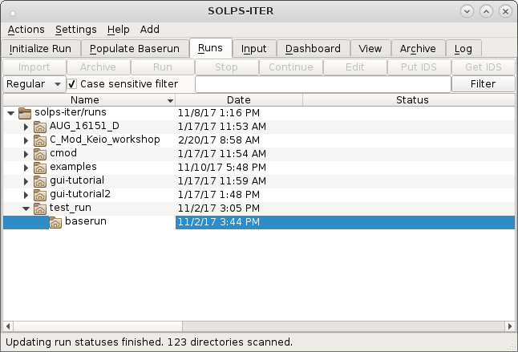
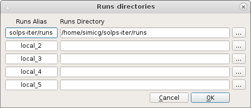
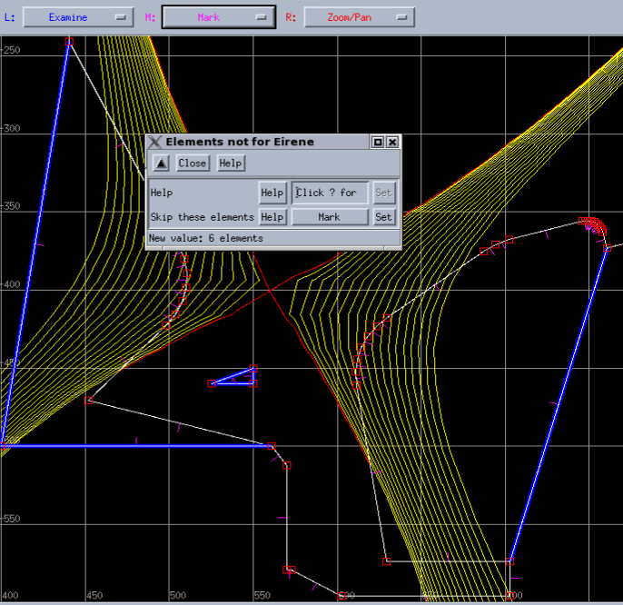

.. highlight:: csh

.. _divgeo:

=================
Meshing toolchain
=================

Meshing C-Mod with DivGeo and Carre
===================================

In this tutorial we will use *DivGeo* and *Carre* to prepare the C-Mod tokamak
geometry. The model will be later used for creating a mesh. Each input file
used for creating the DivGeo model should be located in the ``baserun`` run
directory. The following commands repare the ``baserun`` input data needed for
this tutorial::

     $ stop
     $ cd runs/examples
     $ cmake . && make # Fetches all examples from external repository
     $ tar xvzf tutorial-DivGeo_C-Mod.tar.gz
     $ cd tutorial-DivGeo_C-Mod/baserun

The EFIT equilibrium file  ``baserun/g.990429019.00940`` in this example
describes a C-Mod tokamak lower single-null shot number 990429029 at 940 ms
of the the discharge.
Since DivGeo cannot read the EFIT format equilibrium file directly the EFIT
format is needed to be transformed to DivGeo equilibrium format with::

    $ e2d g990429019.00940 g990429019.00940.equ

To have smoother contouring in the grid generator, we should increase the
resolution of the equilibrium data. Using higher resolution equilibrium avoids
us some problems when the fluid grid is generated::

    $ d2d g990429019.00940.equ g990429019.00940.x2.equ

The the wall geometry file ``baserun/wall_geometry_990429019.ogr`` lists the
R, Z points in the machine coordinates and describes the layout of the plasma
facing components. The points are in `mm` and must form a closed polygon,
i.e. the first and last points must be the same.

*DivGeo* can be started inside SOLPS GUI. The procedure is as follows. First
start SOLPS GUI. SOLPS GUI will open with the **runs** tab.

The ``baserun`` directory must be located under the
``${SOLPSTOP}/runs/examples/tutorial-DivGeo_C-Mod/`` directory for SOLPS-ITER
to work correctly. Moreover, the top directory ``${SOLPSTOP}/runs`` needs to
be listed in the :menuselection:`&Settings --> &Runs`, such as shown in the
following image:

Now select your ``baserun`` folder in :menuselection:`&Runs` tab and click
ont the :guilabel:`&Populate Baserun` tab. Click inside the DivGeo area to
start DivGeo. If you wish to dock it into SOLPS GUI, click once again inside
DivGeo area after DivGeo appears in standalone window.

.. You should see the following window at the end of this tutorial.

.. Comment.. image:: divgeo_1.png
   Comment:align: center

Import the vessel wall description
----------------------------------

The wall geometry file is located in the ``baserun`` directory.
Import the vessel wall description by opening
:menuselection:`&File --> &Import --> &Template` and load the
``wall_geometry_990429019.ogr`` file, which should be listed in the
Template dialog box.

Press :kbd:`CTRL+P` to fit the wall data to the workspace. If you cannot see
the wall, then use the :menuselection:`&View --> &Display` and make sure that
the :guilabel:`Template` radio button is pressed.

.. image:: divgeo_2.png
   :align: center

Import magnetic equilibrium data
--------------------------------

The magnetic equilibrium file is located in the ``baserun`` directory. Import
the magnetic equilibrium data by opening
:menuselection:`&File --> &Import --> &Equilibrium` and load the
``g990429019.00940.x2.equ`` file, which should be listed in the Equilibrium
dialog box.

If you cannot see the equilibrium displayed as blue (SOL) and red (core and PFR)
rectangles after it is loaded, then use :menuselection:`&View --> &Display`
and make sure that the :guilabel:`Equilibrium` radio button is pressed.

.. image:: divgeo_3.png
   :align: center

Converting the wall segments to geometry elements
-------------------------------------------------

To set the surface normals click
:menuselection:`&Command --> &Convert --> &Template to elements`. The short pink
lines, which indicate the normal surfaces, will appear.

.. image:: divgeo_4.png
   :align: center

It is very important to notice that all surface normals are pointing away
from the plasma. To reverse them can set the middle mouse button to
`"Reverse normals”`. Then click :kbd:`SHIFT+Reverse normals` (middle
button) somewhere on the vessel wall and all of the normals should flip.

.. image:: divgeo_5.png
   :align: center

Setting the magnetic topology
-----------------------------

In DivGeo is very easy to choose which kind of magnetic topology the
modelling grid should have. You can choose it by opening
:menuselection:`&File --> &Import --> &Topology` and choose one of:

   1. SN lower single-null
   2. SN-up upper single-null
   3. DDN disconnected double-null, lower primary x-point
   4. CDN connected double-null
   5. DDN-up disconnected double-null, upper primary x-point

.. image:: divgeo_6.png
   :align: center

For C-Mod case select SN. The separatrix will be marked in a red line if the
topology is applied correctly.

Defining the extent of the targets
----------------------------------

The target definitions need to satisfy the following rules:

    1. Each target segment needs to have a short wall element at each end,
       which will not be part of the target, but will be used to separate the
       target from the main wall in a subsequent setup step;
    2. the targets must be closed polygons;
    3. the surfaces normals of the closed polygon must all point inward;
    4. the plasma-wetted part of the target must consist of at least two (2)
       wall elements.

In the C-Mod example only the first condition is satisfied. Therefore, a
short segment needs to be added. To add the short segments change the assignment
of the middle mouse button to `"Split element"`, and then click on the vertical
segment just above the target, which adds a point on the wall and creates a
new segment.
Avoid making very short segments, which can cause problems for the triangle
grid generator.

.. image:: divgeo_7.png
   :align: center

The second condition requires a closed polygon, therefore it is necessary to
add a point behind the target and then connect it to the existing points at the
ends of the target. To create a point, click
:menuselection:`&Edit --> &Create --> &Point` and create a point with the
coordinates: ``(400, -500)``.

.. image:: divgeo_8.png
   :align: center

Then, change the middle mouse button to `"Connect points”`,
:kbd:`middle-click` on the new point and drag the cursor to one end of the
target and release the mouse button. Connect the new point to the second end
as well.

The same thing is done for the outer target. The first and the second
conditions should be satisfied as was done for the inner target.

.. image:: divgeo_9.png
   :align: center

Setting the "Structure" variable for "Structure"
------------------------------------------------

The structure variable is the primary definition for the vessel wall. You can
definite the vessel wall by opening :menuselection:`&Variables --> &Structure`

.. image:: divgeo_10.png
   :align: center

Use the right mouse button (assigned to Mark) to select all segments. Using
:kbd:`SHIFT+Right Click` will help a lot. Right clicking on a selected
segment will un-select it. When the highlighting is complete, left-click on
`"Set”` in the `"Structure”` dialogue box, at the end of the line marked
`"Structure”`.

:kbd:`CTRL+U`

to unmark everything.

Setting the "Structure" variable for the targets
------------------------------------------------

As the same like the structure you can set the targets. Mark all of the
segments for the inner target and then click on `"Set”`. Do not include the
segments that are behind the target.

.. image:: divgeo_11.png
   :align: center

The same steps are used for setting the outer target.

.. image:: divgeo_12.png
   :align: center

Setting elements that are to be ignored by EIRENE
-------------------------------------------------

You can select which parts should EIRENE ignored, by opening
:menuselection:`&Variables --> &Add --> &Elements not for Eirene`. Mark
the elements behind the targets and click `"Set”`.

.. image:: divgeo_13.png
   :align: center

Setting the structure used by B2plot
------------------------------------

Defining the wall surfaces that will be written to the mesh.extra file, that
defines the wall specification in B2plot, can be done opening the
:menuselection:`&Variables --> &Add --> &Input to b2plot`

Mark everything except the segments behind the targets.

.. image:: divgeo_14.png
   :align: center

Setting the target specifications
---------------------------------

TODO

Poloidal grid points
--------------------

The poloidal distribution of cells on the Carre grid are set by the
`"poloidal grid points”` in DG.  These are defined separately for the
divertor legs and the SOL. :menuselection:`&Edit --> &Create --> &Grid points`.
Set the Zone to Inner divertor and Cells to 18. The distribution of the cells
can be adjusted by left-clicking and dragging the black line on the plot.
Then click Create to update the workspace. Repeat for the outer divertor. Set
48 points in the SOL, with a roughly uniform distribution of points. The
spacing of the grid points around the x-point should be symmetric.

.. image:: divgeo_15.png
   :align: center

Radial surfaces
---------------

The radial surfaces in DG define the boundaries between rings on the Carre
grid. You can create the surfaces by opening
:menuselection:`&Edit --> &Create --> &Surfaces…` Set 18 surfaces in the SOL.
Adjust the radial distribution to give higher spatial resolution near the
separatrix.

.. image:: divgeo_16.png
   :align: center

Adding a radial surfaces
------------------------

For the core region it is necessary to add a surface which will define the
extent to which the grid penetrates into the core. To do that assign
`"Add surface”` to the middle mouse button. :kbd:`Middle-click` and hold
somewhere in the core, and release the mouse button when happy with the
location of the inner radial boundary (red line).

.. image:: divgeo_17.png
   :align: center

Adding some core radiation
--------------------------

To include core radiation in the wall heat loads, one needs to specify the
amount of core radiation (in `MW`): :menuselection:`Variables --> Add -->
Radiation sources` Enter in the `"Radiated Power”` field the amount of core
radiation (in `MW`) then need to specify the location from where this core
radiation is emitted. This is done by providing a set of point sources. The
radiated power will be spread evenly among these point sources. You create
them by: :menuselection:`&Edit --> &Create --> &Source` And specify the X and
Y coordinates (in `mm`) of the point source location. You may input as few
or as many point sources as you’d like. The point sources (if you choose to
display them) are shown as white asterisks in the DG model.

.. image:: divgeo_18.png
   :align: center

Defining "plot zones"
---------------------

The "plot zones" are a set of walls on which the power load, including the
contrabutions from the plasma particles, Eirene neutrals and radiation can
be computed by b2plot. You add them by:
:menuselection:`&Variables --> &Add --> &Plot zone`

:kbd:`CTRL+U`

and mark the set of elements that you want to include in the plot zone.

:kbd:`CTRL+U` mark the `"Starting element”`. which is the first element of
the plot zone set. Give the zone a label (`Zone-label`) that will be used in
the files created by b2plot (8 characters maximum, no spaces, stars or
ellipses).

.. image:: divgeo_19.png
   :align: center

Configuring the plasma species to be included in the simulations
----------------------------------------------------------------

It is very important to definite plasma species which are included in the
simulations. You definite them by opening:
:menuselection:`Variables --> Plasma species D` .
Also you can add it the impurity species
:menuselection:`Variables --> Add --> Plasma species`
DG recognizes a few "generic” species: H, D, T, He, Be, C, N, Ne, and Ar,
for which a full consistent default set of reactions will be provided by
Uinp. For all other elements, Uinp will look for the corresponding ADAS
ionization and recombination rates, and, if present in your database, will
include them as part of your model.

.. image:: divgeo_20.png
   :align: center

If one wishes to use a different reaction set than the default, one can
instead choose to load the reactions from an AMDS file, using:
:menuselection:`&Variables --> &Add --> &Reference to AMDS`
and giving the name of the AMDS file requested. The number of AMDS files to
be loaded is not limited. These files are to be found in the::

    $SOLPSTOP/modules/AMDS directory.

One can also specify a simple boundary condition of either flux or value for
the density of the highest ionization charge state of that species along the
core boundaries.

EIRENE setup of the "void” regions outside the Carre grid
---------------------------------------------------------

EIRENE will use a triangle grid in regions that are outside the fluid grid,
and this variable defines the zones for the triangle mesh generator.

Mark all of the main chamber elements, including the "SOL edge” segments for
the targets. :menuselection:`&Variables --> &Add --> &TRIA-EIRENE parameters`

Set index to -1 in the dialogue box, and :kbd:`"General Triangle size”`
to 10.0, which will generate large triangles. The negative index indicates
that a mesh should be generated inside the marked region, and a positive
value means the opposite.

.. image:: divgeo_21.png
   :align: center

With :kbd:`CTRL+U` mark the the wall segments in the PFR, including the
`"PFR edge”` elements. Set index to -2 in the dialogue box, and
`"General Triangle size”` to 10.0.

Local refinement of the EIRENE triangle grid
--------------------------------------------
With DG it’s possible to increase the spatial resolution on sub-regions of the
triangle mesh, i.e. the PFR. You can add it by
:menuselection:`&Variables --> &Add --> &Mesh Refinement Zones`

.. image:: divgeo_22.png
   :align: center

Select wall elements that bound the region of interest (left-right,
top-bottom), as shown on the right, and click `"Set”` for `"Region
identification”`. Set `"Desired side length”` to the desired characteristic
scale size of the triangles in this region.

Choose the toroidal approximation
---------------------------------

To set the toroidal approximation you need to set the `"Major Radius"` to a
negative (real) number, such as -1.0, if you want to use the toroidal
approximation instead of the cylindrical approximation.

:menuselection:`Variables --> Global Eirene Data`

Write the output data files that are needed by later steps
----------------------------------------------------------

With the :menuselection:`Commands --> Check variables` you can check if all
variables have valid values. If the check is it ok with:
:menuselection:`Commands --> Rebuild Carre objects`
:menuselection:`File --> Save`
:menuselection:`File --> Output`
can be create three files:
:kbd:`<DG_model_name>.dgo`, `the DG “output” file`
:kbd:`<DG_model_name>.str`, `the “structure” file (used by Carre)`
:kbd:`<DG_model_name>.trg`, `the “targets” file (used by Carre)`

Prepare the links of the DG output files for later programs
-----------------------------------------------------------

Because the other SOLPS-GUI programs expect to find the DG output files in a
"standard" place, a set of symbolic links is produced to fulfill this
requirement, by means of the command: ``lns <DG_model_name>``
Note that you should not include the ``".dg"`` extension in the DG model name.

Launch the mesh building script
-------------------------------

In the following part we wil proceed the creation of a plasma gridm using the
Carre gird operator

``carre -``.

Preparation step
----------------

The preparation starts with:

:kbd:`p (or <Enter>)`

This steps reads the DG files and translates them into
the format needed by Carre

:kbd:`class = cmod`

:kbd:`grid_stem = g1070725014.00700.default.pnl`

 :kbd:`rdeqdg: before rdeqlh`

 :kbd:`rdeqdg: after rdeqlh. nr,nz,btf,rtf=          257         257`

   :kbd:`5.40751075744629       0.660000026226044`

 :kbd:`reading rgr...`

 :kbd:`reading zgr...`

 :kbd:`reading pfm...`

:kbd:`Help, Prepare, Grid, Save, Convert, sTore, Next, Remove, Input, Output,`

:kbd:`Quit`

Gridding step
-------------

The gridding step strats with:

:kbd:`g (or <Enter>)`

The first question you must answer is whether the `X-` and `O-` points
identified by Carre are correct (they usually are). If they are not, then,
you refuse the selection and indicate yourself which of the extrema are `X-`
and `O-` points.

:kbd:`Starting`

:kbd:`newpag OK`

:kbd:`cpsets ok`

:kbd:`cprect ok`

:kbd:`cpcldr ok`

:kbd:`Pre-selected points are identified.`

:kbd:`O-point:     6.8030E-01   -8.0087E-03`

:kbd:`X-point:     5.6218E-01   -3.8994E-01`

:kbd:`Do you accept the selection (y/n)?`

:kbd:`y`

Grid parameter selection step
-----------------------------

Carre then provides a table of parameters. Carre attempts to provide a grid
that must satisfy three criteria simulatenously:

    1. The grid cells must be as locally orthogonal as possible
    2. The grid cells must align with the targets in their vicinity
    3. The size of neighbouring grid cells must not vary too quickly.

It is relatively easy to find a satisfactory solution meeting these three
criteria, but this is not always the case, especially in geometries where the
targets are almost parallel to the flux surfaces, putting criteria 1 and 2 at
odds with one another.

Quickly, the data provided in the Carre table indicates the poloidal spacing
of the grid points along the separatrix segments, the radial spacing of the
successive flux surfaces as one steps away from the separatrix, the
penetration depth of the grid (:kbd:`pntrat`), the guard lengths (i.e. the
vicinity
over which criterion 2 above is applied, in meters), and some numerical
parameters used for the optimization algorithm that attempts to build the mesh.

The poloidal spacings are deduced from the distribution of grid points chosen
in DG. The guard lengths are given by the `"CARRE guard length"` parameters in
the DG `"Target specifications"`. The pntrat value is obtained from the
innermost DG surface chosen in the core.

The radial extent of the grid (and therefore the radial grid spacings) is
determined by the first tangency points (in the PFR and main chamber vessel)
between the flux surfaces and the `"Structure"` defined in DG. However, the
algorithm is not identical to DG’s, so the values found may differ.

SEPARATRIX SEGMENTS:

=== =========== ========== =========== =========== =========== =============
 #   nptseg(i)   lg(i)      deltp1(i)    deltpn(i)     dpmin      dpmax
=== =========== ========== =========== =========== =========== =============
 1      21      1.1724E-01  9.1116E-03  1.8834E-04  1.8834E-04  9.1116E-03

 2      21      1.1053E-01  8.8644E-03  1.8323E-04  1.8323E-04  8.8644E-03

 3      41      1.7723E+00  1.1810E-02  1.5681E-02  1.1810E-02  6.0815E-02

=== =========== ========== =========== =========== =========== =============

RADIAL DISTRIBUTIONS FOR EACH REGION:

Distribution in psi: repart=    2

====== ======= ============ ============ ============ ============ ============
region  npr(i)     width      deltr1(i)   deltrn(i)     drmin      drmax
====== ======= ============ ============ ============ ============ ============
 1       21      2.7276E-02   9.6815E-05   2.4586E-03   9.6815E-05   2.4586E-03

 2       11     -1.8005E-02  -2.1524E-04  -3.1739E-03  -3.1739E-03  -2.1524E-04

====== ======= ============ ============ ============ ============ ============

CENTRAL REGION: region i=  3     pntrat max.= 0.39977943

======= ======= ============ ============ ============= ============ ===========
 pntrat  npr(i)    width      deltr1(i)     deltrn(i)      drmin         drmax
======= ======= ============ ============ ============= ============ ===========
0.161   11       -1.4957E-01  -1.7755E-03  -2.6181E-02  -2.6181E-02  -1.7755E-03

======= ======= ============ ============ ============= ============ ===========

GUARD LENGTH FOR EACH DIVERTOR PLATE:

============ ============
 tgarde(1)     tgarde(2)
============ ============
  0.20000        0.20000
============ ============

RELAXATION PARAMETERS USED TO CONSTRUCT THE MESH:

========= ============= =============== ============
nrelax        relax          pasmin         rlcept
========= ============= =============== ============
5000         0.200          1.000E-03      1.000E-06
========= ============= =============== ============

Carre criterion checks
----------------------

Often, the first pass at the Carre grid parameters will not pass internal
muster. Carre checks for a few minimal requirements:

    1. The poloidal grid spacing must be above a minimal threshold, defined
       by the :kbd:`pasmin` parameter. This is not enforced by DG and is the
       most common correction you’ll have to make.
    2. The radial and poloidal grid spacings in each region must have the
       same sign. The spacings are constrained by the first and last values
       of the region to grid and the total interval length.

The code will not proceed until these requirements are met and will show
messages like this:

:kbd:`Invalid data for segment 1!`

The numbers :kbd:`dpmin` and :kbd:`dpmax` must be larger than :kbd:`pasmin` in
absolute value.

Modify :kbd:`deltp1`, :kbd:`deltpn` or :kbd:`pasmin` accordingly.

:kbd:`dpmin,dpmax,pasmin =  1.8834E-04  9.1116E-03  1.0000E-03`

:kbd:`Invalid data for segment 2!`

The numbers :kbd:`dpmin` and :kbd:`dpmax` must be larger than :kbd:`pasmin`
in absolute value. Modify :kbd:`deltp1`, :kbd:`deltpn` or :kbd:`pasmin`
accordingly.

:kbd:`dpmin,dpmax,pasmin =  1.8323E-04  8.8644E-03  1.0000E-03`

Type the name of the variable to be changed followed by `'='`, and its
numerical value. For example: :kbd:`nptseg(2)=32` (return). Type `"end"` to
stop.

Modifying the Carre parameters
------------------------------

Usually changing the value of :kbd:`pasmin` is a good start.

:kbd:`pasmin = 0.99e-3`

:kbd:`end`

:kbd:`Invalid data for segment 1!`

The numbers :kbd:`dpmin` and :kbd:`dpmax` must be larger than :kbd:`pasmin` in
absolute value. MModify :kbd:`deltp1`, :kbd:`deltpn` or :kbd:`pasmin`
accordingly.

:kbd:`dpmin,dpmax,pasmin =  1.8834E-04  9.1116E-03  9.9000E-04`

:kbd:`Invalid data for segment 2!`

The numbers :kbd:`dpmin` and :kbd:`dpmax` must be larger than :kbd:`pasmin`
in absolute value.
Modify :kbd:`deltp1`, :kbd:`deltpn` or :kbd:`pasmin` accordingly.

:kbd:`dpmin,dpmax,pasmin =  1.8323E-04  8.8644E-03  9.9000E-04`

We now modify the poloidal grid spacings. The first spacing is the one touching
the `X-point`, and the last spacing is at the targets.

:kbd:`deltpn(1)=1.0e-3`

:kbd:`deltpn(2)=1.0e-3`

:kbd:`end`

SEPARATRIX SEGMENTS:

=== ========== ============ ============= ============ ============= ===========
 #   nptseg(i)   lg(i)       deltp1(i)     deltpn(i)      dpmin         dpmax
=== ========== ============ ============= ============ ============= ===========
1      21      1.1724E-01   9.1116E-03    1.0000E-03   1.0000E-03    9.1116E-03

2      21      1.1053E-01   8.8644E-03    1.0000E-03   1.0000E-03    8.8644E-03

3      41      1.7723E+00   1.1810E-02    1.5681E-02   1.1810E-02    6.0815E-02

=== ========== ============ ============= ============ ============= ===========

RELAXATION PARAMETERS USED TO CONSTRUCT THE MESH:

====== ======== =========== ===========
nrelax  relax     pasmin       rlcept
====== ======== =========== ===========
5000    0.200    9.900E-04   1.000E-06

====== ======== =========== ===========

:kbd:`Do you wish to accept these values (y/n)? y`

Producing the grid
------------------

Carre then proceeds, one region at a time (:kbd:`ireg` index), to build the
flux surfaces (:kbd:`ir` index) in order, stepping from the separatrix outward.
If the Carre algorithm fails to converge while building the flux surfaces,
you will get a (non-fatal) error message that allows you to continue, but
suggests some possible changes to the gridding parameters that might improve
convergence, although it may not improve the “quality” of the final grid.

You may also get a fatal error message that indicates that Carre was not able
to build the next flux surface. This usually occurs because the radial
spacings required are too small compared to the resolution of the magnetic
equilibrium provided (fix this by refining the equilibrium a further step,
using :kbd:`d2d`, or by increasing the minimal radial spacings by modifying the
:kbd:`deltr1` and :kbd:`deltrn` parameters). Sometimes, this is because the
limiting  structures in the DG structure are so small that they may stepped
over as Carre moves from one flux surface to the next, and can be fixed by
going back to the DG model and making this limiting structures bigger.

You will get this kind of output:

:kbd:`ireg=           1`

:kbd:`ir=           2`

:kbd:`ir=           3`

:kbd:`ir=           4`

:kbd:`ir=           5`

:kbd:`ir=           6`

….

:kbd:`ir=           7`

:kbd:`ir=           8`

:kbd:`ir=           9`

:kbd:`ir=          10`

:kbd:`ir=          11`

Saving the grid parameters
--------------------------

If you wish to remember the settings change you made, choose the :kbd:`Save`
option. The grid parameters are then written in the :kbd:`carre.dat` file. If
you wish to re-use these parameters, skip the :kbd:`Prepare` step in your next
invocation of the :kbd:`carre` script.

:kbd:`Help, Prepare, Grid, Save, Convert, sTore, Next, Remove, Input, Output,`
:kbd:`Quit ?`

:kbd:`s`

Saved grid settings in carre.dat file

Converting the grid output from Carre
-------------------------------------

To convert the grid output from Carre, you can do it by:

:kbd:`c (or <Enter>)`

:kbd:`Help, Prepare, Grid, Save, Convert, sTore, Next, Remove, Input, Output,`
:kbd:`Quit ?`

:kbd:`c`

Name of the file containing the carre grid

:kbd:`carre.out`

The conversion step takes the carre.out file containing the Carre grid and
converts it to the `Sonnet` and `B2.5` formats, respectively a :kbd:`*.sno`
and :kbd:`*.geo` file.

Select the output format

    1. standard mailtri format
    2. format `B2.5`
    3. format `SONNET-DIVIMP`
    4. format `DG-SONNET-B2-EIRENE`
    5. revised `DIVIMP` with grid parameters and `PSI` values

 :kbd:`The format chosen is :           4`

 Name of the file containing the carre grid :kbd:`carre.out`

 Select the output format

    1. standard mailtri format
    2. format `B2.5`
    3. format `SONNET-DIVIMP`
    4. format `DG-SONNET-B2-EIRENE`
    5. revised `DIVIMP` with grid parameters and `PSI` values

 :kbd:`The format chosen is :           2`

Storing the grid files
----------------------

The sorting of the grid files can be made by:

:kbd:`Help, Prepare, Grid, Save, Convert, sTore, Next, Remove, Input, Output,`
:kbd:`Quit?`

:kbd:`t (or <Enter>)`

dir OK

The grid in DG format is stored as ``*.sno`` format. The ``dg.dgo``,
``dg.equ``, ``dg.str`` and ``dg.trg``, you need to copied them into
the::

    $ /home/ITER/user_name/SOLPS-GUI/modules/DivGeo/device/cmod

The grid in B2.5 format is stored as ``*.geo`` format and the you can view
the grid in PostScript format as ``*.ps`` format.

Import the mesh into DG
-----------------------

After you stored the grid files, the ``*sno`` format file is the one that DG
can read it as a mesh. Note that DG can only read files in the Sonnet format
``(*.sno)``. The mesh can be import as:

:menuselection:`File --> Import --> Mesh`

When you import the mesh you need to check if some grid cells are
outlined in magenta. If there are, these are concave cells that will yield
errors when running Eirene and should be corrected before proceeding. Two
methods are available for proceeding. The first is to go back to
Carre and chose a different set of gridding parameters. This is where the Save
option comes in. The second is to modify the grid points by hand (if there
are not too many of them). This can be done as follows. Change one of the
mouse button functions to ``Move mesh point`` and select a corner of a magenta
grid cell and move it until the cell outline changes colour to lavender. You
may need to propagate such changes over a range of cells. Bear in mind
however that you are only modifying the ``*.sno`` grid file. You will need to
save your modifications by exporting the mesh:

:menuselection:`File --> Export --> Mesh`

Closing Carre or gridding again
-------------------------------

If you are satisfied with your grid, or modified it within DG, you can now quit
the carre script with

:kbd:`Help, Prepare, Grid, Save, Convert, sTore, Next, Remove, Input, Output,`
:kbd:`Quit ?`

:kbd:`q (or <Enter>)`

If you wish to obtain a new grid (and you have saved the previous set of
gridding parameters):

:kbd:`g (or <Enter>)`

Repeat until the grid will be done correct.

Start the triangulation script
------------------------------
After the meshing part, is needed to be done the triangulation script. This
script can be start with:

:kbd:`triang-.`

Create the input files for triangulation script
-----------------------------------------------

On the first call, when you will get:

:kbd:`Help, Uinp, B2ag, Eirene, Tria, triaGeom, Plot, View, Store, Convert,`
:kbd:`List, Remove, reMap, Inquire, Quit ?`

is best to use:

:kbd:`U`

Using uppercase U instead of the (default) lowercase u ensures that the links
(from the ``lns`` command earlier) are correct. ``Uinp`` is a program that
builds several input files for SOLPS-GUI programs according to the data
provided in the DG model:

   1. Eirene input files ``input.eir, test.eir and triang.eir``
   2. Tria input file header ``triang.hed``
   3. B2.5 pre-processor input files ``b2ag.dat, b2ai.dat, b2ar.dat``, and
      converter input file ``b2yt.dat``.
   4. B2.5 input file ``b2.user.parameters``
   5. b2plot input file ``mesh.extra``
   6. Stencil files ``b2.neutral.parameters.stencil`` and
      ``b2.boundary.parameters.stencil`` which are sample files containing a
      very rough default physics model for the boundary conditions and
      recycling parameters, but that have the right format for further
      modification to adapt to your physics  problem at hand.

``Uinp`` will display the list of particles being used, the reactions it will
include in the Eirene input file, the boundaries it will define and so on.

The output of the list of the particles, all them reactions (ionization,
recombination) you can see it in the ``AMJUEL``. which is a Database of
Eirene.

Meshing ITER Baseline scenario
==============================

The ITER baseline scenario case follows the same steps as for the C-Mod.
Every file which is used for running is located in one working directory
called ``baserun``. The basic setup of the run directory starts::

     $ stop
     $ cd runs/examples
     $ cmake . && make # Fetches all examples
     $ tar xvzf tutorial-DivGeo_ITER_baseline_scenario.tar.gz
     $ cd tutorial-DivGeo_ITER_baseline_scenario/baserun

In this directory you will find the following files:

Baseline2008-li0.x4.equ
    - Equilibrium file (Sonnet format)
F57-Be_W-Ne.dg
    - DivGeo model
iterm.carre.105
    - CARRE grid for SOLPS_ITER simulations
tt.tpl
    - Vacuum vessel description

Then is needed to copy the EFIT equilibrium file ``Baseline2008-li0.70`` into
``baserun`` directory. This example of the equilibrium file is for a
ITER case Ne plasma with beryllium wolfram impurities. Because the format of
the EFIT equilibrium file is not readable, so is needed to format it, into
the DG equilibrium::

    $ e2d Baseline2008-li0.70 Baseline2008-li0.70.equ

To improved smoother contouring for the equilibrium of the ITER baseline
case should increase the resolution of the data. Using higher resolution
equilibrium can avoid some problems when the fluid grid is generated::

    $ d2d Baseline2008-li0.70.equ Baseline2008-li0.70.x4.equ

The next step is to copy the wall geometry file into ``baserun``
directory.

To start DivGeo, as a SOLPS-GUI tool can be done with choosing first at the
Runs menu the directory baserun and after that to click on the Populate baserun
and just click on the Start DivGeo button on the left down corner of the
SOLPS-GUI window.

Import geometry file
--------------------

To start to use the DivGeo should make an import of the wall geometry file
which is already into ``baserun`` directory. That can be done with opening
the: :menuselection:`File --> Import --> Template` and load
``F57-Be_W-Ne.ogr``, which should appear in the dialogue box. Then press
:kbd:`CTRL+P` to fit the wall data to the workspace. If you cannot
see the wall, then use the :menuselection:`View --> Display` and make sure
that the Template radio button is pressed.

.. image:: divgeo_ITER_1.png
   :align: center

Import equilibrium file
-----------------------

After that need to be load the equilibrium file
:menuselection:`File --> Import --> Equilibrium` and select the
``Baseline2008-li0.70.x4.equ`` from the dialogue box.If you cannot
see the equilibrium displayed as red (SOL) and blue (core and PFR)
rectangles after it is loaded, then use :menuselection:`View --> Display`
and make sure that the Equilibrium button is pressed.

.. image:: divgeo_ITER_2.png
   :align: center

Setting the magnetic topology
-----------------------------

You can tell to DivGeo also which kind of magnetic topology you want the
modelling grid to have. As was said at the C-Mod case that can be done by
:menuselection:`File --> Import --> Topology` and choose one of topology in
the list. For the previous example of C-Mod case was selected SN. But for
this case none of the topologies fulfills the conditions. You can create a
magnetic topology by your own with :menuselection:`Commands --> Edit
topology`

.. image:: divgeo_ITER_4.png
   :align: center

You choose that you want the topology to be through x-point and write which
level. You save the topology and after that you chose it from the list.

Setting the structure
----------------------

This is the primary definition for the vessel wall. This can be done if you
choose :menuselection:`Variables --> Structure`

.. image:: divgeo_ITER_5.png
   :align: center

Use the right mouse button (assigned to Mark) to select all segments. Using
:kbd:`SHIFT+Right Click` will help a lot. Right clicking on a selected
segment will un-select it. When the highlighting is complete, left-click on
`“Set”` in the `“Structure”` dialogue box, at the end of the line marked
`“Structure”`.

:kbd:`CTRL+U` to unmark everything.

Setting the structure for the targets
-------------------------------------

As the same like the structure you can set the targets. Mark all of the
segments for the inner target and then click on `“Set”`. Do not include the
segments that are behind the target.

.. image:: divgeo_ITER_6.png
   :align: center

The same is for the outer target.

.. image:: divgeo_ITER_7.png
   :align: center

Creating the radial surfaces
----------------------------

The radial surfaces in DG define the boundaries between rings on the Carre
grid. To create the surfaces can be done by
:menuselection:`Edit --> Create --> Surfaces…` Set 18 surfaces in the SOL.
Adjust
the radial distribution to give higher spatial resolution near the
separatrix.

.. image:: divgeo_ITER_8.png
   :align: center

Adding a radial surfaces
------------------------

For the core region it is necessary to add a surface which will define the
extent to which the grid penetrates into the core. To do that assign `“Add
surface”` to the middle mouse button. :kbd:`Middle-click` and hold somewhere in
the core,

.. image:: divgeo_ITER_9.png
   :align: center

Adding core radiation
---------------------

To include core radiation in the wall heat loads, one needs to specify the
amount of core radiation (in `MW`):
:menuselection:`Variables --> Add --> Radiation sources`
Enter in the `“Radiated Power”` field the amount of core radiation (in `MW`) then
need to specify the location from where this core radiation is emitted.
This is done by providing a set of point sources. The radiated power will be
spread evenly among these point sources. You create them by:
:menuselection:`Edit --> Create --> Source`
And specify the X and Y coordinates (in `mm`) of the point source location.
You may input as few or as many point sources as you’d like. The point
sources (if you choose to display them) are shown as white asterisks  in the
DG model.

.. image:: divgeo_ITER_10.png
   :align: center

Defining plot zones
-------------------

The plot zones are a set of walls on which the power load, including the
contrabutions from the plasma particles, Eirene neutrals and radiation can be
computed by b2plot. That can be done with
:menuselection:`Variables --> Add --> Plot zone`
:kbd:`CTRL+U` and mark the set of elements that you want to include in
the plot zone. :kbd:`CTRL+U` mark the `“Starting element”`. which is the
first element of the plot zone set.

Give the zone a label, because this zones will be used in the files created by
b2plot.

.. image:: divgeo_ITER_11.png
   :align: center

Setting the structure that are used by B2plot
---------------------------------------------

Defining the wall surfaces also defines the wall specification in B2plot, that
can be done by
:menuselection:`Variables --> Add --> Input to b2plot`
Mark all elements which are specifaing the b2plot and click `SET`.

.. image:: divgeo_ITER_12.png
   :align: center

Setting the shadowing structure
-------------------------------

The shadowing structure is the set of physical wall elements that can receive
light from the plasma (or its reflections). It is used to compute the
radiative contribution to the wall heat loads.
:menuselection:`Variables --> Add --> Shadowing structure` :kbd:`CTRL+U`

Mark all the segments likely to receive light from the plasma. The shadowing
structure must be continuous and closed.

.. image:: divgeo_ITER_13.png
   :align: center

Setting the gas puffing
-----------------------

It is very important to set the parameters of how much the gas is puffing
into the SOL. For this reason DG has a special option to do that. The gas
puffing parameters can be define by
:menuselection:`Variables --> Add --> Gas puff`

.. image:: divgeo_ITER_14.png
   :align: center

First you need to mark an set the puffing slot from where the gas will enter
into the system. Then all other specifications. For gas specious you select
what kind of gas is puffing, in this case is D2. Then the puffing flux for
this case is 2.7e22.

PRF surface group pump
----------------------

For PFR edge is only set based on where the radial boundary of the grid
will be, as determined by intersection with the divertor knee. You can
definite the PRF surface group pump with choosing the
:menuselection:`Variables --> Add --> PFR surface group` and then choosing
which part you will mark: the pump part

.. image:: divgeo_ITER_15.png
   :align: center

The part of the inner divertor

.. image:: divgeo_ITER_16.png
   :align: center

The part of the outer divertor

.. image:: divgeo_ITER_17.png
   :align: center

EIRENE setup of the "void” regions outside the Carre grid
---------------------------------------------------------

EIRENE will use a triangle grid in regions that are outside the fluid grid,
and this variable defines the zones for the triangle mesh generator.

Mark all of the main chamber elements, including the "SOL edge” segments for
the targets. :menuselection:`Variables --> Add --> TRIA-EIRENE parameters`

Set index to -1 in the dialogue box, and :kbd:`"General Triangle size”`
to 10.0, which will generate large triangles. The negative index indicates
that a mesh should be generated inside the marked region, and a positive
value means the opposite.

.. image:: divgeo_ITER_18.png
   :align: center

With :kbd:`CTRL+U` mark the the wall segments in the PFR, including the `"PFR
edge”` elements. Set index to -2 in the dialogue box, and `"General Triangle
size”` to 10.0.

Global B2 data
--------------

In the global B2 data you can set some power parameters as the electron and
ion power, and also the power fraction inboard and the time dependent strtum.
:menuselection:`Variables --> Add --> Global B2 data`
For the electron and ion power for this case you need to set it on 50. For
the power fraction inboard 0.25

.. image:: divgeo_ITER_19.png
   :align: center

Configuring the plasma species to be included in the simulations
----------------------------------------------------------------

It is very important to definite plasma species which are included in the
simulations. That you do it by: :menuselection:`Variables --> Plasma
species D` . Also you can add it the impurity species
:menuselection:`Variables --> Add --> Plasma species`

DG recognizes a few "generic” species: H, D, T, He, Be, C, N, Ne, and Ar,
for which a full consistent default set of reactions will be provided by
Uinp. For all other elements, Uinp will look for the corresponding ADAS
ionization and recombination rates, and, if present in your database, will
include them as part of your model.

.. image:: divgeo_ITER_20.png
   :align: center

Local refinement of the EIRENE triangle grid
--------------------------------------------
With DG it’s possible to increase the spatial resolution on sub-regions of the
triangle mesh, i.e. the PFR. This can be done by
:menuselection:`Variables --> Add --> Mesh Refinement Zones`

.. image:: divgeo_ITER_21.png
   :align: center

Select wall elements that bound the region of interest (left-right,
top-bottom), as shown on the right, and click `"Set”` for `"Region
identification”`. Set `"Desired side length”` to the desired characteristic
scale size of the triangles in this region.

Creating the grid points
------------------------

The poloidal distribution of cells on the Carre grid are set by the
`"poloidal grid points”` in DG.  These are defined separately for the
divertor legs and the SOL. :menuselection:`Edit --> Create --> Grid points`.
Set the Zone to Inner divertor and Cells to 18. The distribution of the cells
can be adjusted by left-clicking and dragging the black line on the plot.
Then click Create to update the workspace. Repeat for the outer divertor. Set
48 points in the SOL, with a roughly uniform distribution of points. The
spacing of the grid points around the x-point should be symmetric.

.. image:: divgeo_ITER_22.png
   :align: center
