.. highlight:: csh

.. _divgeo:

=================
Meshing toolchain
=================

Meshing C-Mod with DivGeo
=========================

With this tutorial we'll show how the tool *DivGeo* is working. Firstly
every file which is used for running in the DivGeo should be located in one
working directory called ``baserun``. The basic setup of the run directory
starts::

     $ stop
     $ cd runs/examples
     $ cmake . && make # Fetches all examples
     $ tar xvzf tutorial-DivGeo_C-Mod.tar.gz
     $ cd tutorial-DivGeo_C-Mod/baserun

Then is needed to copy the EFIT equilibrium file ``g.990429019.00940`` into
``baserun`` directory. This example of the equilibrium file is for a C-Mod
lower single-null equilibrium for shot 990429029 at 940 ms into the sischarge
Because the format of the EFIT equilibrium file is not readable, so is needed
to format it, into the DG equilibrium::

    $ e2d g990429019.00940 g990429019.00940.equ

To improved smoother contouring in the grid generator, should increase the
resolution of the equilibrium data. Using higher resolution equilibrium can
avoid some problems when the fluid grid is generated::

    $ d2d g990429019.00940.equ g990429019.00940.x2.equ

The next step is to copy the wall geometry file
``wall_geometry_990429019.ogr`` into ``baserun`` directory. The list of the
R, Z points in the machine coordinates describes the layout of the plasma
facing components. The points are in `mm` and must form a closed polygon,
i.e. the first and last points must be the same.

To start DivGeo, as a SOLPS-GUI tool can be done with choosing first at the
Runs menu the directory baserun and after that to click on the Populate
baserun and just click on the Start DivGeo button on the left down corner
of the SOLPS GUI window.

You should see the following window at the end of this tutorial.

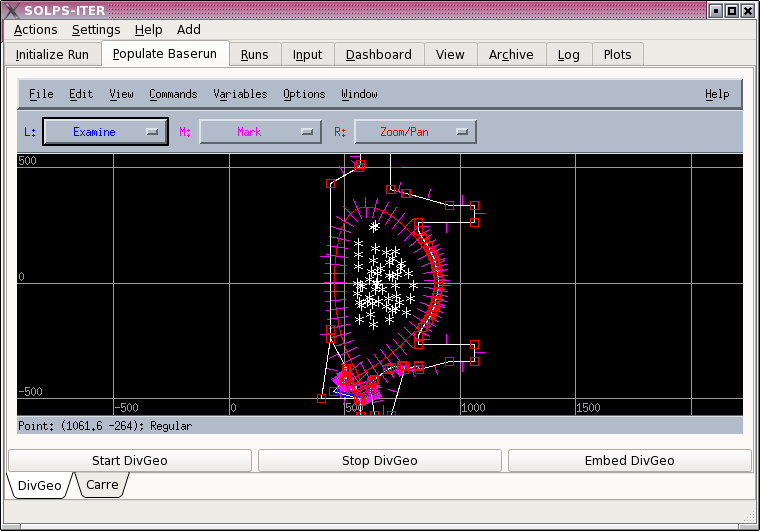

Import geometry file
--------------------

To start to use the DivGeo should make an import of the wall geometry file
which is already into ``baserun`` directory. That can be done with opening the:
:menuselection:`File --> Import --> Template` and load
``wall_geometry_990429019.ogr``, which should appear in the dialogue box.
Then press :kbd:`CTRL+P` to fit the wall
data to the workspace. If you cannot see the wall, then use the
:menuselection:`View --> Display` and make sure that the Template radio button
is pressed.

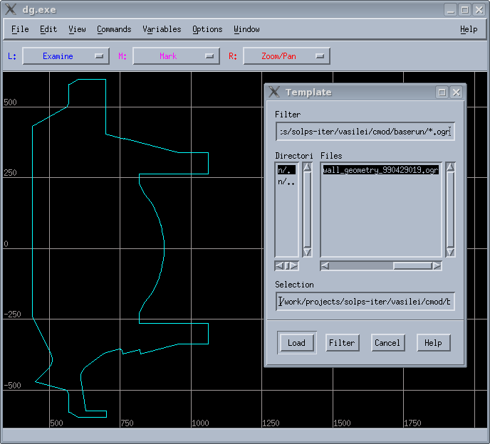

Import equilibrium file
-----------------------

After that need to be load the equilibrium file
:menuselection:`File --> Import --> Equilibrium` and select the
``g990429019.00940.x2.equ`` from the dialogue box.If you cannot
see the equilibrium displayed as blue (SOL) and red (core and PFR)
rectangles after it is loaded, then use :menuselection:`View --> Display`
and make sure that the Equilibrium button is pressed.

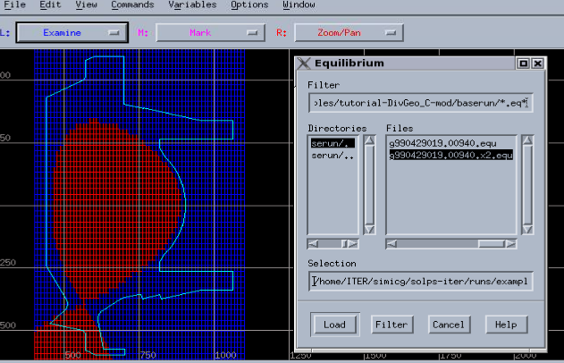

Converting the wall segments
----------------------------

To set the surface normals can be done by choosing
:menuselection:`Command --> Convert --> Template to elements`. The short pink
lines, which indicates the normal surfaces, will appears.

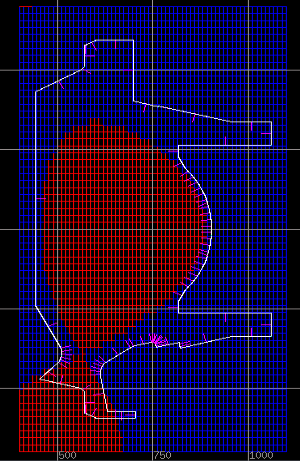

It is very important to notice that all surface normals are pointing away
from the plasma. To reverse them can be done if you set the middle mouse
button to `"Reverse normals”`. Then click :kbd:`SHIFT+Reverse normals` (middle
button) somewhere on the vessel wall and all of the normals should flip.

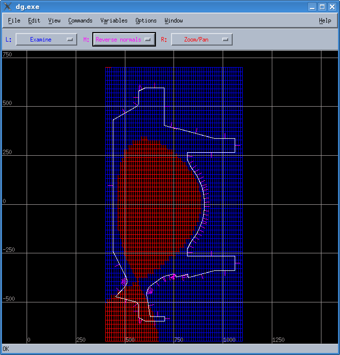

Setting the magnetic topology
-----------------------------

You can tell to DivGeo also which kind of magnetic topology you want the
modelling grid to have. That can be done by
:menuselection:`File --> Import --> Topology` and choose one of:

   1. SN lower single-null
   2. SN-up upper single-null
   3. DDN disconnected double-null, lower primary x-point
   4. CDN connected double-null
   5. DDN-up disconnected double-null, upper primary x-point

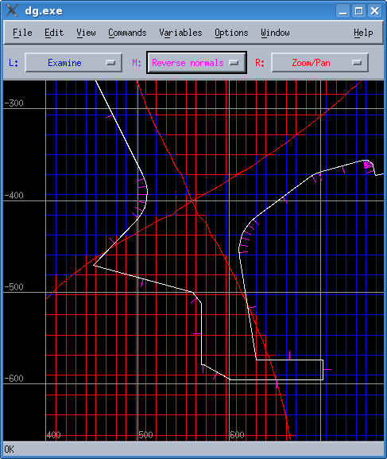

For C-Mod case select SN. The separatrix will be markedin a red line if the
topology is applied correctly.

Target definition
-----------------

To make a target definition need to be satisfied the following conditions:

    1. each target segment needs to have a short wall element at each end
       which will be used to separate the target from the main wall;
    2. the targets must be closed polygons;
    3. the surfaces normals of the closed polygon must all point inward;
    4. the plasma-wetted part of the target must consist of at least two (2)
       wall elements.

In the C-Mod example only the first condition is satisfied. Therefore, a
short segment needs to be added. That can be done by: change the assignment
of the middle mouse button to `"Split element”`, and then click on the vertical
segment just above the target, which adds a point on the wall and creates a
new segment.
Avoid making very short segments, which can cause problems for the triangle
grid generator.

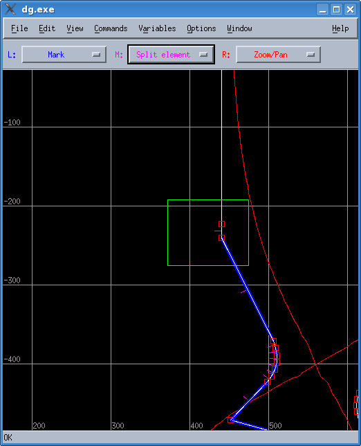

For creating the closed polygon, which is required by the second condition,it
is necessary to add a point behind the target and then connect it to the
existing points at the ends of the target.
:menuselection:`Edit --> Create --> Point`

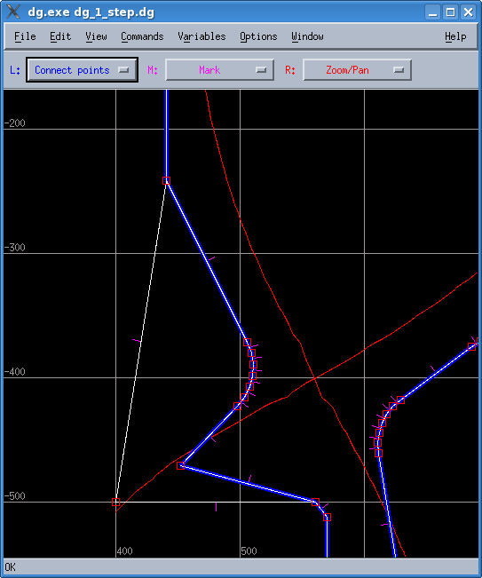

Then, change the middle mouse button to `"Connect points”`, and
:kbd:`middle-click` on the new point, and drag the cursor to one end of the
target and release the mouse button.

The same thing is done for the outer target. The first and the second
conditions should be satisfied as was done for the inner target.

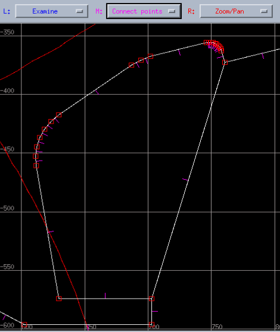

Setting the structure
----------------------

This is the primary definition for the vessel wall. This can be done if you
choose :menuselection:`Variables --> Structure`

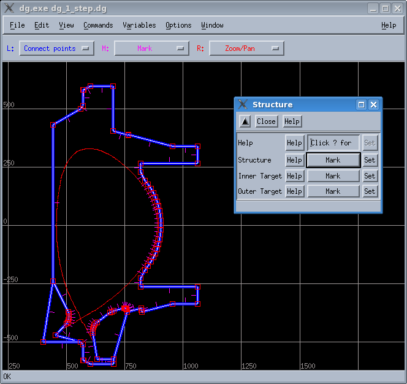

Use the right mouse button (assigned to Mark) to select all segments. Using
:kbd:`SHIFT+Right Click` will help a lot. Right clicking on a selected
segment will un-select it. When the highlighting is complete, left-click on
`"Set”` in the `"Structure”` dialogue box, at the end of the line marked
`"Structure”`.

:kbd:`CTRL+U` to unmark everything.

Setting the structure for the targets
-------------------------------------

As the same like the structure you can set the targets. Mark all of the
segments for the inner target and then click on `"Set”`. Do not include the
segments that are behind the target.

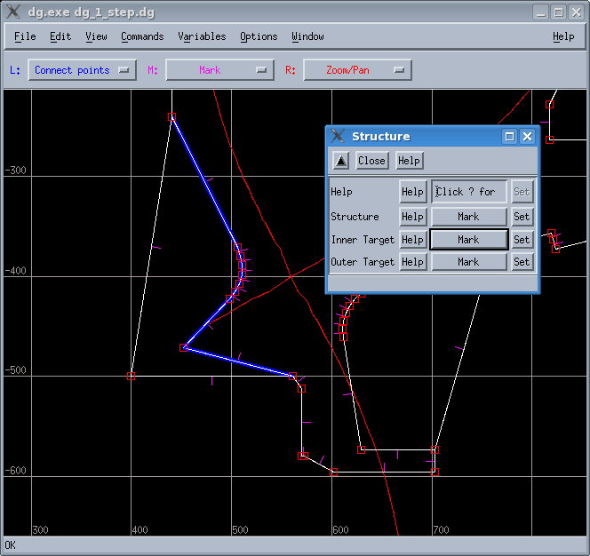

The same is for the outer target.

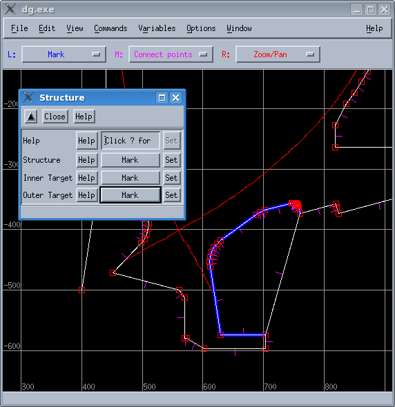

Setting the structure which is ignored by EIRINE
------------------------------------------------

To ignored the parts of the structure which are not a parts of the EIRINE can
be done by :menuselection:`Variables --> Add --> Elements not for Eirene`. Mark
the elements behind the targets and click `"Set”`.

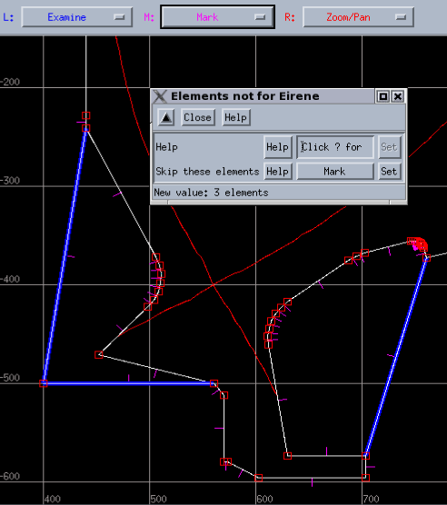

Setting the structure that are used by B2plot
---------------------------------------------

Defining the wall surfaces that will be written to the mesh.extra file that
defines the wall specification in B2plot, can be done by
:menuselection:`Variables --> Add --> Input to b2plot`

Mark everything except the segments behind the targets.

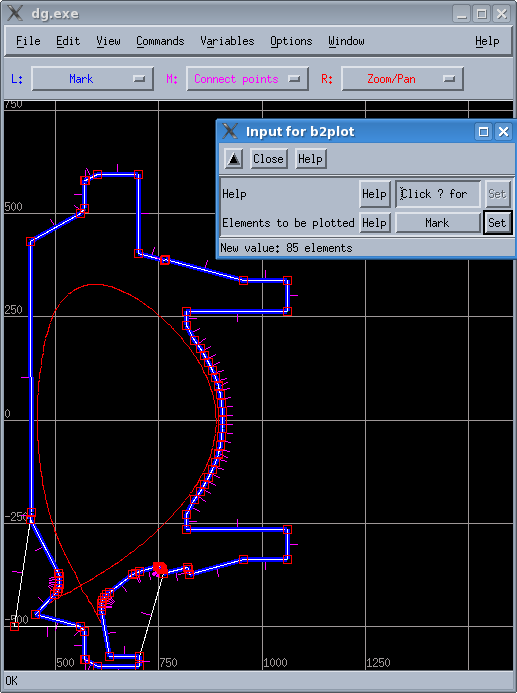

Creating the grid points
------------------------

The poloidal distribution of cells on the Carre grid are set by the
`"poloidal grid points”` in DG.  These are defined separately for the
divertor legs and the SOL. :menuselection:`Edit --> Create --> Grid points`.
Set the Zone to Inner divertor and Cells to 18. The distribution of the cells
can be adjusted by left-clicking and dragging the black line on the plot.
Then click Create to update the workspace. Repeat for the outer divertor. Set
48 points in the SOL, with a roughly uniform distribution of points. The
spacing of the grid points around the x-point should be symmetric.

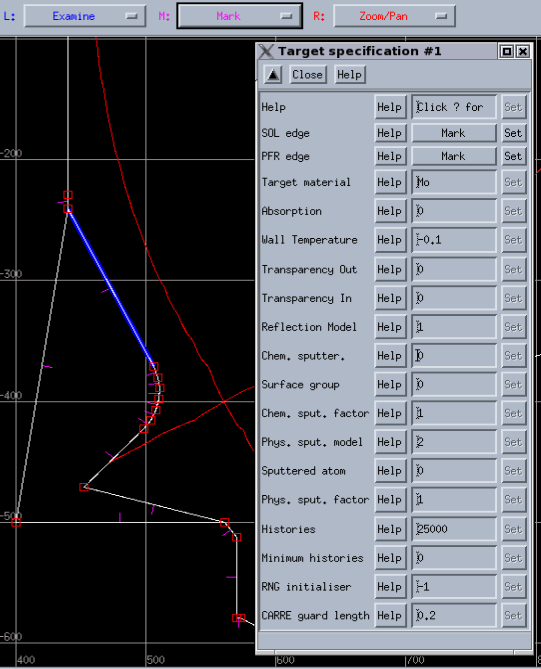

Creating the radial surfaces
----------------------------

The radial surfaces in DG define the boundaries between rings on the Carre
grid. To create the surfaces can be done by
:menuselection:`Edit --> Create --> Surfaces…` Set 18 surfaces in the SOL.
Adjust
the radial distribution to give higher spatial resolution near the
separatrix.

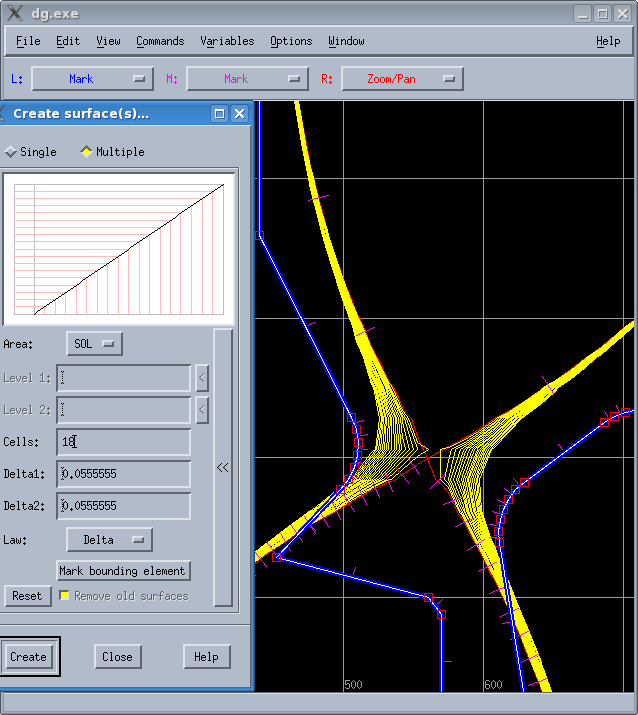

Adding a radial surfaces
------------------------

For the core region it is necessary to add a surface which will define the
extent to which the grid penetrates into the core. To do that assign `"Add
surface”` to the middle mouse button. :kbd:`Middle-click` and hold
somewhere in the core, and release the mouse button when happy with the
location of the inner radial boundary (red line).

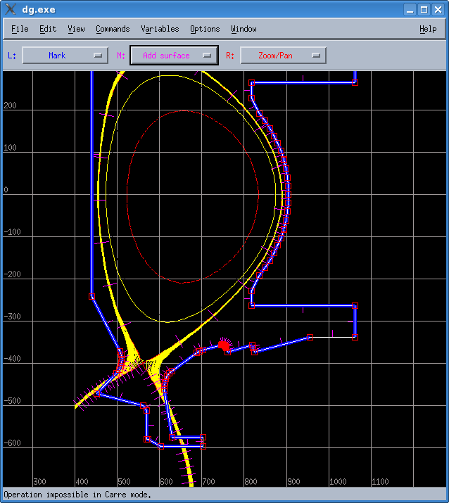

Adding the core radiation
-------------------------

To include core radiation in the wall heat loads, one needs to specify the
amount of core radiation (in `MW`): :menuselection:`Variables --> Add -->
Radiation sources` Enter in the `"Radiated Power”` field the amount of core
radiation (in `MW`) then need to specify the location from where this core
radiation is emitted. This is done by providing a set of point sources. The
radiated power will be spread evenly among these point sources. You create
them by: :menuselection:`Edit --> Create --> Source` And specify the X and
Y coordinates (in `mm`) of the point source location. You may input as few
or as many point sources as you’d like. The point sources (if you choose to
display them) are shown as white asterisks in the DG model.

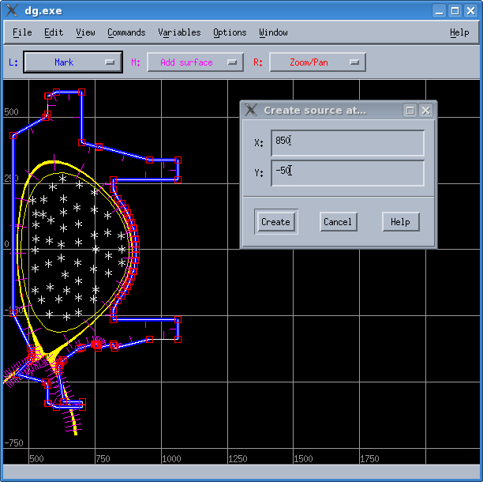

Defining plot zones
-------------------

The plot zones are a set of walls on which the power load, including the
contrabutions from the plasma particles, Eirene neutrals and radiation can
be computed by b2plot. That can be done with :menuselection:`Variables -->
Add --> Plot zone` :kbd:`CTRL+U` and mark the set of elements that you want
to include in the plot zone. :kbd:`CTRL+U` mark the `"Starting element”`.
which is the first element of the plot zone set. Give the zone a label
(`Zone-label`) that will be used in the files created by b2plot (8
characters maximum, no spaces, stars or ellipses).

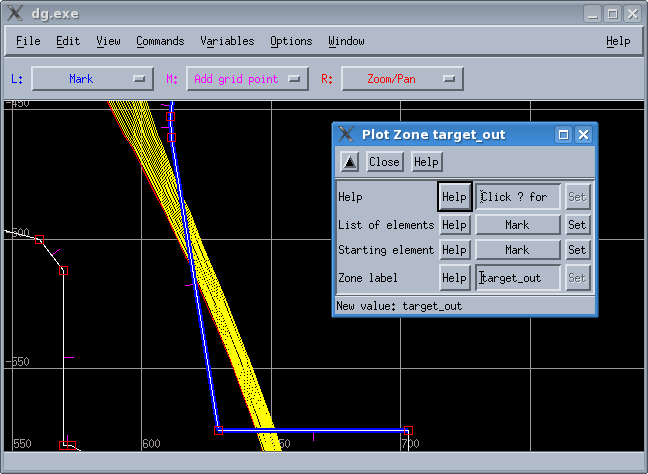

Configuring the plasma species to be included in the simulations
----------------------------------------------------------------

It is very important to definite plasma species which are included in the
simulations. That you do it by: :menuselection:`Variables --> Plasma
species D` . Also you can add it the impurity species
:menuselection:`Variables --> Add --> Plasma species`

DG recognizes a few "generic” species: H, D, T, He, Be, C, N, Ne, and Ar,
for which a full consistent default set of reactions will be provided by
Uinp. For all other elements, Uinp will look for the corresponding ADAS
ionization and recombination rates, and, if present in your database, will
include them as part of your model.

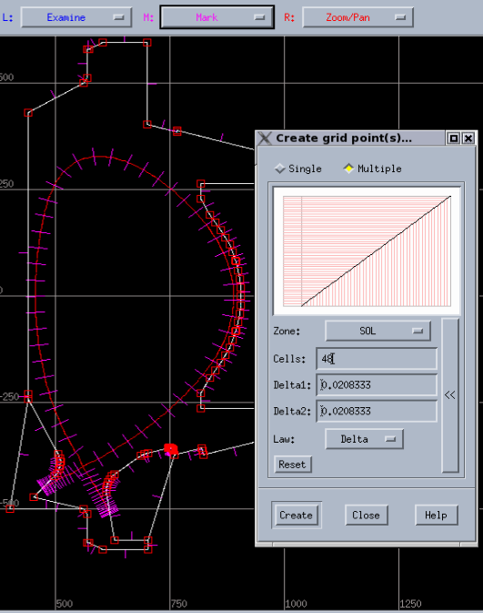

If one wishes to use a different reaction set than the default, one can
instead choose to load the reactions from an AMDS file, using:
:menuselection:`Variables > Add > Reference to AMDS`
and giving the name of the AMDS file requested. The number of AMDS files to
be loaded is not limited. These files are to be found in the::

    $SOLPSTOP/modules/AMDS directory.

One can also specify a simple boundary condition of either flux or value for
the density of the highest ionization charge state of that species along the
core boundaries.

EIRENE setup of the "void” regions outside the Carre grid
---------------------------------------------------------

EIRENE will use a triangle grid in regions that are outside the fluid grid,
and this variable defines the zones for the triangle mesh generator.

Mark all of the main chamber elements, including the "SOL edge” segments for
the targets. :menuselection:`Variables --> Add --> TRIA-EIRENE parameters`

Set index to -1 in the dialogue box, and :kbd:`"General Triangle size”`
to 10.0, which will generate large triangles. The negative index indicates
that a mesh should be generated inside the marked region, and a positive
value means the opposite.

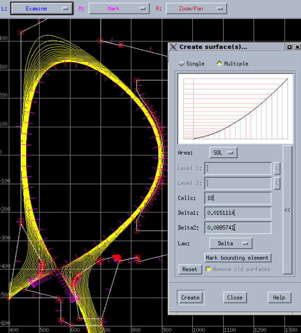

With :kbd:`CTRL+U` mark the the wall segments in the PFR, including the `"PFR
edge”` elements. Set index to -2 in the dialogue box, and `"General Triangle
size”` to 10.0.

Local refinement of the EIRENE triangle grid
--------------------------------------------
With DG it’s possible to increase the spatial resolution on sub-regions of the
triangle mesh, i.e. the PFR. This can be done by
:menuselection:`Variables --> Add --> Mesh Refinement Zones`

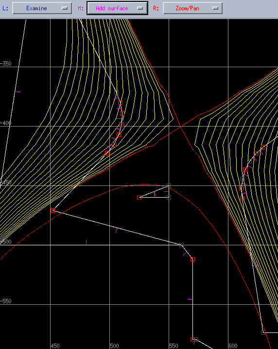

Select wall elements that bound the region of interest (left-right,
top-bottom), as shown on the right, and click `"Set”` for `"Region
identification”`. Set `"Desired side length”` to the desired characteristic
scale size of the triangles in this region.

Meshing ITER Baseline scenario
==============================

The ITER baseline scenario case follows the same steps as for the C-mod.
Every file which is used for running is located in one working directory
called ``baserun``. The basic setup of the run directory starts::

     $ stop
     $ cd runs/examples
     $ cmake . && make # Fetches all examples
     $ tar xvzf tutorial-DivGeo_ITER_baseline_scenario.tar.gz
     $ cd tutorial-DivGeo_ITER_baseline_scenario/baserun

Then is needed to copy the EFIT equilibrium file ``Baseline2008-li0.70`` into
``baserun`` directory. This example of the equilibrium file is for a
ITER case Ne plasma with beryllium wolfram impurities. Because the format of
the EFIT equilibrium file is not readable, so is needed to format it, into
the DG equilibrium::

    $ e2d Baseline2008-li0.70 Baseline2008-li0.70.equ

To improved smoother contouring for the equilibrium of the ITER baseline
case should increase the resolution of the data. Using higher resolution
equilibrium can avoid some problems when the fluid grid is generated::

    $ d2d Baseline2008-li0.70.equ Baseline2008-li0.70.x4.equ

The next step is to copy the wall geometry file into ``baserun``
directory.

To start DivGeo, as a SOLPS-GUI tool can be done with choosing first at the
Runs menu the directory baserun and after that to click on the Populate baserun
and just click on the Start DivGeo button on the left down corner of the
SMITER-GUI window.

Import geometry file
--------------------

To start to use the DivGeo should make an import of the wall geometry file
which is already into ``baserun`` directory. That can be done with opening
the: :menuselection:`File --> Import --> Template` and load
``F57-Be_W-Ne.ogr``, which should appear in the dialogue box. Then press
:kbd:`CTRL+P` to fit the wall data to the workspace. If you cannot
see the wall, then use the :menuselection:`View --> Display` and make sure
that the Template radio button is pressed.

.. image:: divgeo_ITER_1.png
   :align: center

Import equilibrium file
-----------------------

After that need to be load the equilibrium file
:menuselection:`File --> Import --> Equilibrium` and select the
``Baseline2008-li0.70.x4.equ`` from the dialogue box.If you cannot
see the equilibrium displayed as red (SOL) and blue (core and PFR)
rectangles after it is loaded, then use :menuselection:`View --> Display`
and make sure that the Equilibrium button is pressed.

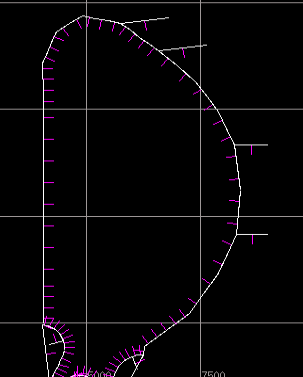

Setting the magnetic topology
-----------------------------

You can tell to DivGeo also which kind of magnetic topology you want the
modelling grid to have. As was said at the C-mode case that can be done by
:menuselection:`File --> Import --> Topology` and choose one of topology in
the list. For the previous example of C-mode case was selected SN. But for
this case none of the topologies fulfills the conditions. You can create a
magnetic topology by your own with :menuselection:`Commands --> Edit
topology`

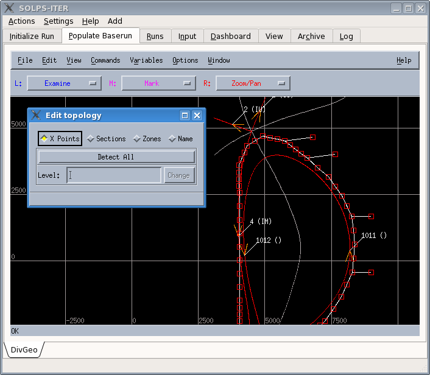

You choose that you want the topology to be through x-point and write which
level. You save the topology and after that you chose it from the list.

Setting the structure
----------------------

This is the primary definition for the vessel wall. This can be done if you
choose :menuselection:`Variables --> Structure`

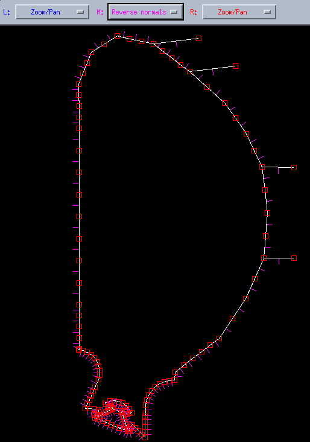

Use the right mouse button (assigned to Mark) to select all segments. Using
:kbd:`SHIFT+Right Click` will help a lot. Right clicking on a selected
segment will un-select it. When the highlighting is complete, left-click on
`“Set”` in the `“Structure”` dialogue box, at the end of the line marked
`“Structure”`.

:kbd:`CTRL+U` to unmark everything.

Setting the structure for the targets
-------------------------------------

As the same like the structure you can set the targets. Mark all of the
segments for the inner target and then click on `“Set”`. Do not include the
segments that are behind the target.

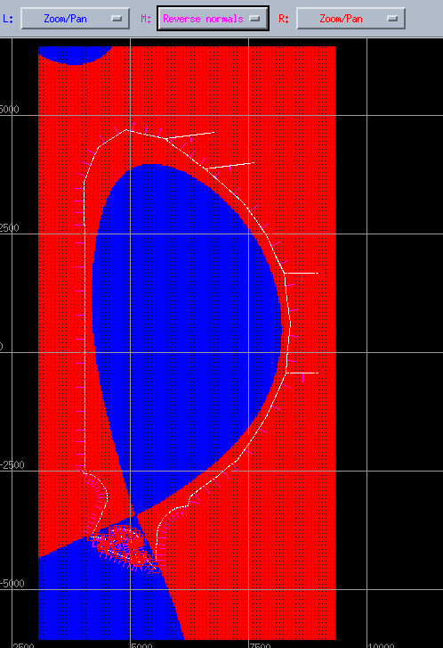

The same is for the outer target.

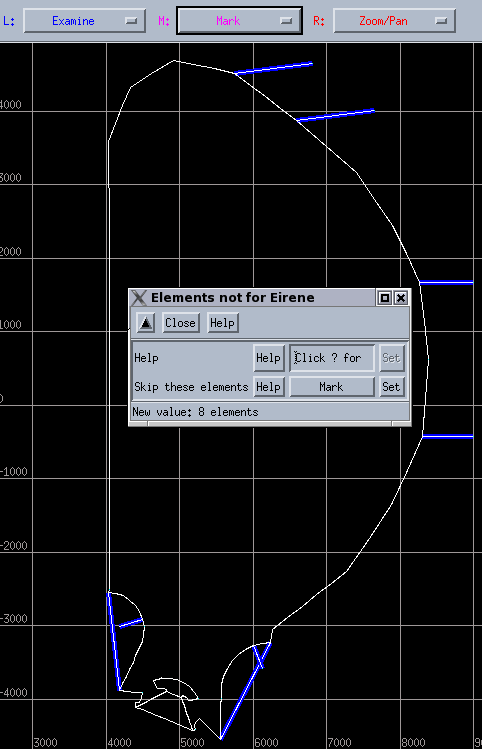

Creating the radial surfaces
----------------------------

The radial surfaces in DG define the boundaries between rings on the Carre
grid. To create the surfaces can be done by
:menuselection:`Edit --> Create --> Surfaces…` Set 18 surfaces in the SOL.
Adjust
the radial distribution to give higher spatial resolution near the
separatrix.

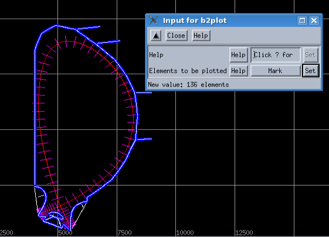

Adding a radial surfaces
------------------------

For the core region it is necessary to add a surface which will define the
extent to which the grid penetrates into the core. To do that assign `“Add
surface”` to the middle mouse button. :kbd:`Middle-click` and hold somewhere in
the core,

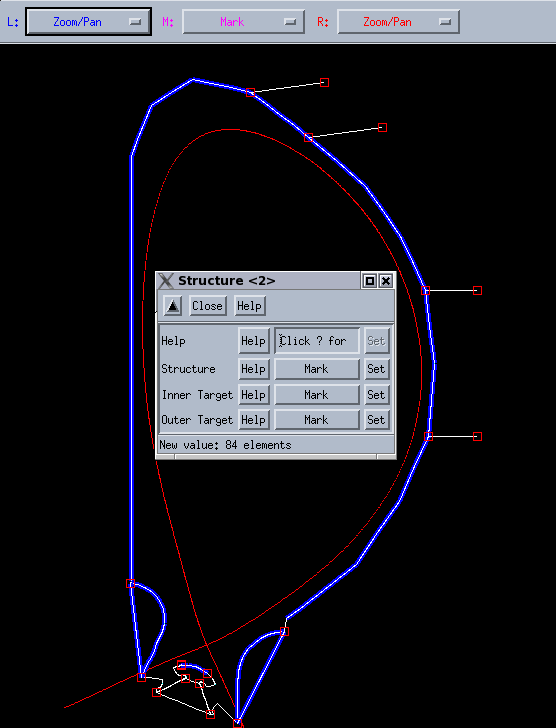

Adding core radiation
---------------------

To include core radiation in the wall heat loads, one needs to specify the
amount of core radiation (in `MW`):
:menuselection:`Variables --> Add --> Radiation sources`
Enter in the `“Radiated Power”` field the amount of core radiation (in `MW`) then
need to specify the location from where this core radiation is emitted.
This is done by providing a set of point sources. The radiated power will be
spread evenly among these point sources. You create them by:
:menuselection:`Edit --> Create --> Source`
And specify the X and Y coordinates (in `mm`) of the point source location.
You may input as few or as many point sources as you’d like. The point
sources (if you choose to display them) are shown as white asterisks  in the
DG model.

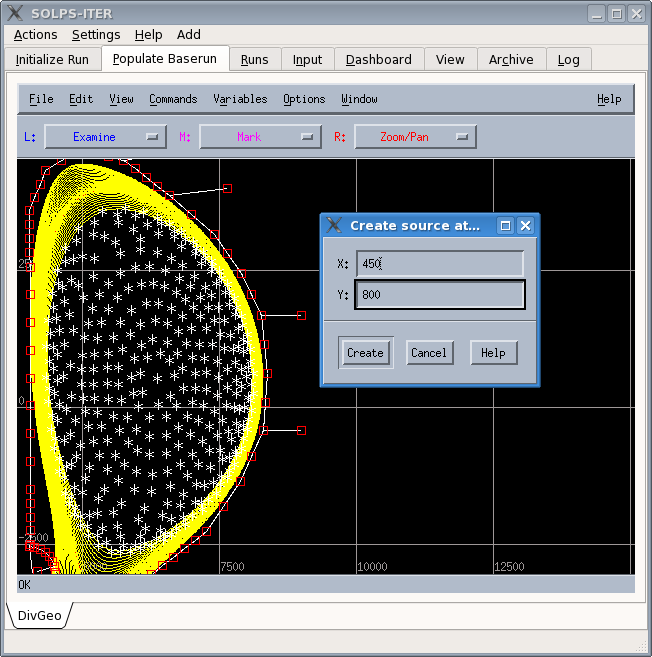

Defining plot zones
-------------------

The plot zones are a set of walls on which the power load, including the
contrabutions from the plasma particles, Eirene neutrals and radiation can be
computed by b2plot. That can be done with
:menuselection:`Variables --> Add --> Plot zone`
:kbd:`CTRL+U` and mark the set of elements that you want to include in
the plot zone. :kbd:`CTRL+U` mark the `“Starting element”`. which is the
first element of the plot zone set.

Give the zone a label, because this zones will be used in the files created by
b2plot.

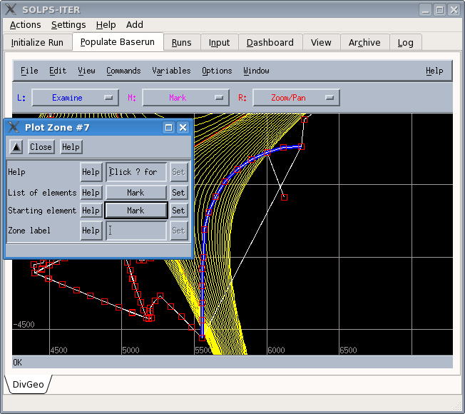

Setting the structure that are used by B2plot
---------------------------------------------

Defining the wall surfaces also defines the wall specification in B2plot, that
can be done by
:menuselection:`Variables --> Add --> Input to b2plot`
Mark all elements which are specifaing the b2plot and click `SET`.

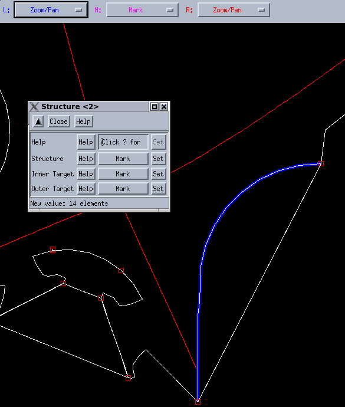

Setting the shadowing structure
-------------------------------

The shadowing structure is the set of physical wall elements that can receive
light from the plasma (or its reflections). It is used to compute the
radiative contribution to the wall heat loads.
:menuselection:`Variables --> Add --> Shadowing structure` :kbd:`CTRL+U`

Mark all the segments likely to receive light from the plasma. The shadowing
structure must be continuous and closed.

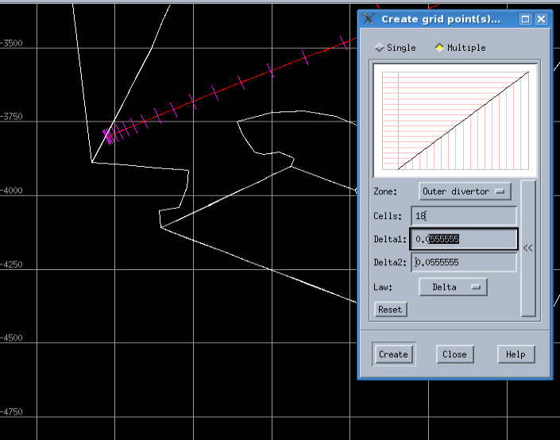

Setting the gas puffing
-----------------------

It is very important to set the parameters of how much the gas is puffing
into the SOL. For this reason DG has a special option to do that. The gas
puffing parameters can be define by
:menuselection:`Variables --> Add --> Gas puff`

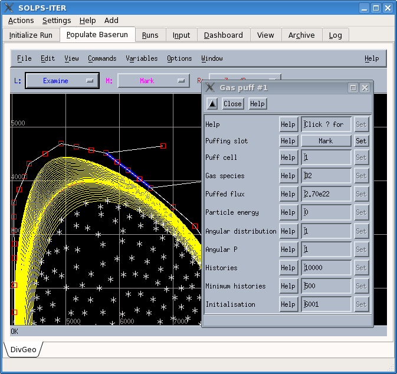

First you need to mark an set the puffing slot from where the gas will enter
into the system. Then all other specifications. For gas specious you select
what kind of gas is puffing, in this case is D2. Then the puffing flux for
this case is 2.7e22.

PRF surface group pump
----------------------

For PFR edge is only set based on where the radial boundary of the grid
will be, as determined by intersection with the divertor knee. You can
definite the PRF surface group pump with choosing the
:menuselection:`Variables --> Add --> PFR surface group` and then choosing
which part you will mark: the pump part

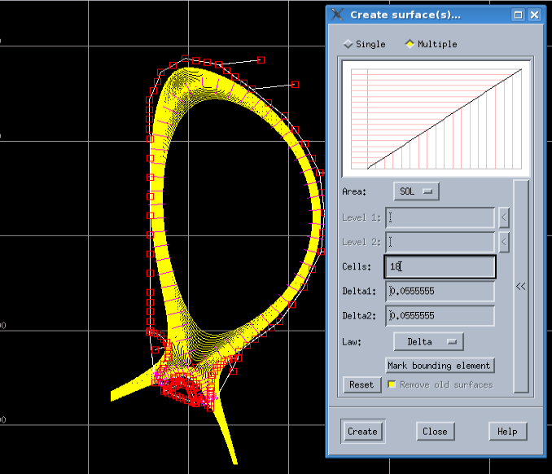

The part of the inner divertor

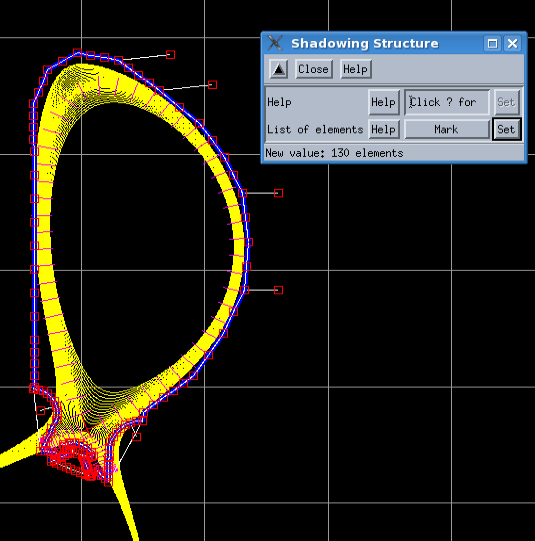

The part of the outer divertor

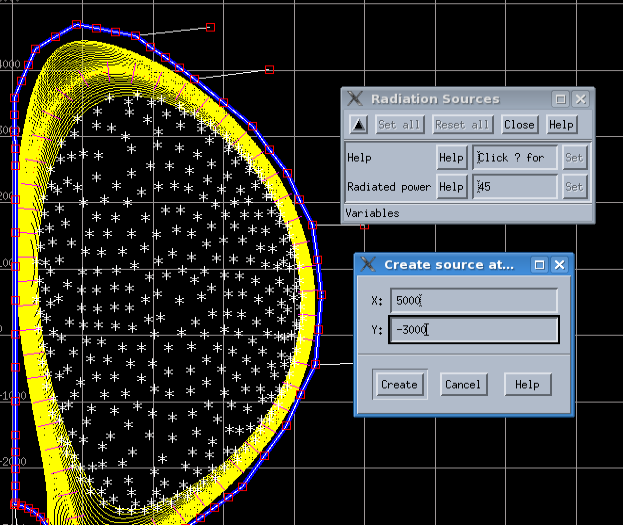

EIRENE setup of the "void” regions outside the Carre grid
---------------------------------------------------------

EIRENE will use a triangle grid in regions that are outside the fluid grid,
and this variable defines the zones for the triangle mesh generator.

Mark all of the main chamber elements, including the "SOL edge” segments for
the targets. :menuselection:`Variables --> Add --> TRIA-EIRENE parameters`

Set index to -1 in the dialogue box, and :kbd:`"General Triangle size”`
to 10.0, which will generate large triangles. The negative index indicates
that a mesh should be generated inside the marked region, and a positive
value means the opposite.

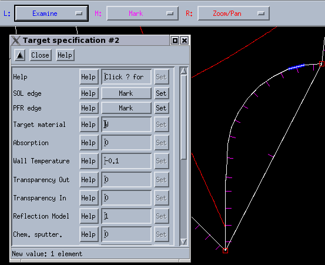

With :kbd:`CTRL+U` mark the the wall segments in the PFR, including the `"PFR
edge”` elements. Set index to -2 in the dialogue box, and `"General Triangle
size”` to 10.0.

Global B2 data
--------------

In the global B2 data you can set some power parameters as the electron and
ion power, and also the power fraction inboard and the time dependent strtum.
:menuselection:`Variables --> Add --> Global B2 data`
For the electron and ion power for this case you need to set it on 50. For
the power fraction inboard 0.25

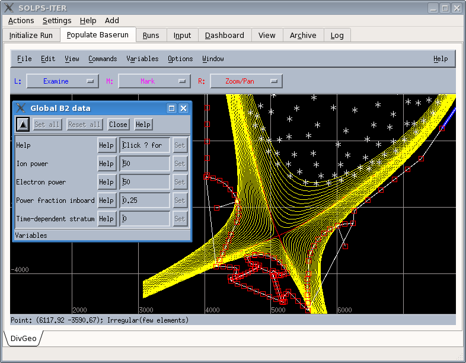

Configuring the plasma species to be included in the simulations
----------------------------------------------------------------

It is very important to definite plasma species which are included in the
simulations. That you do it by: :menuselection:`Variables --> Plasma
species D` . Also you can add it the impurity species
:menuselection:`Variables --> Add --> Plasma species`

DG recognizes a few "generic” species: H, D, T, He, Be, C, N, Ne, and Ar,
for which a full consistent default set of reactions will be provided by
Uinp. For all other elements, Uinp will look for the corresponding ADAS
ionization and recombination rates, and, if present in your database, will
include them as part of your model.

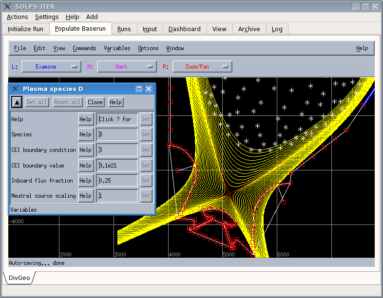

Local refinement of the EIRENE triangle grid
--------------------------------------------
With DG it’s possible to increase the spatial resolution on sub-regions of the
triangle mesh, i.e. the PFR. This can be done by
:menuselection:`Variables --> Add --> Mesh Refinement Zones`

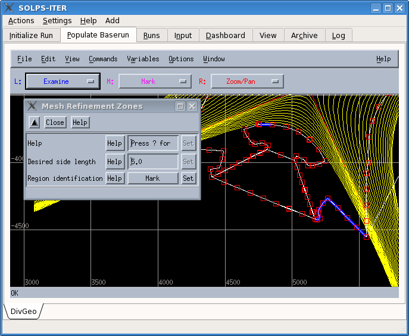

Select wall elements that bound the region of interest (left-right,
top-bottom), as shown on the right, and click `"Set”` for `"Region
identification”`. Set `"Desired side length”` to the desired characteristic
scale size of the triangles in this region.

Creating the grid points
------------------------

The poloidal distribution of cells on the Carre grid are set by the
`"poloidal grid points”` in DG.  These are defined separately for the
divertor legs and the SOL. :menuselection:`Edit --> Create --> Grid points`.
Set the Zone to Inner divertor and Cells to 18. The distribution of the cells
can be adjusted by left-clicking and dragging the black line on the plot.
Then click Create to update the workspace. Repeat for the outer divertor. Set
48 points in the SOL, with a roughly uniform distribution of points. The
spacing of the grid points around the x-point should be symmetric.

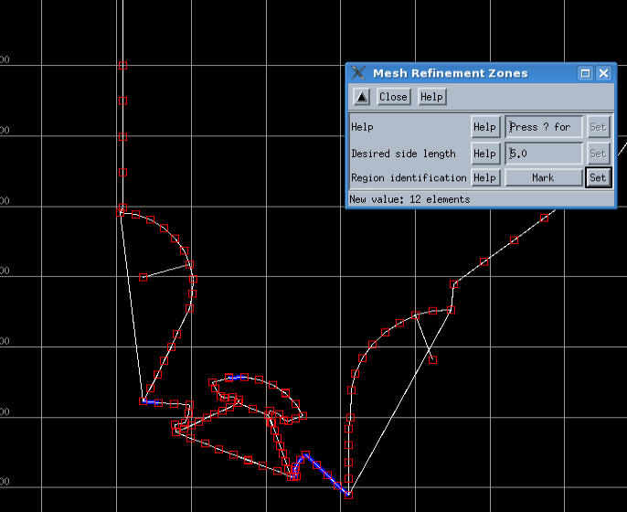
