.. highlight:: csh

.. ualedgeplugin_:

=================================
Using ParaView ReadUALEdge plugin
=================================

This tutorial covers the basic instructions about running and using
ParaView application [1]_ and how to run and use ReadUALEdge
ParaView plugin on g04.efda-itm.

Introduction to ParaView
-------------------------

ParaView is an open-source, multi-platform application used to visualize
data sets. Here we won't cover the installation process as the all needed
informations including setup guide, tutorials etc. can be found on ParaView
wiki page http://www.paraview.org/Wiki/ParaView and in ParaView Guide
found on http://www.paraview.org/paraview-guide/.

The use of some useful ParaView tools will be covered in ReadUALEdge
plugin chapter.

ParaView ReadUALEdge plugin
---------------------------

ParaView ReadUALEdge plugin is a tool used to visualize and analyze data,
obtained by fusion simulations (electron temperature/density, ion
temperature/density) stored in CPO and/or IDS database.

Here we'll demonstrate how to launch and use the ReadUALEdge plugin using
two different IDS databases, first being shot: ``16151; run: 1000`` [2]_
and  ``shot: 1; run: 1`` [3]_

.. [1] During the time of writing this  tutorial ParaView version 5.1.0
       was used.
.. [2] ``user: kosl; tokamak: aug; version: 4.10a``.
.. [3] ``user: kosl; tokamak: aug; version: 4.10a``. IDS database for
       now doesn't take in those three parameters as the CPO database does.

Note that because we are using IDS database, the following modules
must be loaded using terminal commands::

% module use -a ~dkaljun/imas/etc/modulefiles
% module load imas/develop/3/ual/develop

Additional commands to check available modules etc.::

% module avail imas
% module display imas/develop/3/ual/develop

Loading the plugin
------------------

After launching the ParaView application the start window appears.

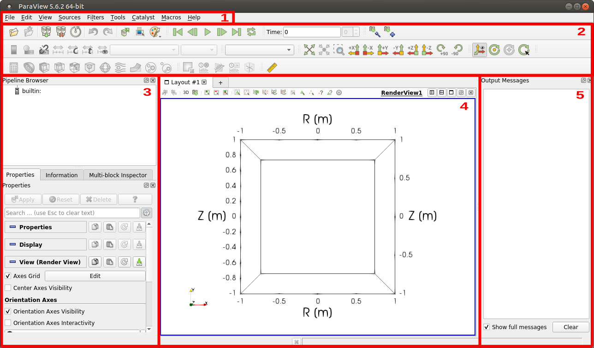

   ParaView start window.

The main parts are:

 1. Menu bar
 2. Toolbar
 3. Pipeline Browser
 4. View Browser

Loading and running the ReadUALEdge plugin is done in the next few steps:

1. Open the *Plugin Manager* by navigating from Menu Bar to
   :menuselection:`Tools --> Manage Plugins`

   .. figure:: images/2_manage_plugins.png
      :align: center
      :alt: Navigating to the Plugin Manager

      Navigating to the Plugin Manager

2. In Plugin Manager press the :guilabel:`Load Now` button.

  .. figure:: images/3_plugin_manager1.png
     :alt: Plugin Manager window

     Plugin Manager window

3. Navigate to and select the plugin library file then press :guilabel:`OK`

  .. figure:: images/4_plugin_manager2.png
     :alt: Navigating and selecting plugin library file

     Navigating and selecting plugin library file

4. Now the plugin should be already loaded. If it’s not, highlight
   the plugins name in Plugin Manager and press :guilabel:`Load
   Selected` button.  Optionally by checking the :guilabel:`Auto
   Load` option the plugin will be automatically loaded whenever the
   ParaView application is launched

  .. figure:: images/5_plugin_manager3.png
     :alt: Loading the ReadUALEdge plugin

     Loading the ReadUALEdge plugin

5. Run the plugin by navigating from Menu Bar to
   :menuselection:`Sources --> UAL Edge` (see
   :num:`Fig. #pv-run-plugin-1`). The Pipeline Browser will change and
   after choosing the desired database parameters press button
   :guilabel:`Apply` (see :num:`Fig. #pv-run-plugin-2`). The database
   will be loaded and visualized on the View Browser as seen in
   :num:`Fig. #pv-run-plugin-3` for AUG tokamak and in
   :num:`Fig. #pv-run-plugin-4` for ITER tokamak.

  .. _pv-run-plugin-1:
  .. figure:: images/6_running_plugin.png
     :alt: Running the ReadUALEdge plugin

     Running the ReadUALEdge plugin

  .. _pv-run-plugin-2:
  .. figure:: images/7_plugin_run1.png
     :alt: Applying the ReadUALEdge plugin database parameters

     Applying the ReadUALEdge plugin database parameters

  .. _pv-run-plugin-3:
  .. figure:: images/8_plugin_run2.png
     :alt: Example of visualized data gathered from tokamak ``Aug`` database

     Example of visualized data gathered from tokamak ``Aug``  database

  .. _pv-run-plugin-4:
  .. figure:: images/10_plugin_loaded3.png
     :alt: Example of visualizied data gathered from tokamak ``ITER`` database

     Example of visualizied data gathered from tokamak ``ITER`` database

.. note:: 
   Sometimes after opening Iter tokamak database **no** visual
   change in the ``View`` ``Browser`` can be seen, because of the
   default zoom. To solve that press twice the :guilabel:`Reset`
   button found in :guilabel:`Toolbar`.

Data analysis
-------------

In previous chapter we can notice that we have loaded data, but no
useful information could be seen, just the geometry of the tokamak using
a lot of colors. In this tutorial we’ll first explain what those multiple
color represent and then how to display full information we want.

Subgrids and Multi-Block Inspector
~~~~~~~~~~~~~~~~~~~~~~~~~~~~~~~~~~

Briefly said, subgrid is “a piece” of geometry. In our case, the
**Multi-Block Inspector** uses the subgrids as blocks of data, using a
different color for each block of data, as seen in Figures
:num:`Fig. #pv-run-plugin-3` and :num:`Fig. #pv-run-plugin-4`, and it
is used to select and display only the wanted blocks of data.

To load the Multi-Block Inspector, go to Menu bar
:menuselection:`View` and check the :menuselection:`Multi-Block
Inspector` selection, as seen in :num:`Fig. #pv-loading-mbinsp`. Then
you should have already noticed that a new interface called
*Multi-Block Inspector* opened at the bottom of the Pipeline Browser,
as seen in :num:`Fig. #pv-mbinsp`.

.. _pv-loading-mbinsp:
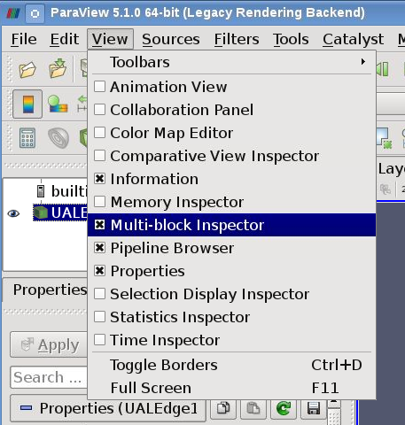

   Loading the Multi-Block Inspector

.. _pv-mbinsp:
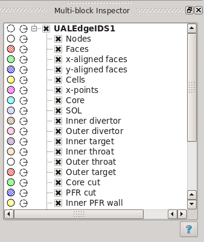

   Multi-Block Inspector

Here we can select the wanted blocks we want to be seen in the *View
Browser*. An example is shown in :num:`Fig. #pv-mbinscp-cells`, where
only the ``Cells`` block was selected, and in
:num:`Fig. #pv-mbinscp-nodes`, where only the ``Nodes`` block was
selected. We can also choose multiple blocks at once, as shown in
:num:`Fig. #pv-mbinspc-sol-odivertor` where blocks ``SOL`` and
``Outer`` ``Divertor`` were selected.

.. _pv-mbinscp-cells:
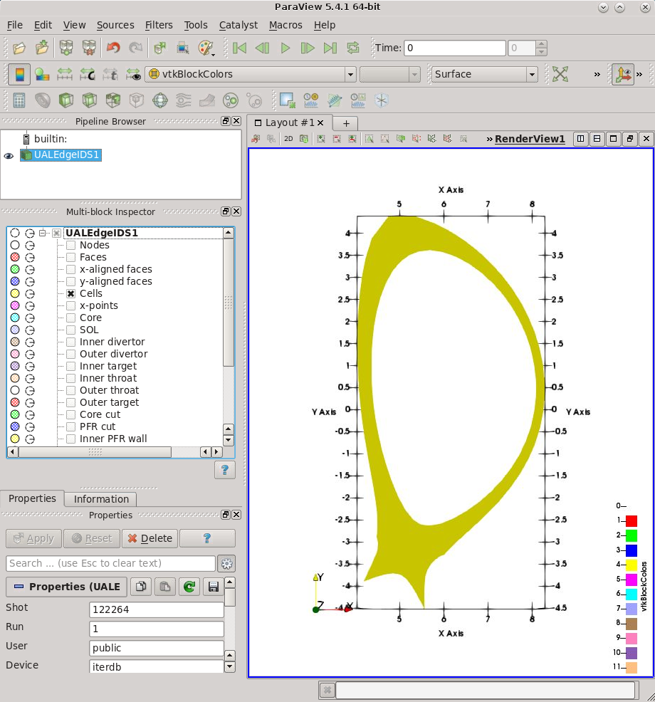

   Displaying Cells block using Multi-Block Inspector

.. _pv-mbinscp-nodes:
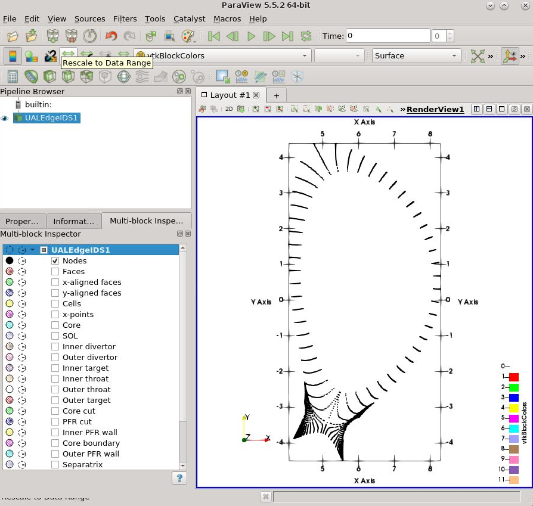

   Displaying Nodes block using Multi-Block Inspector

.. _pv-mbinspc-sol-odivertor:
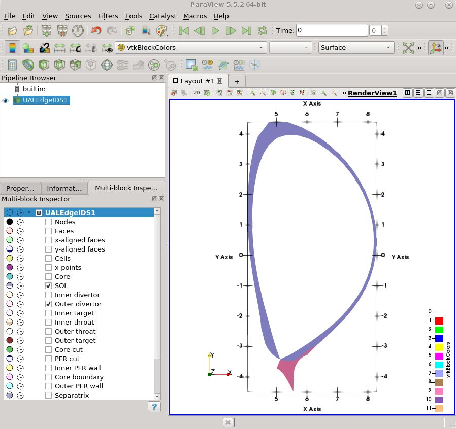

   Displaying SOL and Outer Divertor blocks using Multi-Block Inspector

Data arrays
~~~~~~~~~~~

Data arrays are holding data such as *electron density/temperature* and
*ion density/temperature* values, which are used to color the blocks.
When running the ReadUALedge plugin with the *Multi-Block Inspector* the
*vtkBlockColors* layer is automatically selected, coloring the blocks
with their specific block color. To select the wanted data layer
navigate through **List of Data Arrays** found in Toolbar, as seen in
:num:`Fig. #pv-data-arrays-list`. Examples are shown in Figures
:num:`Fig. #pv-data-arrays-list-ne`, :num:`Fig. #pv-data-arrays-list-te` and
:num:`Fig. #pv-data-arrays-list-te-core-sol`.

.. _pv-data-arrays-list:
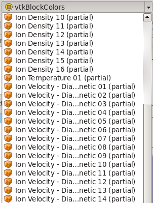

   List of data arrays

.. _pv-data-arrays-list-ne:
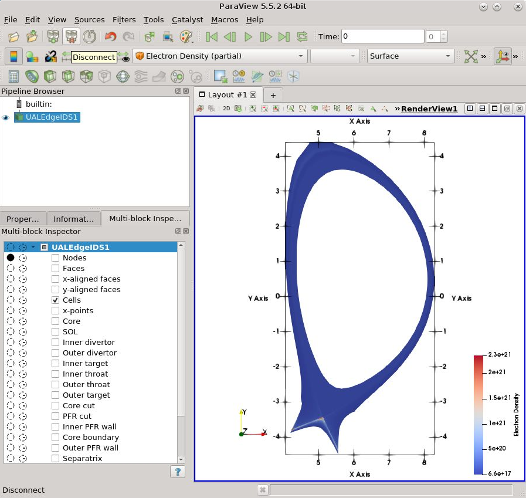

   Data layer Electron Density using Cell block

.. _pv-data-arrays-list-te:
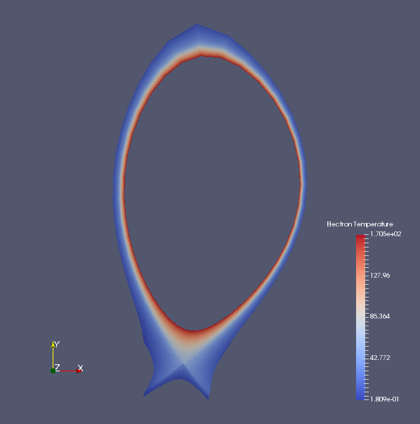

   Data layer Electron Temperature using Cell block

.. _pv-data-arrays-list-te-core-sol:
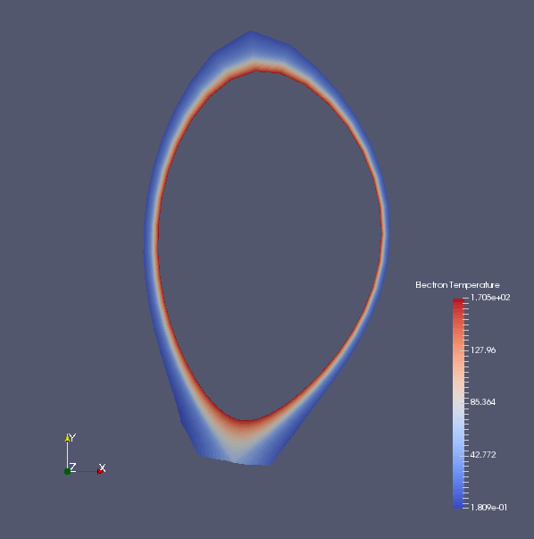

   Data layer Electron Temperature using Core and SOL block

Other useful ParaView tools
---------------------------

Python Calculator filter
~~~~~~~~~~~~~~~~~~~~~~~~

Python Calculator filter allows us to work with data arrays (Electron
Density, Ion Temperature etc.) and create new data array to display
the results. It can be found under :menuselection:`Filter -->
Alphabetical --> Python` ``Calculator`` as seen in
:num:`Fig. #pv-python-calculator1` and
:num:`Fig. #pv-python-calculator2`.

.. _pv-python-calculator1:
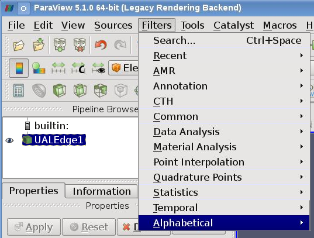

   Selecting Filters Alphabetical

.. _pv-python-calculator2:
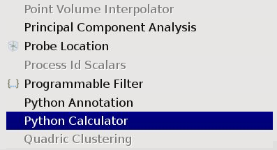

   Python calculator filter

After selecting the Python Calculator a new interface will open in the
Pipeline Browser as seen in :num:`Fig. #pv-python-calculator3`.

.. _pv-python-calculator3:
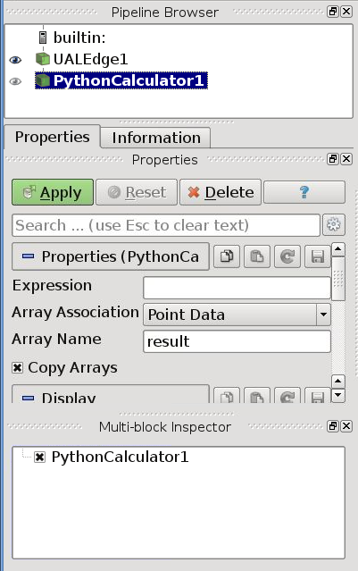

   Python Calculator start in Pipeline Browser

This filter takes a case sensitive *Expression*, an *Array Association*
and custom *Array Name*. An example is shown in 
:num:`Fig. #pv-python-calculator4`, where we used next expression and
options:

-  | Expression:
   | ``inputs[0].CellData[’Ion Density 1’]+inputs[0].CellData[’Ion Density 2’]``

-  | Array Association: Cell Data

-  | Array Name: Custom Array Name

-  Press :guilabel:`Apply` button

.. _pv-python-calculator4:
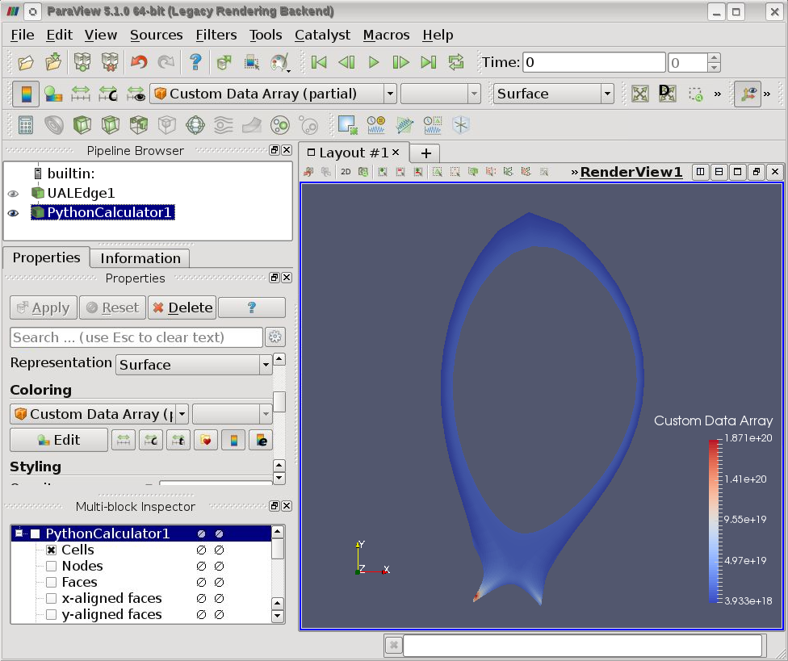

   Sum of Ion Density arrays scalars as Custom Data Array

In this case the Python Calculator created a sum of *Ion Density 1* and
*Ion Density 2* data arrays and created new data array called *Custom
Array Name*, which can be chosen from the Data Array list and analyzed.

.. note::

   #1: If we have a long list od data layers and want to create sum of
   all of them the expression can be very long. Typing it manually can be
   frustrating, so it’s advisable to use a short self written script to
   generate the expression. ParaView includes also its own Python Shell.
   The use of Python Shell in Paraview and example of script to generate
   the expression is explained and shown in *ParaView Python Shell*
   section.

   #2: After the Python Calculator was ran and until applying the
   setting in Pipeline Browser there will be one block shown in Multi-Block
   Inspector, if activated, with the name ``PythonCalculator1``. If we
   deselect this block, the ParaView might crash and it may also cause the
   ReadUALEdge plugin to fully unload, in which case it must be again
   manually loaded using Plugin Manager. After pressing the :guilabel:`Apply`
   button the Multi-Block Inspector works normally.

More Python Calculator functions and operations can be found on web page
http://www.itk.org/Wiki/index.php?title=ParaView/Users_Guide/Python_Calculator\&oldid=46066 and in ParaView guide under Chapter 5.8.2.

ParaView Python Shell
~~~~~~~~~~~~~~~~~~~~~

ParaView Python Shell can be found navigating to :menuselection:`Tools
--> Python Shell` and it opens Paraview editor as shown in
:num:`Fig. #pv-python-shell` and :num:`Fig. #pv-python-shell2`.

.. _pv-python-shell:
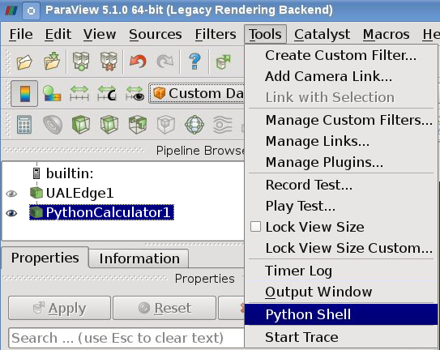

   Navigating to ParaView Shell

.. _pv-python-shell2:
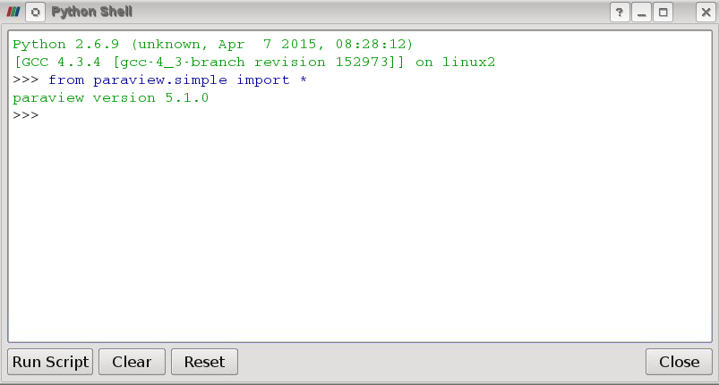

   ParaView Python Shell window

Here we’ll show an example solving the issue with quite long Python
Calculator Expressions. The IDS database ``Shot:1; Run:1; User: kosl;
Tokamak: iter`` has almost 100 Ion Density data arrays, so very long
expression is needed to create a sum of all of them, but because inside
the expression the functions are being repeated we can easily generate
it using Python Shell.

The Python script and part of its output is shown in
:num:`Fig. #pv-python-shell3`.

.. _pv-python-shell3:
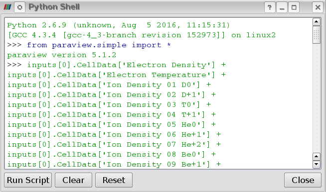

   Python Shell code and output

The results of using the mentioned IDS database and the generated
expression by copying it are shown in
:num:`Fig. #pv-python-calculator5`.

.. _pv-python-calculator5:
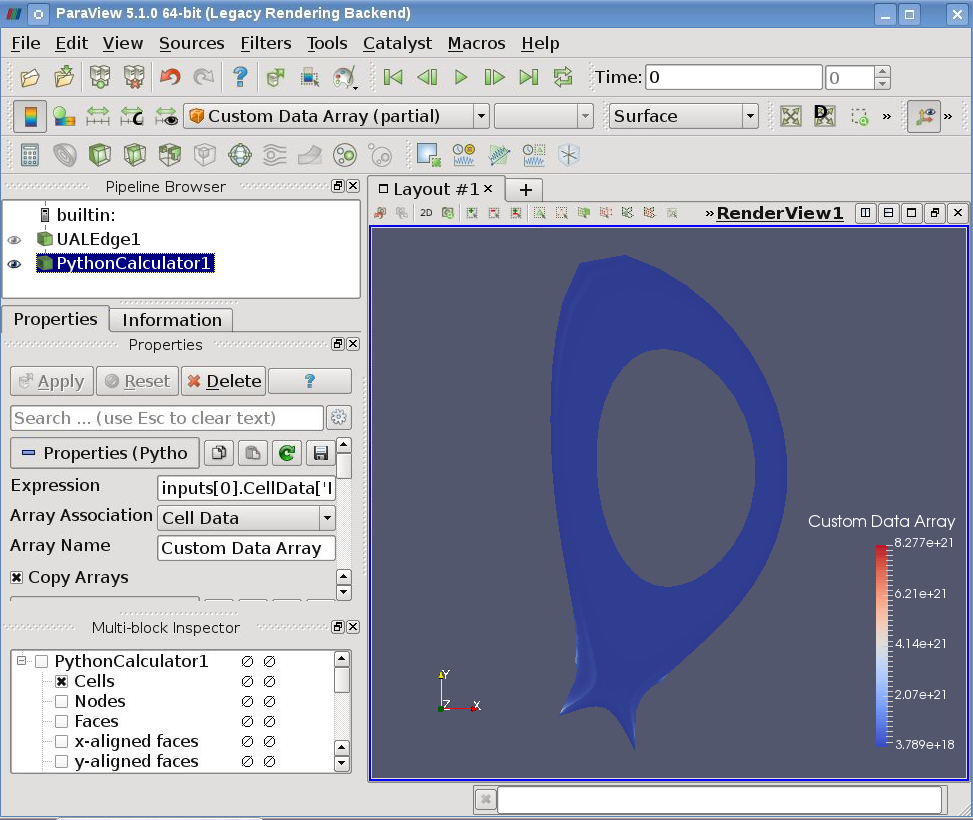

   IDS ITER tokamak and Custom Data Array as sum of all Ion Density
   arrays scalars

Plot Over Line filter
~~~~~~~~~~~~~~~~~~~~~

Plot Over Line filter is a flexible tool, used to create a chart such as
temperature change through the wall.

The start and end location of the plotted data is user selected, and the
plot values are taken from available Data Arrays and also from
coordinates of previously mentioned start and end location.

It can be found at the same location as any other filter, navigating to
:menuselection:`Filters --> Alphabetical --> Plot Over Line`, as seen in
:num:`Fig. #pv-pov1`. When selected, two by line connected white dots,
representing the start and end location taken for the plot, will appear
on the *View Browser*, as seen in :num:`Fig. #pv-pov2`, which can be
moved by clicking and dragging with the mouse pointer. When done, press
the :guilabel:`Apply` button.

.. _pv-pov1:
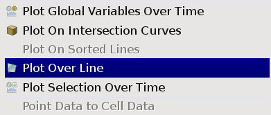

   Navigating to Plot Over Line filter

.. _pv-pov2:
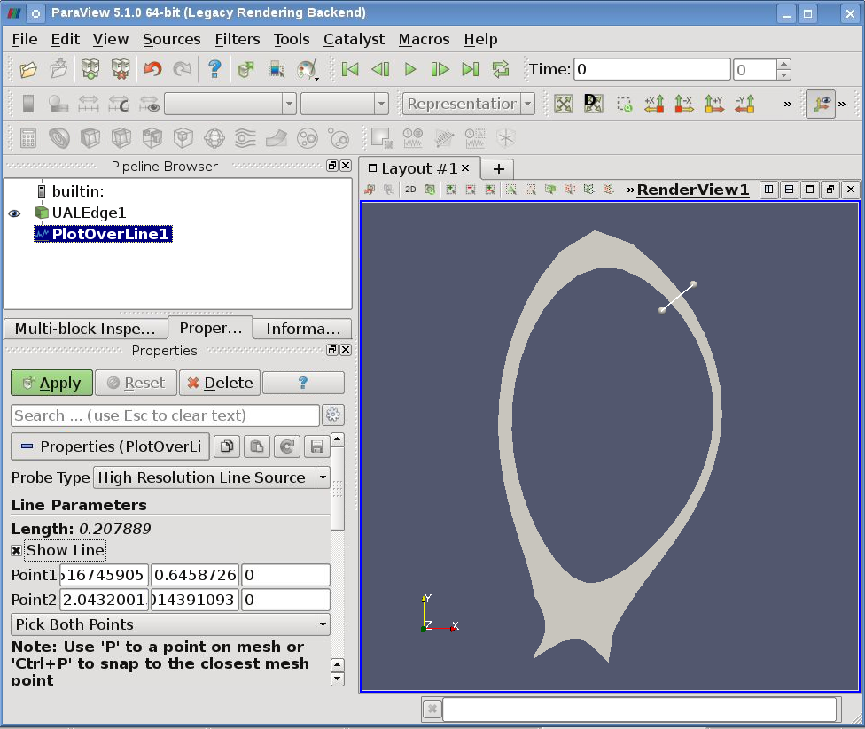

   Selecting end and start location for the plot

By pressing the :guilabel:`Apply` button a new interface will appear in the
*Pipeline Browser* and also the default chart will appear on the *View
Browser*, as seen in :num:`Fig. #pv-pov3`.

.. _pv-pov3:
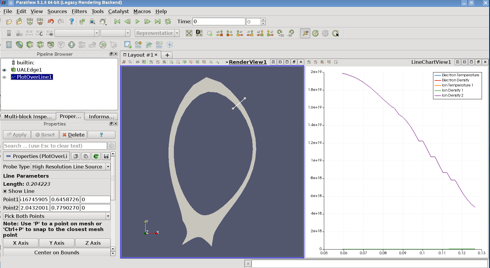

   Chart example

You can notice, that all the Data Arrays are being shown in the chart
and also making some of them unclear because of the used value range.
Note also that by default the X-axis is following the direction and
length of the previously for the plot selected start and end point.

There are many different settings to get the desired chart view, here a
few of them will be shown.

The simplest one is by clicking the left mouse button on the chart and
by dragging the line by mouse.

To display only the selected Data Array data, in the new *Pipeline
Browser* interface scroll down to **Series Parameters** and there the
desired Data Arrays (and also showing coordinate changes from start to
end point) can be chosen, as seen in :num:`Fig. #pv-pov4`. The range will
automatically adjust to selected plot values.

Chart line colors can be changed double clicking the colored square icon
in the *Series Parameters* and **Choose Series Color** window will
appear.

.. _pv-pov4:
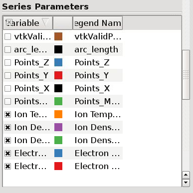

   Data Array scalars selection

The axis range settings can be found furthermore in the *Pipeline
Browser* as **Left Axis Range** and **Bottom Axis Range**.

.. _pv-pov5:
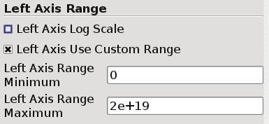

   Axis range customization

To create more Line Charts for the same case click one of the window
splitting tools found in the top right corner of the *View Browser* such
as **Split vertical** as seen in :num:`Fig. #pv-pov6`. It will open a new
separated window and there click **Line Chart View**, as shown in
:num:`Fig. #pv-pov7`, and new Line Chart will be created, as seen in
:num:`Fig. #pv-pov8`.

.. _pv-pov6:
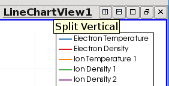

   View Browser Split Vertical

.. _pv-pov7:
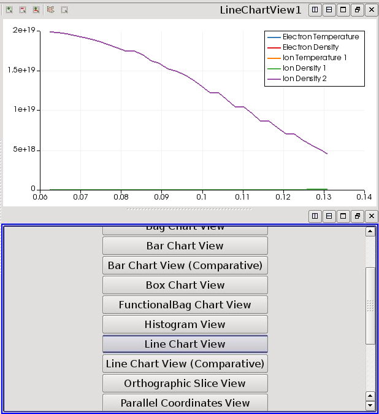

   Creating Line Chart View

.. _pv-pov8:
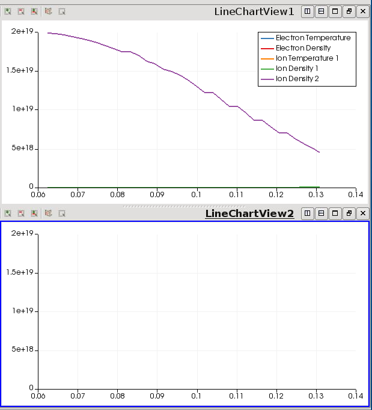

   New Line chart created

Then, while the created empty *Line Chart* is selected, in the *Pipeline
Browser* click on the eye icon beside the *TextOverLine* filter name,
which should be transparent by default, as seen in :num:`Fig. #pv-pov9`.
The by default selected Data Arrays should appear in the *Line Chart*.

.. _pv-pov9:
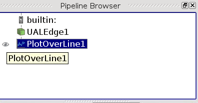

   Hide/Show indicator

From there we can work with the chart normally and chose wanted Data
Arrays in the *Series Parameters* under *Pipeline Browser* as before.
Just note that the *Text Chart* we want to change must first be selected
in the *View Browser* before we can operate with it.

An example of using multiple Line Charts is shown in
:num:`Fig. #pv-pov10`.

.. _pv-pov10:
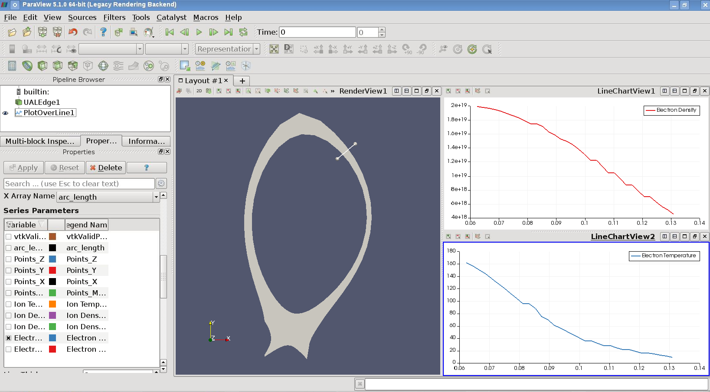

   Example of ordered Line Charts

