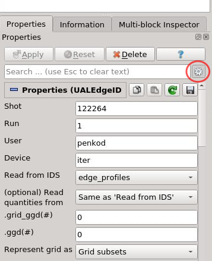
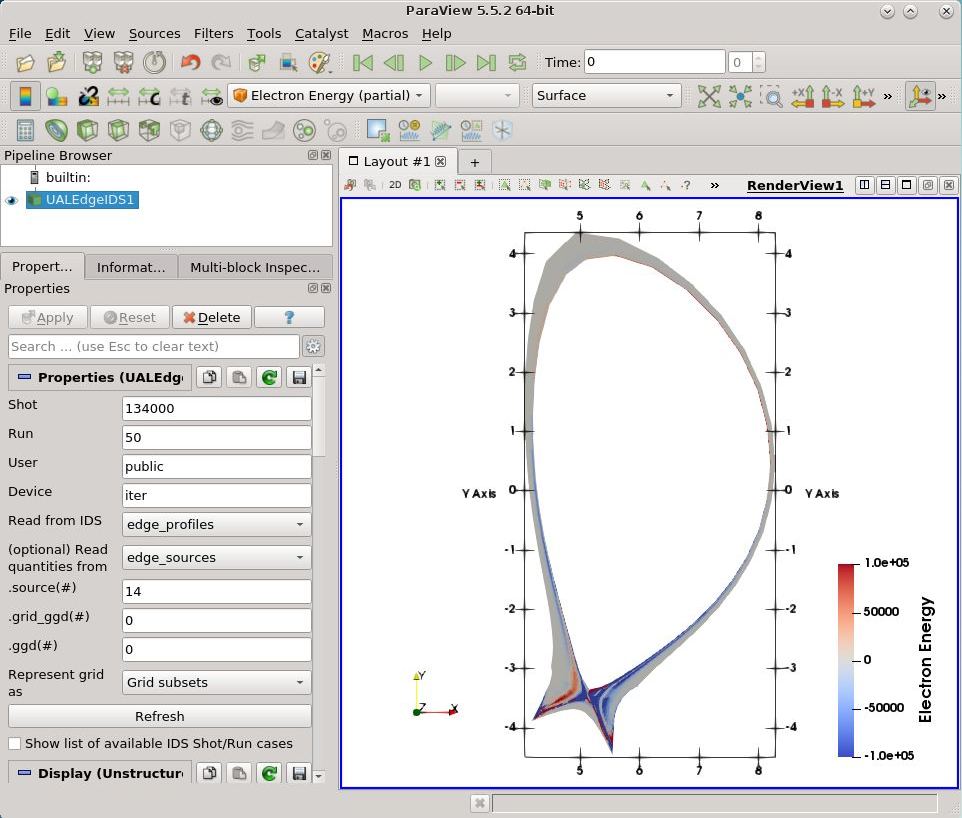
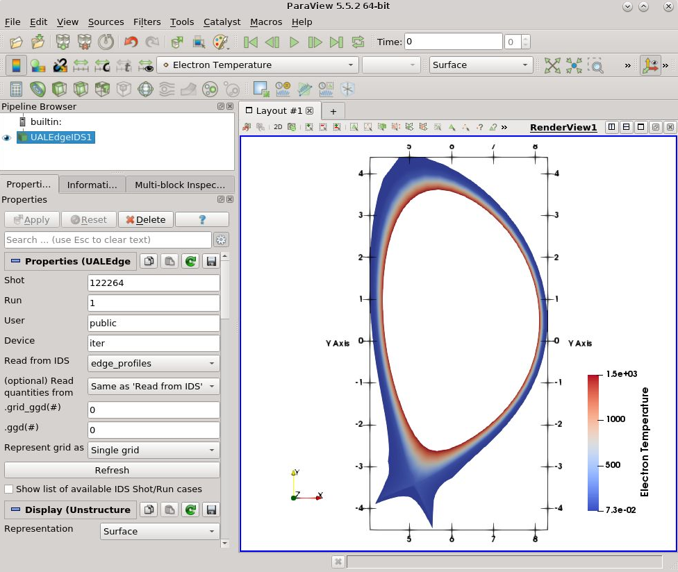
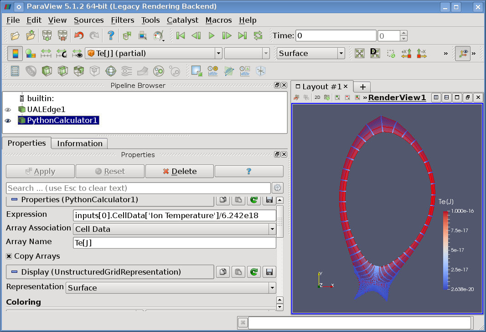

.. highlight:: csh

.. ualedgeplugin_:

=================================
Using ParaView ReadUALEdge plugin
=================================

:Author: Dejan Penko, University of Ljubljana

This tutorial covers the basic instructions about running and using
ParaView application [1]_ and how to run and use ReadUALEdge
ParaView plugin on **ITER hpc-login02.iter.org login node**.

Introduction to ParaView
-------------------------

ParaView is an open-source, multi-platform application used to visualize
data sets. More on ParaView is available on
`ParaView wiki page <http://www.paraview.org/Wiki/ParaView/>`_ and
`ParaView Guide <http://www.paraview.org/paraview-guide/>`_. By default,
SOLPS-GUI comes with its own ParaView installation procedure however the plugin
can be used also with other installations of ParaView.

In this section also a few convenient ParaView tools will be covered.

ParaView ReadUALEdge plugin
---------------------------

**ParaView ReadUALEdge plugin** is a tool used to visualize and analyze plasma
state, obtained by fusion simulation codes such as SOLPS-ITER and JINTRAC
(also JOREK is supported) and stored to Interface Data Structures, a data
hierarchy structure format and a successor to CPOs, used by IMAS. The list of
currently supported IDSs:

- Edge Profiles
- Edge Transport
- Edge Sources
- MHD

In this tutorial an example of the ReadUALEdge plugin usage will be demonstrated
using IDS (available on ITER HPC) with the next parameters:

- shot: **122264**
- run: **1**
- user: **public**
- device: **iter**

.. [1] During the time of writing this tutorial the next ParaView versions were
       used: **ParaView version 5.5.2** on ITER HPC and
       **ParaView version 5.6.2** (local installation).

Using ParaView and plugin on ITER HPC cluster
~~~~~~~~~~~~~~~~~~~~~~~~~~~~~~~~~~~~~~~~~~~~~

**ParaView 5.5.2** is already available on **ITER HPC cluster** as a module and
it can be used for loading the plugin.
To set the environment use the following commands:

.. code-block:: console

   module purge
   module load IMAS/3.26.0-4.5.0
   module load ParaView/5.5.2-intel-2018a-Python-3.6.4-mpi
   paraview

or use, while in SOLPS-GUI root directory:

.. code-block:: console

   ./run-paraview.sh

.. Note::

   This modules were last checked on 20.2.2020. With time new modules might be
   introduced and the old ones **removed** (!).

Additional commands to check available modules:

.. code-block:: console

   module avail IMAS
   module avail imas # listing older IMAS versions

A ParaView opening window will appear. For instructions on how to load and use
the plugin continue to subsection :ref:`loading_plugin`

Development use of ParaView
~~~~~~~~~~~~~~~~~~~~~~~~~~~

For *standalone* use on cluster when having compiled your own ParaView provided
by SOLPS-GUI then use the commands:

.. code-block:: console

   # source setupenv.sh
   module use ~/solps-gui/modules
   module load paraview-plugin-edge/1.5
   paraview

The plugin then should be already loaded in ParaView, otherwise it can be
loaded manually.

.. _loading_plugin:

Loading the plugin
------------------

When launching the ParaView application first the startup window should appear.

The main parts are:

 1. Menu bar
 2. Toolbar
 3. Pipeline Browser
 4. View Browser
 5. Output messages

.. figure:: images/1_start_window_marked.png
   :align: center
   :alt: ParaView start window

   ParaView startup window. Note: the `R` and `Z` marks are not provided
   default by ParaView. They have to be manually set in settings.

Loading and running the ReadUALEdge plugin is done in the next few steps:

1. Open the *Plugin Manager* by navigating from :guilabel:`Menu Bar` to
   :guilabel:`Tools` -> :guilabel:`Manage Plugins`.

   .. figure:: images/2_manage_plugins.png
      :align: center
      :alt: Navigating to the Plugin Manager

      Navigating to the Plugin Manager

2. In Plugin Manager press the :guilabel:`Load Now` button.

  .. figure:: images/3_plugin_manager1.png
     :alt: Plugin Manager window

     Plugin Manager window

3. Navigate to and select the plugin library file ``libReadUALEdge.so``
   available in
   ``/home/ITER/penkod/public/ParaView-plugin-ReadUALEdge/imas/3.26.0``
   directory. Press :guilabel:`OK` button.

  .. figure:: images/4_plugin_manager2.png
     :alt: Navigating and selecting plugin library file

     Navigating and selecting plugin library file

4. Now the plugin should be already loaded. If it's not, highlight
   the plugins name in Plugin Manager and press :guilabel:`Load
   Selected` button.  Optionally by checking the :guilabel:`Auto
   Load` option the plugin will be automatically loaded whenever the
   ParaView application is launched

  .. figure:: images/5_plugin_manager3.png
     :alt: Loading the ReadUALEdge plugin

     Loading the ReadUALEdge plugin

5. Run the plugin by navigating from :guilabel:`Menu Bar` to
   :guilabel:`Sources` -> :guilabel:`IMAS` -> :guilabel:`UAL Edge IDS` (see
   :numref:`pv-run-plugin-1`). The Pipeline Browser will change and
   after choosing the desired database parameters press button
   :guilabel:`Apply` (see :numref:`pv-run-plugin-2`). The database
   will be loaded and visualized on the View Browser as seen in
   :numref:`pv-run-plugin-3` for ITER tokamak device.

  .. _pv-run-plugin-1:

  .. figure:: images/6_running_plugin.png
     :alt: Running the ReadUALEdge plugin

     Running the ReadUALEdge plugin

  .. _pv-run-plugin-2:

  .. figure:: images/7_plugin_run1.png
     :width: 100%
     :alt: Applying the ReadUALEdge plugin IDS database parameters

     Applying the ReadUALEdge plugin database parameters

  .. _pv-run-plugin-3:

  .. figure:: images/8_plugin_run2.png
     :width: 100%
     :alt: Example of visualized data gathered from public ``iter`` database

     Example of visualized data gathered from public ``iter``  database

.. Note::
   One plugin instance should be run only once. If another IDS is to be read
   re-run / open a new instance of the plugin. Using the same plugin instance
   all the time might result in a plugin failure.

.. Note::

   Sometimes after pressing the :guilabel:`Apply` button there might be
   **no** visual change in the ``View`` ``Browser`` due to the
   default zoom settings. To solve that press twice the :guilabel:`Reset`
   button found in :guilabel:`Toolbar`.

Data analysis
-------------

In the previous section it could be noticed that the contents of the IDS were
loaded, but a mix-up of different colors could be seen
(as in Figure :numref:`pv-run-plugin-3`), displaying only the the geometry of
the tokamak. Here it will be explained what those multiple colors represent and
then how to display only the wanted segment of the full available data.

Grid subsets and Multi-Block Inspector
~~~~~~~~~~~~~~~~~~~~~~~~~~~~~~~~~~~~~~

Briefly said, **grid subset** is a segment of the full **grid geometry**
description which occur in codes such as **SOLPS-ITER** and **JINTRAC EDGE2D**.
In our case,
the **Multi-Block Inspector** uses the grid subsets as **blocks of data**,
displaying them in **different colors** with one color per block of data
as seen in Figure :numref:`pv-run-plugin-3`, and it
is used to select and display only a selection of the available blocks.

To load the :guilabel:`Multi-Block Inspector`, go to :guilabel:`Menu bar`
-> :guilabel:`View` and check the :guilabel:`Multi-Block Inspector`
selection, as seen in :numref:`pv-loading-mbinsp`. Then
you should have already noticed that a new interface called
**Multi-Block Inspector** tab opened at the bottom of the
:guilabel:`Pipeline Browser`, as seen in :numref:`pv-mbinsp`.

.. _pv-loading-mbinsp:
.. figure:: images/11_loading_mbinsp.png

   Loading the Multi-Block Inspector

.. _pv-mbinsp:
.. figure:: images/12_mbinsp.png

   Multi-Block Inspector

Here any blocks can be selected or deselected and instant block selection change
can be observed in the :guilabel:`View Browser`.
An example is shown in :numref:`pv-mbinscp-cells`, where
only the ``Cells`` block was selected, and in
:numref:`pv-mbinscp-nodes`, where only the ``Nodes`` block was
selected. We can also choose multiple blocks at once, as shown in
:numref:`pv-mbinspc-sol-odivertor` where blocks ``SOL`` and
``Outer`` ``Divertor`` were selected.

.. _pv-mbinscp-cells:
.. figure:: images/13_mbinsp_cells.png
   :alt: Displaying Cells block using Multi-Block Inspector
   :width: 80%

   Displaying Cells block using Multi-Block Inspector

.. _pv-mbinscp-nodes:
.. figure:: images/14_mbinsp_nodes.png
   :alt: Displaying Nodes block using Multi-Block Inspector
   :width: 80%

   Displaying Nodes block using Multi-Block Inspector

.. _pv-mbinspc-sol-odivertor:
.. figure:: images/15_mbinsp_sol-odivertor.png
   :alt: Displaying SOL and Outer Divertor blocks using Multi-Block Inspector
   :width: 80%

   Displaying SOL and Outer Divertor blocks using Multi-Block Inspector

Data arrays
~~~~~~~~~~~

Data arrays are representing **plasma state quantities**
such as *electron density/temperature* and
*ion density/temperature* values, which are used to allocate values to the
block elements (nodes, 2D cells etc.).
When running the **ReadUALedge plugin** the so-called
**vtkBlockColors** layer is automatically selected, coloring the blocks
with their specific block color. Selection of the wanted data layer can be done
by navigate through the **List of Data Arrays** found in :guilabel:`Toolbar`,
as seen in :numref:`pv-data-arrays-list`. Examples are shown in Figures
:numref:`pv-data-arrays-list-ne`, :numref:`pv-data-arrays-list-te` and
:numref:`pv-data-arrays-list-te-core-sol`.

.. _pv-data-arrays-list:
.. figure:: images/16_data_arrays_list.png
   :alt: List of available quantity arrays.

   List of quantity arrays

.. _pv-data-arrays-list-ne:

.. figure:: images/17_data_arrays_ne_full.png
   :width: 80%
   :alt: **Cells** grid subset (block) selection with corresponding
         **Electron Density** values.

   **Cells** grid subset (block) selection with corresponding
   **Electron Density** values.

.. _pv-data-arrays-list-te:

.. figure:: images/18_data_arrays_te.png
   :width: 45%
   :alt: **Cells** grid subset (block) selection with corresponding
         **Electron Temperature** values.

   **Cells** grid subset (block) selection with corresponding
   **Electron Temperature** values.

.. _pv-data-arrays-list-te-core-sol:

.. figure:: images/19_data_arrays_te_core_sol.png
   :width: 45%
   :alt: Core and SOL grid subset (block) selection with corresponding
         **Electron Temperature** values.

   **Core** and **SOL** grid subset (block) selection with corresponding
   **Electron Temperature** values.

Advanced options
~~~~~~~~~~~~~~~~

With further ReadUALEdge plugin development a few advanced options were
introduced, intended for reading data from different Edge IDS or from different
time slice (time slice index 0 is the default value).
The advanced options can be toggled by clicking the gear icon in
:guilabel:`Pipeline Browser` -> :guilabel:`Properties` tab -> **gear icon next
to the search box**.

An additional set of value boxes will be shown.

   Toggle advanced plugin options.

The options shown are:

- :guilabel:`Read from IDS`: A dropdown list of supported IDSs from which
  the **grid geometry** will be read.
- :guilabel:`(Optional) Read quantities from`: A dropdown list of supported
  IDSs from which the **plasma state quantities** will be read. Usually the
  same "IDS grid geometry source" is being used also for getting the
  corresponding quantities.
- :guilabel:`.grid_ggd(#)`: Represent a **GGD grid** geometry time slice index
  to be read.
- :guilabel:`.ggd(#)`: Represent a **GGD** time slice index to be read.
- :guilabel:`Represent grid as`: Option to represent grid as a set of:

  - :guilabel:`grid subsets` (intended for **SOLPS-ITER**; **JINTRAC EDGE2D**
    etc.), or
  - :guilabel:`a single grid` (intended for **JOREK** where grid subsets are
    not being used). For this option note that:

    - Reads only **quantites** corresponding to **points** (0D elements),
    - If the data in the IDS is well written it can be used also for cases
      that use grid subsets (as shown in Figure :numref:`SOLPS-ITER-single-grid`).

When selecting **edge_sources** IDS a next option will be shown:

 - :guilabel:`.source(#)`: **Edge Sources** source index.

When selecting **edge_transport** IDS a next option will be shown:

 - :guilabel:`.model(#)`: **Edge Transport** model index.

.. Note:: When selecting different combinations make sure that the data was
   stored properly following the IMAS **Data Dictionary** structure description!

.. Note:: More information on the available options is available by **hovering**
          over the widgets with the mouse cursor.

In below Figure :numref:`JINRAC-EDGE2D-example` an example using a combination
of advanced settings is being demonstrated.

.. _JINRAC-EDGE2D-example:

   Example of using advanced options with (IMAS 3.26.0)
   **Shot: 134000**; **Run: 50**;
   **User: public**; **Device: iter** (on ITER HPC). **Edge Profiles IDS** is
   being used as a source for the **grid geometry description** while the
   quantities are taken from **Edge Sources IDS - Source 14**
   (in Python notation).

.. _SOLPS-ITER-single-grid:

   Example of using :guilabel:`Represent grid as` -> :guilabel:`single grid`
   with (IMAS 3.26.0) **Shot: 122264**; **Run: 1**; **User: public**;
   **Device: iter** (on ITER HPC).

Other useful ParaView tools
---------------------------

.. note::
   The tutorial below was made with ParaView 5.1.0 and might be outdated.

.. _paraview-python-filter:

Python Calculator filter
~~~~~~~~~~~~~~~~~~~~~~~~

Python Calculator filter allows us to work with data arrays (Electron
Density, Ion Temperature etc.) and create new data array to display
the results. It can be found under :menuselection:`Filter -->
Alphabetical -->` ``Python Calculator`` as seen in
:numref:`pv-python-calculator1` and
:numref:`pv-python-calculator2`.

.. _pv-python-calculator1:
.. figure:: images/20_python_calculator1.png

   Selecting Filters Alphabetical

.. _pv-python-calculator2:
.. figure:: images/21_python_calculator2.png

   Python calculator filter

After selecting the Python Calculator a new interface will open in the
Pipeline Browser as seen in :numref:`pv-python-calculator3`.

.. _pv-python-calculator3:
.. figure:: images/22_python_calculator3.png
   :alt: Python Calculator start in Pipeline Browser

   Python Calculator start in Pipeline Browser

This filter takes a case sensitive *Expression*, an *Array Association*
and custom *Array Name*. An example is shown in
:numref:`pv-python-calculator6`, where convert
all values from data array ``Ion Temperature`` from *eV* to *joules*
(``Te[J] = Te[Ev]/6.242e18``)using Python Calculator
The expression and options are:

-  Expression: ``inputs[0].CellData['Ion Temperature']/6.242e18'``
-  Array Association: Cell Data
-  Array Name: Te[J]
-  Press :guilabel:`Apply` button

.. _pv-python-calculator6:

   Ion Temperature data array values converted from Joules to eV

In the next example we'll use Python Calculator to make a sum of
*Ion Density 01 D0* and *Ion Density 02 D+1* data arrays and create a new data
array called *Custom Array Name*.
The expression and options are:

- Expression: ``inputs[0].CellData['Ion Density 01 D0']+inputs[0].CellData['Ion Density 02 D+1']``
- Array Association: Cell Data
- Array Name: Custom Array Name
- Press :guilabel:`Apply` button

.. _pv-python-calculator4:
.. figure:: images/23_python_calculator4.png
   :alt: Sum of Ion Density arrays scalars as Custom Data Array

   Sum of Ion Density arrays scalars as Custom Data Array

This new custom data array is now available in the Data Array list and can be
used for analysis.

.. note::

   #1: If we have a long list od data layers and want to create sum of
   all of them the expression can be very long. Typing it manually can be
   frustrating, so it's advisable to use a short self written script to
   generate the expression. ParaView includes also its own Python Shell.
   The use of Python Shell in Paraview and example of script to generate
   the expression is explained and shown in *ParaView Python Shell*
   section.

   #2: After the Python Calculator was ran and until applying the
   setting in Pipeline Browser there will be one block shown in Multi-Block
   Inspector, if activated, with the name ``PythonCalculator1``. If we
   deselect this block, the ParaView might crash and it may also cause the
   ReadUALEdge plugin to fully unload, in which case it must be again
   manually loaded using Plugin Manager. After pressing the :guilabel:`Apply`
   button the Multi-Block Inspector works normally.

More Python Calculator functions and operations can be found on web page
http://www.itk.org/Wiki/index.php?title=ParaView/Users_Guide/Python_Calculator\&oldid=46066
and in ParaView guide under Chapter 5.8.2.

ParaView Python Shell
~~~~~~~~~~~~~~~~~~~~~

ParaView Python Shell can be found navigating to :menuselection:`Tools
--> Python Shell` and it opens Paraview editor as shown in
:numref:`pv-python-shell` and :numref:`pv-python-shell2`.

.. _pv-python-shell:
.. figure:: images/24_python_shell.png
   :alt: Navigating to ParaView Shell

   Navigating to ParaView Shell

.. _pv-python-shell2:
.. figure:: images/25_python_shell2.png
   :alt: ParaView Python Shell window

   ParaView Python Shell window

Here we'll show an example solving the issue with quite long Python
Calculator Expression. The IDS database ``Shot:1; Run:1; User: kosl;
Tokamak: iter`` has almost 100 Ion Density data arrays, so very long
expression is needed to create a sum of all of them. One way to avoid
typing the expression by hand is by writing Python
script, in which we read array names directly from ParaView loaded source
and then generate the expression, and then running it inside Paraview Python Shell,

Example of ``Generate_Py_Calc_Expression.py`` Python script is shown below.

.. code-block:: python

    from paraview.simple import *

    def GenerateExpression():
        # Creating python calculator sum(all_edge_arrays) expression by reading array names
        # directly from ParaView.
        # IMPORTANT: The UALEdge source in Pipeline Browser bust be selected/highlighted in
        # order for it to work!

        reader = GetActiveSource() # Get data from currently selected/highlighted source in
                                   # the Pipeline Browser.
        UpdatePipeline()
        numOfArrays = len(reader.CellData)

        for i in range(numOfArrays):
            # Getting the name of i-th array.
            arrayName = reader.CellData[i].GetName()
            # Printing the expression.
            print "inputs[0].CellData['%s']" % (arrayName),
            if i + 1 < numOfArrays:
                print "+",

    if __name__ == "__main__":
        print("This script is intended to use with ParaView Shell not as a standalone script!")

    GenerateExpression()

To run the Python script press ``Run Script`` button found in Python Shell interface, navigate to your Python script and then press OK.

.. note::
    The ``GetActiveSource()`` function reads data from currently selected/highlighted source in the
    Pipeline Browser, so make sure you have UALEdge source selected BEFORE running the script!

Part of the output of the Python script is shown in
:numref:`pv-python-shell3`.

.. _pv-python-shell3:
.. figure:: images/26_python_shell3.png
   :alt: Python Shell code and output

   Python Shell code and output

In this case the script reads names of all available data arrays and also uses
all of them to create Python Calculator Expression. If we want to use only some
data arrays in Python Calculator we can just copy parts of the generated expression
or modify the script to get the desired output.

The results of using the mentioned IDS database and the generated
expression by copying it are shown in
:numref:`pv-python-calculator5`.

.. _pv-python-calculator5:
.. figure:: images/27_python_calculator5.png
   :alt: IDS ITER tokamak and Custom Data Array as sum of all Ion Density arrays scalars

   IDS ITER tokamak and Custom Data Array as sum of all Ion Density
   arrays scalars

Plot Over Line filter
~~~~~~~~~~~~~~~~~~~~~

Plot Over Line filter is a flexible tool, used to create a chart such as
temperature change through the wall.

The start and end location of the plotted data is user selected, and the
plot values are taken from available Data Arrays and also from
coordinates of previously mentioned start and end location.

It can be found at the same location as any other filter, navigating to
:menuselection:`Filters --> Alphabetical --> Plot Over Line`, as seen in
:numref:`pv-pov1`. When selected, two by line connected white dots,
representing the start and end location taken for the plot, will appear
on the *View Browser*, as seen in :numref:`pv-pov2`, which can be
moved by clicking and dragging with the mouse pointer. When done, press
the :guilabel:`Apply` button.

.. _pv-pov1:
.. figure:: images/28_pov1.png
   :alt: Navigating to Plot Over Line filter

   Navigating to Plot Over Line filter

.. _pv-pov2:
.. figure:: images/29_pov2.png
   :alt: Selecting end and start location for the plot

   Selecting end and start location for the plot

By pressing the :guilabel:`Apply` button a new interface will appear in the
*Pipeline Browser* and also the default chart will appear on the *View
Browser*, as seen in :numref:`pv-pov3`.

.. _pv-pov3:
.. figure:: images/30_pov3.png

   Chart example

You can notice, that all the Data Arrays are being shown in the chart
and also making some of them unclear because of the used value range.
Note also that by default the X-axis is following the direction and
length of the previously for the plot selected start and end point.

There are many different settings to get the desired chart view, here a
few of them will be shown.

The simplest one is by clicking the left mouse button on the chart and
by dragging the line by mouse.

To display only the selected Data Array data, in the new *Pipeline
Browser* interface scroll down to **Series Parameters** and there the
desired Data Arrays (and also showing coordinate changes from start to
end point) can be chosen, as seen in :numref:`pv-pov4`. The range will
automatically adjust to selected plot values.

Chart line colors can be changed double clicking the colored square icon
in the *Series Parameters* and **Choose Series Color** window will
appear.

.. _pv-pov4:
.. figure:: images/31_pov4.png
   :alt: Data Array scalars selection

   Data Array scalars selection

The axis range settings can be found furthermore in the *Pipeline
Browser* as **Left Axis Range** and **Bottom Axis Range**.

.. _pv-pov5:
.. figure:: images/32_pov5.png
   :alt: Axis range customization

   Axis range customization

To create more Line Charts for the same case click one of the window
splitting tools found in the top right corner of the *View Browser* such
as **Split vertical** as seen in :numref:`pv-pov6`. It will open a new
separated window and there click **Line Chart View**, as shown in
:numref:`pv-pov7`, and new Line Chart will be created, as seen in
:numref:`pv-pov8`.

.. _pv-pov6:
.. figure:: images/33_pov6.png
   :alt: View Browser Split Vertical

   View Browser Split Vertical

.. _pv-pov7:
.. figure:: images/34_pov7.png

   Creating Line Chart View

.. _pv-pov8:
.. figure:: images/35_pov8.png

   New Line chart created

Then, while the created empty *Line Chart* is selected, in the *Pipeline
Browser* click on the eye icon beside the *TextOverLine* filter name,
which should be transparent by default, as seen in :numref:`pv-pov9`.
The by default selected Data Arrays should appear in the *Line Chart*.

.. _pv-pov9:
.. figure:: images/36_pov9.png
   :alt: Hide/Show indicator

   Hide/Show indicator

From there we can work with the chart normally and chose wanted Data
Arrays in the *Series Parameters* under *Pipeline Browser* as before.
Just note that the *Text Chart* we want to change must first be selected
in the *View Browser* before we can operate with it.

An example of using multiple Line Charts is shown in
:numref:`pv-pov10`.

.. _pv-pov10:
.. figure:: images/37_pov10.png
   :alt: Example of ordered Line Charts

   Example of ordered Line Charts

