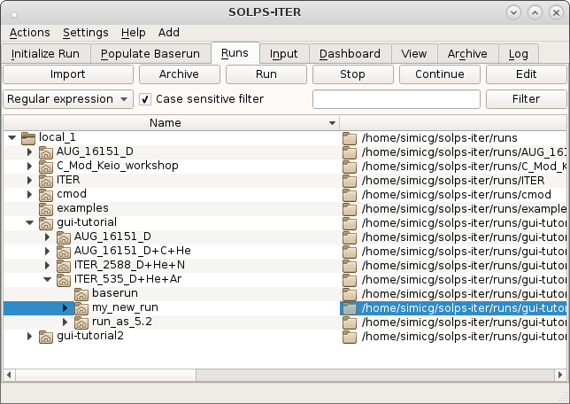
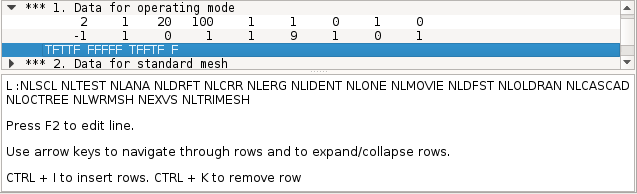
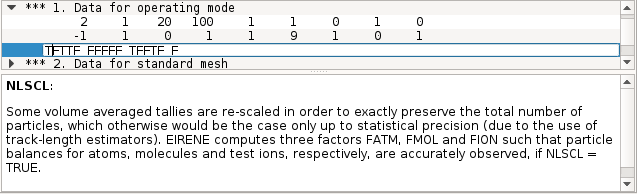
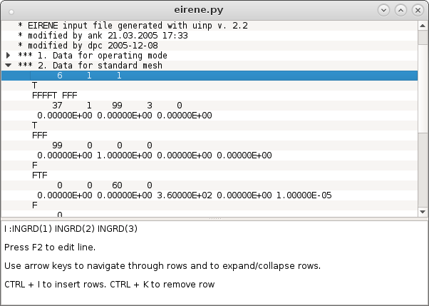
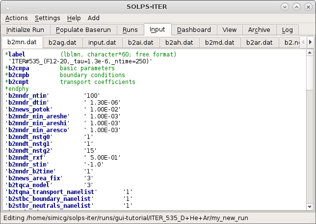
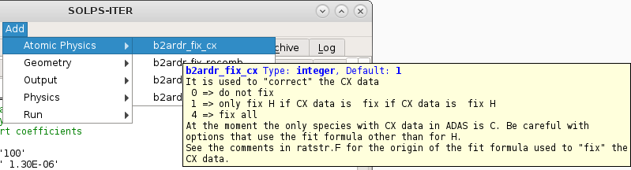
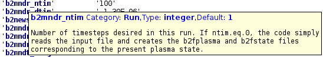

.. highlight:: csh

.. _editors:

===========================
Using Eirene and B2 editors
===========================

This tutorial will show you how to use the Eirene and B2 editors and show how
it helps us to edit and read the input files for Eirene and B2.

Eirene editor
-------------

The aim of the editor is to help us read and edit the input file with ease. 
This is achieved by using tree-style text editing and a window for showing
help.

It comes as a module for solps-gui and it can be used in stand alone mode. To 
use Eirene editor in solps-gui simply call solps after building solps-gui 
project.

Note: The editor doesn't work on all pyQt versions. The current selected 
version is 5.8. Other than really old python versions the eirene editor works
on 2.7.x python version and 3.5, 3.6 versions.

.. code-block:: bash

   cd solps-gui
   source setupenv.sh
   solps

This will open solps-gui with the default tab set on Runs. 

Now you have to travel through the runs directory to the desired directory and 
then clicking the button edit.

Then we click the Input tab. This changes the main window into a series of tabs
each editors for an input file from the current chosen run. We travel to the 
input.dat tab, select it and then we are in Eirene editor.

You can either use mouse or your keyboard for navigation. The keys for keyboard
navigation nare arrows. Use up and down key for navigating through lines and
left and right key for expanding and collapsing nodes of the tree.

While navigating you can see that the content of the lower help window is 
changing. When you traverse through relevant lines the help window will show 
you the type of the current card and the parameters that are in the line as 
well as some commands on how to start editing lines, insert a new line or 
delete the current selected line.

To go into edit mode for current card press F2. This will put the cursor inside
the line and you can start editing the line. The help description will show you
which parameter you are currently editing and its description.

The format of the cards are called:
- I for Integer
- L for Logical
- R for Real
- S for string or free format

If the card is of type I, L, R then a validator is activated that validates 
your editing. If the editing is "legal" then the is edit accepted otherwise it 
is rejected and the value of the card is returned to the previous valid value. 
This can be checked on the youtube link. !YoutubeLink

List of hot-keys:
   :kbd:`Up or Down` Travel up or down the lines.

   :kbd:`Right or Left` Expand or collapse lines. 

   :kbd:`Control-i` Inserts a comment row at current cursor location.

   :kbd:`Control-k` Deletes row at current cursor location.

.. note::

   Eirene editor does not change the structure of the input file when
   a relevant flag has been changed!

To use the Eirene editor in a stand alone version call

.. code-block:: bash

   cd solps-gui
   source setupenv.sh
   python3 src/widgets/eirene.py /path/to/your/input.dat

or use ``eirene /path/to/your/input.dat`` alias.

The stand alone version is the same with one exception. It has a status bas
on the bottom of the main window. The status bar shows us on which line we are
and on which column and in which block we currently are. Other than that it 
works the same. A link to a demonstration video: _eirene

B2 editor
---------

To run this editor you have to run solps-gui and use the same procedure as for
eirene-editor. When in solps-gui you have to navigate to the desired run 
directory and click Edit button.

.. code-block::bash

   cd solps-gui
   source setupenv.sh
   solps 

Then you have to change to the Input tab.

The B2 editor helps us with editing B2 input files. When you are under the 
Input tab there is another bar bellow that has tabs for all the input files 
solps-gui found in the current run directory. When you click a tab with a 
file that starts with 'b2' the B2 editor helps us edit those files.

If you hover with your mouse above a part of text that is highlighted blue, it
means that there is a tooltip help for it.

You can freely change the text, correct or incorrect. Instead of adding 
additional switches or parameters by hand you can add them from Add that is in
the menu bar.

From the Add menu you can add many switches or parameters, the way they are
added that their name is inserted at the current cursor location along with the
default values the parameter or switch holds. 

To run the B2 editor in stand alone mode, you have to call first go to the 
folder where the B2 editor is. It is provided with
``solps-gui/src/widgets/b2.py`` file.

To run it as standalone, call:

.. code-block:: bash
    
   cd solps-gui
   source setupenv.sh
   python3 src/widgets/b2.py /path/to/b2*.dat

or use ``b2 /path/to/b2*.dat`` alias.

.. note::

   This opens only one window with tool-tip highlight help and an add
   menu for switches and parameters.
   To have full functionality you need the following files:
   
   1. ``b2.py`` Main program.
   2. ``b2_tooltips.py`` Tooltips data. Without it there is no highlighting and tooltip help.
   3. ``b2menu.py`` Add menu data. Without it there is no bar for adding switches or parameters.

Extra resources
---------------

   | Demonstration video for stand-alone Eirene editor: EireneDemo_
   | Demonstration video for both editors: EireneB2Demo_

.. _EireneDemo: https://youtu.be/OTfdsTBTyUo
.. _EireneB2Demo: https://youtu.be/w2hZ4PbZJhg
