.. highlight:: csh

.. _initialize-run-C-Mod:

==========================
Initializing run for C-Mod
==========================

In this tutorial we will create a running case for coupled B2.5 and Eirene run.

.. note::

   This tutorial should continue after the meshing tutorial :ref:`meshing`
   inside ``$SOLPSTOP/runs/example/tutorial-DivGeo_C-Mod`` or start from the
   completed meshing example by entering the following command lines::

     $ stop
     $ cd runs/examples
     $ make tutorial-DivGeo_C-Mod-InitializeRun
     $ cd tutorial-DivGeo_C-Mod-InitializeRun
     $ rm -rf new_run # Will be created in this tutorial

   After you have extracted the case, be sure to select the *baserun* inside
   ``$SOLPSTOP/runs/example/tutorial-DivGeo_C-Mod-InitializeRun/``.

Before proceeding be sure to ``select`` the baserun directory you have
been working on in the ``Runs`` tab of ``SOLPS-GUI``.

Finishing with populating baserun
=================================

Before we start initializing a run, lets first use the tab ``B2 Input files``
in the :guilabel:`&Populate Baserun`.

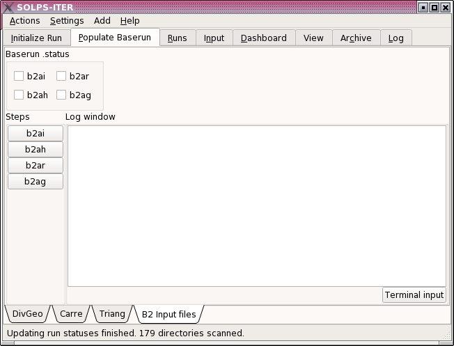

.. note::

   Even though ``b2mn`` already does the steps in tab ``B2 Input files``, its
   easier to look at the output in case there are some errors at with
   generating B2 input files.

If you have finished with the previous tutorial :ref:`meshing` then you are set
to initialize a run for C-Mod and thus finish preparing the case for future
simulations and runs with different settings.

If you haven't done :ref:`meshing`, do it, because you cannot continue from
this point.

.. note::

   Don't forget to tick the self-assessment check boxes in the tab
   ``B2 Input files`` as well!

Running b2ai step
-----------------

If you press in the step :guilabel:`b2ai`, which runs ``b2run b2ai``, which
prepares the default initial plasma state file, b2fstati.

There shouldn't be any problems and the output log should look like:

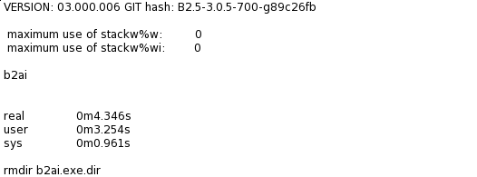

.. _stencil:

Running b2ah step
-----------------

Click on :guilabel:`b2ah`, which runs ``b2run b2ah``, which prepares the
default physics file, b2fpardf. Now here the should be an error log, such as:

.. image ::b2_input_files_3.png
   :align: center

Although it's not specific, the file `b2ah.dat` is missing in the baserun
directory.

Now, if you'd open a terminal and check the ``baserun`` directory, you would
notice a ``b2ah.dat.stencil`` file. Now we have to just save the file as
``b2ah.dat`` in the baserun directory and the ``b2run b2ah`` step should run
fine.

Switch to :guilabel:`&Runs` tab and make sure that the correct ``baserun``
directory is selected. Now click on :guilabel:`edit`, so that we take a look at
the input files in baserun directory.

If you click to the ``b2ah`` editor tab you will notice a partially greyed out
text saying:

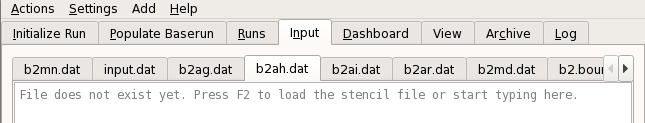

Click on the editor area first and then press :kbd:`F2`. This will load the
stencil file.

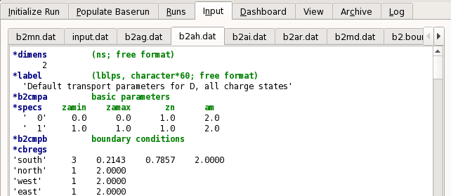

To save the file in the baserun dir as ``b2ah.dat``, simply switch to another
tab, in this case back to the :guilabel:`Populate Baserun` tab.

.. note::

   You can always check the ``Log`` tag that contains debugging information of
   various "parts" of the SOLPS-gui.

Now if we run :guilabel:`b2ah` in
:menuselection:`Populate Baserun --> B2 Input files`, the output at the end
should look like:

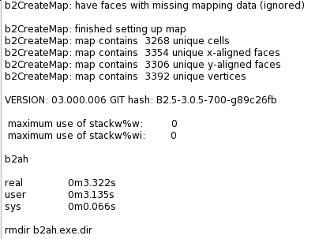

.. note::

   Again, do not forget on checking the check boxes!

Running b2ar step
-----------------

If you press in the step :guilabel:`b2ar`, which runs ``b2run b2ar``, which
prepares the default atomic physics rates file, b2frates.

There shouldn't be any problems and the output log should look like:

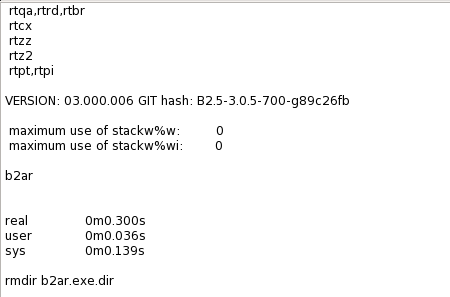

Running coupled B2.5 with Eirene
================================

Create new run directory
------------------------

Switch to :guilabel:`Initialize Run`. This widget helps the user to create run
directories which in this case initiates a coupled B2.5 with Eirene case for
case C-Mod.

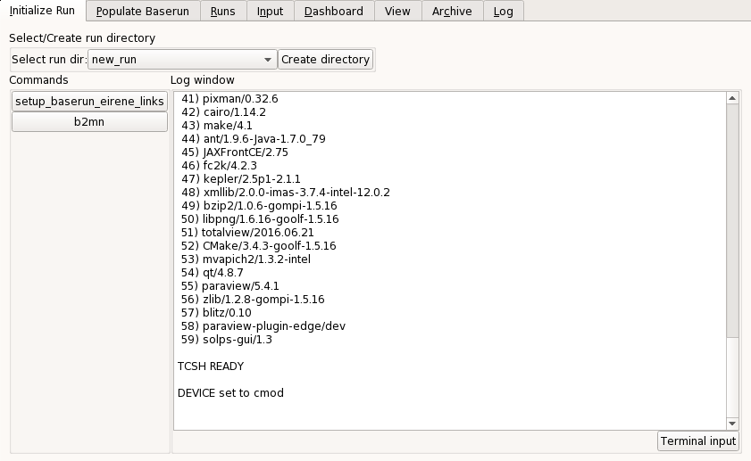

First click on :guilabel:`Create directory`. This will spawn a normal
file browser, except in this case it only shows folders. Click on the icon,
that looks like a ``folder with a plus (+)`` to create a new folder for the
run. I have named the new run directory ``new_run``.

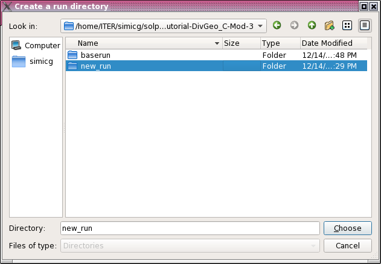

Also choose the newly made directory by selecting (highlighting) and clicking
the :guilabel:`Choose` button.

Now we have created and chosen the run directory.

.. note::

   You can switch between run directories with the **ComboBox** left of
   :guilabel:`Create directory` button. A baserun directory NEEDS to be
   chosen in the ``Runs`` tab for using ``Initialize run``.

Setting baserun eirene links
----------------------------

The next step is clicking :guilabel:`setup_baserun_eirene_links`.

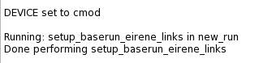

Running "b2run b2mn"
--------------------

Now before hitting :guilabel:`b2mn` button, we have to set the user B2 input
files in our run directory.

There are stencil files, i.e., input files for B2 that have an
extension of ``*.stencil`` in the baserun directory.

These act as the default templates for the B2 input files.

The list of stencil files:

  - b2mn.dat.stencil
  - b2.transport.inputfile.stencil
  - b2.numerics.parameters.stencil

These are needed as user input files to start the run from the populated
baserun.

If we'd run :guilabel:`b2mn` now, a lot of errors of missing input files
would cause the run to fail. This has to be fixed by going to the
:guilabel:`Runs` tab, so to again check if the correct ``run`` directory is
selected. In this case the name of the run directory is ``my_run``, so click
on it in the :guilabel:`Runs` tab. Then click the :guilabel:`Edit` button.

.. note:: Important

  Again, in this case :guilabel:`Edit` the run directory and not the baserun
  directory!

  Now traverse through all the editor tabs, and wherever you see that there is
  a stencil available, **load** it by first clicking on the *editor area* and
  clicking :kbd:`F2`

A figure, for example, of how the *b2mn* editor tab looks like after loading
the stencil file.

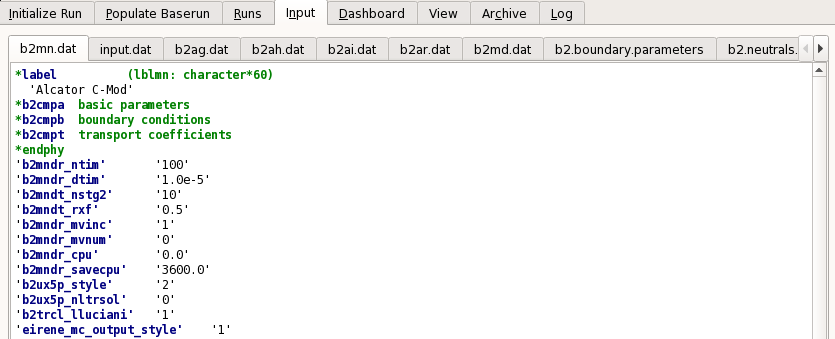

Now you are ready to start :guilabel:`b2mn`. Switch to the
:guilabel:`Initialize Run` and start it.

Remember, from now on, if there is an error in which a file is missing, you
must have forgotten it to load from the baserun directory to the run directory.

Now after some minutes (about 5 minutes on ITER hpc) it will finish and towards
the end the output will look like

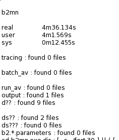

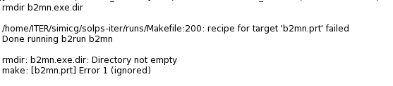

Now we can, for example, check the output graph for ``resall_D``. Head to the
:menuselection:`Dashboard` tab and in the ``edit area for plot command`` type
``resall_D``.

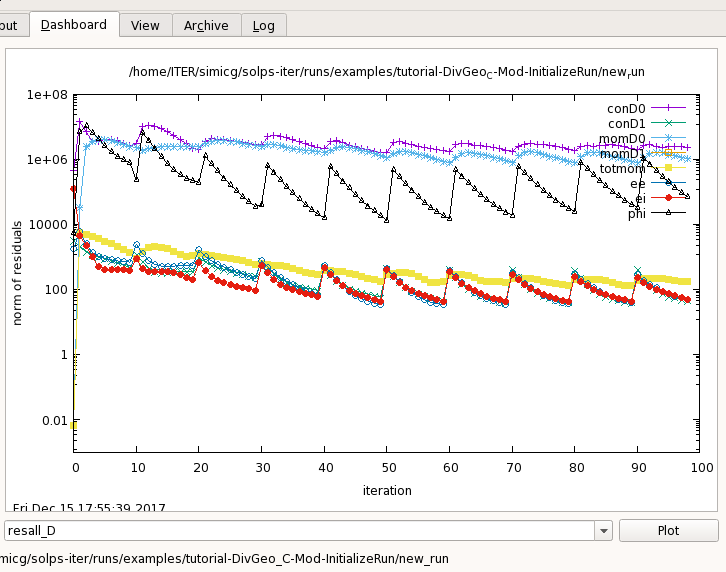

Additional information
----------------------

Under the ``Populate Baserun`` are also the following buttons:

 - ``Clear log``: As the names suggests, it clears the log window
 - ``Stop run``: This stops the current TCSH shell and restarts it
 - ``Terminal input``: Used to give TCSH terminal commands to the TCSH terminal