.. highlight:: csh

.. _meshing_iter:

========================================
Meshing toolchain-ITER Baseline scenario
========================================

DivGeo
======

As was done in C-mod tokamak tutorial, firstly we will use *DivGeo* and *Carre*
to prepare the ITER tokamak geometry. The model will be later used for
creating a mesh. Each input file used for creating the DivGeo model should be
located in the ``baserun`` run directory. The following commands repare the
``baserun`` input data needed for his tutorial::

     $ stop
     $ cd runs/examples
     $ cmake . && make # Fetches all examples from external repository
     $ tar xvzf tutorial-DivGeo_ITER_baseline_scenario.tar.gz
     $ cd tutorial-DivGeo_ITER_baseline_scenario/baserun

The EFIT equilibrium file  which describes ITER tokamak in this case is
``baserun/Baseline2008-li0.70``.
Since DivGeo cannot read the EFIT format equilibrium file directly the EFIT
format is needed to be transformed to DivGeo equilibrium format with::

    $ e2d baserun/Baseline2008-li0.70.equ

To have smoother contouring in the grid generator, we should increase the
resolution of the equilibrium data. Using higher resolution equilibrium avoids
us some problems when the fluid grid is generated::

    $ d2d baserun/Baseline2008-li0.70.x4.equ

*DivGeo* can be started inside SOLPS GUI. The procedure is as follows. First
start SOLPS GUI. SOLPS GUI will open with the **runs** tab.

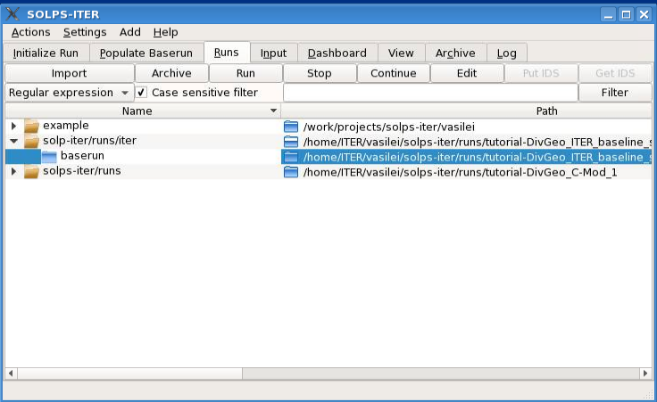

The ``baserun`` directory must be located under the
``${SOLPSTOP}/runs/examples/tutorial-DivGeo_ITER_baseline_scenario/``
directory for SOLPS-ITER to work correctly. Moreover, the top directory
``${SOLPSTOP}/runs`` needs to be listed in the
:menuselection:`&Settings --> &Runs`, such as shown in the following image:

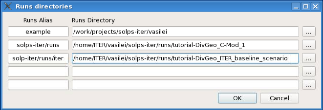

Next select the correct device for environment variable ``DEVICE``. To do this
click on :menuselection:`&Settings --> Preferences`. You will see a group
called **Environment variables** and in it *DEVICE*. There is a dropdown widget
in which you can either select or add the device variable. In this case either
select *iter* or write *iter* inside the edit area.

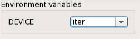

Now select your ``baserun`` folder in :menuselection:`&Runs` tab and click
ont the :guilabel:`&Populate Baserun` tab. Click inside the DivGeo area to
start DivGeo. If you wish to dock it into SOLPS GUI, click once again inside
DivGeo area after DivGeo appears in standalone window, as was done previously
at the C-mod tokamak case.

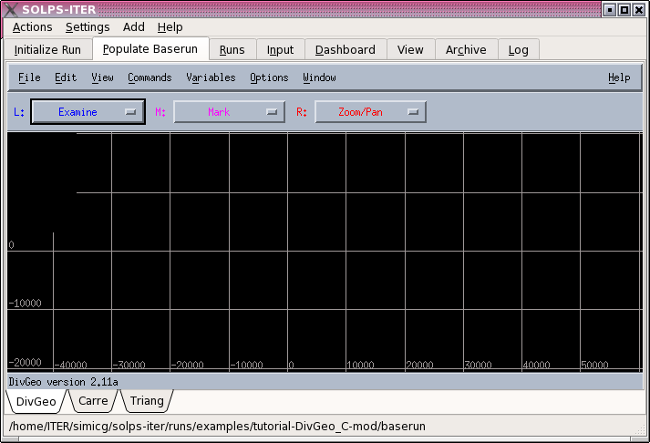

Additionally the ``tutorial-DivGeo_ITER_baseline_scenario/`` contains DivGeo
files for different stages in the tutorial in preparing the DivGeo model
for the ITER tokamak.
This way you can either start from beginning or from any point of the steps.

Make sure that when you either load a DivGeo file or start a new, to then save
it to the ``baserun`` directory, alongside the equilibrium file.

Import ITER baseline scenario geometry
--------------------------------------

The geometry files are located in the ``baserun`` directory.
First open the prepared geometry file:
:menuselection: `&File --> &Open --> ITER_0_step.dg`
The import the equilibrium file by opening
:menuselection:`&File --> &Import --> &Equilibrium` and load the
``Baseline2008-li0.70.x4.equ``, which should be listed in the
Equilibrium dialog box.

If you cannot see the equilibrium displayed as red (SOL) and blue (core and PFR)
rectangles after it is loaded, then use :menuselection:`&View --> &Display`
and make sure that the :guilabel:`Equilibrium` radio button is pressed.

.. image:: divgeo_ITER_1.png
   :align: center

.. note::
   This step is available in ``ITER_1_step.dg``

Converting the wall segments to geometry elements
-------------------------------------------------

To set the surface normals click
:menuselection:`&Command --> &Convert --> Template to elements`. The short pink
lines, which indicate the normal surfaces, will appear.

.. image:: divgeo_ITER_2.png
   :align: center

It is very important to notice that all surface normals are pointing away
from the plasma. To reverse them can set the middle mouse button to
`"Reverse normals”`. Then click :kbd:`Shift + Reverse normals` (middle
button) somewhere on the vessel wall and all of the normals should flip.

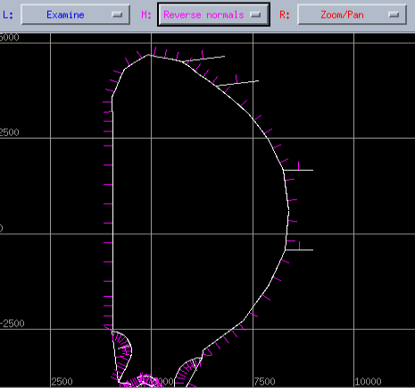

Setting the magnetic topology
-----------------------------

In DivGeo is very easy to choose which kind of magnetic topology the
modelling grid should have. You can choose it by opening
:menuselection:`&File --> &Import --> To&pology` and choose one of:

   1. SN lower single-null
   2. SN-up upper single-null
   3. DDN disconnected double-null, lower primary x-point
   4. CDN connected double-null
   5. DDN-up disconnected double-null, upper primary x-point

For ITER baseline scenario case select SN.

Setting the "Structure" variable for "Structure"
------------------------------------------------

The structure variable is the primary definition for the vessel wall. You can
define the vessel wall by opening :menuselection:`V&ariables --> Structure`

Use the right mouse button (assigned to Mark) to select all segments except the
short segments that are just outside the targets. Using SHIFT+right click will
help a lot. Right clicking on a selected segment will un-select it.

.. image:: divgeo_ITER_4.png
   :align: center

Use the right mouse button (assigned to Mark) to select all segments. Using
:kbd:`SHIFT+Right Click` will help a lot. Right clicking on a selected
segment will un-select it. When the highlighting is complete, left-click on
`"Set”` in the `"Structure”` dialogue box, at the end of the line marked
`"Structure”`.

:kbd:`CTRL+U` to unmark everything.

Setting the "Structure" variable for the targets
------------------------------------------------

As the same like the structure you can set the targets. Mark all of the
segments for the inner target and then click on `"Set”`. Do not include the
segments that are behind the target.

.. image:: divgeo_ITER_5.png
   :align: center

The same steps are used for setting the outer target.

.. image:: divgeo_ITER_6.png
   :align: center

.. note::
   This step is available in ``ITER_2_step.dg``

Setting elements that are to be ignored by EIRENE
-------------------------------------------------

You can select which parts should EIRENE ignored, by opening
:menuselection:`V&ariables --> &Add --> &Elements not for Eirene`. Mark
the elements behind the targets and click `"Set”`.

.. image:: divgeo_ITER_7.png
   :align: center

Setting the elements that are used by B2plot
--------------------------------------------

Defining the wall surfaces that will be written to the mesh.extra file, that
defines the wall specification in B2plot, can be done opening the
:menuselection:`&Variables --> &Add --> &Input to b2plot`

Mark everything except the segments behind the targets.

.. image:: divgeo_ITER_8.png
   :align: center

Setting the target specifications
---------------------------------

Target specification #1
~~~~~~~~~~~~~~~~~~~~~~~

Click on :menuselection:`V&ariables --> Target specification --> #1`

#1 is the inner target for this case. The target index as a function of
magnetic topology is as follows:

+------------+------------+-----------+-----------+-----------+
| Topology   | Target #1  | Target #2 | Target #3 | Target #4 |
+------------+------------+-----------+-----------+-----------+
| SN-down    | HFS        | LFS       |           |           |
+------------+------------+-----------+-----------+-----------+
| SN-up      | LFS        | HFS       |           |           |
+------------+------------+-----------+-----------+-----------+
| DN         | HFS-down   | HFS-up    | LFS-up    | LFS-down  |
+------------+------------+-----------+-----------+-----------+

The target numbering must follow the order of the B2.5 grid indices, which
increase as one goes around the core plasma in a clockwise direction.

Mark the upper-most segment on the inner target, which is in the Scrape-Off
Layer, and click "Set" for "SOL edge" as shown in the following figure.

.. image:: divgeo_ITER_9.png
   :align: center

Mark the segment that defines the lower extent of the target , and click
"Set" for "PFR edge".

.. image:: divgeo_ITER_10.png
   :align: center

Change "Target material" to W for this case, to match the ITER target
material, and click "Set". Assign "Chem. sput." (chemical sputtering) to 0,
and click "Set".

Target specification #2
~~~~~~~~~~~~~~~~~~~~~~~

Click on :menuselection:`V&ariables --> Target specification --> #2`

The outer target is less straightforward and then inner target for this case.
The "edge" settings for the targets have to intersect the outer radial boundary
of the grid, but it’s not obvious where the SOL radial boundary edge will be at
this stage.

.. image:: divgeo_ITER_11.png
   :align: center

For "PFR edge", the segment indicated in the right-most figure is not the same
as the lower-, outer-most segment included when the Structure variable was set
for the outer target – this is OK. The "PFR edge" is only set based on where
the radial boundary of the grid will be, as determined by intersection with the
divertor knee.

.. image:: divgeo_ITER_12.png
   :align: center

Poloidal grid points
--------------------

The poloidal distribution of cells on the Carre grid are set by the
`"poloidal grid points”` in DG. These are defined separately for the
divertor legs and the SOL.

Click :menuselection:`&Edit --> &Create --> &Grid points`.

Set the Zone to Inner divertor and Cells to 18. The distribution of the cells
can be adjusted by left-clicking and dragging the black line on the plot.
Then click Create to update the workspace. Repeat for the outer divertor. Set
48 points in the SOL, with a roughly uniform distribution of points. The
spacing of the grid points around the x-point should be symmetric.

.. image:: divgeo_ITER_13.png
   :align: center

Repeat for the outer divertor.

Set 48 points in the SOL, with a roughly uniform distribution of points
(a straight line on the grid point distribution plot).

The spacing of the grid points around the x-point should be symmetric. Meaning
that set the grid points for SOL, click the :guilabel:`Reset` button and assign
48 cells.

.. image:: divgeo_ITER_14.png
   :align: center

.. note::
   This step is available in ``ITER_3_step.dg``

Radial surfaces
---------------

The radial surfaces in DG define the boundaries between rings on the Carre
grid.
Click :menuselection:`&Edit --> &Create --> &Surfaces...`

Set 18 surfaces in the SOL.

Adjust the radial distribution to give higher spatial resolution near the
separatrix.

.. image:: divgeo_ITER_15.png
   :align: center

.. note::
   This step is available in ``ITER_4_step.dg``

There is an issue in the PFR for this particular case: the flux surface which
is tangent to the "knee" will miss the bottom of the outer target and cross the
entrance to the "plenum" in the sub-divertor.

Setting the shadowing structure
-------------------------------

The shadowing structure is the set of physical wall elements that can receive
light from the plasma (or its reflections). It is used to compute the radiative
contribution to the wall heat loads.

Click :menuselection:`V&ariables --> &Add --> Shadowing structure`

First unselect everything with :kbd:`Ctrl + U`

Mark all the segments likely to receive light from the plasma. The shadowing
structure must be continuous and closed.

.. image:: divgeo_ITER_16.png
   :align: center

Adding some core radiation
--------------------------

To include core radiation in the wall heat loads, one needs to specify the
amount of core radiation (in `MW`).

Click :menuselection:`Variables --> Add --> Radiation sources`

Enter in the "Radiated Power" field the amount of core
radiation (in "MW") then need to specify the location from where this core
radiation is emitted.

This is done by providing a set of point sources. The radiated power will be
spread evenly among these point sources. You create them by clicking
:menuselection:`&Edit --> &Create --> &Source` and specify the X and
Y coordinates (in `mm`) of the point source location. You may input as few
or as many point sources as you’d like. The point sources (if you choose to
display them) are shown as white asterisks in the DG model.

.. image:: divgeo_ITER_17.png
   :align: center

.. note::
   This step is available in  ``ITER_5_step.dg``

Defining "plot zones"
---------------------

The "plot zones" are a set of walls on which the power load, including the
contrabutions from the plasma particles, Eirene neutrals and radiation can
be computed by b2plot. You add them by clicking
:menuselection:`&Variables --> &Add --> &Plot zone`

Unselect everythin with :kbd:`Ctrl + U`

and mark the set of elements that you want to include in the plot zone.
Mark the "Starting element", i.e. the first element of the plot zone set, such
that, as you travel along the plot zone set, the plasma is to your LEFT.
Give the zone a label (`Zone-label`) that will be used in
the files created by b2plot (8 characters maximum, no spaces, stars or
ellipses).

.. image:: divgeo_ITER_18.png
   :align: center

Configuring the plasma species to be included in the simulations
----------------------------------------------------------------

It is very important to definite plasma species which are included in the
simulations. You definite them by clicking
:menuselection:`Variables --> Plasma species D`.

.. image:: divgeo_ITER_19.png
   :align: center

Also you can add it the impurity species with clicking
:menuselection:`Variables --> Add --> Plasma species`.
DG recognizes a few "generic” species: H, D, T, He, Be, C, N, Ne, and Ar,
for which a full consistent default set of reactions will be provided by
Uinp. For all other elements, Uinp will look for the corresponding ADAS
ionization and recombination rates, and, if present in your database, will
include them as part of your model.

If one wishes to use a different reaction set than the default, one can
instead choose to load the reactions from an AMDS file, using:
:menuselection:`&Variables --> &Add --> &Reference to AMDS`
and giving the name of the AMDS file requested. The number of AMDS files to
be loaded is not limited. These files are to be found in the::

    $SOLPSTOP/modules/AMDS directory.

One can also specify a simple boundary condition of either flux or value for
the density of the highest ionization charge state of that species along the
core boundaries.

EIRENE setup of the "void" regions outside the Carre grid
---------------------------------------------------------

EIRENE will use a triangle grid in regions that are outside the fluid grid,
and this variable defines the zones for the triangle mesh generator.

Mark all of the main chamber elements, including the "SOL edge” segments for
the targets. :menuselection:`&Variables --> &Add --> &TRIA-EIRENE parameters`

Set index to -1 in the dialogue box, and :kbd:`"General Triangle size”`
to 10.0, which will generate large triangles.

.. image:: divgeo_ITER_20.png
   :align: center

Press kbd:`Ctrl + U` to unmark everything.

Mark the the wall segments in the PFR, including the "PFR edge" elements. Set
index to -2 in the dialogue box, and "General Triangle size" to 10.0.

.. image:: divgeo_ITER_21.png
   :align: center

Local refinement of the EIRENE triangle grid
--------------------------------------------
With DG it’s possible to increase the spatial resolution on sub-regions of the
triangle mesh, i.e. the PFR. You can add it by clicking
:menuselection:`&Variables --> &Add --> &Mesh Refinement Zones`

Select wall elements that bound the region of interest (left-right,
top-bottom), as shown on the right, and click "Set" for "Region
identification". Set "Desired side length" to the desired characteristic
scale size of the triangles in this region.

.. image:: divgeo_ITER_22.png
   :align: center

Choose the toroidal approximation
---------------------------------

To set the toroidal approximation you need to set the `"Major Radius"` to a
negative (real) number, such as -1.0, if you want to use the toroidal
approximation instead of the cylindrical approximation.

:menuselection:`Variables --> Global Eirene Data`

Write the output data files that are needed by later steps
----------------------------------------------------------

With the :menuselection:`Commands --> Check variables` you can check if all
variables have valid values.

Hopefully you see this at the bottom of the screen:

  All variables have valid values

Then click on:

  1. :menuselection:`Commands --> Rebuild Carre objects`
  2. :menuselection:`File --> Save`
  3. :menuselection:`File --> Output`

The last command will create three files:

  - **<DG_model_name>.dgo**, the DG "output" file
  - **<DG_model_name>.str**, the "structure" file (used by Carre)
  - **<DG_model_name>.trg**, the "targets" file (used by Carre)

And you are set to go to the next part of tutorial.

Carre
=====

Now that we have prepared our DivGeo model, the next step is creating the
plasma grid using Carre.

Switch to Carre tab in SOLPS-GUI.

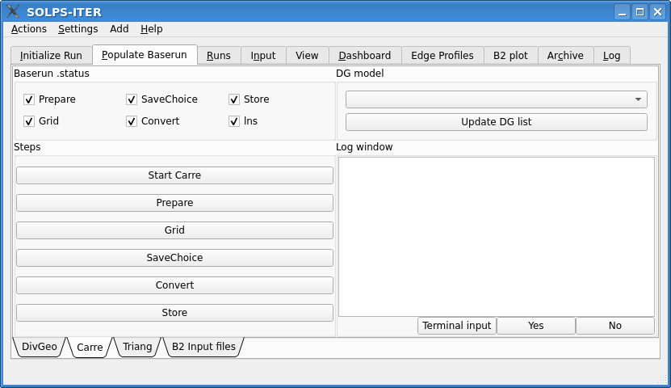

This tab is grouped into two sections, upper and lower half. The upper half
is self assessment of Carre for the current baserun. Checkboxes, which are
clickable tells the user which steps were already run and the *DG model* drop
down button tells us which DivGeo model has been used to create the plasma
grid.

.. note::

  If the list does not contain a DG model, you have to rescan the baserun dir
  with clicking the :guilabel:`Update DG list`.

The lower half is the interface to the Carre. On the left side are control
buttons and on the right we have a log window which shows us the output of
Carre. Underneath the log window we have the response widgets for Carre. The
manual input button spawns an **input dialog** in which we will write the
parameters value when needed and the *Yes* and *No* button are used for yes/no
(y/n) questions, given by Carre.

Starting Carre
--------------

Before starting carre we must first select our *DivGeo model*, we created
previously. Simply click on the drop down button under ``DG model`` and there
should be the name of our *DivGeo model*, ``ITER_5_step.dg``.
Click on it so it is selected.

The reason why this must be done is that for the first time a linking
has to be made against the *DivGeo model*, so that the proper files and their
formats are copied to the correct locations.

For more information search the ``solps-iter/scripts`` folder and run the
``lns`` script.

Now we can click the button :guilabel:`Start Carre` to start Carre. This will
take a while since the environemnt of *SOLPS-ITER* has to be loaded to a TCSH
shell before Carre can be started.

Notice that the ``lns`` check box was ticked. Whenever you will want to redo
the linking with ``lns`` just untick it before clicking
:guilabel:`Start Carre`.

After a while the following output should be shown in the log window.

Prepare
-------

This step reads the DG files and translates them into the format needed by
Carre.

Click on widget :guilabel:`Prepare`. If there is no error the output should be
as in the following figure

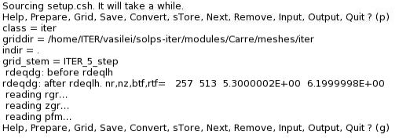

Now we click on the checkbox :guilabel:`Prepare`.

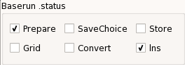

Gridding step
-------------

Click the :guilabel:`Grid`. Soon a first question will appear, whether the *X-*
and *O-* points identified by Carre are correct (they usually are). If they are
not, then, you refuse the selection and indicate yourself which of the extrema
are *X-* and *O-* points.

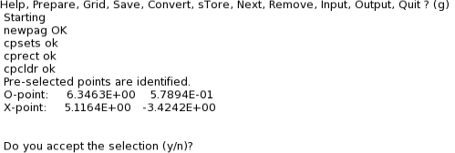

To accept click on the :guilabel:`Yes` widget.

Modifying the Carre parameters
~~~~~~~~~~~~~~~~~~~~~~~~~~~~~~

From the log window the following output should be seen

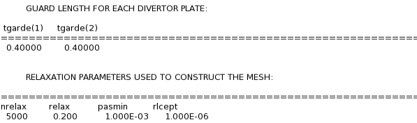

The are more parameters printed if you scroll up, but no errors were reported.
If you would accept them by pressing :guilabel:`Yes`, the following text would
be displayed in the log window

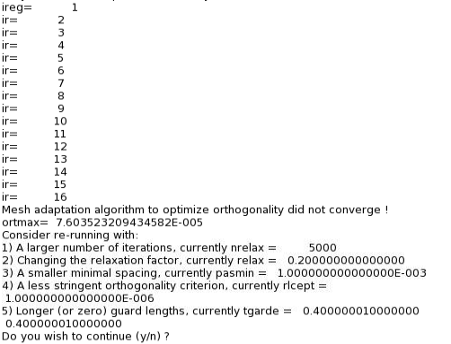

As the error message says that the relaxation parameters are not correct. If
you pressed :guilabel:`Yes`, then you would have to click on the
:guilabel:`Grid` again to start the process again; that is saying
yes to the *X-* and *O-* points.

Now instead of pressing :guilabel:`Yes`, press :guilabel:`No`, then Carre will
ask us for input, to change the grid parameters.

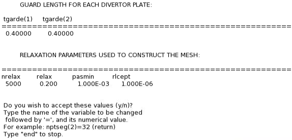

So now we click on :guilabel:'Terminal input', which shows a dialog in which
we will write:

    tgarde(1)=0.8
    tgarde(2)=0.8
    nrelax=1000
    relax=0.4
    rlcept=0.0001
    end

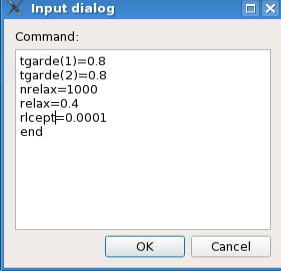

And click on ``Ok``. Then Carre again asks us if we wish to accept the values.
We Click on the widget :guilabel:`Yes`.

Now we will get no error message but instead the following output

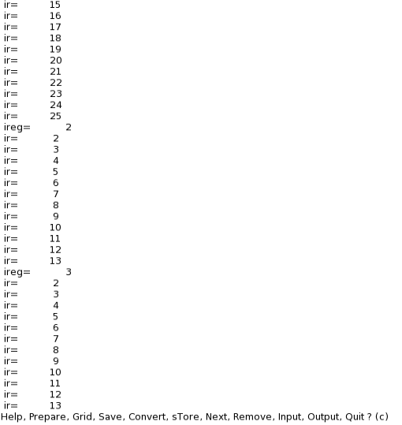

Now we check the check box for *Grid*, as we have completed this step.

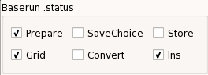

Saving the grid parameters
--------------------------

If you wish to remember the settings change you made, click the
:guilabel:`SaveChoice` button. The grid parameters are then written in the
**carre.dat** file. If you wish to re-use these parameters, skip the
``Prepare`` step in your next invocation of the carre script.

It is good to also check the :guilabel:`SaveChoice` check box, so it is noted
that the grid parameters were changed.

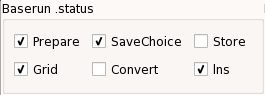

Converting the grid output from Carre
-------------------------------------

The conversion step takes the *carre.out* file containing the Carre grid and
converts it to the Sonnet and B2.5 formats, respectively a \*.sno and \*.geo
file.

Click on the :guilabel:`Convert`.

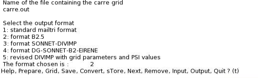

And check the checkbox for *Convert*.

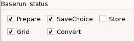

Storing the grid files
----------------------

Click on :guilabel:`Store` to store the grid files.

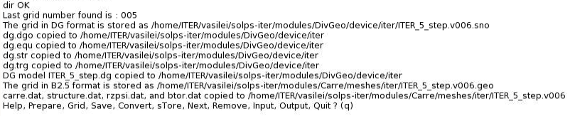

Sometimes you will get an error message saying:

  No traduit.out. Convert the grid first.

Even though we did Convert the grid successfully. In this case sometimes
convert doesn't work, even though it produces a normal output. Run it again and
try to store the grid files again.

And check the checkbox for *Store*.

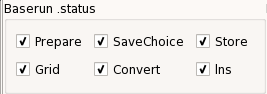

Inspecting the mesh
===================

Now we will check the generated mesh. Switch over to the DivGeo tab and if you
have closed ``ITER_5_step.dg``, reopen it and if you wish dock it.

In DivGeo click on :menuselection:`File --> Import --> Mesh` and open
``ITER_5_step.dg.sno`` file. Note that DG can only read files in the
Sonnet format (\*.sno).

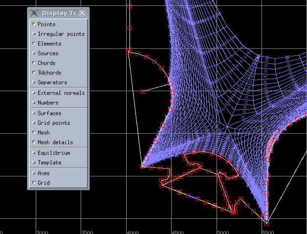

You may see some grid cells that are outlined in magenta. These are concave
cells that will yield errors when running Eirene and should be corrected before
proceeding. Two methods are available.

Changing grid parameters in Carre
---------------------------------

The first is to go back to Carre and chose a different set of gridding
parameters and try your luck or smarts against an ill-posed mathematical
problem. This is where the Save option comes in handy!

An easier way is the next method.

Manually change mesh points in DivGeo
-------------------------------------

The second is to modify the grid points by hand (if there are not too many of
them). This can be done as follows. Change one of the mouse button functions
to ``Move mesh point`` and select a corner of a magenta grid cell and move it
until the cell outline changes colour to lavender. You may need to propagate
such changes over a range of cells.

The result is that there are no more magenta grids.

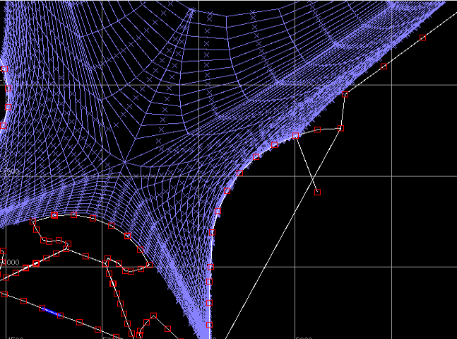

Bear in mind however that you are only
modifying the \*.sno grid file. You will need to save your modifications by
exporting the mesh :menuselection:`File --> Export --> Mesh`.

.. note::
   This step is available in ``ITER_6_step.dg``

Triang
======

Head over to *Triang* tab to start Triang. The functionality of this tab is
similar to the one with Carre, except there are other steps and there is no
DivGeo model selection.

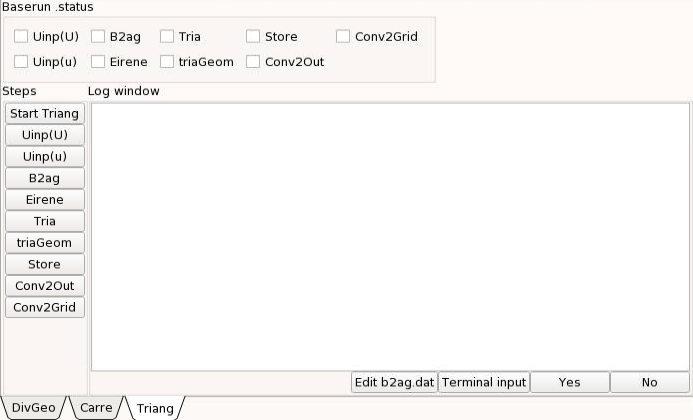

Start triang with :guilabel:`Start Triang`. The output will be as following:

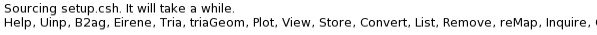

Create the input files
----------------------

Uinp is a program that builds several input files for SOLPS-ITER programs
according to the data provided in the DG model:

  - Eirene input files input.eir, test.eir and triang.eir
  - Tria input file header triang.hed
  - B2.5 pre-processor input files b2ag.dat, b2ai.dat, b2ar.dat, and converter
    input file b2yt.dat.
  - B2.5 input file b2.user.parameters
  - b2plot input file mesh.extra
  - Stencil files b2ah.dat.stencil, b2.neutral.parameters.stencil and
    b2.boundary.parameters.stencil which are sample files containing a very
    rough default physics model for the boundary conditions and recycling
    parameters, but that have the right format for further modification to
    adapt to your physics problem at hand.

On the first call, it is best to use :guilabel:`Uinp(U)` as in uppercase U.
Uinp will display the list of particles being used, the reactions it will
include in the Eirene input file, the boundaries it will define, etc...

If Uinp is happy the following output at the end should be observed

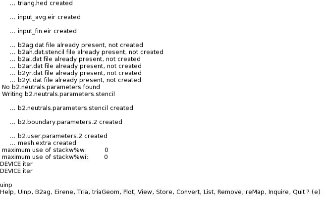

Modifying the b2ag.dat file
---------------------------

If you have modified the grid file by hand in DG, you need to modify the
b2ag.dat (right) file created by Uinp to point to your modified file instead
of the file initially created by Carre.

Click on the button :guilabel:`Edit b2ag.dat`. An input dialog will show.

Change the value of the first parameter in the \*param list from ``-1.0`` to
``-2.0`` and the name of the file given to the b2agfs_geometry switch to your
modified \*.sno file.

*SOLPS-GUI* provides a little help and shows in the end it prints you the
latest \*.sno file created. The line should be similar to:

 !Latest SNO file in DivGeo/device/iter: ITER_5_step.v006.sno

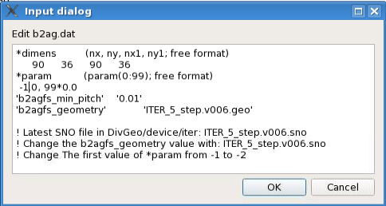

No to avoid any problems, copy the name of the \*.sno file to the
b2agfs_geometry switch and delete the line.

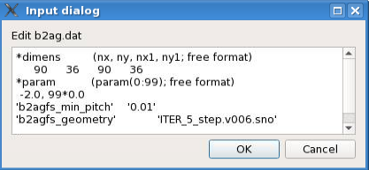

Creating the fort.30 file
-------------------------

Once you are pointing to the correct mesh file, proceed with the triang by
clicking on :guilabel:`B2ag`.

This command runs the b2ag program to create a geometry file that provides the
mesh geometry used by Eirene.

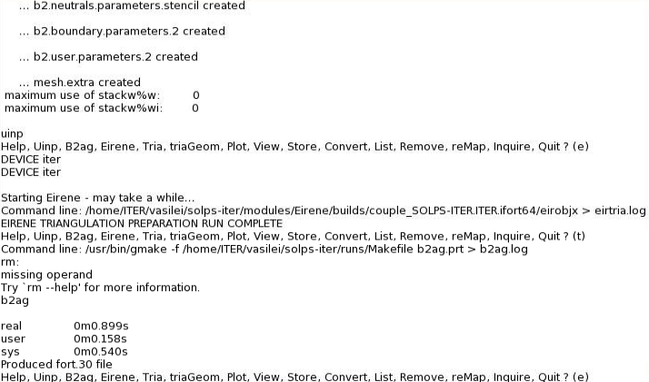

This step will be skipped if a **fort.30** file is already present. If you are
re-running triang to obtain a new geometry in an already populated directory,
make sure you have removed the older b2ag.dat and fort.30 files beforehand.

Eirene triangulation preparation run
------------------------------------

Press :guilabel:`Eirene`. If this step is successful, the output will look like

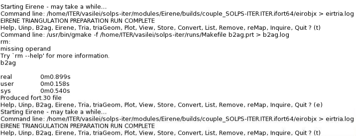

If this step fails (i.e. the message “No valid fort.78 file created” appears),
you should look at the error messages from Eirene that you will find in the
eirtria.log file. Standard Eirene debugging applies.

This step uses Eirene to produce the full contours that will be used in the
triangulation step next. The contours deduced by Eirene are written in the
fort.78 file. The script then concatenates this file with the triang.hed file,
which contains the information about the desired triangle sizes and mesh
refinement zones from DG to form the tria.in file that will be the input for
the tria program.

Triangulation
-------------

Press :guilabel:`Tria`. If this step is successful, the output will look like

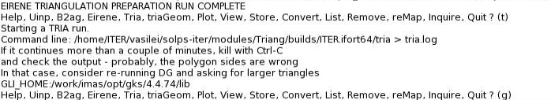

The triangulation results will be stored in three files:

  - *tria.nodes*
  - *tria.elemente*
  - *tria.neighbor*

which contain, respectively, the coordinates of the nodes, the vertices
assignment for the triangles, and the connectivity information between
triangles.

If this step fails, you should look at the error messages from tria that you
will find in the tria.log file generated in the baserun directory.

Triangulating the Carre grid and merging it with the outer triangles
--------------------------------------------------------------------

Press :guilabel:`triaGeom`. If this step is successful, the output will look
like

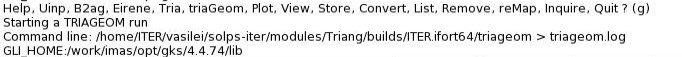

This steps takes the output from the triangulation step and adds nodes
corresponding to the Carre grid cells, each of which is split into at least two
triangles.

The connectivity information is also enriched to indicate in which Carre grid
cell, if any, each triangle is embedded.

This step also creates the links between the triageom.[cells,nodes,links]
files and the fort.3[3-5] files used later by SOLPS-ITER.

Storing the triangle files
--------------------------

Press :guilabel:`Store`. If this step is successful, the output will look like

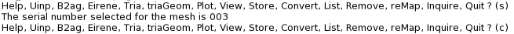

The triangulation files will be stored in some standard directories. The script
may ask you to create these directories if those are not yet present. Simply
press :guilabel:`Yes` if you are asked.

Links to the triangle files as fort.33, fort.34, and fort.35, as needed by
Eirene, are updated to their new location.

Converting the triangle files into an "outer" template
------------------------------------------------------

Press :guilabel:`Conv2Out`. If this step is successful, the output will look
like

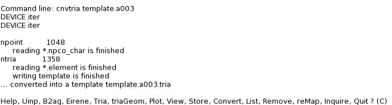

template.aXXX.tria file contains the triangles created by the tria step, which
cover the area outside the Carre grid.

Converting the triangle files into a "grid" template
----------------------------------------------------

Press :guilabel:`Conv2Grid`. If this step is successful, the output will look
like

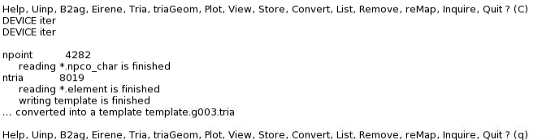

The template.gXXX.tria file contains the triangles created by the triageom
step, which covers the entire domain.

View the results in DivGeo
==========================

You can view the triangle grids by importing them as templates, using the
template file created during the two conversion steps above. If you are happy
with them, you are done! Otherwise, you may wish to modify the triangle size
and/or the mesh refinement regions. Also, you can move or create wall vertices,
since those vertices act as anchors for the triangulation.

Head back to DivGeo tab and import the resulting templates with
:menuselection:`File --> Import --> Template` and import
``template.gXXX.tria.ogr``. The index may be different at your case.

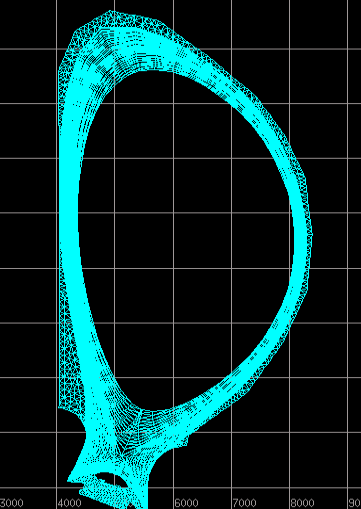

.. note::
   This step is available in ``ITER_7_step.dg``
