.. highlight:: csh

.. _meshing-compass:

================
Meshing COMPASS
================

DivGeo
======

As in the C-mod and ITER tokamak tutorial, we will first use *DivGeo* and
*Carre* to prepare the COMPASS tokamak geometry. The model will be used
later to create a mesh. Any input file used to create the DivGeo model
should be in the run directory :file:`baserun`. The following commands
prepare the :file:`baserun` input data needed for this tutorial::

     $ stop
     $ cd runs/examples
     $ make tutorial-DivGeo_Compass
     $ cd tutorial-DivGeo_Compass/baserun

The list of files are:

 - :file:`compass.ogr` : DivGeo template file for the ITER tokamak 
 - :file:`compass_equilx2.equ`: Equilibrium file
 - :file:`COMPASS\_*.dg` : Prepared DivGeo files

The EFIT equilibrium file  which describes ITER tokamak in this case is
``baserun/compass_equil``.
Since DivGeo cannot read the EFIT format equilibrium file directly the EFIT
format is needed to be transformed to DivGeo equilibrium format with::

    $ e2d baserun/compass_equil.equ

To have smoother contouring in the grid generator, we should increase the
resolution of the equilibrium data. Using higher resolution equilibrium avoids
us some problems when the fluid grid is generated::

    $ d2d baserun/compass_equilx2.equ

.. note:: Note that all DivGeo files saved as steps below have
          hardcoded paths to other files. To be reused at next step
          they need to be edited and under the :file:`baserun/`
          directory. The easiest way to continue from specific step is
          to open the :file:`COMPASS_step_x_*.dg` in DivGeo and save it
          as :file:`compass.dg` or similar under
          :file:`baserun/` and should not change in next steps unless
          used for achive saved elsewhere.

*DivGeo* can be started inside SOLPS GUI. The procedure is as follows.
First start SOLPS GUI. SOLPS GUI will open with the **runs** tab.

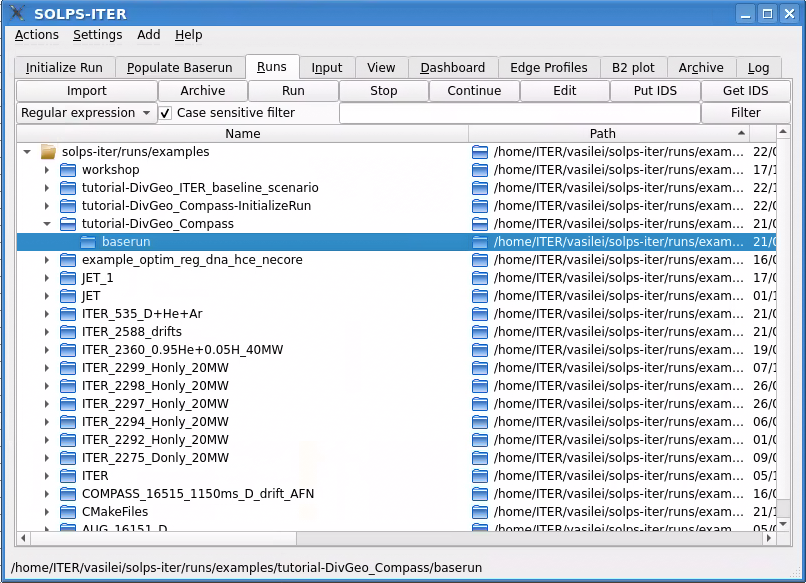

The ``baserun`` directory must be located under the
``${SOLPSTOP}/runs/examples/tutorial-DivGeo_Compass/``
directory for SOLPS-ITER to work correctly. Moreover, the top
directory ``${SOLPSTOP}/runs/examples`` needs to be listed in the
:menuselection:`&Settings --> &Runs`, such as shown in the following
image:

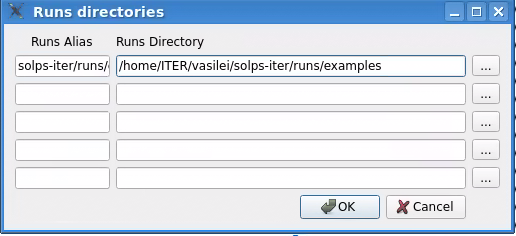

Next select the correct device for environment variable ``DEVICE``. To
do this click on :menuselection:`&Settings --> Preferences -->
Settings`. You will see a group called **Environment variables** and
in it *DEVICE*. There is a dropdown widget in which you can either
select or add the device variable. In this case either select *compass*
or write *comapss* inside the edit area.

Now select your ``baserun`` folder in :menuselection:`&Runs` tab and click
on the :guilabel:`&Populate Baserun` tab. Click inside the DivGeo area to
start DivGeo. If you wish to dock it into SOLPS GUI, click once again inside
DivGeo area after DivGeo appears in standalone window. DivGeo window is not 
redrawn after tab change. Clicking inside docked area shows DivGeo window again.

.. note::

   Functions of the buttons are governed by top list of selection
   boxes maked with :guilabel:`L:`, :guilabel:`M:` and :guilabel:`R:`
   that means left, middle and right mouse buttons respectively. If
   you don't see :guilabel:`Connect Points` in the middle then you
   need to select it from drop down. If you have a single mouse button
   then you will need to change :guilabel:`L:` :guilabel:`Connect
   Points` to and use just that. For using :guilabel:`Zoom/Pan` the
   modifiers are with :kbd:`shift+click` to unzoom and
   :kbd:`shift+drag` to pan.

Additionally the ``tutorial-DivGeo_Compass`` contains DivGeo
files for different stages in the tutorial in preparing the DivGeo model
for the COMPASS tokamak.
This way you can either start from beginning or from any point of the steps.

Make sure that when you either load a DivGeo file or start a new, to then save
it to the ``baserun`` directory, alongside the equilibrium file.

Import the COMPASS template
---------------------------

The wall geometry file is located in the ``baserun`` directory.
Import the vessel wall description by opening
:menuselection:`&File --> &Import --> &Template` and load the
``compass.ogr`` file, which should be listed in the
Template dialog box.

Press :kbd:`CTRL+P` to fit the wall data to the workspace. If you cannot see
the wall, then use the :menuselection:`&View --> &Display` and make sure that
the :guilabel:`Template` radio button is pressed.

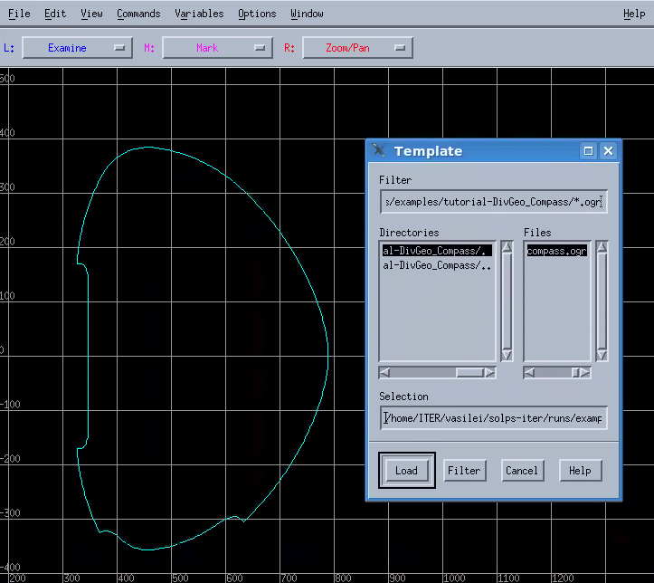

Import magnetic equilibrium data
--------------------------------

The magnetic equilibrium file is located in the ``baserun`` directory. Import
the magnetic equilibrium data by opening
:menuselection:`&File --> &Import --> &Equilibrium` and load the
``compass_equilx2.equ`` file, which should be listed in the Equilibrium
dialog box.

If you cannot see the equilibrium displayed as blue (SOL) and red (core and PFR)
rectangles after it is loaded, then use :menuselection:`&View --> &Display`
and make sure that the :guilabel:`Equilibrium` radio button is pressed.

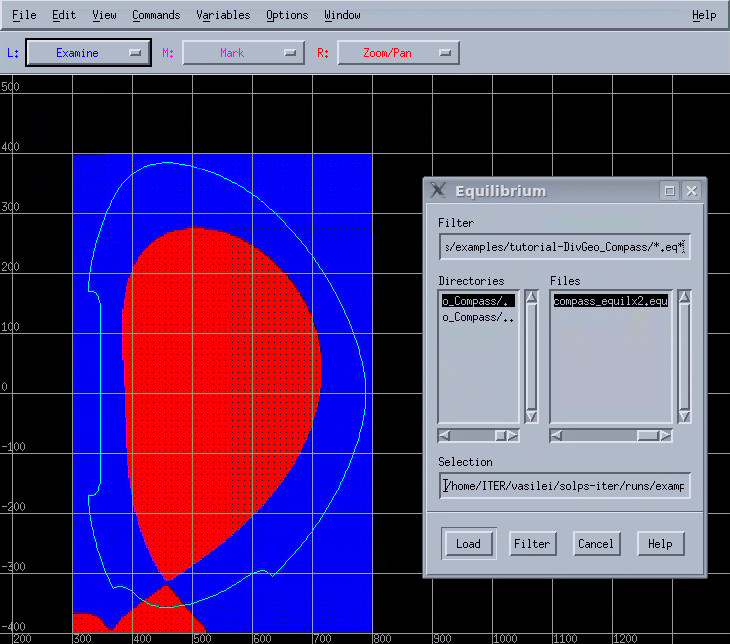

.. note:: At this point a copy of :file:`compass.dg` was saved as
   :file:`COMPASS_step_1_template.dg` only for archival purposes outside
   :file:`baserun/` directory. If you want to save your DG file use
   :file:`compass.dg` as filename saved under
   :file:`baserun/` directory at any time.

Converting the wall segments to geometry elements
-------------------------------------------------

To set the surface normals click
:menuselection:`&Command --> &Convert --> &Template to elements`. The short pink
lines, which indicate the normal surfaces, will appear.

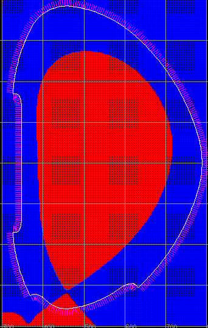

It is very important that all surface normals are pointing away from the
plasma. 

The ``.ogr`` file will probably have a much higher element resolution than necessary. 
Reduce the number of wall elements by :menuselection:`&Commands --> &Simplify --> &Merge/Split elements`.
Set the maximum deviation to 0.5 mm and press OK. Keep in mind that some of the edges may have an important 
impact on the physics (neutral reflection etc.). Then, renumber the elements using 
:menuselection:`&Commands --> &Renumber elements`, otherwise EIRENE will complain about having 
too many wall elements (the maximum default value is 300).

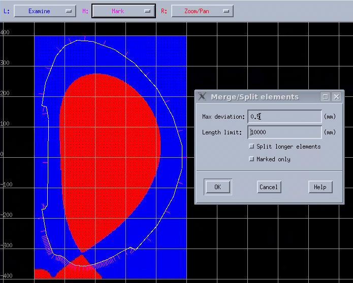

.. note::
   At this point a copy of :file:`compass.dg` was saved as :file:`Compass_step_2_reduce_normals.dg`

Setting the magnetic topology
-----------------------------

In DivGeo is very easy to choose which kind of magnetic topology the
modelling grid should have. You can choose it by opening
:menuselection:`&File --> &Import --> &Topology` and choose one of:

   1. SN lower single-null
   2. SN-up upper single-null
   3. DDN disconnected double-null, lower primary x-point
   4. CDN connected double-null
   5. DDN-up disconnected double-null, upper primary x-point

For COMPASS case select SN.

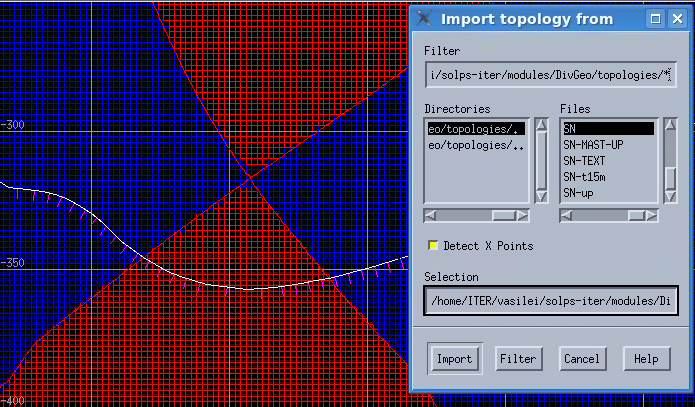

Defining the extent of the targets
----------------------------------

The target definitions need to satisfy the following rules:

    1. Each target segment needs to have a short wall element at each end,
       which will not be part of the target, but will be used to separate the
       target from the main wall in a subsequent setup step;
    2. the targets must be closed polygons;
    3. the surfaces normals of the closed polygon must all point inward;
    4. the plasma-wetted part of the target must consist of at least two (2)
       wall elements.

In COMPASS case all the conditions are satisfied except the second, in which we
have to have closed polygons for the targets. Therefore it is necessary to
add a points behind the target and then connect it to the existing points at the
ends of the target. 

Click :menuselection:`&Edit --> &Create --> &Point` and create the following
new points:

    - ``(325, -375)``
    - ``(400, -375)``

Then, change the **middle mouse** button to `"Connect points"`,
:kbd:`middle-click` on the new point and drag the cursor. Connect the new points with the points:

    - ``(340.611, 254.62)``
    - ``(436.787, 354.255)``

Also make sure that the normal of the newly created line is
facing inwards the polygon.

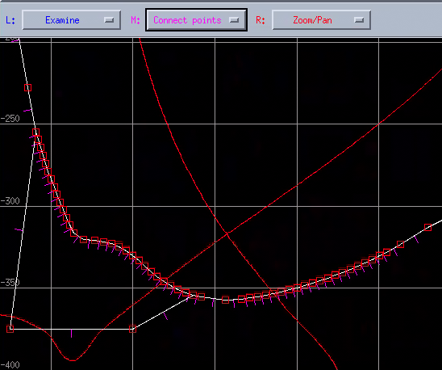

The same thing is done for the outer target. Create the following
new point:

    - ``(525, -375)``

Connect the point with the points:

    - ``(471.213, -355.904)``
    - ``(554.704, -328.079)``

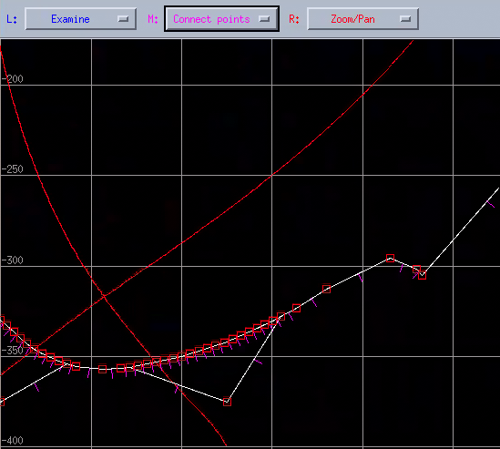
  
      
.. note::
   At this point a copy of :file:`compass.dg` was saved as :file:`COMPASS_step_3_defining_targets.dg`

Setting the "Structure" variable for "Structure"
------------------------------------------------

The structure variable is the primary definition for the vessel wall. You can
define the vessel wall by opening :menuselection:`&Variables --> &Structure`

Use the right mouse button (assigned to Mark) to select all segments. Using
:kbd:`SHIFT + Right Click` will help a lot. Right clicking on a selected
segment will un-select it. When the highlighting is complete, left-click on
`"Set"` in the `"Structure"` dialogue box, at the end of the line marked
`"Structure"`.  Do not include the segments that are behind the targets.

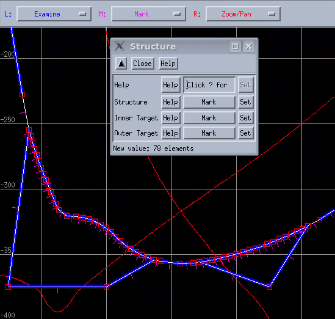

      
:kbd:`CTRL+U` to unmark everything.

As the same like the structure you can set the targets. Mark all of the
segments for the inner target and then click on `"Set”`.

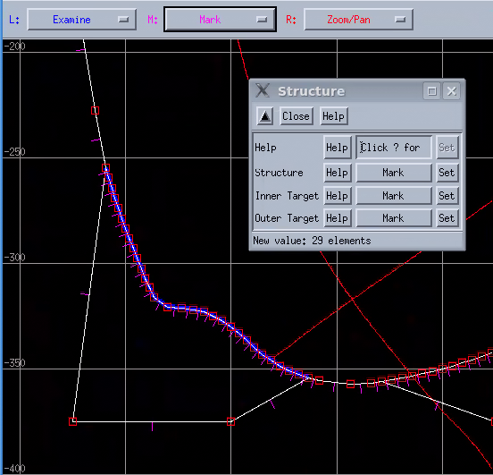

      
The same steps are used for setting the outer target.

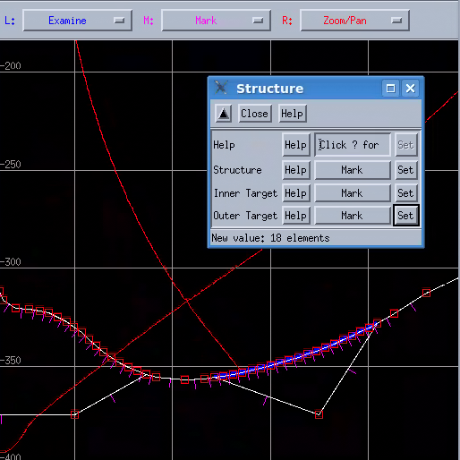

      
.. note::
   At this point a copy of :file:`compass.dg` was saved as :file:`COMPASS_step_4_structure.dg`

Setting elements that are to be ignored by EIRENE
-------------------------------------------------

You can select which parts should EIRENE ignored, by opening
:menuselection:`V&ariables --> &Add --> &Elements not for Eirene`. Mark
the elements behind the targets and click `"Set”`.

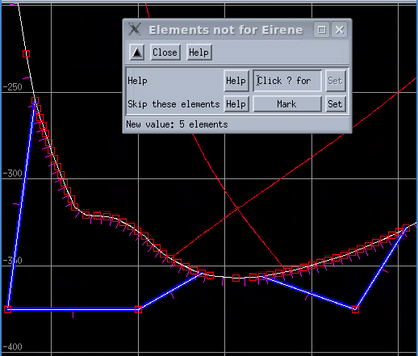

      
Setting the target specifications
---------------------------------

Target specification #1
~~~~~~~~~~~~~~~~~~~~~~~

Click on :menuselection:`&Variables --> &Target specification --> #1`

#1 is the inner target for this case. The target index as a function of
magnetic topology is as follows:

+------------+------------+-----------+-----------+-----------+
| Topology   | Target #1  | Target #2 | Target #3 | Target #4 |
+------------+------------+-----------+-----------+-----------+
| SN-down    | HFS        | LFS       |           |           |
+------------+------------+-----------+-----------+-----------+
| SN-up      | LFS        | HFS       |           |           |
+------------+------------+-----------+-----------+-----------+
| DN         | HFS-down   | HFS-up    | LFS-up    | LFS-down  |
+------------+------------+-----------+-----------+-----------+

The target numbering must follow the order of the B2.5 grid indices, which
increase as one goes around the core plasma in a clockwise direction.

Mark the upper-most segment on the inner target, which is in the Scrape-Off
Layer, and click "Set" for "SOL edge" as shown in the following figure.

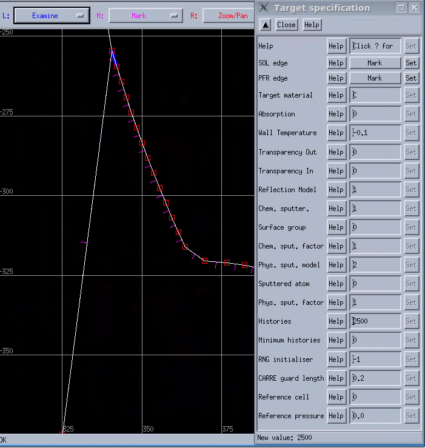

Mark the segment that defines the lower extent of the target , and click
"Set" for "PFR edge".

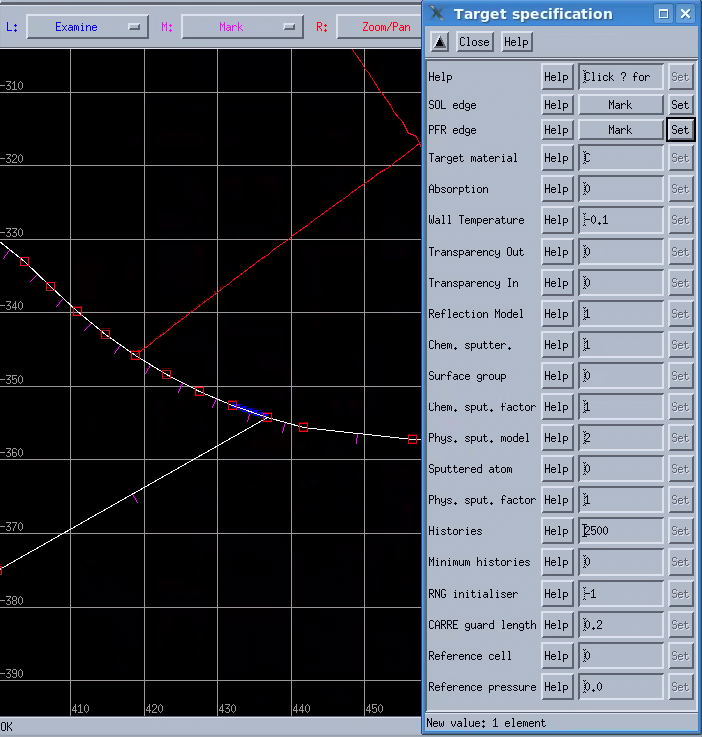

Change "Target material" to C for this case, to match the COMPASS target
material, and click "Set". Assign "Chem. sput." (chemical sputtering) to 1,
and click "Set".

Target specification #2
~~~~~~~~~~~~~~~~~~~~~~~

Click on :menuselection:`&Variables --> &Target specification --> #2`

The outer target is less straightforward and then inner target for this case.
The "edge" settings for the targets have to intersect the outer radial boundary
of the grid, but it’s not obvious where the SOL radial boundary edge will be at
this stage.

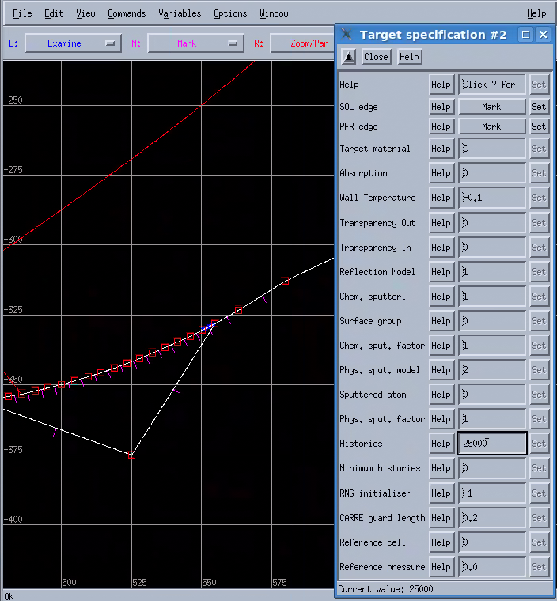

For "PFR edge", the segment indicated in the right-most figure is not the same
as the lower-, outer-most segment included when the Structure variable was set
for the outer target – this is OK. The "PFR edge" is only set based on where
the radial boundary of the grid will be, as determined by intersection with the
divertor knee.

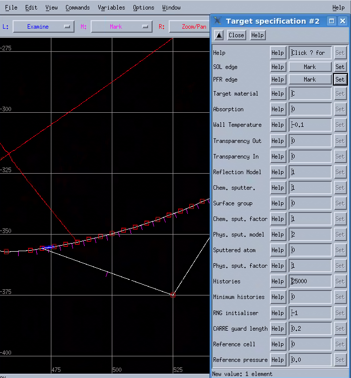

.. note::
   At this point a copy of :file:`compass.dg` was saved as :file:`COMPASS_step_5_target_specification.dg`

Poloidal grid points
--------------------

The poloidal distribution of cells on the Carre grid are set by the
`"poloidal grid points”` in DG. These are defined separately for the
divertor legs and the SOL.

Click :menuselection:`&Edit --> &Create --> &Grid points`.

Set the Zone to Inner divertor and Cells to 18. The distribution of the cells
can be adjusted by left-clicking and dragging the black line on the plot.
Then click Create to update the workspace. 

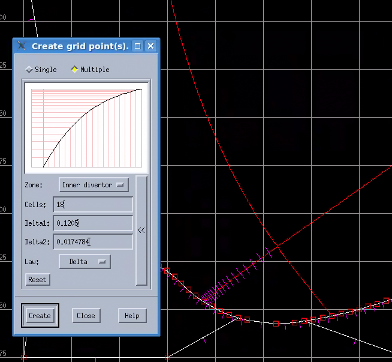

Repeat for the outer divertor.

Set 48 points in the SOL, with a roughly uniform distribution of points
(a straight line on the grid point distribution plot).

The spacing of the grid points around the x-point should be symmetric. Meaning
that set the grid points for SOL, click the :guilabel:`Reset` button and assign
48 cells.

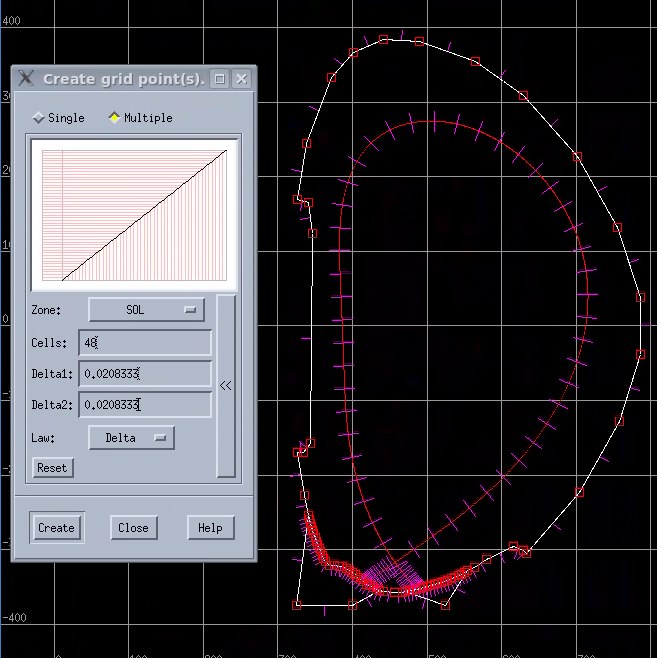

.. note::
   At this point a copy of :file:`compass.dg` was saved as :file:`COMPASS_step_6_grid_points.dg`

Radial surfaces
---------------

Before creating radial surfaces check if all surface normals are pointing away from the
plasma. At the closed targets there are two normals that are pointing out of closed targets.
To reverse them can set the middle mouse button to `"Reverse normals”`. 
Then click :kbd:`Shift + Reverse normals` (middle button) and click on the normals. 

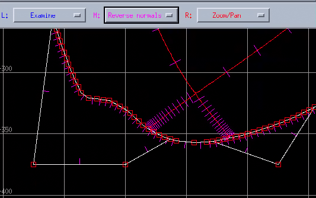

.. tip::

   If the normals are not correct will get message `"Iregullar point"`.

.. note::
   At this point a copy of :file:`compass.dg` was saved as :file:`COMPASS_step_7_reverse_normals.dg`

The radial surfaces in DG define the boundaries between rings on the Carre.
Click :menuselection:`&Edit --> &Create --> &Surfaces.`

Set 18 surfaces in the SOL.

Adjust the radial distribution to give higher spatial resolution near the
separatrix.

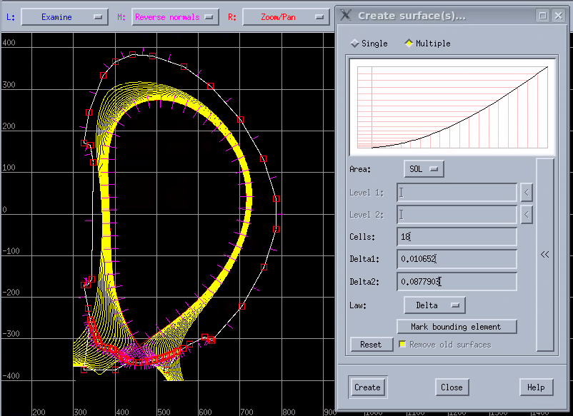

.. note::
   At this point a copy of :file:`compass.dg` was saved as :file:`COMPASS_step_8_radial_surfaces_a.dg`

There is an issue in the PFR for this particular case: the flux surface which
is tangent to the "knee" will miss the bottom of the outer target and cross the
entrance to the "plenum" in the sub-divertor.

.. tip::

   Create a virtual structure in the PFR volume, which will cause DG to reduce
   the radial extent of the grid.

For this COMPASS case, add three points (:menuselection:`&Edit --> &Create --> &Point`):

    - ``(455, -350)``
    - ``(450.544, -354.49)``
    - ``(459.088, -354.354)``

and connect them (change the **middle mouse** button to `"Connect point"`). 

.. tip::

   To reduce the radial extent at the inner target also create a virtual
   structure up of it. 

Add three points (:menuselection:`&Edit --> &Create --> &Point`):

    - ``(341.818, -248.601)``
    - ``(340.656, -250.593)``
    - ``(343.421, -250.901)``

and connect them (change the **middle mouse** button to `"Connect point"`). 

Make sure the surface normals point inward, using `"Reverse normals"` with the
middle button, if required.

Set the middle mouse button to `"Add surface"` and identify the flux surface.

At the PFR 

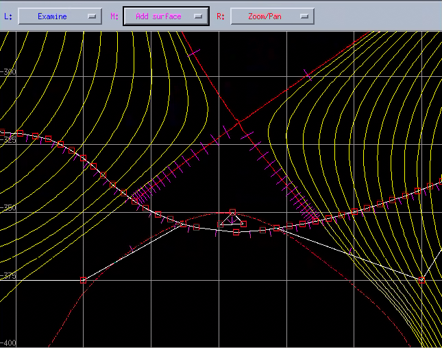

At the inner target

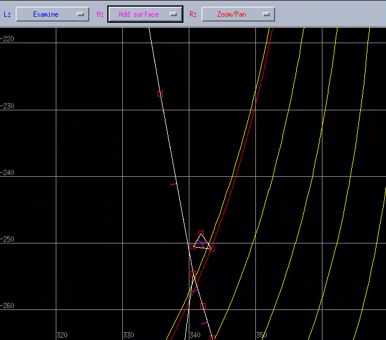

.. note::
   At this point a copy of :file:`compass.dg` was saved as :file:`COMPASS_step_8_radial_surfaces_b.dg`

Add the new surfaces to the `"Elements not for Eirene"` variable – there should
now be 11 segments in the list (the PFR triangle, the virtual triangle at the inner 
divertor and the five surfaces that are behind the targets).

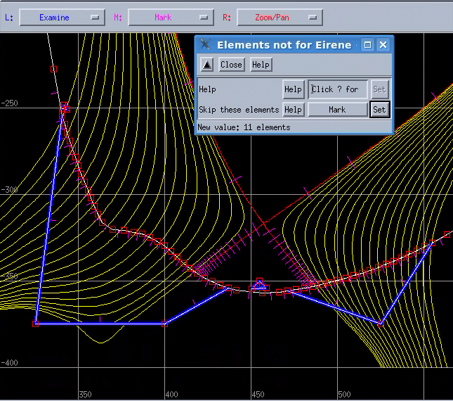

Add the new surfaces to the `"Structure"` variable – there should now be 84
segments in the list.

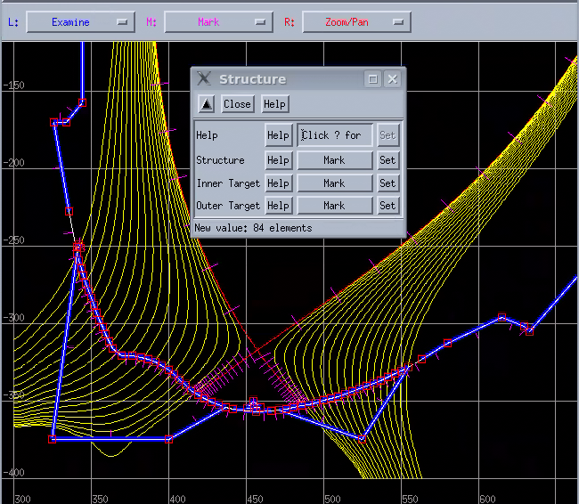

      
Set 18 surfaces in the PFR.

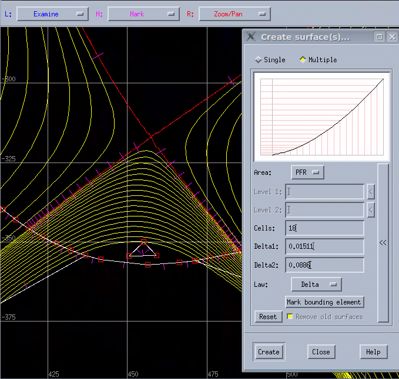

      
      
.. note::
   At this point a copy of :file:`compass.dg` was saved as :file:`COMPASS_step_8_radial_surfaces_c_pfr.dg`

For the core region it is necessary to add a surface which will define
the extent to which the grid penetrates into the core.

Assign `"Add surface"` to the middle mouse button.

Middle-click and hold somewhere in the core, and release the mouse button when
happy with the location of the inner radial boundary.

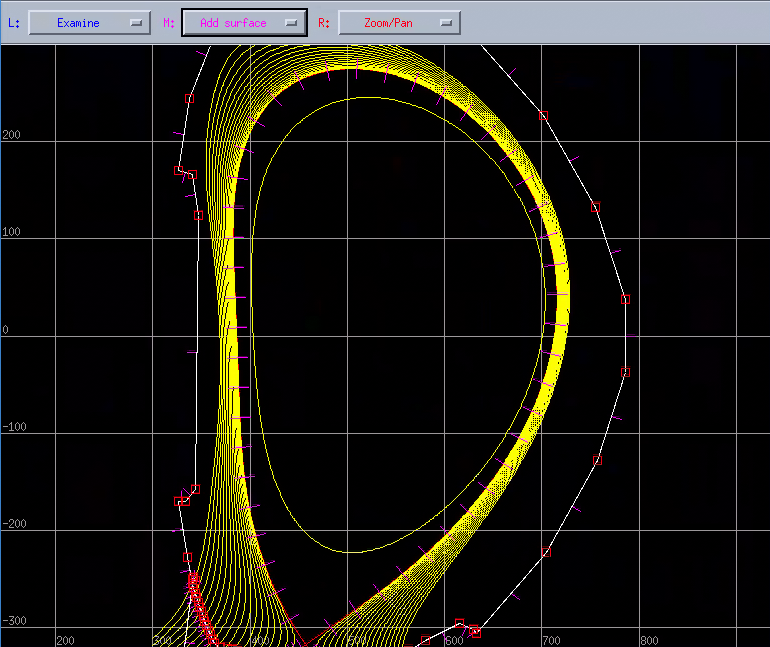

      
The number of radial surfaces in the core must be the same as for the PFR, i.e.
18 in this case, using :menuselection:`&Edit --> &Create --> &Surface(s).`

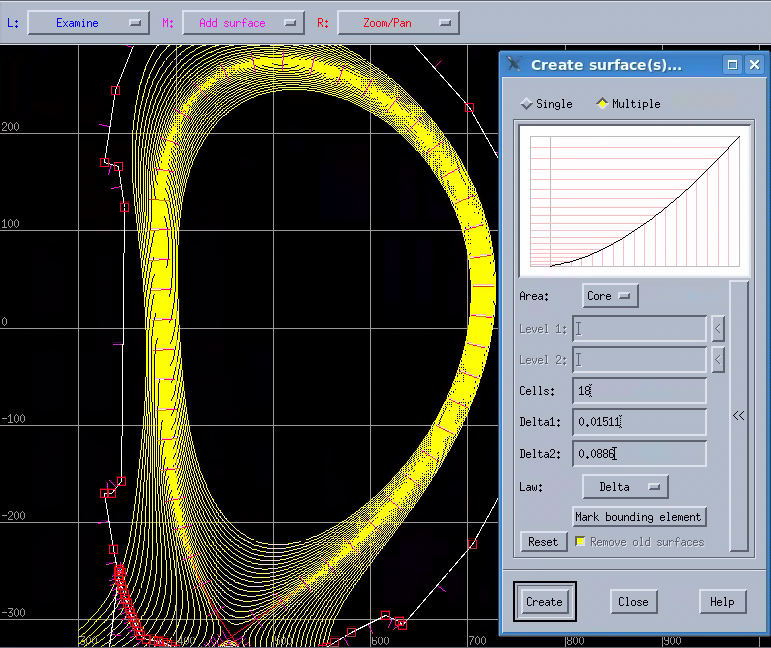

.. note::
   At this point a copy of :file:`compass.dg` was saved as :file:`COMPASS_step_8_radial_surfaces_d_core.dg`

To refresh the radial surfaces at the virtual structure up of the inner target once again add new radial surfaces
(:menuselection:`&Edit --> &Create --> &Surfaces.`) and set the same values

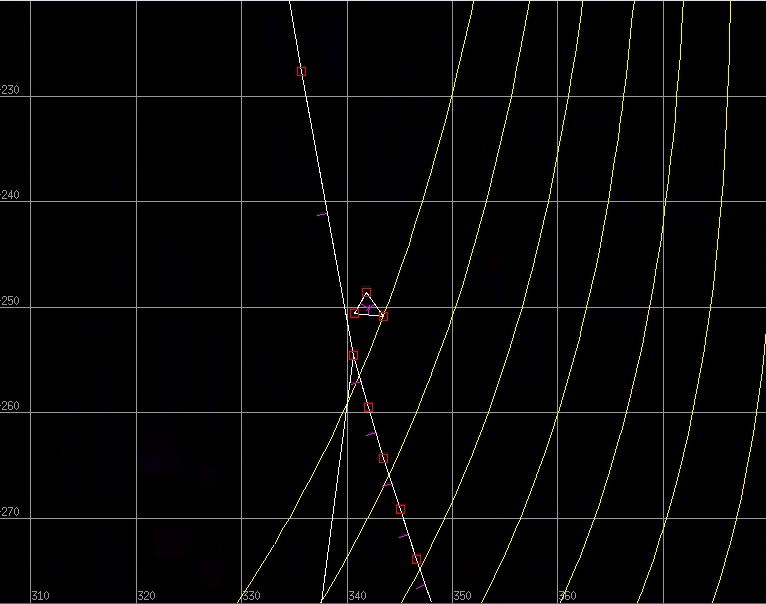

.. note::
   At this point a copy of :file:`compass.dg` was saved as :file:`COMPASS_step_8_radial_surfaces_e_new_surface.dg`

If you want to close yellow lines that are surfaces click on
:menuselection:`&View -- > &Display -- > &Surfaces`

Configuring the plasma species to be included in the simulations
----------------------------------------------------------------

It is very important to definite plasma species which are included in the
simulations. You definite them by clicking
:menuselection:`Variables --> Plasma species D`.

Also you can add it the impurity species with clicking
:menuselection:`Variables --> Add --> Plasma species`.
DG recognizes a few "generic” species: H, D, T, He, Be, C, N, Ne, and Ar,
for which a full consistent default set of reactions will be provided by
Uinp. For all other elements, Uinp will look for the corresponding ADAS
ionization and recombination rates, and, if present in your database, will
include them as part of your model.

If one wishes to use a different reaction set than the default, one can
instead choose to load the reactions from an AMDS file, using:
:menuselection:`&Variables --> &Add --> &Reference to AMDS`
and giving the name of the AMDS file requested. The number of AMDS files to
be loaded is not limited. These files are to be found in the::

    $SOLPSTOP/modules/amds directory.

In this case we will use the species as shown in the following figure. Set the
values as written in the fields.

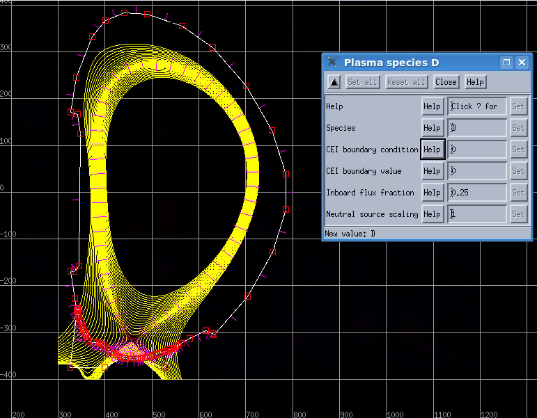

.. note::
   At this point a copy of :file:`compass.dg` was saved as :file:`COMPASS_step_9_plasma_species.dg`

General Surface parameters
--------------------------

To set the general surface parameters click on :menuselection:`&Variables --> &General Surface Data`.

Set the values as written in the fields.

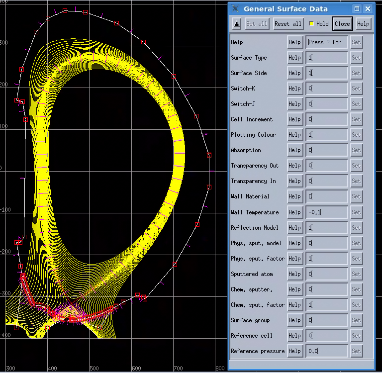

.. note::
   At this point a copy of :file:`compass.dg` was saved as :file:`COMPASS_step_11_general_data.dg`

EIRENE setup of the "void" regions outside the Carre grid
---------------------------------------------------------

EIRENE will use a triangle grid in regions that are outside the fluid grid,
and this variable defines the zones for the triangle mesh generator.

Mark all of the main chamber elements, including the "SOL edge” segments for
the targets. :menuselection:`&Variables --> &Add --> &TRIA-EIRENE parameters`

Set index to ``-1`` in the dialogue box, and :kbd:`"General Triangle size”`
to 5.0.

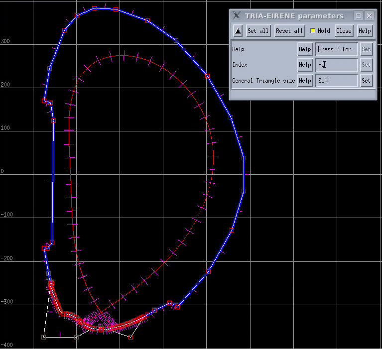

To display the index values, right-click in the index field and select Show Values.

Press :kbd:`Ctrl + U` to unmark everything.

Mark the divertor dome and virtual structrures. Set the index to ``0`` in the dialogue box, and
:kbd:`"General Triangle size”` to 5.0.

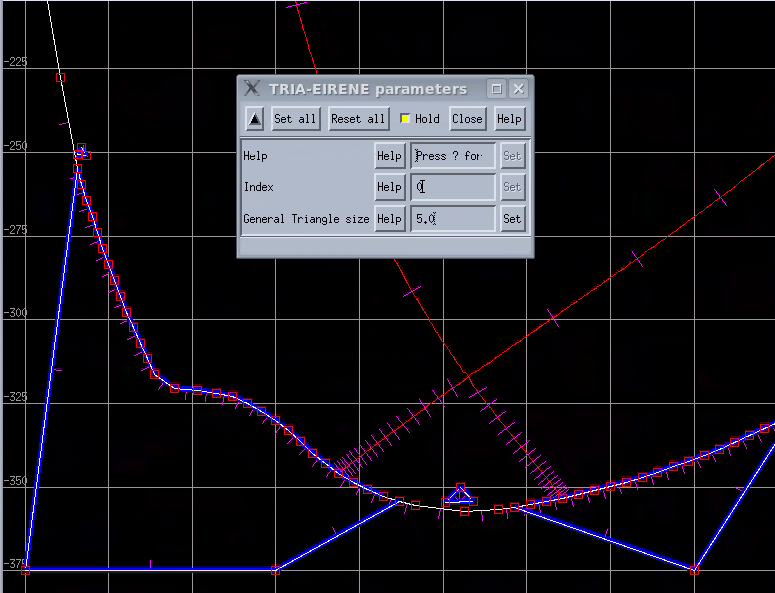

Press :kbd:`Ctrl + U` to unmark everything.

Mark the PFR segments and set index to ``-2`` in the dialogue box, and :kbd:`"General Triangle size”`
to 5.0.

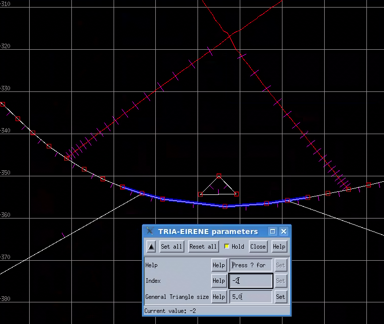

.. note::
   At this point a copy of :file:`compass.dg` was saved as :file:`COMPASS_step_12_tria-eirene_parameters.dg`

Choose the toroidal approximation
---------------------------------

To set the toroidal approximation you need to set the `"Major Radius"` to a
negative (real) number, such as -1.0, if you want to use the toroidal
approximation instead of the cylindrical approximation.

:menuselection:`Variables --> Global Eirene Data`

In this case set the values as shown in the following image

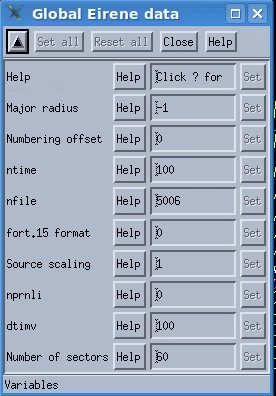

.. note::
   At this point a copy of :file:`compass.dg` was saved as :file:`COMPASS_step_13_tria-eirene_parameters.dg`

Write the output data files that are needed by later steps
----------------------------------------------------------

Save your DivGeo work as :file:`compass.dg` filename saved
under :file:`baserun/` directory.

With the :menuselection:`Commands --> Check variables` you can check if all
variables have valid values.

Hopefully you see this at the bottom of the screen:

  All variables have valid values

Then click on:

  1. :menuselection:`Commands --> Rebuild Carre objects`
  2. :menuselection:`File --> Save`
  3. :menuselection:`File --> Output`

The last command will create three files, where <DG_model_name> will
be :file:`compass`:

  - **<DG_model_name>.dgo**, the DG "output" file
  - **<DG_model_name>.str**, the "structure" file (used by Carre)
  - **<DG_model_name>.trg**, the "targets" file (used by Carre)

  
And you are set to go to the next part of tutorial.

Carre
=====

Now that we have prepared our DivGeo model, the next step is creating the
plasma grid using Carre.

Switch to Carre tab in SOLPS-GUI.

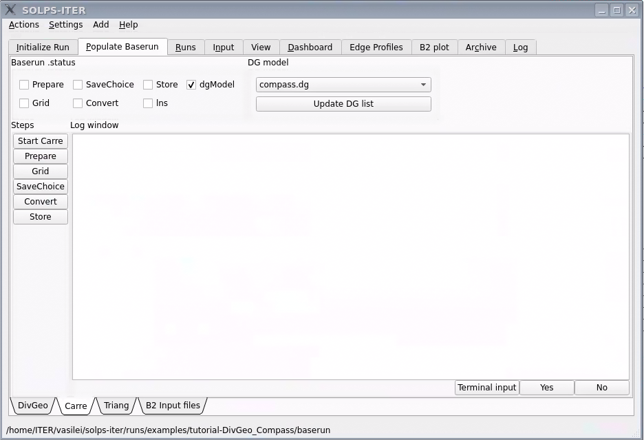
   
   Initial Carre tab with selected "baserun" shown in the status line.

This tab is grouped into two sections (see :numref:`fig:compass_carre_1`),
upper and lower half. The upper half is a self assessment of Carre for
the current baserun. Checkboxes, which are clickable tells the user
which steps were already run and the *DG model* drop down button tells
us which DivGeo model has been used to create the plasma grid. This
self assesed checkboxes are then saved in the :file:`baserun/.status`
file and can be information only or can be used by Carre to do some
actions. For example, if :guilabel:`lns` is checked then
:command:`lns` script will not be run when you press :guilabel:`Start
Carre`.

.. note::

  If the list does not contain a DG model, you have to rescan the baserun dir
  with clicking the :guilabel:`Update DG list`.

The lower half is the interface to the Carre. On the left side are
control buttons and on the right we have a log window which shows us
the output of Carre. Underneath the log window we have the response
widgets for Carre. The manual input button spawns an **input dialog**
in which we will write the parameters value when needed and the
:guilabel:`Yes` and :guilabel:`No` button are used for yes/no (y/n)
questions, given by Carre.

Starting Carre
--------------

Before starting Carre we must first select our *DivGeo model*, we
created previously. Simply click on the drop down button under ``DG
model`` and there should be the name of our *DivGeo model*. Click on
:file:`compass.dg`, so it is selected. 

The reason why this must be done is that for the first time a symbolic
linking (using :command:`ln -s` with the script named ``lns``) has to
be made against the *DivGeo model*, so that the proper files and their
formats are copied to the correct locations. Before you press
:guilabel:`Start Carre`, make sure that the checkbox for
:command:`lns` is not ticked.

For more information search run the ``lns`` script that can be found
under the :file:`solps-iter/scripts` directory.

Now we can click the button :guilabel:`Start Carre` to start Carre. This will
take a while since the environemnt of *SOLPS-ITER* has to be loaded to a TCSH
shell before Carre can be started.

.. note::
   Note that the checkbox ''lns'' and ''dgModel'' has been automatically
   activated. Whenever you will want to redo the linking with ``lns``
   just untick it before clicking :guilabel:`Start Carre`.

After a while the following output should be shown in the log window.

Prepare
-------

This step reads the DG files and translates them into the format needed by
Carre.

Click on button :guilabel:`Prepare`. If there is no error the output should be
as in the following figure

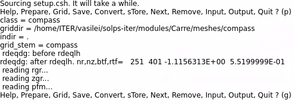

Now we click on the checkbox :guilabel:`Prepare`.

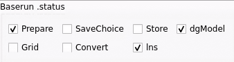

Gridding step
-------------

Click the button :guilabel:`Grid`. Soon a first question will appear, whether the *X-*
and *O-* points identified by Carre are correct (they usually are). If they are
not, then, you refuse the selection and indicate yourself which of the extrema
are *X-* and *O-* points.

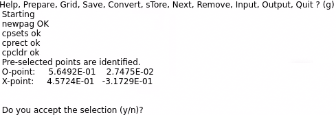

To accept click on the :guilabel:`Yes` widget.

Modifying the Carre parameters
~~~~~~~~~~~~~~~~~~~~~~~~~~~~~~

From the log window the following output should be seen

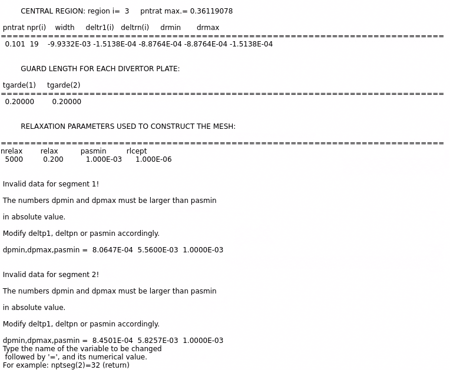
      
As the error message says that the pasmin parameters is not
correct and asks do we wish to continue. Press :guilabel:`No` to quit
the meshing.

So now we click on :guilabel:`Terminal input`, which shows a dialog in which
we will write (copy and paste):

 | pasmin=1.0000E-5
 | end

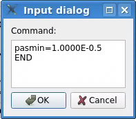

And click on :guilabel:`OK`.

Now we will get no error message but instead the following output

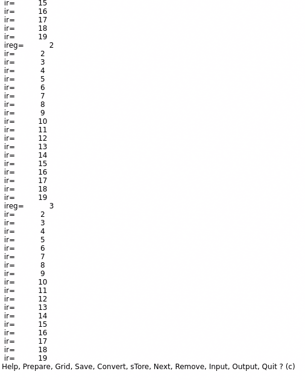

Now we check the check box for *Grid*, as we have completed this step.

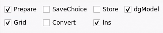

Saving the grid parameters
--------------------------

If you want to save the changes you have made to the settings, click
on the button :guilabel:`SaveChoice`. The grid parameters are
then written to the **carre.dat** file. If you want to reuse these
parameters, skip the step ``Prepare`` the next time you call the carre
script. The output should be as in the following figure

It is good to also check the :guilabel:`SaveChoice` check box, so it is noted
that the grid parameters were changed.

Converting the grid output from Carre
-------------------------------------

The conversion step takes the *carre.out* file containing the Carre grid and
converts it to the Sonnet and B2.5 formats, respectively a \*.sno and \*.geo
file.

Click on the :guilabel:`Convert`.

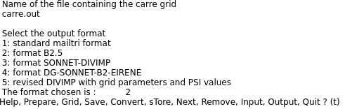

And check the checkbox for *Convert*.

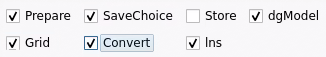

Storing the grid files
----------------------

Click on :guilabel:`Store` to store the grid files.

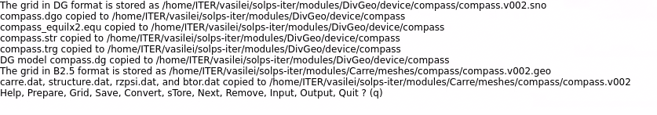

.. tip::

   Sometimes you will get an error message saying:

   No traduit.out. Convert the grid first.

   Even though we did Convert the grid successfully. In this case
   sometimes convert doesn't work, even though it produces a normal
   output. Run it again from the Convert step and try to store the grid
   files again.

And check the checkbox for *Store*.

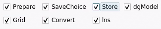

Inspecting the mesh
===================

Now we will check the generated mesh. Switch over to the DivGeo tab and if you
have closed DivGeo, reopen it and if you wish dock it.

:menuselection:`File --> Open` the last DivGeo file
:file:`baserun/compass.dg`.

Then in DivGeo click on :menuselection:`File --> Import --> Mesh` and open
last generated :file:`*.sno` file. Note that DG can only read files in the
Sonnet format (\*.sno).

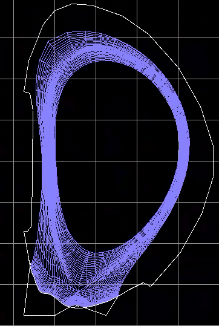

You may see some that the grid cells are correct and can contuonue with the next
step. 

Triang
======

Head over to *Triang* tab to start Triang. The functionality of this tab is
similar to the one with Carre, except there are other steps and there is no
DivGeo model selection.

Start triang with :guilabel:`Start Triang`. The output will be as following:

Create the input files
----------------------

Uinp is a program that builds several input files for SOLPS-ITER programs
according to the data provided in the DG model:

  - Eirene input files input.eir, test.eir and triang.eir
  - Tria input file header triang.hed
  - B2.5 pre-processor input files b2ag.dat, b2ai.dat, b2ar.dat, and converter
    input file b2yt.dat.
  - B2.5 input file b2.user.parameters
  - b2plot input file mesh.extra
  - Stencil files b2ah.dat.stencil, b2.neutral.parameters.stencil and
    b2.boundary.parameters.stencil which are sample files containing a very
    rough default physics model for the boundary conditions and recycling
    parameters, but that have the right format for further modification to
    adapt to your physics problem at hand.

On the first call, it is best to use :guilabel:`Uinp(U)` as in uppercase U.
Uinp will display the list of particles being used, the reactions it will
include in the Eirene input file, the boundaries it will define, etc...

If Uinp is happy the following output at the end should be observed

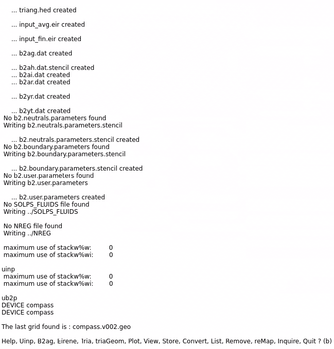

Modifying the b2ag.dat file
---------------------------

If you have modified the grid file by hand in DG, you need to modify the
b2ag.dat (right) file created by Uinp to point to your modified file instead
of the file initially created by Carre.

Click on the button :guilabel:`Edit b2ag.dat`. An input dialog will show.

Change the value of the first parameter in the \*param list from ``-1.0`` to
``-2.0`` and the name of the file given to the b2agfs_geometry switch to your
modified \*.sno file.

*SOLPS-GUI* provides a little help and shows in the end it prints you the
latest \*.sno file created. The line should be similar to:

 !Latest SNO file in DivGeo/device/iter: compass.v002.sno

No to avoid any problems, copy the name of the \*.sno file to the
b2agfs_geometry switch and delete the line.

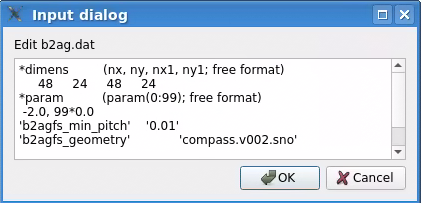

Creating the fort.30 file
-------------------------

Once you are pointing to the correct mesh file, proceed with the triang by
clicking on :guilabel:`B2ag`.

This command runs the b2ag program to create a geometry file that provides the
mesh geometry used by Eirene.

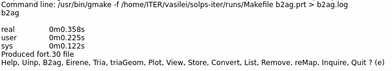

.. note::
        This step will be skipped if a **fort.30** file is already present. If you are
        re-running triang to obtain a new geometry in an already populated directory,
        make sure you have removed the older b2ag.dat and fort.30 files beforehand.

Eirene triangulation preparation run
------------------------------------

Press :guilabel:`Eirene`. If this step is successful, the output will look like

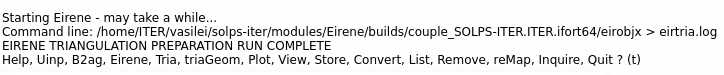

If this step fails (i.e. the message “No valid fort.78 file created” appears),
you should look at the error messages from Eirene that you will find in the
eirtria.log file. Standard Eirene debugging applies.

This step uses Eirene to produce the full contours that will be used in the
triangulation step next. The contours deduced by Eirene are written in the
fort.78 file. The script then concatenates this file with the triang.hed file,
which contains the information about the desired triangle sizes and mesh
refinement zones from DG to form the tria.in file that will be the input for
the tria program.

Triangulation
-------------

Press :guilabel:`Tria`. If this step is successful, the output will look like

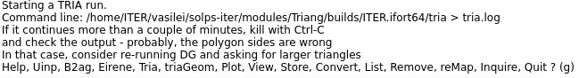

The triangulation results will be stored in three files:

  - *tria.nodes*
  - *tria.elemente*
  - *tria.neighbor*

which contain, respectively, the coordinates of the nodes, the vertices
assignment for the triangles, and the connectivity information between
triangles.

If this step fails, you should look at the error messages from tria that you
will find in the tria.log file generated in the baserun directory.

Triangulating the Carre grid and merging it with the outer triangles
--------------------------------------------------------------------

Press :guilabel:`triaGeom`. If this step is successful, the output will look
like

This steps takes the output from the triangulation step and adds nodes
corresponding to the Carre grid cells, each of which is split into at least two
triangles.

The connectivity information is also enriched to indicate in which Carre grid
cell, if any, each triangle is embedded.

This step also creates the links between the triageom.[cells,nodes,links]
files and the fort.3[3-5] files used later by SOLPS-ITER.

Storing the triangle files
--------------------------

Press :guilabel:`Store`. If this step is successful, the output will look like

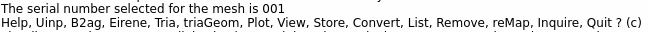

The triangulation files will be stored in some standard directories. The script
may ask you to create these directories if those are not yet present. Simply
press :guilabel:`Yes` if you are asked.

Links to the triangle files as fort.33, fort.34, and fort.35, as needed by
Eirene, are updated to their new location.

Converting the triangle files into an "outer" template
------------------------------------------------------

Press :guilabel:`Conv2Out`. If this step is successful, the output will look
like

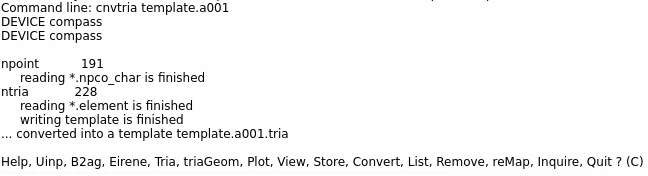

template.aXXX.tria file contains the triangles created by the tria step, which
cover the area outside the Carre grid.

Converting the triangle files into a "grid" template
----------------------------------------------------

Press :guilabel:`Conv2Grid`. If this step is successful, the output will look
like

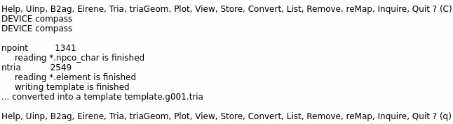

The template.gXXX.tria file contains the triangles created by the triageom
step, which covers the entire domain.

View the results in DivGeo
==========================

You can view the triangle grids by importing them as templates, using the
template file created during the two conversion steps above. If you are happy
with them, you are done! Otherwise, you may wish to modify the triangle size
and/or the mesh refinement regions. Also, you can move or create wall vertices,
since those vertices act as anchors for the triangulation.

Head back to DivGeo tab and import the resulting templates with
:menuselection:`File --> Import --> Template` and import
``template.gXXX.tria.ogr``. The index may be different at your case.

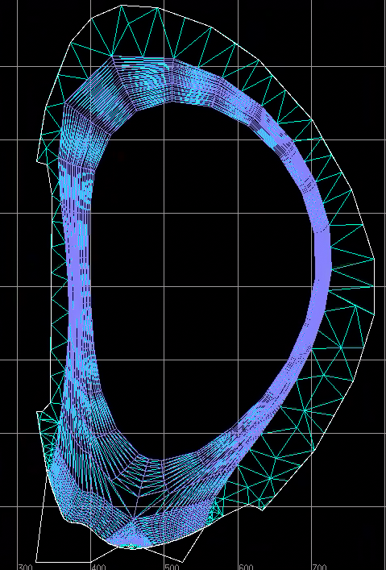

.. note:: At this point a copy of :file:`ITER_compass.dg` was saved as :file:`COMPASS_step_14_final_grids.dg`
