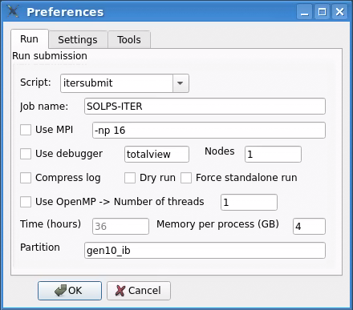
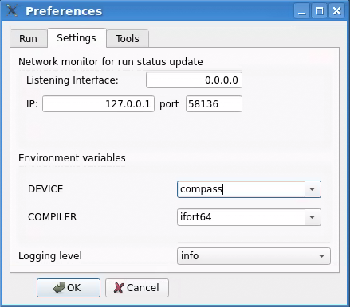
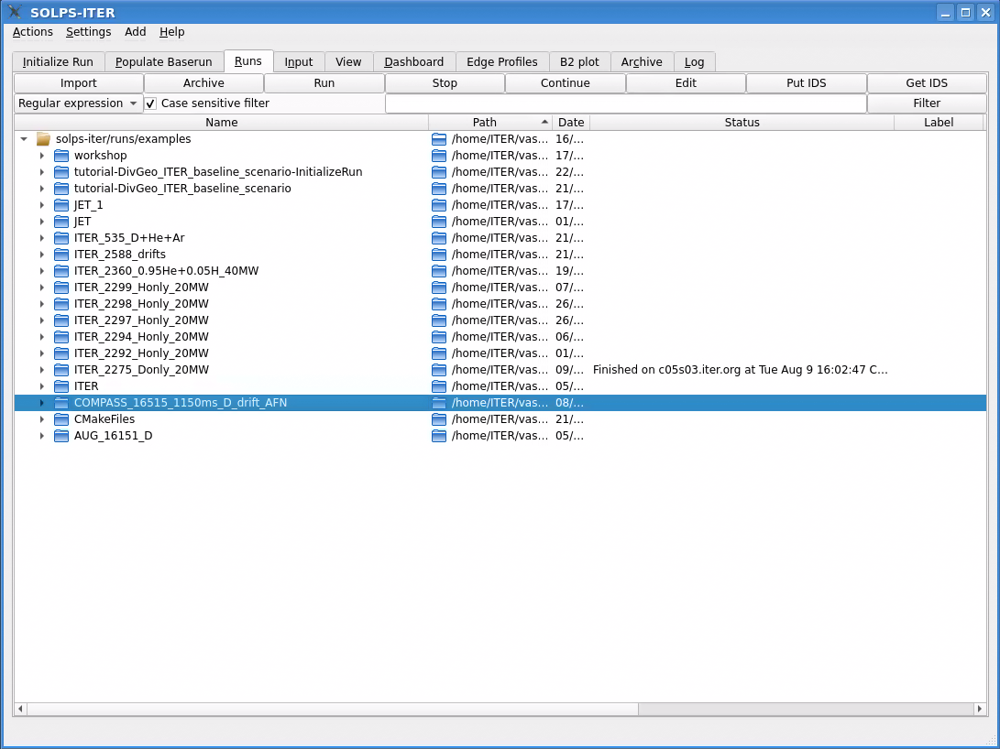
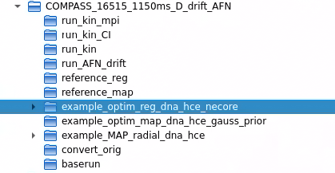
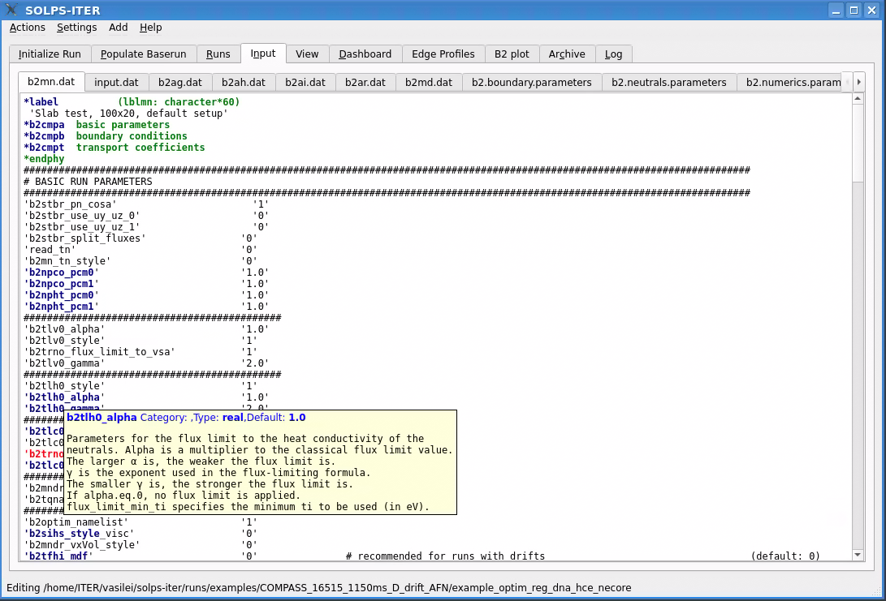
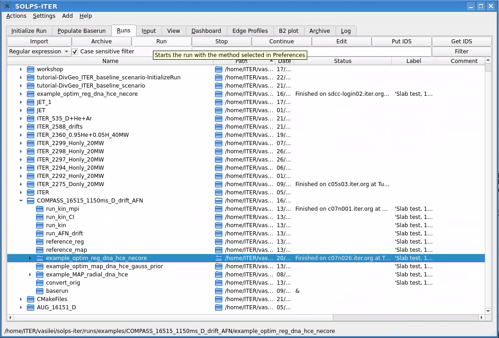
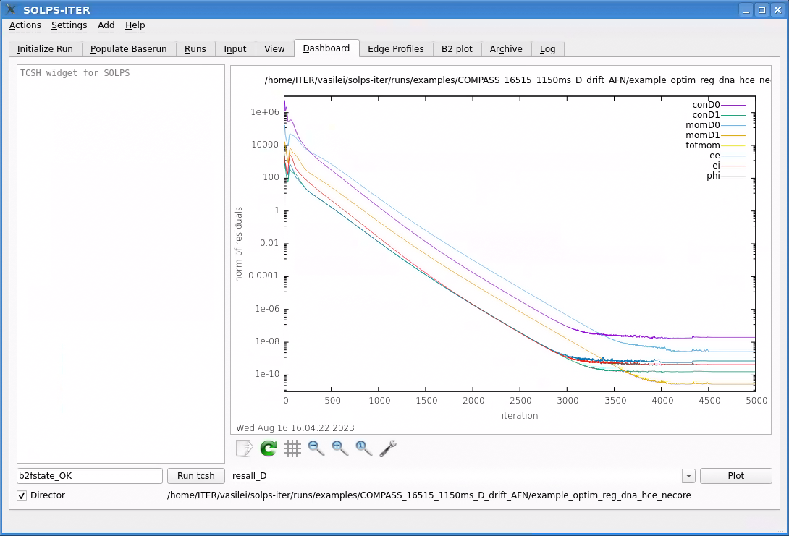

==========
Using Runs
==========

With this tutorial we will show how to setup the *Runs* environment and
:guilabel:`Run` already prepared "demonstration" runs *locally*. This
means running on personal computer (PC) with Linux environment. PC can
be multi-user machine with several users and multi-core processors
running several SOLPS runs at once and in the queue if the system is
properly configured (see :ref:`submission-howto`).

..
   For this tutorial we will be using a simple, already fully converged
   reference case: ASDEX-Upgrade, D-only, B2.5 stand-alone, 1000 iterations
   that resides in ``/work/projects/solps-iter/bonninx/AUG_16151_D``.
   Normally this case runs about 5 minutes to finish.

.. note::

   For running B2.5 standalone case you will need a compiled standalone
   version of the SOLPS-ITER which is non-default. To get B2.5 compiled you
   need to::

   $ make b25 # or
   $ make all # as the default is "make solps"

First start
-----------

At the first start of the SOLPS GUI you see an empty and default
configuration.

.. image:: runs_1.png
   :align: center

.. _run_directories:

Configure the runs directories
------------------------------

 1. From the menu bar select :menuselection:`Settings --> Runs`.
    A new dialog window for *Runs settings* will open.
 2. Select top-right ellipsis button :guilabel:`...` and
    :guilabel:`Choose` your ``runs`` folder that can be found under your
    SOLPS top (i.e. ``~/solps-iter``) installation.
 3. Optionally you may rename default alias ``local_1`` to this *runs* tree
    to whatever name you like. This alias will then be seen as one of
    top runs trees in "tree-view" under Runs tab.
 4. Optionally you may add up to four such Runs trees and name it. These
    trees may be available under other SOLPSTOP trees or provided by other
    users or project trees if you have at least read access.
 5. Press OK. Trees will be rescanned for status.

.. image:: runs_2.png
   :align: center

Sizing the windows and tree-view colums
---------------------------------------

Depending on the past usage and configuration you will end up with the
collection of runs in several *runs trees*. The GUI can be resized to
user preference of available screen size. Neverthess, even with small
window user should be able with tree-view to traverse and fold/unfold the
runs hierarchy of several thousands runs.

GUI is designed without any save button. However, several preferences are
remembered (saved) at when closing the GUI. At start GUI window will open
at the same location and with the size as previously exited. Similarly,
one can resize tree-view columns and even move them by dragging left or
right and this configuration will be "saved" at exit in user preferences.

.. image:: runs_3.png
   :align: center

For demonstration only please resize the columns in the following manner:

   1. Shrink the ``Path`` to icon-only size.
   2. Move the ``Status`` before the ``Date``.
   3. Click on the ``Name`` to sort by descending order
   4. Enter AUG nearby the :guilabel:`Filter` and press :guilabel:`Filter`
   5. Optionally, clear the filter and resize again

ITER run case
-------------

Setting Preferences
~~~~~~~~~~~~~~~~~~~

For this tutorial we will be using ``localsubmit`` script which is
default submission procedure. Provisionally, nothing needs to be changed
in the following :menuselection:`Settings --> Preferences`:

.. image:: runs_4.png
   :align: center

The only difference among users should be default network monitoring port.
Each user on the system should have its own port number in the range
of *unprivileged* ports (1024-65535). GUI acts as a server receiving status
updates over network from runs running in the background. If there is a
clash of these port numbers, then they should make an agreement. However,
default heuristics hashes 13566 users in a range starting with 51966 (0xCAFE)
and should not cause a problem unless some wierd UID assigments policy is
used on the system. In that case users are advised to use next available
port for their local server.

.. _import_run:

Importing the run
~~~~~~~~~~~~~~~~~

We can import the runs from other users and then modify them by
simple configuration editor later on.

Please do the following steps to import the
``/work/projects/solps-iter/runs/examples/ITER_2297_Honly_20MW`` run:

 1. Click on the top-most runs tree (``solps``). This is destination of
    the imported run(s). You may select some other directory residing
    under ``solps`` or elsewhere. :guilabel:`Import` button should be
    enabled at the destination selected. User needs to take care that
    the same directory should not already exist at the *import destination*.
 2. Click the :guilabel:`Import` button and :guilabel:`Choose` with
    directory dialog the ``/work/projects/solps-iter/runs/examples/ITER_2297_Honly_20MW``
    directory. Shortly after *import* will copy complete tree, traverse
    though the tree by fixing *baserun timestamps* and recreate links
    to neigboring *baserun*.

.. image:: runs_5.png
   :align: center

Editing configuration
~~~~~~~~~~~~~~~~~~~~~

You may edit newly imported run by selecting ``run_restart`` directory
and presing :guilabel:`Edit` button that will load all available files.
Current edit folder is written in the status bar below. There is no save
button. Modifications are saved automatically when selecting other tabs.
Usual undo button :kbd:`Control-z` can be used too.
User may move file tabs to its prefered positions that will be restored
in the same way as tree-view columns. New files can be added by editing
``untitled`` file tab.

.. image:: runs_6.png
   :align: center

For this case no editing is needed. One may hover the parameters to get
the tooltip help extracted from the SOLPS manual.

Starting the run
~~~~~~~~~~~~~~~~

As ``ITER_2297_Honly_20MW/run_restart`` is ready to run case one can simply
select it by clicking on tree-view as highlighted in the following image
and then pressing the :guilabel:`Run` button.

.. image:: runs_8.png
   :align: center

Immediately, in the *status* column there should appear submission command
which is ``itersubmit`` in this case. If there is no *batch* queue GUI
should receive from background task over the network to the localhost
(127.0.0.1) notification ``Submited at ...`` with timestamp in status.

This case runs 5 minutes for single-user or longer depending
on system load. We need to have results to proceed with the analysis.

Meanwhile, we can explain the :guilabel:`Stop` button, which  meaning
should be obvious. This is a *graceful* stop method that reguest with
the `b2mn.exe.dir/.quit` to exit after the current iteration completes.
There are no violent methods available for non-friendly behaving runs.
Users may still investigate batches with the command line.
For `localsubmit` there is `atq` command that lists currently pending
batch "jobs". Outputs from the runs can be read by "classic"
``mail`` command and can usually be redirected to users' mailbox with
``${HOME}/.forward`` filename.

:guilabel:`Continue` button allows starting of already stopped runs by
copying end plasma state ``b2fstate`` to ``b2fstati`` and submitting in
the usual :guilabel:`Run` way.

Archive
~~~~~~~

To simplify overall work within the *Runs tree-view* there is a possibility
to (re)move selected trees for *Archive* tab. As usual we select the
directory and click :guilabel:`Archive` button. Selected directory with all
subdirectories will be immediately removed from the *Runs tree-view* and
will appear under *Archive tree-view*. Nothing has happened on the
filesystem with this operation! Just the view to the tree is different.

Practically, there is no difference between the *Runs* and *Archive* tree
view. Archived sub-trees are just filtered out of *Runs* and vice-versa.
The only distinction is that regular run-operations are not possible on
archived trees. One can :guilabel:`Restore` runs back from the archive
on-the-fly. It can only restore those directories that are marked with the
folder icon as those were archive. Archive tree-view shows complete
hierarchy so that users know from where archived subtrees are comming from.
There is no real distinction whate can be archived. From top-directories
to leaf-trees. One may even decide to archive some of the dirs udner some
tree and the archive the tree completely. However, as metioned before,
restoring means filtering and tree hierarchy rules here.

Log
~~~

Log tab collects messages that may appear on the status bar and messages
from several processes and runs during the operation. User may, depending
on the logging level selected in :menuselection:`Settings --> Preferences --> Tools`.
Different levels are colored for easier spotting of higher importance
messages.

Analysis with the Dashboard
~~~~~~~~~~~~~~~~~~~~~~~~~~~

Many SOLPS plots are available from the command line and shoud be issued
under each directory. SOLPS GUI provides plots available for gnuplot within
the dashboard that user can design to its own interest and create a custom
dashboard without programming in Python.  Simple *dashboard* in the
follwing image shows composition of several widgets.

.. image:: runs_7.png
   :align: center

The philosophy of dashboard operation relies on signal/slot communication
among the widgets. Similarly to scientific workflow engines such as
`Kepler <https://kepler-project.org>`_ there is a *Director* that
redistributes selected run to controlled widgets. Signal flow can here
be triggered with additional buttons and custom widgets prepared to
work for SOLPS operation. Tcsh shell for example finds ``${SOLPSTOP}``
for selected run and performs input commands there.

Director may operate in *pass-through* or *checked* way enabling users
to block signals to selected widgets and therefore freezing some plots
for comparison.

By selecting an option from the dropdown menu, for example ``resall_D``, and then pressing the :guilabel:`Plot` button the following *energy* analysis
appears:

.. image:: runs_9.png
   :align: center

(This energy analysis is a bit messy to look at, but we can zoom in by holding the right mouse key and selecting an area!) User may select or type the commands in *solpsplots* widget or enter
TCSH administrative commands without requiring *regular* terminal and
moving to directories quickly.

How to customize the *Dashboard* is described in the :ref:`dashboard`
tutorial.

COMPASS case for Algorithmic Differentiation optimization
---------------------------------------------------------

The case is an unstructured, coarse grid (48x24) pure D COMPASS case with drifts
and Advanced Fluid Neutrals, and kinetic neutrals without drifts. 
This run case was produced as an example for the input parameter sensitivities 
and optimization strategies in B2.5 using Algorithmic Differentiation (AD). For 
a more detailed explanation of what is AD and how the optimization in B2.5 were done,
see Sec. in the SOLPS-ITER manual

Setting Preferences for COMPASS
~~~~~~~~~~~~~~~~~~~~~~~~~~~~~~~

After configuring the run directory (see :ref:`run_directories`), 
we have adjusted the preferences  :menuselection:`Settings --> Preferences` 
for the COMPASS reactor. In this case, we will be using the ``itersubmit`` script
with 1 node (:menuselection:`Preferences --> Run`.)

In :menuselection:`Preferences --> Settings` the name device should be chnage in compass.
The monitoring port number is same. 

Importing the run
~~~~~~~~~~~~~~~~~

The run case ``/work/projects/solps-iter/runs/examples/COMPASS_16515_1150ms_D_drift_AFN`` 
can be imported using the same steps as were done for ITER (see :ref:`import_run`) 
or can be selected from the run directory. 

Editing configuration
~~~~~~~~~~~~~~~~~~~~~

``COMPASS_16515_1150ms_D_drift_AFN`` has two different run cases:

- ``run_AFN_drifts``: fluid case with drifts and Advanced Fluid Neutrals

- ``run_kin``: kinetic case without drifts

The examples for optimization, are based on ``run_AFN_drifts`` but without drifts.
There are different case setups depending of the cost functions:

- example_optim_MAP_radial_dna_hce: case setup for running a Bayesian MAP estimation. It will optimize radially dependent particle and electron heat diffusion coefficients (6 points each), to match electron density n_e and temperature T_e at the OMP as well as their radial gradient at the OMP as cost function. The standard deviation SIGMA for n_e, T_e, and grad(T_e) cost functions is also optimized, while sigma of grad (n_e) is assumed to be known for this example. Optimization will run for 20 iterations.

- example_optim_reg_dna_hce_necore: case setup for running a nonlinear regression estimation. It will optimize a constant particle and electron heat diffusion coefficient together with the core density BC for D+ ions, to match electron density n_e and temperature T_e at the OMP and at the target. Optimization will run for 15 iterations.

- example_optim_map_dna_hce_gauss_prior: a simplified MAP estimation case based on reference_reg, using Gussian priors. Useful for testing MAP estimation for both tangent adn adjoint.

- reference_map: reference case for the MAP estimation. Used to extract the synthetic cost function data and for plotting results.

- reference_reg: reference case for the regression estimation. Used to extract the synthetic cost function data and for plotting results.

In this tutorial we will use ``example_optim_reg_dna_hce_necore``. 

To edit the input files we click on :guilabel:`Edit` button that will 
load all available files. There is no save button. Modifications are saved 
automatically when selecting other tabs. 

If you want to understand the meaning of each input parameter, simply hover 
the cursor over the parameter.

Starting the run
~~~~~~~~~~~~~~~~

The case can be run by clicking :guilabel:`Run` button.

Right away, in the status column, you should see the submission 
command, which is ``itersubmit`` in this particular case. If there is no *batch* queue, 
the GUI will receive a notification over the network from a background task to the localhost, 
saying ``Submitted at ...`` along with a timestamp in the status.

:guilabel:`Stop` button, stop method that reguest with
the `b2mn.exe.dir/.quit` to exit after the current iteration completes.
The :guilabel:`Continue` button permits the restart of previously stopped runs by copying the last plasma 
state from b2fstate to b2fstati and then submitting it in the usual :guilabel:`Run` way.

Analysis with the Dashboard
~~~~~~~~~~~~~~~~~~~~~~~~~~~

When the case is ended 

the ouput results can be analyzed with *dashboard*. By clicking the 
:guilabel:`Dashboard` and selecting an option from the dropdown menu, 
for example ``resall_D``, and then pressing the :guilabel:`Plot` button 
the following *energy* analysis appears:

How to customize the *Dashboard* is described in the :ref:`dashboard`
tutorial.