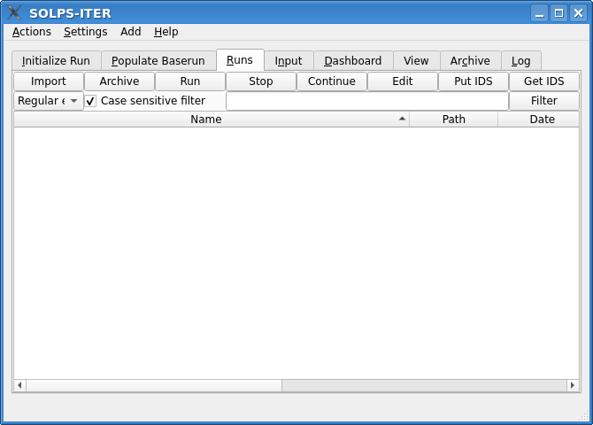
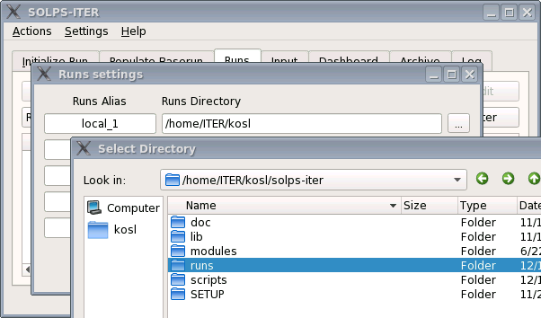
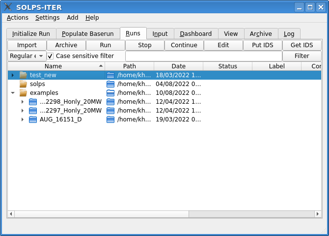
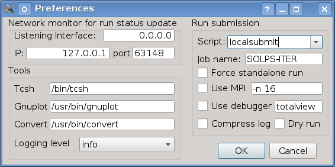
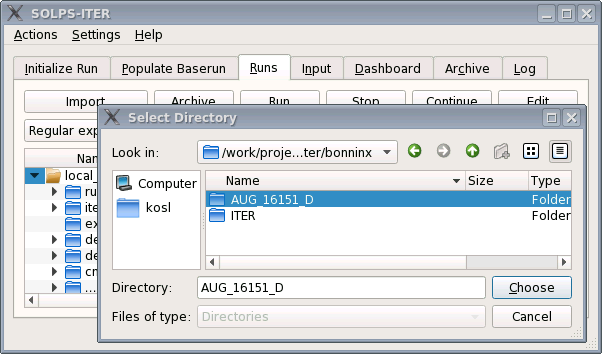
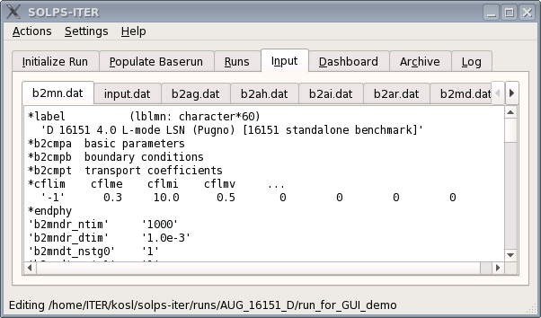
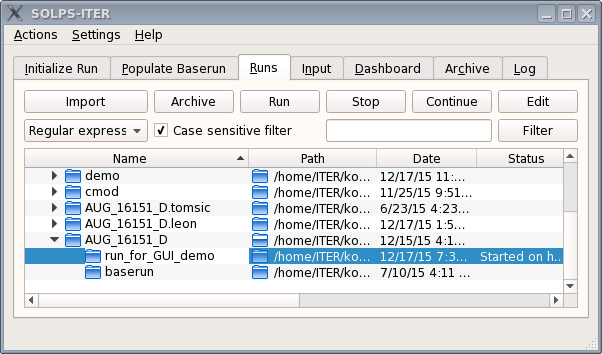
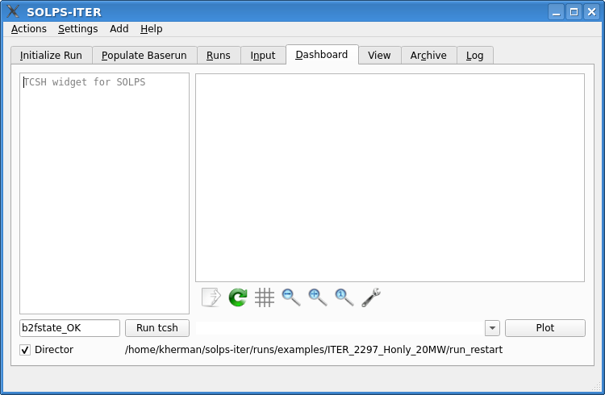
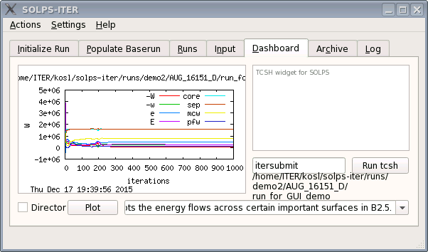
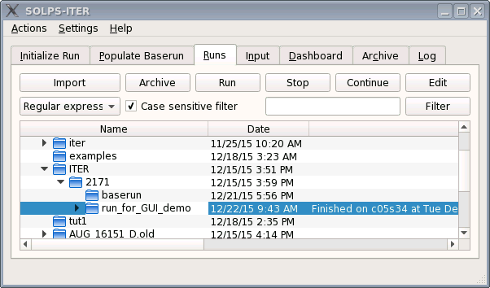

==========
Using Runs
==========

With this tutorial we will show how to setup the *Runs* environment and
:guilabel:`Run` already prepared "demonstration" runs *locally*. This
means running on personal computer (PC) with Linux environment. PC can
be multi-user machine with several users and multi-core processors
running several SOLPS runs at once and in the queue if the system is
properly configured (see :ref:`submission-howto`).

For this tutorial we will be using a simple, already fully converged
reference case: ASDEX-Upgrade, D-only, B2.5 stand-alone, 1000 iterations
that resides in ``/work/projects/solps-iter/bonninx/AUG_16151_D``.
Normally this case runs about 5 minutes to finish.

.. note::

   For running ``AUG_16151_D`` case you will need a compiled standalone
   version of the SOLPS-ITER which is non-default. To get B2.5 compiled you
   need to::

   $ make b25 # or
   $ make all # as the default is "make solps"

First start
-----------

At the first start of the SOLPS GUI you see an empty and default
configuration.

Configure the runs directories
------------------------------

 1. From the menu bar select :menuselection:`Settings --> Runs`.
    A new dialog window for *Runs settings* will open.
 2. Select top-right ellipsis button :guilabel:`...` and
    :guilabel:`Choose` your ``runs`` folder that can be found under your
    SOLPS top (i.e. ``~/solps-iter``) installation.
 3. Optionally you may rename default alias ``local_1`` to this *runs* tree
    to whatever name you like. This alias will then be seen as one of
    top runs trees in "tree-view" under Runs tab.
 4. Optionally you may add up to four such Runs trees and name it. These
    trees may be available under other SOLPSTOP trees or provided by other
    users or project trees if you have at least read access.
 5. Press OK. Trees will be rescanned for status.

Sizing the windows and tree-view colums
---------------------------------------

Depending on the past usage and configuration you will end up with the
collection of runs in several *runs trees*. The GUI can be resized to
user preference of available screen size. Neverthess, even with small
window user should be able with tree-view to traverse and fold/unfold the
runs hierarchy of several thousands runs.

GUI is designed without any save button. However, several preferences are
remembered (saved) at when closing the GUI. At start GUI window will open
at the same location and with the size as previously exited. Similarly,
one can resize tree-view columns and even move them by dragging left or
right and this configuration will be "saved" at exit in user preferences.

For demonstration only please resize the columns in the following manner:

   1. Shrink the ``Path`` to icon-only size.
   2. Move the ``Status`` before the ``Date``.
   3. Click on the ``Name`` to sort by descending order
   4. Enter AUG nearby the :guilabel:`Filter` and press :guilabel:`Filter`
   5. Optionally, clear the filter and resize again

Setting Preferences
-------------------

For this tutorial we will be using ``localsubmit`` script which is
default submission procedure. Provisionally, nothing needs to be changed
in the following :menuselection:`Settings --> Preferences`:

The only difference among users should be default network monitoring port.
Each user on the system should have its own port number in the range
of *unprivileged* ports (1024-65535). GUI acts as a server receiving status
updates over network from runs running in the background. If there is a
clash of these port numbers, then they should make an agreement. However,
default heuristics hashes 13566 users in a range starting with 51966 (0xCAFE)
and should not cause a problem unless some wierd UID assigments policy is
used on the system. In that case users are advised to use next available
port for their local server.

Importing the run
-----------------

We can import the runs from other users and then modify them by
simple configuration editor later on.

Please do the following steps to import the
``/work/projects/solps-iter/bonninx/AUG_16151_D`` run:

 1. Click on the top-most runs tree (``local_1``). This is destination of
    the imported run(s). You may select some other directory residing
    under ``local_1`` or elsewhere. :guilabel:`Import` button should be
    enabled at the destination selected. User needs to take care that
    the same directory should not already exist at the *import destination*.
 2. Click the :guilabel:`Import` button and :guilabel:`Choose` with
    directory dialog the ``/work/projects/solps-iter/bonninx/AUG_16151_D``
    directory. Shortly after *import* will copy complete tree, traverse
    though the tree by fixing *baserun timestamps* and recreate links
    to neigboring *baserun*.

Editing configuration
---------------------

You may edit newly imported run by selecting ``run_for_GUI_demo`` directory
and presing :guilabel:`Edit` button that will load all available files.
Current edit folder is written in the status bar below. There is no save
button. Modifications are saved automatically when selecting other tabs.
Usual undo button :kbd:`Control-z` can be used too.
User may move file tabs to its prefered positions that will be restored
in the same way as tree-view columns. New files can be added by editing
``untitled`` file tab.

For this case no editing is needed.

Starting the run
----------------

As ``AUG_16151_D/run_for_GUI_demo`` is ready to run case one can simply
select it by clicking on tree-view as highlighted in the following image
and then pressing the :guilabel:`Run` button.

Immediately, in the *status* column there should appear submission command
which is ``localsubmit`` in this case. If there is no *batch* queue GUI
should receive from background task over the network to the localhost
(127.0.0.1) notification ``Started on ...`` with timestamp in status.

This case runs 5 minutes for single-user or longer depending
on system load. We need to have results to proceed with the analysis.

Meanwhile, we can explain the :guilabel:`Stop` button, which  meaning
should be obvious. This is a *graceful* stop method that reguest with
the `b2mn.exe.dir/.quit` to exit after the current iteration completes.
There are no violent methods available for non-friendly behaving runs.
Users may still investigate batches with the command line.
For `localsubmit` there is `atq` command that lists currently pending
batch "jobs". Outputs from the runs can be read by "classic"
``mail`` command and can usually be redirected to users' mailbox with
``${HOME}/.forward`` filename.

:guilabel:`Continue` button allows starting of already stopped runs by
copying end plasma state ``b2fstate`` to ``b2fstati`` and submitting in
the usual :guilabel:`Run` way.

Archive
-------

To simplify overall work within the *Runs tree-view* there is a possibility
to (re)move selected trees for *Archive* tab. As usual we select the
directory and click :guilabel:`Archive` button. Selected directory with all
subdirectories will be immediately removed from the *Runs tree-view* and
will appear under *Archive tree-view*. Nothing has happened on the
filesystem with this operation! Just the view to the tree is different.

Practically, there is no difference between the *Runs* and *Archive* tree
view. Archived sub-trees are just filtered out of *Runs* and vice-versa.
The only distinction is that regular run-operations are not possible on
archived trees. One can :guilabel:`Restore` runs back from the archive
on-the-fly. It can only restore those directories that are marked with the
folder icon as those were archive. Archive tree-view shows complete
hierarchy so that users know from where archived subtrees are comming from.
There is no real distinction whate can be archived. From top-directories
to leaf-trees. One may even decide to archive some of the dirs udner some
tree and the archive the tree completely. However, as metioned before,
restoring means filtering and tree hierarchy rules here.

Log
---

Log tab collects messages that may appear on the status bar and messages
from several processes and runs during the operation. User may, depending
on the log level selected in :menuselection:`Settings --> Preferences`.
Different levels are colored for easier spotting of higher importance
messages.

Analysis with the Dashboard
---------------------------

Many SOLPS plots are available from the command line and shoud be issued
under each directory. SOLPS GUI provides plots available for gnuplot within
the dashboard that user can design to its own interest and create a custom
dashboard without programming in Python.  Simple *dashboard* in the
follwing image shows composition of several widgets.

The philosophy of dashboard operation relies on signal/slot communication
among the widgets. Similarly to scientific workflow engines such as
`Kepler <https://kepler-project.org>`_ there is a *Director* that
redistributes selected run to controlled widgets. Signal flow can here
be triggered with additional buttons and custom widgets prepared to
work for SOLPS operation. Tcsh shell for example finds ``${SOLPSTOP}``
for selected run and performs input commands there.

Director may operate in *pass-through* or *checked* way enabling users
to block signals to selected widgets and therefore freezing some plots
for comparison.

By pressing the :guilabel:`Plot` button the following *energy* analysis
appears:

User may select or type the commands in *solpsplots* widget or entering
TCSH administrative commands without requiring *regular* terminal and
moving to directories quickly.

How to customize the *Dashboard* is described in the :ref:`dashboard`
tutorial.

ITER case 2171
--------------

The ITER 2171 case located under ``/work/projects/solps-iter/bonninx/ITER``
is larger than the default case, so you need to redimension your arrays
and recompile SOLPS-ITER. This is done in the
``$SOLPSTOP/modules/B2.5/src/include/DIMENSIONS.F`` file, which should
be copied to ``$SOLPSTOP/modules/B2.5/src/include.local/DIMENSIONS.F``,
then you would need to increase ``DEF_NATM`` to at least 4, ``DEF_NFL``
to at least 21, and ``DEF_NPLS`` to at least 17. Then::

  cd $SOLPSTOP ; gmake depend ; gmake

The following ``diff`` output between original (<) and inceased (>) values
describes necessary changes to
``$SOLPSTOP/modules/B2.5/src/include.local/DIMENSIONS.F``.

.. code-block:: diff

   19,21c19,21
   < #define DEF_NFL 9
   < #define DEF_NPLS 9
   < #define DEF_NATM 3
   ---
   > #define DEF_NFL 21
   > #define DEF_NPLS 17
   > #define DEF_NATM 5
   35c35
   < #define DEF_NSRFS 2
   ---
   > #define DEF_NSRFS 4

For running the case:

1. :guilabel:`Import` the ``/work/projects/solps-iter/bonninx/ITER/2171``
    case.

2. Select the case and press :guilabel:`Edit` to change:
    a) ``b2mn.dat`` :

      .. code-block:: diff

         45c45
         > 'b2stbc_feedback'     '0'
         ---
         < 'b2stbc_feedback'     '1'

    b) and in ``b2.boundary.parameters``:

      .. code-block:: diff

         18c18
         <  BCCON(0, 6)=  10,   9,  10,   9,   9,  10,   9,   9,   9,   9,  11,   9,   9,   9,   9,   9,   9,   9,   9,   9,   9,
         ---
         >  BCCON(0, 6)=  10,   9,  10,   9,   9,  10,   9,   9,   9,   9,   8,   9,   9,   9,   9,   9,   9,   9,   9,   9,   9,
         42c42
         <  LBNDUSR=F, LFEEDBACK=T,
         ---
         >  LBNDUSR=F, LFEEDBACK=F,

3. Open :menuselection:`Settings --> Preferences` and

   a) change submission script from ``localsubmit`` to ``intersubmit``.
   b) Change IP address of the GUI from localhost ``127.0.0.1`` to
      ``hostname -i`` IP address from where you are submitting the jobs
      (monitoring).
      For example: Use 10.153.0.52 if you are submitting from
      *hpc-app1.iter.org* and 10.153.0.16 for GUI running at
      *hpc-login4.iter.org*.

4. Press :guilabel:`Run` and observe if the case will run for 4 minutes. You
   may use ``qstat`` or equvalent job scheduler command to observe your job
   placement in the cluster. At start and end you should receive job status
   updates directly to the GUI running runs status server at the port
   specified. Finally, you should receive status:

